# Product & Architectural Roadmap (Single Source of Truth)

> 📌 **Master Roadmap Location:** For the comprehensive, platform-wide sequential timeline (M1 to M112) and active milestone tracking across both `Prateek_website` and `retriever`, see:
> 👉 **[`docs/UNIFIED_MASTER_ROADMAP.md`](file:///Users/prateeksharma/Developer/Prateek_website/docs/UNIFIED_MASTER_ROADMAP.md)**

---

## Quick Reference: Active Phases & Milestones

```mermaid
timeline
    title Master Development Timeline
    Phase A (M1–M30) : Core Platform Foundation & RAG Engine : Completed
    Phase B (M31–M45) : Multi-Tenant Auth, Security & Client Portals : Completed
    Phase C (M46–M53) : GraphRAG, RLM REPL, LLM Safety & 360 Deep Audit : Completed
    Phase D (M54–M56) : Surface Polish, Citation Visualizer & RLM Studio : Completed
    Phase E (M57–M60) : Autonomous Growth, Cold Outreach & AI Newsjacking : Completed
    Phase F (M61–M62) : Data Connectors & Vision OCR Ingestion : Completed
    Phase G (M63–M68) : SOTA Productized E-Commerce Scoping & Agency Ecosystem : Completed
    Phase H (M69–M73) : SOTA Cognitive RAG Algorithm R&D : Completed
    Phase I (M74–M78) : Enterprise Cognitive Evaluation & Deep Observability : Completed
    Phase J (M79–M85) : Machine Learning & Predictive Intelligence Framework : Completed
    Phase J.5 (M85.1–M85.4) : Forensic Audit Remediation — Parity : Completed
    Phase J.6 (M85.5–M85.10) : Production Hardening & Credibility : Completed
    Phase J.7 (M85.11–M85.17) : Honest AI Wiring & Trust Hardening : Completed
    Phase K (M86–M90) : Enterprise Scale, Edge Replication & Universal Plugins : Completed
    Phase L (M91–M97) : Forward Deployed Engineering (FDE) Agentic Stack : Completed
    Phase M (M98–M102) : Sovereign Edge & Multi-Cloud Resiliency : Completed
    Phase N (M103–M109) : Autonomous Agent Swarms, Long-Horizon Memory & Multi-Agent Quorum : Completed
    Phase O (M110–M113) : Public Open-Source Launch & Community Ecosystem : Completed
    Phase P (M114+) : Multimodal Real-Time Voice & Distributed Agentic Mesh : Active
```

---

## Active Milestone Sequence (Phase O: M110 – M113 & Phase P: M114 – M117)

| Milestone | Title | Focus Area | Status | Detailed Specification |
|:---|:---|:---|:---|:---|
| **M86** | Edge AI Token Shield, DDoS Defense & Upstash Rate Limiting | Dual-mode sliding-window token limiter & resilient SSE reconnect | **Completed** | [`docs/UNIFIED_MASTER_ROADMAP.md`](file:///Users/prateeksharma/Developer/Prateek_website/docs/UNIFIED_MASTER_ROADMAP.md#milestone-86-edge-ai-token-shield-ddos-defense--upstash-redis-rate-limiting) |
| **M86.5** | Platform Capabilities & Active Batteries Observability Cockpit | 12 platform batteries inventory and live telemetry command center | **Completed** | [`docs/UNIFIED_MASTER_ROADMAP.md`](file:///Users/prateeksharma/Developer/Prateek_website/docs/UNIFIED_MASTER_ROADMAP.md#milestone-865-platform-capabilities--active-batteries-observability-cockpit) |
| **M87** | Automated Cloud Database Snapshots & PITR Engine | AES-256 encrypted table streamer & zero-downtime `--dry-run` PITR recovery | **Completed** | [`docs/UNIFIED_MASTER_ROADMAP.md`](file:///Users/prateeksharma/Developer/Prateek_website/docs/UNIFIED_MASTER_ROADMAP.md#milestone-87-automated-cloud-database-snapshots-s3r2-wal-archival--pitr-recovery-engine) |
| **M88** | Enterprise Compliance Vault: Presidio PII & GDPR Wipe | Luhn entity sanitizer & HMAC-SHA256 deletion certificate authority | **Completed** | [`docs/UNIFIED_MASTER_ROADMAP.md`](file:///Users/prateeksharma/Developer/Prateek_website/docs/UNIFIED_MASTER_ROADMAP.md#milestone-88-enterprise-compliance-vault-presidio-pii-redaction--gdpr-cryptographic-wipe) |
| **M89** | Geo-Distributed Multi-Region Edge Vector Read-Replicas | Geo-IP latency router & CQRS read-replica connection pooler | **Completed** | [`docs/UNIFIED_MASTER_ROADMAP.md`](file:///Users/prateeksharma/Developer/Prateek_website/docs/UNIFIED_MASTER_ROADMAP.md#milestone-89-geo-distributed-multi-region-edge-vector-read-replicas) |
| **M90** | Universal Ecosystem Plugins (Slack Bot, Chrome Ext, GDrive Sync) | Native Slack bot `/ask-retriever`, Manifest V3 extension & 2-way sync | **Completed** | [`docs/UNIFIED_MASTER_ROADMAP.md`](file:///Users/prateeksharma/Developer/Prateek_website/docs/UNIFIED_MASTER_ROADMAP.md#milestone-90-universal-ecosystem-plugins-slack-bot-chrome-extension--2-way-gdrive-sync) |
| **M91** | LangGraph Cyclic Agentic Workflows & HITL State Engine | Stateful cyclic graphs, PostgreSQL checkpoints & human approval gates | **Completed** | [`docs/UNIFIED_MASTER_ROADMAP.md`](file:///Users/prateeksharma/Developer/Prateek_website/docs/UNIFIED_MASTER_ROADMAP.md#milestone-91-langgraph-cyclic-agentic-orchestration--human-in-the-loop-hitl-state-engine) |
| **M92** | DSPy Declarative Prompt Compilation & Teleprompter | Declarative Signatures, teleprompter metric optimization & hot-activation | **Completed** | [`docs/UNIFIED_MASTER_ROADMAP.md`](file:///Users/prateeksharma/Developer/Prateek_website/docs/UNIFIED_MASTER_ROADMAP.md#milestone-92-dspy-declarative-prompt-compilation--algorithmic-self-optimization-pipeline) |
| **M93** | Enterprise LLM Gateway & Multi-Model Smart Router | LiteLLM gateway, dynamic model failover, cost & quota attribution | **Completed** | [`docs/UNIFIED_MASTER_ROADMAP.md`](file:///Users/prateeksharma/Developer/Prateek_website/docs/UNIFIED_MASTER_ROADMAP.md#milestone-93-enterprise-llm-gateway--multi-model-smart-router-litellm-architecture) |
| **M94** | NVIDIA NeMo Guardrails & Conversational Safety Rails | Colang flow interpreter, sub-20ms input rails & post-inference fact check | **Completed** | [`docs/UNIFIED_MASTER_ROADMAP.md`](file:///Users/prateeksharma/Developer/Prateek_website/docs/UNIFIED_MASTER_ROADMAP.md#milestone-94-nvidia-nemo-guardrails--multi-turn-conversational-safety-rails) |
| **M95** | Durable Asynchronous Execution & AI Workflow Engine | Step-level memoization (<2ms replay), retry backoff & Step DAG timeline | **Completed** | [`docs/UNIFIED_MASTER_ROADMAP.md`](file:///Users/prateeksharma/Developer/Prateek_website/docs/UNIFIED_MASTER_ROADMAP.md#milestone-95-durable-asynchronous-execution--background-ai-workflow-engine) |
| **M96** | Serverless GPU Serving & Custom vLLM / LoRA Deployment Pipeline | Modal / BentoML serverless GPU auto-scaling & runtime LoRA swapping | **Completed** | [`docs/UNIFIED_MASTER_ROADMAP.md`](file:///Users/prateeksharma/Developer/Prateek_website/docs/UNIFIED_MASTER_ROADMAP.md#milestone-96-serverless-gpu-serving--custom-vllm--lora-deployment-pipeline-modal--bentoml) |
| **M97** | Autonomous FDE Metaprogrammer & Capability Studio | Natural language capability wizard & automated Hexagonal code scaffolder | **Completed** | [`docs/UNIFIED_MASTER_ROADMAP.md`](file:///Users/prateeksharma/Developer/Prateek_website/docs/UNIFIED_MASTER_ROADMAP.md#milestone-97-autonomous-fde-metaprogrammer--self-extending-capability-studio) |
| **M98** | Sovereign Edge SQLite / Turso Vector Synchronization & Offline Agent | Embedded SQLite 3 FTS5, binary float32 BLOB vectors, differential delta sync | **Completed** | [`docs/UNIFIED_MASTER_ROADMAP.md`](file:///Users/prateeksharma/Developer/Prateek_website/docs/UNIFIED_MASTER_ROADMAP.md#milestone-98-sovereign-edge-sqlite--turso-vector-synchronization--offline-first-edge-agent) |
| **M99** | Distributed Multi-Cloud Failover & Edge Turso LibSQL Replication | Active-active multi-cloud failover, LibSQL embedded replicas & cluster health probing | **Completed** | [`docs/UNIFIED_MASTER_ROADMAP.md`](file:///Users/prateeksharma/Developer/Prateek_website/docs/UNIFIED_MASTER_ROADMAP.md#milestone-99-distributed-multi-cloud-failover--edge-turso-libsql-replication) |
| **M100** | Sovereign Edge Voice & Local Whisper / WebRTC Speech Synthesis | Full-duplex WebRTC, local Whisper ASR, RMS/ZCR VAD endpointing & streaming neural TTS | **Completed** | [`docs/UNIFIED_MASTER_ROADMAP.md`](file:///Users/prateeksharma/Developer/Prateek_website/docs/UNIFIED_MASTER_ROADMAP.md#milestone-100-sovereign-edge-voice--local-whisper--webrtc-speech-synthesis) |
| **M101** | Zero-Trust Micro-Enclave Encryption & Hardware KMS Remote Attestation | Hardware-rooted memory sealing (SGX/Nitro/TPM), AES-256-GCM, attestation evidence & Battery #21 | **Completed** | [`docs/UNIFIED_MASTER_ROADMAP.md`](file:///Users/prateeksharma/Developer/Prateek_website/docs/UNIFIED_MASTER_ROADMAP.md#milestone-101-zero-trust-micro-enclave-encryption--hardware-kms-remote-attestation) |
| **M102** | Autonomous Edge Fleet Swarm Mesh & P2P Gossip Replication | Decentralized P2P cluster discovery, epidemic anti-entropy replication & Battery #22 | **Completed** | [`docs/UNIFIED_MASTER_ROADMAP.md`](file:///Users/prateeksharma/Developer/Prateek_website/docs/UNIFIED_MASTER_ROADMAP.md#milestone-102-autonomous-edge-fleet-swarm-mesh--p2p-gossip-replication) |
| **M103** | Universal Model Context Protocol (MCP) Server & 20-Battery Tool Registry | Expose platform batteries as JSON-RPC 2.0 MCP tools (SSE/Stdio) for external frontier models & IDEs | **Completed** | [`docs/UNIFIED_MASTER_ROADMAP.md`](file:///Users/prateeksharma/Developer/Prateek_website/docs/UNIFIED_MASTER_ROADMAP.md#milestone-103-universal-model-context-protocol-mcp-server--20-battery-tool-registry) |
| **M104** | Autonomous Multi-Turn ReAct Tool Loop & Self-Healing Runtime | Dynamic cyclic Reason-Act-Observe loop, trace memory, self-correction on tool exceptions & cycle breakers | **Completed** | [`docs/UNIFIED_MASTER_ROADMAP.md`](file:///Users/prateeksharma/Developer/Prateek_website/docs/UNIFIED_MASTER_ROADMAP.md#milestone-104-autonomous-multi-turn-react-tool-loop--self-healing-execution-engine) |
| **M105** | Smart Tool Gateway & Multi-Model Economic Orchestrator | Hybrid routing: mid-tier LLMs for routine tool calls, dynamic escalation to frontier models (GPT-6/Claude 3.7) | **Completed** | [`docs/UNIFIED_MASTER_ROADMAP.md`](file:///Users/prateeksharma/Developer/Prateek_website/docs/UNIFIED_MASTER_ROADMAP.md#milestone-105-smart-tool-gateway--multi-model-economic-orchestrator) |
| **M106** | Studio Tool Surface Cockpit & MCP Interactive Playbuilder | SaaS Studio & Admin command center, live ReAct trace visualizer, 1-click Claude/Cursor snippets | **Completed** | [`docs/UNIFIED_MASTER_ROADMAP.md`](file:///Users/prateeksharma/Developer/Prateek_website/docs/UNIFIED_MASTER_ROADMAP.md#milestone-106-studio-tool-surface-cockpit--mcp-interactive-playbuilder) |
| **M107** | Zero-Toy Invariant Enforcement & Fail-Fast Hardening across All Subsystems | Forensic audit eradicating synthetic score boosts, dummy audio fallbacks, fake probe 200s, and fake document generators; automated static analysis linter (`audit_zero_toy.py`) | **Completed** | [`docs/UNIFIED_MASTER_ROADMAP.md`](file:///Users/prateeksharma/Developer/Prateek_website/docs/UNIFIED_MASTER_ROADMAP.md#milestone-107-zero-toy-invariant-enforcement--fail-fast-hardening-across-all-subsystems) |
| **M108** | Cognitive Agent Memory Consolidation & Long-Horizon Experience Distillation | Ebbinghaus retention decay, episodic/procedural memory synthesis, ReAct guidance injection & Battery #25 | **Completed** | [`docs/UNIFIED_MASTER_ROADMAP.md`](file:///Users/prateeksharma/Developer/Prateek_website/docs/UNIFIED_MASTER_ROADMAP.md#milestone-108-cognitive-agent-memory-consolidation--long-horizon-experience-distillation) |
| **M109** | Multi-Agent Swarm Quorum & Dynamic Debate Consensus Engine | Dialectic debate DAG, weighted quorum voting, hallucination pruning & Battery #26 | **Completed** | [`docs/UNIFIED_MASTER_ROADMAP.md`](file:///Users/prateeksharma/Developer/Prateek_website/docs/UNIFIED_MASTER_ROADMAP.md#milestone-109-multi-agent-swarm-quorum--dynamic-debate-consensus-engine) |
| **M110** | Public Open-Source Launch (`v1.0.0-rc1`) & Decoupled SDKs | 1-line quickstart script (`curl -fsSL https://get.retriever.run \| bash`), Docker Compose stack, `@prat3010/retriever-client` on npm & `retriever-python` on PyPI | **Completed** | [`docs/UNIFIED_MASTER_ROADMAP.md`](file:///Users/prateeksharma/Developer/Prateek_website/docs/UNIFIED_MASTER_ROADMAP.md#milestone-110-public-open-source-launch-v100-rc1--decoupled-sdks) |
| **M111** | Community Connectors Ecosystem & Change-Data-Capture (CDC) Pipeline | Relational DB CDC (PostgreSQL/MySQL), S3/R2 object storage watcher, GitHub/Slack connectors & Battery #27 | **Completed** | [`docs/UNIFIED_MASTER_ROADMAP.md`](file:///Users/prateeksharma/Developer/Prateek_website/docs/UNIFIED_MASTER_ROADMAP.md#milestone-111-community-connectors-ecosystem--change-data-capture-cdc-pipeline) |
| **M112** | Kubernetes Native Operator & Helm Charts (v1.2.0-alpha1) | Production Helm 3 chart, RetrieverCluster CRD, level-triggered reconciler & Battery #28 | **Completed** | [`docs/UNIFIED_MASTER_ROADMAP.md`](file:///Users/prateeksharma/Developer/Prateek_website/docs/UNIFIED_MASTER_ROADMAP.md#milestone-112-kubernetes-native-operator--production-helm-charts-v120-alpha1) |
| **M113** | Multimodal Vision GraphRAG & Schematic Ingestion (v1.3.0-alpha1) | Architectural schematic parsing, normalized bounding-box coordinates, cross-modal GraphRAG & Battery #29 | **Completed** | [`docs/UNIFIED_MASTER_ROADMAP.md`](file:///Users/prateeksharma/Developer/Prateek_website/docs/UNIFIED_MASTER_ROADMAP.md#milestone-113-multimodal-vision-graphrag--schematic-ingestion-v130-alpha1) |
| **M114** | Real-time Audio Streaming & Low-Latency Full-Duplex WebRTC Voice Agent (v1.4.0-alpha1) | Full-duplex WebSocket audio streaming, in-process VAD endpointing, conversational barge-in cancellation & genuine Web Audio spectrum | **Completed** | [`docs/UNIFIED_MASTER_ROADMAP.md`](file:///Users/prateeksharma/Developer/Prateek_website/docs/UNIFIED_MASTER_ROADMAP.md#milestone-114-real-time-audio-streaming--low-latency-full-duplex-webrtc-voice-agent) |
| **M115** | Distributed Model Context Protocol (MCP) Mesh & Agent Federation (v1.5.0-alpha1) | Decentralized P2P MCP Mesh, HMAC trust envelopes, agent federation & Battery #30 | **Completed** | [`docs/UNIFIED_MASTER_ROADMAP.md`](file:///Users/prateeksharma/Developer/Prateek_website/docs/UNIFIED_MASTER_ROADMAP.md#milestone-115-distributed-model-context-protocol-mcp-mesh--agent-federation) |
| **M116** | Autonomous Mesh Dynamic Load-Balancing & Ephemeral Enclave Auto-Scaling (v1.6.0-alpha1) | Power-of-Two-Choices (P2C), EWMA latency decay ($\alpha = 0.2$), scale-to-zero enclave provisioning, 95% load shedding & Battery #31 | **Completed** | [`docs/37_Mesh_Load_Balancing_and_Ephemeral_AutoScaling_PRD.md`](file:///Users/prateeksharma/Developer/Prateek_website/docs/37_Mesh_Load_Balancing_and_Ephemeral_AutoScaling_PRD.md) |
| **M117** | Decentralized Multi-Tenant Vector Sharding & Distributed Raft Consensus (v1.7.0-alpha1) | 32-bit FNV-1a consistent hash ring (64 vnodes/shard), Raft leader election & AppendEntries log replication, scatter-gather query with RRF rank fusion, 2-phase online rebalancing & Battery #32 | **Completed** | [`docs/38_Decentralized_Vector_Sharding_and_Raft_Consensus_PRD.md`](file:///Users/prateeksharma/Developer/Prateek_website/docs/38_Decentralized_Vector_Sharding_and_Raft_Consensus_PRD.md) |
| **M118** | Zero-Knowledge Proof (ZKP) Vector Attestation & Verifiable Grounding (v1.8.0-alpha1) | Deterministic binary Merkle DAG (odd-leaf duplicate padding), leaf commitments, Ed25519-signed Grounding Certificates, public zero-knowledge verifier & Battery #33 | **Completed** | [`docs/39_Zero_Knowledge_Vector_Attestation_PRD.md`](file:///Users/prateeksharma/Developer/Prateek_website/docs/39_Zero_Knowledge_Vector_Attestation_PRD.md) |
| **M119** | Enterprise Identity Federation (SAML 2.0 / SCIM 2.0) & RB-VAC (v1.9.0-alpha1) | SAML 2.0 IdP SSO, RFC 7644 SCIM 2.0 directory engine, pre-retrieval set-intersection RB-VAC pruning, dual-theme SaaS studio cockpit & Battery #34 | **Completed** | [`docs/40_Enterprise_Identity_Federation_and_RBVAC_PRD.md`](file:///Users/prateeksharma/Developer/Prateek_website/docs/40_Enterprise_Identity_Federation_and_RBVAC_PRD.md) |

---

## Domain Technical Specifications & PRDs

For deep technical implementation details, schemas, API contracts, and component architectures:
- **Scoping Engine & Client Workspace Dashboard PRD:** [`docs/25_SOTA_Scoping_Engine_PRD.md`](file:///Users/prateeksharma/Developer/Prateek_website/docs/25_SOTA_Scoping_Engine_PRD.md)
- **RAG SaaS Studio Workspace PRD:** [`docs/24_RAG_App_Studio_PRD.md`](file:///Users/prateeksharma/Developer/Prateek_website/docs/24_RAG_App_Studio_PRD.md)
- **Enterprise Identity Federation & RB-VAC PRD:** [`docs/40_Enterprise_Identity_Federation_and_RBVAC_PRD.md`](file:///Users/prateeksharma/Developer/Prateek_website/docs/40_Enterprise_Identity_Federation_and_RBVAC_PRD.md)
- **Client Workspace Architecture & Contracts:** [`docs/CLIENT_DASHBOARD_ROADMAP.md`](file:///Users/prateeksharma/Developer/Prateek_website/docs/CLIENT_DASHBOARD_ROADMAP.md)
- **Autonomous Outreach Agent Technical Spec:** [`docs/AI_OUTREACH_AGENT_ROADMAP.md`](file:///Users/prateeksharma/Developer/Prateek_website/docs/AI_OUTREACH_AGENT_ROADMAP.md)
- **Automated AI Blogging Engine Spec:** [`docs/AUTOMATED_AI_BLOGGING_ROADMAP.md`](file:///Users/prateeksharma/Developer/Prateek_website/docs/AUTOMATED_AI_BLOGGING_ROADMAP.md)

