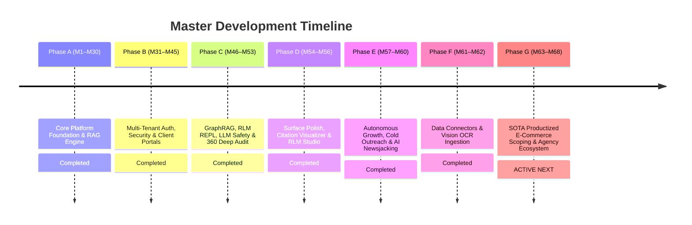

# Product & Architectural Roadmap (Single Source of Truth)

> 📌 **Master Roadmap Location:** For the comprehensive, platform-wide sequential timeline (M1 to M68) and active milestone tracking across both `Prateek_website` and `retriever`, see:
> 👉 **[`docs/UNIFIED_MASTER_ROADMAP.md`](file:///Users/prateeksharma/Developer/Prateek_website/docs/UNIFIED_MASTER_ROADMAP.md)**

---

## Quick Reference: Active Phases & Milestones

---

## Active Milestone Sequence (Phase G: M63 – M68)

| Milestone | Title | Focus Area | Detailed Specification |
|:---|:---|:---|:---|
| **M63** | Multimodal Discovery & Dogfooding Tenant | 1-line prompt + RFP/PRD PDF OCR dropzone on `prateeq_scoping` public tenant with live telemetry badge | [`docs/25_SOTA_Scoping_Engine_PRD.md`](file:///Users/prateeksharma/Developer/Prateek_website/docs/25_SOTA_Scoping_Engine_PRD.md#module-1-multimodal-ai-scoping-copilot--rfp-document-ingestion) |
| **M64** | Productized Architecture Cart Drawer & CPQ | Slide-over cart drawer, GraphRAG upsells, volume discount meter, promo validation engine | [`docs/25_SOTA_Scoping_Engine_PRD.md`](file:///Users/prateeksharma/Developer/Prateek_website/docs/25_SOTA_Scoping_Engine_PRD.md#module-3-productized-architecture-cart-drawer-bundles--promo-engine) |
| **M65** | Live Architecture Topology Map | Interactive SVG/Canvas node visualizer & active dependency cascade disconnect modal | [`docs/25_SOTA_Scoping_Engine_PRD.md`](file:///Users/prateeksharma/Developer/Prateek_website/docs/25_SOTA_Scoping_Engine_PRD.md#module-4-live-interactive-architecture-topology-map) |
| **M66** | Terminal Scoping CLI & Mobile QR Pay | `/terminal` CLI scoping commands (`scope new`, `cart checkout`) + QR code deposit payment | [`docs/25_SOTA_Scoping_Engine_PRD.md`](file:///Users/prateeksharma/Developer/Prateek_website/docs/25_SOTA_Scoping_Engine_PRD.md#module-5-pre-deposit-dashboard-bridge-deep-links--embedded-sota-customizer) |
| **M67** | Dashboard Bridge & Cryptographic SOW Freeze | Google Fast-Pass PKCE handoff (`tn_client_uuid`), embedded CPQ, SHA-256 SOW lock, Phase 2 Change Orders | [`docs/25_SOTA_Scoping_Engine_PRD.md`](file:///Users/prateeksharma/Developer/Prateek_website/docs/25_SOTA_Scoping_Engine_PRD.md#module-6-digital-proposal-sign-off-50-escrow--cryptographic-scope-freeze) |
| **M68** | Unified Persistent Copilot & Post-Launch SLA | Persistent Retriever Copilot chat, 1-click GitHub repo scaffolding, post-launch SLA cockpit | [`docs/25_SOTA_Scoping_Engine_PRD.md`](file:///Users/prateeksharma/Developer/Prateek_website/docs/25_SOTA_Scoping_Engine_PRD.md#module-8-unified-persistent-ai-project-copilot-scoping--dashboard-continuity) |

---

## Domain Technical Specifications & PRDs

For deep technical implementation details, schemas, API contracts, and component architectures:
- **Scoping Engine & Client Workspace Dashboard PRD:** [`docs/25_SOTA_Scoping_Engine_PRD.md`](file:///Users/prateeksharma/Developer/Prateek_website/docs/25_SOTA_Scoping_Engine_PRD.md)
- **RAG SaaS Studio Workspace PRD:** [`docs/24_RAG_App_Studio_PRD.md`](file:///Users/prateeksharma/Developer/Prateek_website/docs/24_RAG_App_Studio_PRD.md)
- **Client Workspace Architecture & Contracts:** [`docs/CLIENT_DASHBOARD_ROADMAP.md`](file:///Users/prateeksharma/Developer/Prateek_website/docs/CLIENT_DASHBOARD_ROADMAP.md)
- **Autonomous Outreach Agent Technical Spec:** [`docs/AI_OUTREACH_AGENT_ROADMAP.md`](file:///Users/prateeksharma/Developer/Prateek_website/docs/AI_OUTREACH_AGENT_ROADMAP.md)
- **Automated AI Blogging Engine Spec:** [`docs/AUTOMATED_AI_BLOGGING_ROADMAP.md`](file:///Users/prateeksharma/Developer/Prateek_website/docs/AUTOMATED_AI_BLOGGING_ROADMAP.md)
