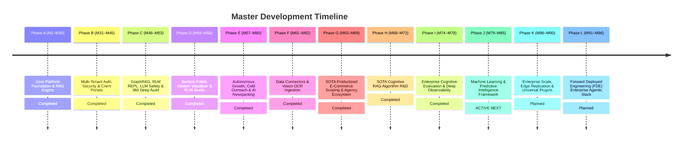

# Product & Architectural Roadmap (Single Source of Truth)

> 📌 **Master Roadmap Location:** For the comprehensive, platform-wide sequential timeline (M1 to M96) and active milestone tracking across both `Prateek_website` and `retriever`, see:
> 👉 **[`docs/UNIFIED_MASTER_ROADMAP.md`](file:///Users/prateeksharma/Developer/Prateek_website/docs/UNIFIED_MASTER_ROADMAP.md)**

---

## Quick Reference: Active Phases & Milestones

---

## Active Milestone Sequence (Phase J: M79 – M85)

| Milestone | Title | Focus Area | Status | Detailed Specification |
|:---|:---|:---|:---|:---|
| **M78** | Visual Claim-by-Claim Grounding Diff & Retriever Admin Observability | Visual claim-by-claim grounding highlighter and dedicated Retriever Admin observability cockpit | **Completed** | [`../../retriever/docs/RAG_2026_PRODUCT_ROADMAP.md`](file:///Users/prateeksharma/Developer/retriever/docs/RAG_2026_PRODUCT_ROADMAP.md#milestone-m78-visual-claim-by-claim-grounding-diff--retriever-admin-observability-cockpit) |
| **M79** | Sparse-Dense Hybrid Engine & Contrastive LoRA Domain Adapters | Sublinear BM25 vectorization + Contrastive LoRA residual embedding calibration | **Completed** | [`../../retriever/docs/RAG_2026_PRODUCT_ROADMAP.md`](file:///Users/prateeksharma/Developer/retriever/docs/RAG_2026_PRODUCT_ROADMAP.md#milestone-m79-sparse-dense-hybrid-engine--contrastive-lora-domain-adapters) |
| **M80** | PyTorch Late-Interaction ColBERT Token-Level MaxSim Engine | Multi-vector token representation and hardware-accelerated MaxSim late-interaction operator | **Completed** | [`../../retriever/docs/RAG_2026_PRODUCT_ROADMAP.md`](file:///Users/prateeksharma/Developer/retriever/docs/RAG_2026_PRODUCT_ROADMAP.md#milestone-m80-pytorch-late-interaction-colbert-token-level-maxsim-engine) |
| **M81** | Scikit-Learn Unsupervised Chunk Clustering & HDBSCAN Dynamic Topic Modeling | Dynamic topic modeling & hierarchical community synthesis for GraphRAG knowledge graphs | **Completed** | [`../../retriever/docs/RAG_2026_PRODUCT_ROADMAP.md`](file:///Users/prateeksharma/Developer/retriever/docs/RAG_2026_PRODUCT_ROADMAP.md#milestone-m81-scikit-learn-unsupervised-chunk-clustering--hdbscan-dynamic-topic-modeling) |
| **M82** | Scikit-Learn 2D/3D Embedding Space Projection Pipeline for SaaS Studio | PCA/UMAP/t-SNE projection service & Three.js interactive 3D vector space visualizer in SaaS Studio | **Completed** | [`../../retriever/docs/RAG_2026_PRODUCT_ROADMAP.md`](file:///Users/prateeksharma/Developer/retriever/docs/RAG_2026_PRODUCT_ROADMAP.md#milestone-m82-scikit-learn-2d3d-embedding-space-projection-pipeline-for-saas-studio) |
| **M83** | Scikit-Learn Real-Time Telemetry Anomaly Detection & Quota Abuse Guard | Isolation Forest anomaly sentinel on streaming inference telemetry logs | **ACTIVE NEXT** | [`../../retriever/docs/RAG_2026_PRODUCT_ROADMAP.md`](file:///Users/prateeksharma/Developer/retriever/docs/RAG_2026_PRODUCT_ROADMAP.md#milestone-m83-scikit-learn-real-time-telemetry-anomaly-detection--quota-abuse-guard) |
| **M85.1–M85.4** | Forensic Audit Remediation (Blueprint-to-Reality Parity) | LlamaGuard 3 structured safety, LongLLMLingua entropy scoring, Dashboard live wire | **Completed** | [`docs/UNIFIED_MASTER_ROADMAP.md`](file:///Users/prateeksharma/Developer/Prateek_website/docs/UNIFIED_MASTER_ROADMAP.md#phase-j5-forensic-audit-remediation--blueprint-to-reality-parity-m851--m854--completed) |
| **M85.5–M85.10** | Production Hardening & Engineering Credibility | Secrets rotation, structured logging, blue/green rollback deployment, fail-blocking CI, load tests | **Completed** | [`docs/UNIFIED_MASTER_ROADMAP.md`](file:///Users/prateeksharma/Developer/Prateek_website/docs/UNIFIED_MASTER_ROADMAP.md#phase-j6-production-hardening--engineering-credibility-m855--m8510--completed) |

---

## Domain Technical Specifications & PRDs

For deep technical implementation details, schemas, API contracts, and component architectures:
- **Scoping Engine & Client Workspace Dashboard PRD:** [`docs/25_SOTA_Scoping_Engine_PRD.md`](file:///Users/prateeksharma/Developer/Prateek_website/docs/25_SOTA_Scoping_Engine_PRD.md)
- **RAG SaaS Studio Workspace PRD:** [`docs/24_RAG_App_Studio_PRD.md`](file:///Users/prateeksharma/Developer/Prateek_website/docs/24_RAG_App_Studio_PRD.md)
- **Client Workspace Architecture & Contracts:** [`docs/CLIENT_DASHBOARD_ROADMAP.md`](file:///Users/prateeksharma/Developer/Prateek_website/docs/CLIENT_DASHBOARD_ROADMAP.md)
- **Autonomous Outreach Agent Technical Spec:** [`docs/AI_OUTREACH_AGENT_ROADMAP.md`](file:///Users/prateeksharma/Developer/Prateek_website/docs/AI_OUTREACH_AGENT_ROADMAP.md)
- **Automated AI Blogging Engine Spec:** [`docs/AUTOMATED_AI_BLOGGING_ROADMAP.md`](file:///Users/prateeksharma/Developer/Prateek_website/docs/AUTOMATED_AI_BLOGGING_ROADMAP.md)

