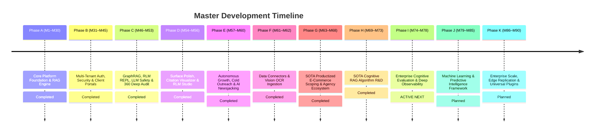

# Product & Architectural Roadmap (Single Source of Truth)

> 📌 **Master Roadmap Location:** For the comprehensive, platform-wide sequential timeline (M1 to M85) and active milestone tracking across both `Prateek_website` and `retriever`, see:
> 👉 **[`docs/UNIFIED_MASTER_ROADMAP.md`](file:///Users/prateeksharma/Developer/Prateek_website/docs/UNIFIED_MASTER_ROADMAP.md)**

---

## Quick Reference: Active Phases & Milestones

---

## Active Milestone Sequence (Phase I: M74 – M78)

| Milestone | Title | Focus Area | Status | Detailed Specification |
|:---|:---|:---|:---|:---|
| **M73** | GraphRAG Leiden Community Detection & Closed-Loop Self-Tuning | Global entity clustering and automated closed-loop self-tuning from online evaluations | **Completed** | [`../../retriever/docs/RAG_2026_PRODUCT_ROADMAP.md`](file:///Users/prateeksharma/Developer/retriever/docs/RAG_2026_PRODUCT_ROADMAP.md#milestone-m73-graphrag-leiden-community-detection--closed-loop-self-tuning) |
| **M74** | Semantic NLI & SLM-as-a-Judge Online Hallucination Engine | Semantic NLI Cross-Encoder + structured SLM judge in Celery worker | **Completed** | [`../../retriever/docs/RAG_2026_PRODUCT_ROADMAP.md`](file:///Users/prateeksharma/Developer/retriever/docs/RAG_2026_PRODUCT_ROADMAP.md#milestone-m74-semantic-nli--slm-as-a-judge-online-hallucination-engine) |
| **M75** | Full-Stack OpenTelemetry Auto-Instrumentation | Auto-instrument SQLAlchemy, HTTPX, Celery and propagate W3C traceparent headers | **Completed** | [`../../retriever/docs/RAG_2026_PRODUCT_ROADMAP.md`](file:///Users/prateeksharma/Developer/retriever/docs/RAG_2026_PRODUCT_ROADMAP.md#milestone-m75-full-stack-opentelemetry-auto-instrumentation--distributed-trace-graph) |
| **M76** | Real-Time Telemetry Live Aggregations & SLA Webhook Alerting | Live SQL multi-tenant aggregations and Slack/Discord/Email webhook incident dispatcher | **Completed** | [`../../retriever/docs/RAG_2026_PRODUCT_ROADMAP.md`](file:///Users/prateeksharma/Developer/retriever/docs/RAG_2026_PRODUCT_ROADMAP.md#milestone-m76-real-time-telemetry-live-aggregations--sla-webhook-alerting-engine) |
| **M77** | Synthetic Golden Dataset Generation & Automated CI/CD Gate | Auto-generate benchmark Q&A pairs from documents and enforce GitHub Actions regression gate | **Completed** | [`../../retriever/docs/RAG_2026_PRODUCT_ROADMAP.md`](file:///Users/prateeksharma/Developer/retriever/docs/RAG_2026_PRODUCT_ROADMAP.md#milestone-m77-synthetic-golden-dataset-generation--automated-cicd-regression-gate) |
| **M78** | Visual Claim-by-Claim Grounding Diff & Retriever Admin Observability | Visual claim-by-claim grounding highlighter and dedicated Retriever Admin observability cockpit | **ACTIVE NEXT** | [`../../retriever/docs/RAG_2026_PRODUCT_ROADMAP.md`](file:///Users/prateeksharma/Developer/retriever/docs/RAG_2026_PRODUCT_ROADMAP.md#milestone-m78-visual-claim-by-claim-grounding-diff--retriever-admin-observability-cockpit) |

---

## Domain Technical Specifications & PRDs

For deep technical implementation details, schemas, API contracts, and component architectures:
- **Scoping Engine & Client Workspace Dashboard PRD:** [`docs/25_SOTA_Scoping_Engine_PRD.md`](file:///Users/prateeksharma/Developer/Prateek_website/docs/25_SOTA_Scoping_Engine_PRD.md)
- **RAG SaaS Studio Workspace PRD:** [`docs/24_RAG_App_Studio_PRD.md`](file:///Users/prateeksharma/Developer/Prateek_website/docs/24_RAG_App_Studio_PRD.md)
- **Client Workspace Architecture & Contracts:** [`docs/CLIENT_DASHBOARD_ROADMAP.md`](file:///Users/prateeksharma/Developer/Prateek_website/docs/CLIENT_DASHBOARD_ROADMAP.md)
- **Autonomous Outreach Agent Technical Spec:** [`docs/AI_OUTREACH_AGENT_ROADMAP.md`](file:///Users/prateeksharma/Developer/Prateek_website/docs/AI_OUTREACH_AGENT_ROADMAP.md)
- **Automated AI Blogging Engine Spec:** [`docs/AUTOMATED_AI_BLOGGING_ROADMAP.md`](file:///Users/prateeksharma/Developer/Prateek_website/docs/AUTOMATED_AI_BLOGGING_ROADMAP.md)

