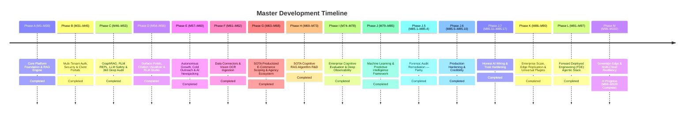

# Product & Architectural Roadmap (Single Source of Truth)

> 📌 **Master Roadmap Location:** For the comprehensive, platform-wide sequential timeline (M1 to M102) and active milestone tracking across both `Prateek_website` and `retriever`, see:
> 👉 **[`docs/UNIFIED_MASTER_ROADMAP.md`](file:///Users/prateeksharma/Developer/Prateek_website/docs/UNIFIED_MASTER_ROADMAP.md)**

---

## Quick Reference: Active Phases & Milestones

---

## Active Milestone Sequence (Phase M: M98 – M102)

| Milestone | Title | Focus Area | Status | Detailed Specification |
|:---|:---|:---|:---|:---|
| **M86** | Edge AI Token Shield, DDoS Defense & Upstash Rate Limiting | Dual-mode sliding-window token limiter & resilient SSE reconnect | **Completed** | [`docs/UNIFIED_MASTER_ROADMAP.md`](file:///Users/prateeksharma/Developer/Prateek_website/docs/UNIFIED_MASTER_ROADMAP.md#milestone-86-edge-ai-token-shield-ddos-defense--upstash-redis-rate-limiting) |
| **M86.5** | Platform Capabilities & Active Batteries Observability Cockpit | 12 platform batteries inventory and live telemetry command center | **Completed** | [`docs/UNIFIED_MASTER_ROADMAP.md`](file:///Users/prateeksharma/Developer/Prateek_website/docs/UNIFIED_MASTER_ROADMAP.md#milestone-865-platform-capabilities--active-batteries-observability-cockpit) |
| **M87** | Automated Cloud Database Snapshots & PITR Engine | AES-256 encrypted table streamer & zero-downtime `--dry-run` PITR recovery | **Completed** | [`docs/UNIFIED_MASTER_ROADMAP.md`](file:///Users/prateeksharma/Developer/Prateek_website/docs/UNIFIED_MASTER_ROADMAP.md#milestone-87-automated-cloud-database-snapshots-s3r2-wal-archival--pitr-recovery-engine) |
| **M88** | Enterprise Compliance Vault: Presidio PII & GDPR Wipe | Luhn entity sanitizer & HMAC-SHA256 deletion certificate authority | **Completed** | [`docs/UNIFIED_MASTER_ROADMAP.md`](file:///Users/prateeksharma/Developer/Prateek_website/docs/UNIFIED_MASTER_ROADMAP.md#milestone-88-enterprise-compliance-vault-presidio-pii-redaction--gdpr-cryptographic-wipe) |
| **M89** | Geo-Distributed Multi-Region Edge Vector Read-Replicas | Geo-IP latency router & CQRS read-replica connection pooler | **Completed** | [`docs/UNIFIED_MASTER_ROADMAP.md`](file:///Users/prateeksharma/Developer/Prateek_website/docs/UNIFIED_MASTER_ROADMAP.md#milestone-89-geo-distributed-multi-region-edge-vector-read-replicas) |
| **M90** | Universal Ecosystem Plugins (Slack Bot, Chrome Ext, GDrive Sync) | Native Slack bot `/ask-retriever`, Manifest V3 extension & 2-way sync | **Completed** | [`docs/UNIFIED_MASTER_ROADMAP.md`](file:///Users/prateeksharma/Developer/Prateek_website/docs/UNIFIED_MASTER_ROADMAP.md#milestone-90-universal-ecosystem-plugins-slack-bot-chrome-extension--2-way-gdrive-sync) |
| **M91** | LangGraph Cyclic Agentic Workflows & HITL State Engine | Stateful cyclic graphs, PostgreSQL checkpoints & human approval gates | **Completed** | [`docs/UNIFIED_MASTER_ROADMAP.md`](file:///Users/prateeksharma/Developer/Prateek_website/docs/UNIFIED_MASTER_ROADMAP.md#milestone-91-langgraph-cyclic-agentic-orchestration--human-in-the-loop-hitl-state-engine) |
| **M92** | DSPy Declarative Prompt Compilation & Teleprompter | Declarative Signatures, teleprompter metric optimization & hot-activation | **Completed** | [`docs/UNIFIED_MASTER_ROADMAP.md`](file:///Users/prateeksharma/Developer/Prateek_website/docs/UNIFIED_MASTER_ROADMAP.md#milestone-92-dspy-declarative-prompt-compilation--algorithmic-self-optimization-pipeline) |
| **M93** | Enterprise LLM Gateway & Multi-Model Smart Router | LiteLLM gateway, dynamic model failover, cost & quota attribution | **Completed** | [`docs/UNIFIED_MASTER_ROADMAP.md`](file:///Users/prateeksharma/Developer/Prateek_website/docs/UNIFIED_MASTER_ROADMAP.md#milestone-93-enterprise-llm-gateway--multi-model-smart-router-litellm-architecture) |
| **M94** | NVIDIA NeMo Guardrails & Conversational Safety Rails | Colang flow interpreter, sub-20ms input rails & post-inference fact check | **Completed** | [`docs/UNIFIED_MASTER_ROADMAP.md`](file:///Users/prateeksharma/Developer/Prateek_website/docs/UNIFIED_MASTER_ROADMAP.md#milestone-94-nvidia-nemo-guardrails--multi-turn-conversational-safety-rails) |
| **M95** | Durable Asynchronous Execution & AI Workflow Engine | Step-level memoization (<2ms replay), retry backoff & Step DAG timeline | **Completed** | [`docs/UNIFIED_MASTER_ROADMAP.md`](file:///Users/prateeksharma/Developer/Prateek_website/docs/UNIFIED_MASTER_ROADMAP.md#milestone-95-durable-asynchronous-execution--background-ai-workflow-engine) |
| **M96** | Serverless GPU Serving & Custom vLLM / LoRA Deployment Pipeline | Modal / BentoML serverless GPU auto-scaling & runtime LoRA swapping | **Completed** | [`docs/UNIFIED_MASTER_ROADMAP.md`](file:///Users/prateeksharma/Developer/Prateek_website/docs/UNIFIED_MASTER_ROADMAP.md#milestone-96-serverless-gpu-serving--custom-vllm--lora-deployment-pipeline-modal--bentoml) |
| **M97** | Autonomous FDE Metaprogrammer & Capability Studio | Natural language capability wizard & automated Hexagonal code scaffolder | **Completed** | [`docs/UNIFIED_MASTER_ROADMAP.md`](file:///Users/prateeksharma/Developer/Prateek_website/docs/UNIFIED_MASTER_ROADMAP.md#milestone-97-autonomous-fde-metaprogrammer--self-extending-capability-studio) |
| **M98** | Sovereign Edge SQLite / Turso Vector Synchronization & Offline Agent | Embedded SQLite 3 FTS5, binary float32 BLOB vectors, differential delta sync | **Completed** | [`docs/UNIFIED_MASTER_ROADMAP.md`](file:///Users/prateeksharma/Developer/Prateek_website/docs/UNIFIED_MASTER_ROADMAP.md#milestone-98-sovereign-edge-sqlite--turso-vector-synchronization--offline-first-edge-agent) |
| **M99** | Distributed Multi-Cloud Failover & Edge Turso LibSQL Replication | Active-active multi-cloud failover, LibSQL embedded replicas & cluster health probing | **Completed** | [`docs/UNIFIED_MASTER_ROADMAP.md`](file:///Users/prateeksharma/Developer/Prateek_website/docs/UNIFIED_MASTER_ROADMAP.md#milestone-99-distributed-multi-cloud-failover--edge-turso-libsql-replication) |
| **M100** | Sovereign Edge Voice & Local Whisper / WebRTC Speech Synthesis | Full-duplex WebRTC, local Whisper ASR, RMS/ZCR VAD endpointing & streaming neural TTS | **Completed** | [`docs/UNIFIED_MASTER_ROADMAP.md`](file:///Users/prateeksharma/Developer/Prateek_website/docs/UNIFIED_MASTER_ROADMAP.md#milestone-100-sovereign-edge-voice--local-whisper--webrtc-speech-synthesis) |

---

## Domain Technical Specifications & PRDs

For deep technical implementation details, schemas, API contracts, and component architectures:
- **Scoping Engine & Client Workspace Dashboard PRD:** [`docs/25_SOTA_Scoping_Engine_PRD.md`](file:///Users/prateeksharma/Developer/Prateek_website/docs/25_SOTA_Scoping_Engine_PRD.md)
- **RAG SaaS Studio Workspace PRD:** [`docs/24_RAG_App_Studio_PRD.md`](file:///Users/prateeksharma/Developer/Prateek_website/docs/24_RAG_App_Studio_PRD.md)
- **Client Workspace Architecture & Contracts:** [`docs/CLIENT_DASHBOARD_ROADMAP.md`](file:///Users/prateeksharma/Developer/Prateek_website/docs/CLIENT_DASHBOARD_ROADMAP.md)
- **Autonomous Outreach Agent Technical Spec:** [`docs/AI_OUTREACH_AGENT_ROADMAP.md`](file:///Users/prateeksharma/Developer/Prateek_website/docs/AI_OUTREACH_AGENT_ROADMAP.md)
- **Automated AI Blogging Engine Spec:** [`docs/AUTOMATED_AI_BLOGGING_ROADMAP.md`](file:///Users/prateeksharma/Developer/Prateek_website/docs/AUTOMATED_AI_BLOGGING_ROADMAP.md)

