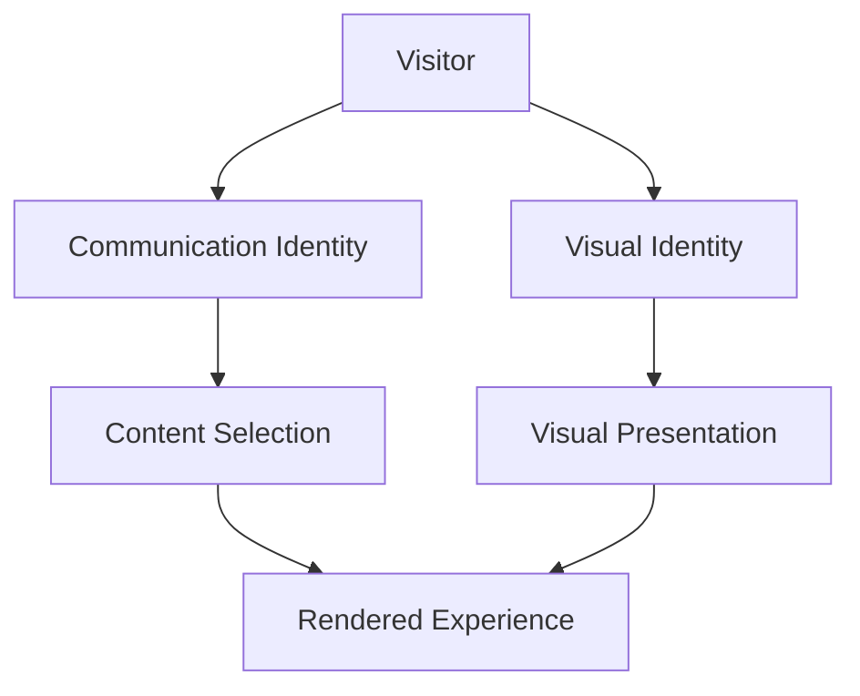
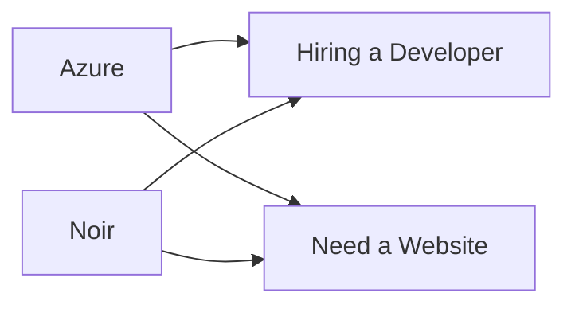

# **6. Adaptive Identity System**

## **Purpose**

The Adaptive Identity System is the foundation of Adaptive Portfolio.

It governs how the website presents itself to different visitors while preserving a single coherent product identity.

Rather than creating multiple versions of the website, the identity system dynamically composes the experience from independent identity layers.

This approach allows the product to remain scalable, maintainable, and future-ready.

---

# **Philosophy**

Identity should be composable.

Every aspect of the visitor experience should be derived from a small number of independent systems working together.

No identity should directly depend on another.

Instead, they combine to produce the final experience.

---

# **Identity Layers**

Adaptive Portfolio is built upon multiple identity layers.

Each layer has a clearly defined responsibility.



Each layer should remain independent.

---

# **Visual Identity**

Visual Identity controls the emotional atmosphere of the website.

Current identities:

- **Azure** (Technical Value: `'light'`)
- **Noir** (Technical Value: `'noir'`)

> [!NOTE]
> **Technical Theme Mapping**: 
> In the database, APIs, CSS class names (`data-theme`), and React context, the product visual theme **Azure** maps to the string value `'light'`, and **Noir** maps to `'noir'`. This decouples user-facing naming conventions from technical variables.

Visual Identity influences:

- color palette
- illustrations
- imagery
- typography mood
- iconography
- visual effects
- atmosphere
- emotional tone

Visual Identity must never determine what information is displayed.

Its responsibility is purely experiential.

---

# **Communication Identity**

Communication Identity determines how the website communicates.

Current identities:

- **Hiring a Developer** (Technical Value: `'developer'`)
- **Need a Website** (Technical Value: `'business'`)

Communication Identity influences:

- messaging
- terminology
- content priorities
- navigation emphasis
- calls to action
- generated documents
- storytelling

Communication Identity should never directly modify visual styling.

---

# **Identity Matrix**

Every visitor experiences one combination of identities.



Current combinations:

- Azure + Hiring a Developer (`light` theme + `developer` communication)
- Azure + Need a Website (`light` theme + `business` communication)
- Noir + Hiring a Developer (`noir` theme + `developer` communication)
- Noir + Need a Website (`noir` theme + `business` communication)

The architecture must support additional combinations without structural changes.

---

# **Identity Independence**

The following rules are non-negotiable.

Changing the visual identity must never automatically change the communication identity.

Changing the communication identity must never automatically change the visual identity.

Each identity should persist independently.

Each identity should evolve independently.

---

# **Content Resolution**

Every rendered component should determine its content using both identity layers.

Conceptually:

```text
Visual Identity
 
+
 
Communication Identity
 
↓
 
Resolved Content
 
↓
 
Rendered Component
```

Components should not contain hardcoded variations.

They should request the appropriate content from the content platform.

---

# **Content Variants**

Every editable piece of content should support variants.

Examples include:

- Hero
- About
- Navigation
- Projects
- Pricing
- Resume
- Quotation
- Contact

The component itself should remain unchanged.

Only the resolved content changes.

---

# **Theme Personality**

Visual identities influence writing style.

Azure should communicate with:

- optimism
- curiosity
- creativity
- exploration
- energy

Noir should communicate with:

- confidence
- refinement
- elegance
- precision
- professionalism

The underlying message should remain consistent.

Only its personality changes.

---

# **Audience Personality**

Developer communication should prioritize:

- engineering
- architecture
- technical thinking
- learning
- implementation

Business communication should prioritize:

- outcomes
- trust
- value
- collaboration
- communication

---

# **Identity Resolution Flow**

Conceptually the rendering pipeline should behave as follows.

```mermaid
flowchart TD

Visitor

↓

Audience Selection

↓

Communication Identity

↓

Visual Theme

↓

Content Platform

↓

Resolved Content

↓

Rendered Experience
```

This flow represents product behaviour rather than implementation.

---

# **Identity State Resolution & Persistence**

The product should remember independently:

- preferred visual identity
- preferred communication identity

To ensure zero layout shifts (CLS), hydration compatibility, and search crawler visibility, the resolution path utilizes a multi-tiered approach:

1. **Server-Side Cookie Recognition**:
   - The visitor's selection is stored in browser cookies (e.g., `theme=[light|noir]` and `audience=[developer|business]`) with a 1-year expiration.
   - On request intercept, the Next.js server components or proxy middleware check these cookie values to render matching HTML elements and metadata server-side.
2. **Client-Side Hydration Reconciler**:
   - As a secondary fallback, `localStorage` holds the values. 
   - A blocking script in `<head>` (for themes) reads `localStorage` to quickly toggle attributes before rendering, preventing visual screen flashing.
3. **Canonical Crawler Default**:
   - Search engines and bots that do not support cookies or `localStorage` are served a balanced, neutral default combination. This default outlines core full-stack competencies and freelance services simultaneously to maximize indexing.

---

# **Global UX Display Toggles**

Apart from the Visual and Communication identities, the client layout listens to two runtime user-driven display toggle states:

1. **Zen Mode (Details Visibility State)**:
   - Tracks whether UI details are hidden via the `isDetailsHidden` boolean state in `ThemeContext`.
   - When active, it appends the `ui-details-hidden` class to `document.documentElement` to globally fade out and hide navigation, footer, and main content structures via CSS rules, leaving the background scenery completely exposed.
2. **Easter Egg Override (Konami Code state)**:
   - Evaluated globally in the layout middleware loop. Typing the Konami code sequence appends `konami-active` class to `document.documentElement`.
   - It mounts the `ThreePizzaRat` canvas overlay. A safety timeout automatically cleans up the class and unmounts the canvas after 30 seconds.

---

# **Future Expansion**

The identity system should remain flexible.

Possible future communication identities:

- Investor
- Collaborator
- Student
- Open Source Maintainer
- Speaker
- Mentor

Possible future visual identities:

- Aurora
- Paper
- Midnight
- Minimal
- Seasonal themes

The architecture should not require redesign to support future identities.

---

# **Failure Behaviour**

If an identity cannot be resolved:

The website should gracefully fall back to safe defaults.

Visitors should never experience:

- broken layouts
- missing content
- inconsistent styling
- empty sections

Graceful degradation is mandatory.

---

# **Engineering Expectations**

The implementation should prioritize:

- composition over duplication
- configuration over hardcoding
- reusable abstractions
- scalability
- maintainability

Identity logic should remain centralized.

Individual components should remain as simple as possible.

---

# **Definition of Success**

The Adaptive Identity System succeeds when:

Visitors feel the website naturally adapts to them.

Developers can introduce new identities without redesigning the application.

Content creators can manage identity variants without modifying presentation code.

The product remains coherent regardless of future expansion.

---

# **Acceptance Criteria**

- Visual and Communication identities remain independent.
- Identity combinations compose correctly.
- Components remain reusable.
- Content variants are resolved dynamically.
- Theme personality influences communication.
- Audience personality influences priorities.
- Identity preferences persist independently using a cookie-first resolution path.
- The architecture supports future identities.
- Failure states degrade gracefully.
- The implementation remains scalable and maintainable.
