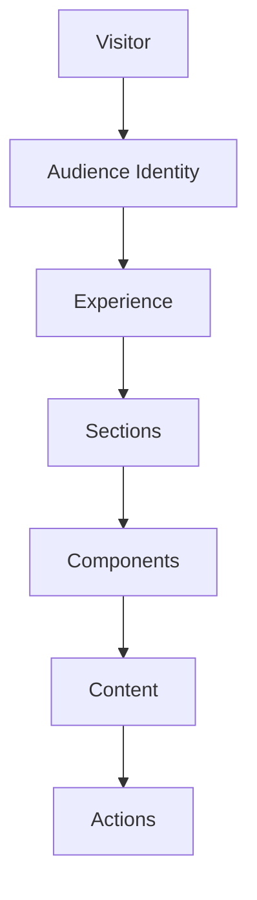
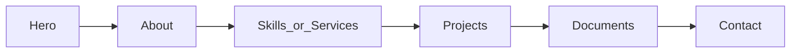

# **8. Information Architecture**

## **Purpose**

Information Architecture defines how information is organized, prioritized, related, and discovered throughout Adaptive Portfolio.

The objective is not to determine how the interface looks.

The objective is to determine how the product thinks.

Every visitor should naturally discover increasingly relevant information without feeling overwhelmed.

The architecture should support current functionality while remaining flexible enough for future expansion.

---

# **Information Philosophy**

Adaptive Portfolio is not a collection of pages.

It is a collection of structured information that is intelligently assembled into experiences.

Pages are merely one possible presentation.

Content is the true product.

---

# **Principles**

The Information Architecture should follow these principles.

## **Hierarchy Before Layout**

Information should be organized by importance before visual design.

The hierarchy should remain meaningful regardless of screen size or visual theme.

---

## **Progressive Disclosure**

Present only what the visitor needs at the current stage.

Allow additional detail to appear naturally as curiosity increases.

Avoid overwhelming visitors with excessive information.

---

## **Context Over Quantity**

Showing less information at the right time is more valuable than showing everything.

Each audience should receive the information most relevant to its goals.

---

## **One Source of Truth**

Every piece of editable information should exist in only one authoritative location.

Avoid duplicated content.

Avoid manually synchronized copies.

Avoid conflicting versions.

---

# **Information Model**

The product should be understood as a hierarchy of information rather than pages.

Each level builds upon the previous one.

---

# **Visitor Layer**

Every visitor enters with:

- an intent
- a preferred communication style
- a preferred visual identity

The remainder of the experience adapts accordingly.

---

# **Experience Layer**

The selected identities determine the overall experience.

The experience consists of multiple independent sections that work together to tell a coherent story.

No section should exist in isolation.

---

# **Section Layer**

Each section has a clearly defined responsibility.

Examples include:

- Hero
- About
- Skills / Services
- Projects
- Playground
- Resume / Quotations
- Pricing
- Contact
- Footer
- Terminal

Sections should remain modular.

Future sections should be introducible without restructuring the application.

---

# **Component Layer**

Sections are composed of reusable components.

Examples include:

- Cards
- Buttons
- Badges
- Statistics
- Timelines
- Galleries
- Documents
- Call-to-action blocks

Components should never own business content.

They simply render it.

---

# **Content Layer**

Content represents the knowledge of the product.

Examples include:

- headlines
- descriptions
- pricing
- services
- projects
- skills
- quotations
- resume entries
- navigation labels

Content should remain independent from presentation.

---

# **Action Layer**

Information should naturally lead to action.

Examples include:

- Download Resume
- Download Quotation
- Contact
- Explore Project
- Visit GitHub
- View Demo
- Schedule Discussion

Actions should feel like logical next steps rather than advertisements.

---

# **Information Relationships**

Content should relate naturally.

Examples:

Projects reference:

- skills
- technologies
- services

Services reference:

- projects

Resume references:

- skills
- projects
- certificates

Quotations reference:

- services
- pricing

Future content relationships should be easy to introduce.

---

# **Navigation Architecture**

Navigation should expose the information hierarchy rather than simply listing pages.

Navigation should answer:

Where am I?

Where can I go?

What is most important?

Navigation labels may adapt according to Communication Identity while preserving structural consistency.

---

# **Content Discovery**

Visitors should discover information progressively.

A typical journey may resemble:

The experience should encourage exploration without forcing it.

---

# **Searchability**

Although a search feature is not currently planned, the information architecture should remain compatible with future search capabilities.

Every major content entity should be structured and identifiable.

Future AI-assisted search should require minimal architectural changes.

---

# **Generated Documents**

Generated documents such as resumes and quotations should derive their content from the same information architecture as the website.

Avoid creating independent document-specific content where shared information is sufficient.

This ensures consistency across every output.

---

# **Future Expansion**

The architecture should naturally support future additions such as:

- blog improvements
- testimonials
- case studies
- certifications
- publications
- talks
- products
- open-source work
- additional audience identities
- multilingual content

Future additions should extend the architecture rather than replace it.

---

# **Scalability**

As the portfolio grows, complexity should increase linearly rather than exponentially.

Adding:

- a new audience
- a new theme
- a new language
- a new section
- a new generated document

should not require redesigning the existing architecture.

---

# **Information Ownership**

Every type of information should have one clearly defined owner.

Examples:

Pricing

↓

Content Platform

Projects

↓

Content Platform

Theme Preferences

↓

Identity System

Resume

↓

Document Generation System

Analytics

↓

Telemetry Platform

Separating ownership reduces ambiguity and improves maintainability.

---

# **Engineering Expectations**

The implementation should emphasize:

- composability
- modularity
- reusability
- separation of concerns
- future extensibility

The Information Architecture should guide engineering decisions rather than follow them.

---

# **Definition of Success**

The Information Architecture succeeds when:

Visitors always know where to find information.

Developers understand where new information belongs.

Content creators understand where information should be managed.

Future expansion remains predictable.

The product grows without becoming disorganized.

---

# **Acceptance Criteria**

- Information hierarchy is clearly defined.
- Progressive disclosure is documented.
- Information relationships are established.
- Sections remain modular.
- Components remain presentation-focused.
- Content remains independent.
- Generated documents reuse the same information model.
- Future expansion is supported.
- Ownership of information is clearly defined.
- Engineering decisions align with the Information Architecture.
