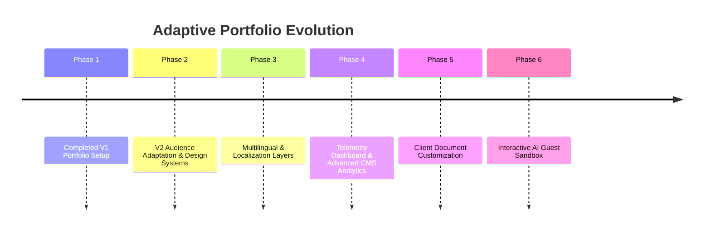

# **21. Future Roadmap**

## **Purpose**

The Future Roadmap tracks proposed feature enhancements, system scale requirements, and strategic updates for subsequent releases of the portfolio. This ensures that the codebase remains prepared for future design and content upgrades.

---

# **Roadmap Milestones**

The evolution of Adaptive Portfolio is structured across six future phases:

---

## **Phase 3: Multilingual & Localization Layers**
* **Dynamic Languages**: Expand the Dynamic Content Platform to support multi-language routing (e.g., English, German, Spanish).
* **Architecture**: Localizations will integrate as an independent schema layer, preventing layout duplication.

---

## **Phase 4: Telemetry Analytics Dashboard**
* **CMS Visualizations**: Build a dashboard directly inside the Streamlit Synchronizer (`scripts/synchronizer.py`) that visualizes visitor metrics.
* **Aggregated Insights**: Generate graphics showing:
  * Visual theme preference distributions.
  * Audience preference trends.
  * Geographical visitor aggregates (by country).
  * Document download rates.

---

## **Phase 5: Client Document Customization**
* **Document Engine**: Expand client-side PDF builders to support customizable document options:
  * **Resume options**: Select specialized resume profiles (e.g., Frontend Specialist, Tech Lead, Product Developer).
  * **Quotation templates**: Select project package tiers and input custom feature selections to calculate estimated rates.

---

## **Phase 6: Interactive AI Guest Sandbox**
* **Safe LLM Playgrounds**: Build a guest sandbox page where technical visitors can interact with a specialized AI helper.
* **Capabilities**: The AI helper can answer questions about the portfolio's architecture, explain project challenges, and provide credential verification.
* **Security Bounds**: Run queries securely using edge function bounds with strict rate limiting.

---

# **Acceptance Criteria**
- Future roadmap items align with the non-negotiable principles defined in [01_Vision_and_Philosophy.md](file:///Users/prateeksharma/Developer/Prateek_website/docs/01_Vision_and_Philosophy.md).
- Architectural patterns remain open to roadmap implementations (e.g. schema layers and route configs).
