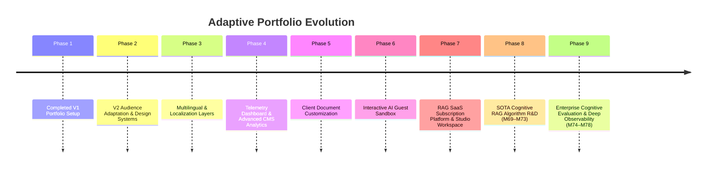

# **21. Future Roadmap (Portfolio Overview)**

> 📌 **Master SSoT Roadmap:** For active platform-wide sequential development tracking (M1 to M78) across `Prateek_website` and `retriever`, see: [`UNIFIED_MASTER_ROADMAP.md`](UNIFIED_MASTER_ROADMAP.md).

## **Purpose**

The Future Roadmap tracks proposed feature enhancements, system scale requirements, and strategic updates for subsequent releases of the portfolio. This ensures that the codebase remains prepared for future design and content upgrades.

---

# **Roadmap Milestones**

The evolution of Adaptive Portfolio is structured across future phases:

```mermaid
timeline
    title Adaptive Portfolio Evolution
    Phase 1 : Completed V1 Portfolio Setup
    Phase 2 : V2 Audience Adaptation & Design Systems
    Phase 3 : Multilingual & Localization Layers
    Phase 4 : Telemetry Dashboard & Advanced CMS Analytics
    Phase 5 : Client Document Customization
    Phase 6 : Interactive AI Guest Sandbox
    Phase 7 : RAG SaaS Subscription Platform & Studio Workspace
    Phase 8 : SOTA Cognitive RAG Algorithm R&D (M69–M73)
    Phase 9 : Enterprise Cognitive Evaluation & Deep Observability (M74–M78)
```

---

## **Phase 3: Multilingual & Localization Layers**
* **Dynamic Languages**: Expand the Dynamic Content Platform to support multi-language routing (e.g., English, German, Spanish).
* **Architecture**: Localizations will integrate as an independent schema layer, preventing layout duplication.

---

## **Phase 4: Telemetry Analytics Dashboard**
* **CMS Visualizations**: Build a dashboard directly inside the Streamlit Synchronizer (`scripts/synchronizer.py`) that visualizes visitor metrics.
* **Aggregated Insights**: Generate graphics showing:
  * Visual theme preference distributions.
  * Audience preference trends.
  * Geographical visitor aggregates (by country).
  * Document download rates.

---

## **Phase 5: Client Document Customization**
* **Document Engine**: Expand client-side PDF builders to support customizable document options:
  * **Resume options**: Select specialized resume profiles (e.g., Frontend Specialist, Tech Lead, Product Developer).
  * **Quotation templates**: Select project package tiers and input custom feature selections to calculate estimated rates.

---

## **Phase 6: Interactive AI Guest Sandbox**
* **Safe LLM Playgrounds**: Build a guest sandbox page where technical visitors can interact with a specialized AI helper.
* **Capabilities**: The AI helper can answer questions about the portfolio's architecture, explain project challenges, and provide credential verification.
* **Security Bounds**: Run queries securely using edge function bounds with strict rate limiting.

---

## **Phase 7: RAG SaaS Subscription Platform & Multi-Tenant Studio Workspace**
* **Razorpay Subscription Automation**: Wire `/rag` pricing tiers to Razorpay subscription APIs and automate tenant provisioning in `retriever` via webhooks.
* **Supabase Auth Session Gate**: Connect `/rag/app` natively to Supabase Auth user sessions (`rag_tenants` and `rag_tenant_members` schemas).
* **Multi-User Team Invites**: Enable tenant owners to invite team members by email with role-based access control.
* **Detailed Ecosystem Roadmap**: See **[Client Dashboard Ecosystem Roadmap](CLIENT_DASHBOARD_ROADMAP.md)** for full specifications.

---

## **Phase 8: SOTA Cognitive RAG Algorithm R&D (M69 – M73)**
* **Anthropic Contextual Retrieval**: Prepend 50-word document context headers to chunks prior to vector embedding.
* **ColBERT Token-Level Reranking**: Late-interaction MaxSim operations on top-50 candidate sets.
* **Corrective RAG (CRAG)**: Autonomous agentic reflection loop with web search fallbacks.
* **RLM REPL Studio & Leiden Graph Community RAG**: Dedicated SaaS Studio workspace tab and global hierarchical graph summaries.

---

## **Phase 9: Enterprise Cognitive Evaluation & Deep Observability (M74 – M78)**
* **Semantic NLI & SLM-as-a-Judge**: DeBERTa cross-encoder + local Ollama evaluation tasks for zero false-positive hallucination tracing.
* **Full-Stack OpenTelemetry Auto-Instrumentation**: End-to-end distributed tracing across SQL, pgvector, HTTPX LLM calls, and Celery workers.
* **Automated Golden Dataset CI/CD Gates & SLA Webhooks**: Automated regression gates and real-time SLA incident webhooks.

---

> 📌 **Cross-Repository Roadmap & Field Documentation:**  
> - **Client Dashboard Ecosystem (`prateeq.in`):** **[CLIENT_DASHBOARD_ROADMAP.md](CLIENT_DASHBOARD_ROADMAP.md)**  
> - **Admin Platform Control Panel (`admin.rag.prateeq.in`):** **[ADMIN_DASHBOARD_ROADMAP.md](../../retriever/docs/ADMIN_DASHBOARD_ROADMAP.md)**  
> - **High-Converting Demo Field Guide:** **[DEMO_PLAYBOOK_AND_SHOWCASE_GUIDE.md](DEMO_PLAYBOOK_AND_SHOWCASE_GUIDE.md)**

---

# **Acceptance Criteria**
- Future roadmap items align with the non-negotiable principles defined in [01_Vision_and_Philosophy.md](01_Vision_and_Philosophy.md).
- Architectural patterns remain open to roadmap implementations (e.g. schema layers and route configs).

---

## **Related Architecture & Cross-References**

- [Unified Master Roadmap (SSoT: M1–M68)](UNIFIED_MASTER_ROADMAP.md)
- [SOTA Scoping Engine & Commerce PRD](25_SOTA_Scoping_Engine_PRD.md)
- [RAG SaaS Studio Workspace PRD](24_RAG_App_Studio_PRD.md)
- [Client Workspace Specification](CLIENT_DASHBOARD_ROADMAP.md)