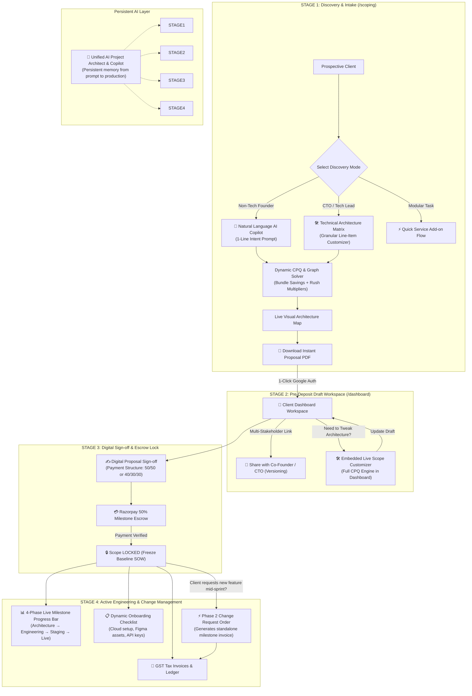
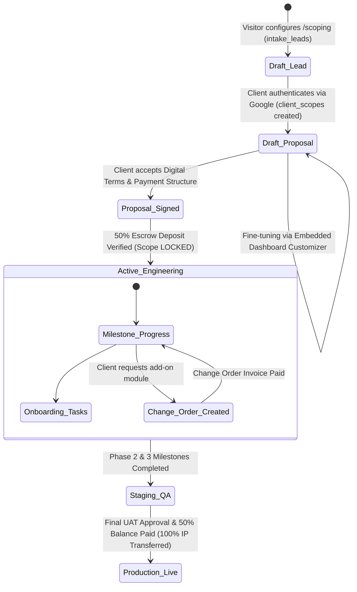

# PRD: Unified SOTA Scoping Engine & Client Workspace Dashboard (v2.0)

> **Document Status:** Working Draft — Unified Architecture Established  
> **Target Release:** Q3 2026  
> **Lead Architect:** Prateek Sharma  
> **Target Audience:** High-ticket B2B Founders, CTOs, Enterprise Product Managers, and Sales Partners  
> **Deal Size Focus:** $3,000 to $35,000+ USD / ₹2,50,000 to ₹30,00,000+ INR  

---

## 1. Executive Summary & Product Vision

The **Unified SOTA Scoping & Client Workspace Engine** merges the public Scoping Lab (`/scoping`) and the authenticated Client Portal (`/dashboard`) into a **single, continuous client lifecycle**.

Instead of treating scoping as a static one-off cost calculator and the dashboard as a disconnected post-sale viewer, v2.0 unifies them into an **agency-grade productized engineering platform**:
1. **At Discovery (`/scoping`)**: Prospective clients articulate their vision via an AI Natural Language Copilot or technical configurator, generating instant line-item CPQ pricing, visual architecture topologies, and Canva-grade proposal PDFs.
2. **At Alignment & Onboarding (`/dashboard`)**: Clients authenticate with 1-click Google Fast-Pass to enter their personal workspace, fine-tune architecture via an embedded customizer, invite co-founders with versioned collaboration links, and review dynamic onboarding requirements.
3. **At Commitment & Execution**: Clients digitally sign terms, execute 50% milestone deposits via Razorpay, lock scope to prevent project creep, and track development live through a 4-phase milestone engine—with post-deposit feature additions automatically managed as structured Phase 2 Change Orders.
4. **Across the Entire Journey**: A **Unified AI Project Copilot** maintains persistent project memory from the client's first prompt on `/scoping` through live sprint delivery on `/dashboard`.

---

## 2. The 4-Stage Continuous Client Lifecycle



---

## 3. Problem Statement & Key Gaps Solved

| Problem in Current System | Root Cause | SOTA Unified Solution (v2.0) |
|:---|:---|:---|
| **High Drop-off on Step 2** | Non-technical buyers face 15+ complex checkboxes (PgVector, Redis, OAuth) and suffer from decision fatigue. | **AI Intent Copilot**: Types 1 line of plain English $\rightarrow$ auto-generates 95% accurate architectural blueprint with 1 click. |
| **Prerequisite Lock Confusion** | Clicking a prerequisite flashes a temporary locked hint with no cascade action. | **Interactive Cascade Dialog**: *"Removing Auth will also remove Role-Based Admin & Stripe Billing. [Remove All 3] or [Keep]"*. |
| **Primitive Dashboard Feature Customizer** | Dashboard currently uses a plain text-box feature list with fuzzy regex string matching for price recalculations. | **Embedded SOTA Configurator**: Opens the full visual CPQ engine and architecture topology map directly inside `/dashboard`. |
| **Scope Creep & Post-Deposit Mutation** | Modifying features on dashboard after deposit directly mutates `client_scopes.features` without a formal invoice. | **Scope Freeze & Change Order Engine**: Locks baseline SOW upon deposit; new features become formal Phase 2 Change Orders with auto-generated invoices. |
| **Disconnected AI Assistants** | `AiScopingPromptBar` on `/scoping` and `ClientProjectCopilot` on `/dashboard` have separated logic and context. | **Unified Project Copilot**: Single persistent assistant tracking client intent, technical stack, timeline, and deliverables across both routes. |
| **Flat Pricing Economics** | No rush delivery multipliers, and large multi-feature scopes lack bundle discount incentives. | **Dynamic CPQ Economics**: 5%–10% Volume Bundle Savings badges + 1.25x Fast-Track Rush Delivery multipliers. |

---

## 4. User Personas & End-to-End Journeys

```text
┌──────────────────────────────────────────────────────────────────────────────────────────────────┐
│                                   END-TO-END USER JOURNEYS                                       │
├──────────────────────────────────────────────────────────────────────────────────────────────────┤
│ 1. ROHAN (Non-Technical Founder):                                                                 │
│    • Enters /scoping → Types: "AI podcast transcription app with Stripe subscriptions"          │
│    • AI Copilot auto-selects SaaS Engine + AI Vision/Audio + Stripe + Admin Center (1 second)    │
│    • Sees Live Topology Map connect nodes → Sees "Growth Bundle Saves $400"                     │
│    • Downloads 1-Page Executive Pitch PDF for his angel investors                                │
│    • 1-Click Google Fast-Pass → Lands in /dashboard with scope preloaded                         │
│    • Signs digital agreement → Pays 50% deposit via Razorpay → Scope freezes                     │
│    • Fills Dynamic Onboarding tasks (Figma link, Supabase invite) → Tracks 4 milestone stages   │
├──────────────────────────────────────────────────────────────────────────────────────────────────┤
│ 2. MIKE (CTO / Technical Buyer):                                                                 │
│    • Enters /scoping via deep link (?engine=saas&goal=ai_rag_app)                                │
│    • Opens Technical Architect Matrix → Overrides foundation tier → Toggles specific SLA care    │
│    • Copies Collaborative Share Link (?share=SCOPE-49102) to get CFO sign-off                   │
│    • Downloads 3-Page Master SOW PDF with explicit boundary exclusions                           │
│    • Authenticates on /dashboard → Selects 40/30/30 milestone structure → Executes wire/card    │
│    • Mid-sprint, requests Voice AI bot → Dashboard creates Phase 2 Change Order invoice          │
└──────────────────────────────────────────────────────────────────────────────────────────────────┘
```

---

## 5. Master Specification Modules (Roadmap Outline)

```text
┌────────────────────────────────────────────────────────────────────────────────────────┐
│               UNIFIED SOTA SCOPING & CLIENT WORKSPACE v2.0 — MODULE MAP                │
├────────────────────────────────────────────────────────────────────────────────────────┤
│  [MODULE 1]  AI Natural Language Scoping Copilot (Prompt Bar, Intent Parser)            │
│  [MODULE 2]  Interactive Prerequisite Solver & Cascade Disconnect UX                   │
│  [MODULE 3]  Dynamic CPQ Commercial Engine (Bundle Discounts, Timeline Rush Surge)     │
│  [MODULE 4]  Live Visual Architecture Topology Map (Interactive Node Graph)            │
│  [MODULE 5]  Dashboard Workspace Bridge & Pre-Deposit Scoping Customizer                │
│  [MODULE 6]  Digital Sign-off, 50% Milestone Escrow & Scope Freeze Protocol            │
│  [MODULE 7]  Post-Deposit Change Order & Phase 2 Milestone Invoicing Engine             │
│  [MODULE 8]  Unified Persistent AI Project Copilot (Scoping ↔ Dashboard Continuity)   │
│  [MODULE 9]  Multi-Format Commercial Proposal Suite 2.0 (1-Page Exec vs 3-Page SOW)    │
└────────────────────────────────────────────────────────────────────────────────────────┘
```

---

## 6. Core Database Schema & State Lifecycle



---

## 7. Deep-Dive Specification: Module 1 — AI Natural Language Scoping Copilot

### 7.1 Objective & Strategic Purpose
The **AI Natural Language Scoping Copilot** removes blank-page anxiety and decision fatigue for non-technical buyers. Instead of forcing visitors to navigate 15+ checkboxes, it translates plain-English requirements into a fully resolved technical architecture blueprint in under **1.2 seconds**.

---

### 7.2 UI/UX Specification (`AiScopingPromptBar.tsx`)

#### Visual Placement & Layout
- Positioned prominently at the top of **Step 1: Identity & Goal Archetype** (`StepGoalArchetype.tsx`).
- Styled with a subtle gradient border glow (`var(--brand-accent)`) and a spark icon (`Sparkles` from `lucide-react`).

```text
┌──────────────────────────────────────────────────────────────────────────────────────────────────┐
│  ✨ AI Architecture Copilot                                                                     │
│  ┌────────────────────────────────────────────────────────────────────────────┬────────────────┐ │
│  │ e.g. "B2B SaaS with AI document search, Stripe billing, and admin center" │ [⚡ Auto-Scope] │ │
│  └────────────────────────────────────────────────────────────────────────────┴────────────────┘ │
│  Quick Prompts: [🚀 Real Estate RAG Portal] [🤖 Healthcare Voice Bot] [🛍️ Headless E-Commerce]     │
└──────────────────────────────────────────────────────────────────────────────────────────────────┘
```

#### Micro-Interactions & States
1. **Idle / Focused State:** Input field expands slightly with an ambient azure/noir pulse; suggestion pills appear below.
2. **Generating State (Loading):** 
   - Button switches to spinning icon with text: *"Analyzing Architecture..."*.
   - Feature cards in Step 2 show a brief shimmer/skeleton animation to indicate live AI hydration.
3. **Completed State (Success):**
   - Renders a floating highlight banner:
     `🎯 95% Match Blueprint: B2B SaaS Platform — Rationale: Configured for document processing, recurring subscriptions, and role-based access.`
   - Smoothly scrolls and focuses the user onto the resolved choices with an animated checkmark sequence.

---

### 7.3 API Contract: `/api/scoping/parse-intent`

- **HTTP Method:** `POST`
- **Authentication:** Public route (rate-limited via IP hash).
- **Backend Model:** Google Gemini `gemini-3.6-flash` via `@google/genai` or standard REST endpoint with low temperature ($T = 0.2$) for deterministic mapping.

#### Request Schema
```typescript
interface ParseIntentRequest {
  prompt: string;                        // Client's plain-English input
  currency: 'INR' | 'USD';               // Target currency
  currentContext?: {
    existingEngineId?: string;
    existingFeatureIds?: string[];
  };
}
```

#### Response Schema
```typescript
interface ParseIntentResponse {
  success: boolean;
  archetypeId: string;                   // Matches GoalArchetype.id
  baseEngineId: string;                  // Matches BaseEngineItem.id
  featureIds: string[];                  // Array of valid FeatureItem.id
  brandAssetId: string;                  // Matches BrandAssetOption.id
  maintenancePlanId: string;             // Matches MaintenancePlanOption.id
  suggestedTimeline: string;             // e.g. "Standard (3–4 weeks)"
  confidenceScore: number;               // Float between 0.0 and 1.0 (e.g. 0.94)
  summaryRationale: string;              // 1-2 sentence layman explanation of the technical choices
  unrecognizedRequirements?: string[];   // Any custom niche needs to be logged in additionalNotes
}
```

#### System Prompt & Grounding Rules
The prompt grounds Gemini strictly in the single source of truth (`intakeQuestionnaireDefaults.json`):
```text
You are a Lead Solutions Architect. Your role is to parse a client's project description and map it STRICTLY to the available engines and feature IDs in our engineering catalog.

Catalog Rules:
1. Valid Archetype IDs: landing_page, business_multipage, ecommerce, booking_appointments, saas_app, lms_portal, crm_admin, ai_rag_app, autonomous_agents, voice_ai_agent_app, vision_ocr_saas, standalone_chatbot, custom.
2. Valid Engine IDs: engine_landing, engine_multipage, engine_saas, engine_ecommerce, engine_ai_saas, engine_custom.
3. Valid Feature IDs: auth, payments, database_pgvector, ai_rag, ai_agents, ai_voice_agent, ai_vision, search, cms, email, analytics, realtime, admin, pwa, i18n, integrations, video, pdf.
4. Valid Maintenance IDs: essential, growth, scale, enterprise.
5. You MUST resolve all mandatory prerequisites (e.g., if payments or admin is selected, auth MUST be included).
6. Always return valid JSON matching the specified schema. Do not invent non-existent feature IDs.
```

---

### 7.4 State Hydration & Hook Integration (`useIntakeFormState.ts`)

Upon receiving a successful response from `/api/scoping/parse-intent`:
```typescript
const handleApplyAiBlueprint = (blueprint: ParseIntentResponse) => {
  const targetArchetype = goals.find(g => g.id === blueprint.archetypeId) || goals[0];
  const targetEngine = engines.find(e => e.id === blueprint.baseEngineId) || engines[0];
  
  // 1. Resolve compulsory features for archetype + AI recommended features
  const compulsoryIds = targetArchetype.compulsoryFeatureLabels
    .map(label => features.find(f => f.label === label)?.id)
    .filter(Boolean) as string[];
    
  const mergedFeatureIds = new Set([...compulsoryIds, ...blueprint.featureIds]);
  
  // 2. Resolve graph dependencies
  const resolvedAllIds = resolveFeatureDependencies(Array.from(mergedFeatureIds), features);
  resolvedAllIds.forEach(id => mergedFeatureIds.add(id));

  // 3. Hydrate state
  setFormData(prev => ({
    ...prev,
    projectGoal: targetArchetype.label,
    businessKPI: blueprint.summaryRationale || targetArchetype.primaryOutcome,
    selectedBaseEngineId: targetEngine.id,
    selectedFeatures: Array.from(mergedFeatureIds),
    selectedBrandAssetId: blueprint.brandAssetId || prev.selectedBrandAssetId,
    selectedMaintenanceId: blueprint.maintenancePlanId || prev.selectedMaintenanceId,
    timeline: blueprint.suggestedTimeline || prev.timeline,
    additionalNotes: blueprint.unrecognizedRequirements?.length 
      ? `[AI Custom Requirements: ${blueprint.unrecognizedRequirements.join(', ')}]` 
      : prev.additionalNotes,
  }));

  // 4. Trigger UI notification
  toast.success('AI Architecture Blueprint Applied!', {
    description: blueprint.summaryRationale,
  });
};
```

---

### 7.5 Edge Cases & Resilience Strategy

1. **Vague Prompts (e.g., *"Make a website"*):**
   - Returns baseline `business_multipage` archetype with `confidenceScore = 0.65`.
   - UI displays 3 interactive clarifying chip options: `[E-Commerce Store?]` `[SaaS Product?]` `[Portfolio / Company?]`.
2. **API Outage / Rate Limit:**
   - Gracefully catches errors and renders an informative toast: *"AI Copilot is momentarily resting. You can customize your architecture manually below."*
   - Wizard remains 100% interactive with zero broken states.
3. **Manual Overrides after AI Generation:**
   - Clients can freely uncheck or add features; manual edits preserve the AI-generated business KPI note while updating the active feature array.
4. **Rate Limiting & Abuse Prevention:**
   - Rate limit: **10 AI parsing calls per IP per 10 minutes** using `getIpHash()`. Rejections return HTTP 429.

---

*Module 1 specification is locked. Ready to proceed to Module 2: Interactive Prerequisite Solver & Cascade Disconnect UX.*

