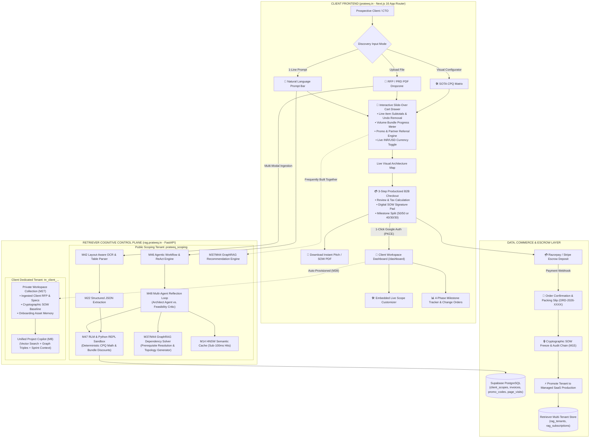
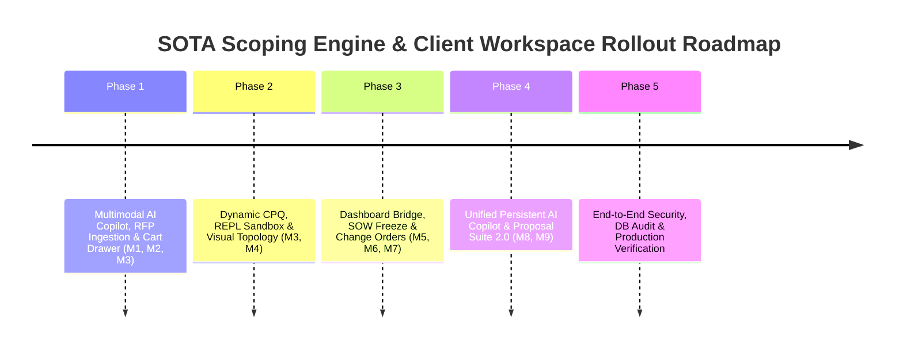

# PRD: Unified SOTA Scoping Engine & Client Workspace Dashboard (v2.0)

> **Document Status:** Master Production Specification — Productized E-Commerce & Retriever Multi-Tenant Cognitive Control Plane  
> **Target Release:** Q3 2026  
> **Lead Architect:** Prateek Sharma  
> **Target Audience:** High-Ticket B2B Founders, CTOs, Enterprise Product Managers, and Sales Partners  
> **Deal Size Focus:** $3,000 to $35,000+ USD / ₹2,50,000 to ₹30,00,000+ INR  
> **Core Cognitive Engine:** Retriever Platform (`rag.prateeq.in` — FastAPI, pgvector, GraphRAG, Multi-Agent Consensus, RLM Python REPL)  
> **Live Production Tenant:** `prateeq_scoping` (Dedicated dogfooding tenant providing real-time proof of Retriever's capabilities)  
> **Commerce Paradigm:** Bespoke Productized Engineering & B2B Architecture Checkout  

---

## 1. Executive Summary & Product Vision

The **Unified SOTA Scoping & Client Workspace Engine** transforms custom software acquisition by merging the public Scoping Lab (`/scoping`), the authenticated Client Portal (`/dashboard`), and the **Retriever AI Platform** (`rag.prateeq.in`) into an **agency-grade productized engineering e-commerce ecosystem**.

### 1.1 The Paradigm Shift: Productized Engineering Commerce
Traditional software agency scoping relies on opaque "Request a Quote" forms, delayed email exchanges, and fuzzy estimates—resulting in decision paralysis, protracted sales cycles, and scope creep.

v2.0 replaces this broken model with **Productized Engineering Commerce**:
1. **Interactive Architecture Cart & Checkout**: Base engines serve as core foundations (SKUs), add-on features serve as modular upgrades, brand kits serve as creative packages, and maintenance plans serve as recurring retainer subscriptions. Prospective clients configure, customize, and inspect itemized costs in a **Slide-over Architecture Cart Drawer** with live currency conversion (INR/USD), volume bundle discounts, and promo code validation.
2. **Authentic Dogfooding Tenant (`prateeq_scoping`)**: The scoping engine is a standard, authentic production tenant of Retriever. Prateek manually onboards the tenant, uploads the engineering catalog documents, and configures the LLM prompt in Retriever—mirroring the exact onboarding path of a real customer. Scoping connects strictly via API keys generated by Retriever (`RETRIEVER_SCOPING_TENANT_ID`, `RETRIEVER_SCOPING_API_KEY` stored in `.env.local`, never hardcoded).
3. **Public Embed Chatbox Showcase**: The scoping chatbox is powered directly by the 1-line embed widget script advertised on `/rag` (`widget.js` / `RetrieverClient`). Every prospect scoping a project tests the speed and accuracy of Retriever's production embed widget in real time.
4. **Audit-First Retriever Integration**: Before consuming any capability from Retriever (embed widget, document parsing, search, RLM math), the implementation is audited and tested inside the `retriever` repository first. If a flaw exists, it is fixed in Retriever at the root rather than patched over on the website.
5. **GraphRAG "Frequently Built Together" Recommendations**: Powered by Retriever's Knowledge Graph (`PgGraphRepository`), the cart dynamically recommends essential companion modules (e.g. recommending *Role-Based Admin* and *Automated Invoicing* when *Stripe Subscriptions* is added), increasing Average Order Value (AOV) while ensuring architectural integrity.
6. **Automatic 7-Day Trial & Immutable Scope Contract**: When a client completes a scope and authenticates to `/dashboard` (Google OAuth PKCE), the platform automatically provisions a dedicated tenant (`tn_client_<uuid>`) on Retriever with a **7-Day Trial** plan and full access to `/rag/app`. The confirmed scope details are compiled and indexed into the client's tenant as an immutable, permanent system document (`is_system: true`, `is_deletable: false`), visible in their Document Library and pre-grounding their AI Copilot.
7. **Commercial vs Infrastructure Cockpit Separation**: Prateek manages all commercial scopes, leads, invoices, and linked tenant IDs locally via the **Streamlit Synchronizer** (`scripts/synchronizer.py`, `sync_tabs/clients.py`). The **Retriever Dashboard** is reserved for system tenant settings and vector infrastructure.
8. **Cryptographic SOW Lock & Phase 2 Change Orders**: Clients digitally sign terms, select milestone payment structures (50/50 or 40/30/30), and execute deposits via Razorpay/Stripe. Upon verification, the baseline SOW is **cryptographically frozen** (`sow_hash = SHA256`). Post-deposit additions are isolated into formal **Phase 2 Change Orders** with auto-generated milestone invoices.

---

## 2. End-to-End System Architecture



---

## 3. The 4-Stage Continuous Lifecycle & Sequence Flow

```mermaid
sequenceDiagram
    autonumber
    actor Client as Prospective Client / CTO
    participant Web as Web Client (prateeq.in)
    participant ScopingTenant as Retriever (Tenant: prateeq_scoping)
    participant Supabase as Supabase Auth & DB
    participant ClientTenant as Retriever (Tenant: tn_client_...)
    participant Razorpay as Razorpay Gateway

    Note over Client,ScopingTenant: STAGE 1: Discovery, Cart Assembly & Live Proof
    Client->>Web: Enters prompt or drops RFP PDF on /scoping
    Web->>ScopingTenant: POST /v1/tenants/prateeq_scoping/documents/ingest (M42 OCR)
    ScopingTenant->>Web: Returns Structured Architecture Scope + Telemetry (380ms)
    Web-->>Client: Renders Cart Drawer, Live Topology & "⚡ Powered by Retriever Engine" badge
    Client->>Web: Toggles features; enters partner promo code (e.g. PARTNER-VIP-10)
    Web->>ScopingTenant: Evaluates GraphRAG companion suggestions ("Frequently Built Together")
    Web-->>Client: Displays Volume Bundle Savings ($1,450 saved) + Sprint Slot Availability

    Note over Client,ClientTenant: STAGE 2: 1-Click Fast-Pass & Tenant Auto-Provisioning
    Client->>Web: Clicks "Proceed to Checkout" (Google OAuth Sign-in)
    Web->>Supabase: Exchanges OAuth Code for PKCE Session
    Web->>ClientTenant: GET /v1/auth/session (Bearer Supabase JWT)
    ClientTenant-->>Web: Auto-provisions tn_client_uuid + API Keys (M39)
    Web->>Supabase: Inserts draft client_scopes record linked to retriever_tenant_id

    Note over Client,Razorpay: STAGE 3: Proposal Sign-Off & Escrow Lock
    Client->>Web: Digitally signs SOW, selects 50/50 split & clicks "Pay Deposit"
    Web->>Razorpay: Creates Order & opens Checkout Modal (50% Scope Deposit)
    Client->>Razorpay: Completes Payment
    Razorpay-->>Web: Webhook payment.captured verified
    Web->>Supabase: Locks scope (scope_status = 'locked', sow_hash = SHA256)
    Web->>ClientTenant: Ingests frozen SOW + RFP into private collection (M27)
    Web-->>Client: Displays Order Confirmation & Packing Slip (ORD-2026-8941)

    Note over Client,ClientTenant: STAGE 4: Active Sprint, Change Orders & Recurring SaaS
    Client->>Web: Lands in /dashboard workspace; interacts with Unified Copilot
    Web->>ClientTenant: POST /v1/tenants/tn_client_uuid/chat (Persistent Memory)
    ClientTenant-->>Client: Real-time context-aware sprint assistance
    Client->>Web: Requests new feature mid-sprint
    Web->>Supabase: Creates scope_change_orders record + Phase 2 milestone invoice
```

---

## 4. Productized Engineering Commerce Capabilities

```text
┌──────────────────────────────────────────────────────────────────────────────────────────────────┐
│                               PRODUCTIZED COMMERCE MECHANICS MATRIX                              │
├──────────────────────────────────────────────────────────────────────────────────────────────────┤
│ 1. SLIDE-OVER ARCHITECTURE CART DRAWER (`ArchitectureCartDrawer.tsx`):                          │
│    • Real-time line-item itemization (Base Engine Foundation + Modular Add-ons + Care Retainer). │
│    • Item removal with instant 5-second `[Undo]` toast notifications.                           │
│    • Live currency switch (INR ₹ with 18% GST breakdown / USD $ international).                  │
├──────────────────────────────────────────────────────────────────────────────────────────────────┤
│ 2. "FREQUENTLY BUILT TOGETHER" UPSELLS (`CartUpsellRecommender.tsx`):                            │
│    • Powered by Retriever GraphRAG: analyzes selected nodes to suggest synergistic features.     │
│    • e.g. "94% of SaaS platforms with Payments also add Role-Based Admin & Automated Invoicing." │
│    • 1-Click `[➕ Add Bundle & Save 5%]` direct insertion into cart.                             │
├──────────────────────────────────────────────────────────────────────────────────────────────────┤
│ 3. VOLUME BUNDLE SAVINGS PROGRESS METER:                                                         │
│    • Starter Stack (1–2 features): 0% discount.                                                 │
│    • Growth Stack (3–5 features): 5% discount (`🏷️ Growth Stack Applied: Save $450`).            │
│    • Enterprise Stack (6+ features): 10% discount (`🔥 Full Suite Applied: Save $1,450`).       │
│    • Visual progress bar: *"Add 1 more feature to unlock the 10% Enterprise Discount!"*          │
├──────────────────────────────────────────────────────────────────────────────────────────────────┤
│ 4. PROMO & SALES PARTNER REFERRAL ENGINE (`/api/scoping/validate-promo`):                        │
│    • Supports coupon codes (e.g. `FOUNDER2026`, `PARTNER-VIP-10`).                               │
│    • Dynamic strikethrough pricing display: `~~$14,500~~ $13,050`.                               │
│    • Automatically tracks Sales Partner attribution in Supabase `client_scopes.metadata`.        │
├──────────────────────────────────────────────────────────────────────────────────────────────────┤
│ 5. SPRINT CAPACITY & SCARCITY TELEMETRY:                                                         │
│    • Live banner: `⚡ Q3 Engineering Capacity: 2 of 3 Dedicated Sprint Slots Available`.          │
│    • Displays earliest kickoff date (e.g. *"Earliest Sprint Start: Sept 1, 2026"*).              │
├──────────────────────────────────────────────────────────────────────────────────────────────────┤
│ 6. PRODUCTIZED B2B CHECKOUT & DIGITAL PACKING SLIP:                                              │
│    • 3-Step checkout modal: Review Cart ➔ Billing & Tax Details ➔ Payment Split ➔ Escrow Pay.   │
│    • Generates Order ID (`ORD-2026-XXXX`) and instant downloadable Tax Invoice & SOW PDF.       │
└──────────────────────────────────────────────────────────────────────────────────────────────────┘
```

---

## 5. Master Specification Modules (Roadmap Outline)

```text
┌────────────────────────────────────────────────────────────────────────────────────────┐
│               UNIFIED SOTA SCOPING & CLIENT WORKSPACE v2.0 — MODULE MAP                │
├────────────────────────────────────────────────────────────────────────────────────────┤
│  [MODULE 1]  Multimodal AI Scoping Copilot & RFP Document Ingestion Engine             │
│  [MODULE 2]  GraphRAG Interactive Prerequisite Solver & Cascade Disconnect UX           │
│  [MODULE 3]  Productized Architecture Cart Drawer, Bundles & Promo Engine              │
│  [MODULE 4]  Live Interactive Architecture Topology Map (Node Flow Visualizer)         │
│  [MODULE 5]  Pre-Deposit Dashboard Bridge, Deep Links & Embedded SOTA Customizer       │
│  [MODULE 6]  Digital Proposal Sign-Off, 50% Escrow & Cryptographic Scope Freeze        │
│  [MODULE 7]  Post-Deposit Phase 2 Change Order & Milestone Invoicing Engine             │
│  [MODULE 8]  Unified Persistent AI Project Copilot (Scoping ↔ Dashboard Continuity)   │
│  [MODULE 9]  Multi-Format Commercial Proposal Suite 2.0 (1-Page Exec vs 3-Page SOW)    │
└────────────────────────────────────────────────────────────────────────────────────────┘
```

---

## 6. Core Database Schema & DDL Specifications

```sql
-- 1. Promo Codes & Partner Attribution Table
CREATE TABLE promo_codes (
  id UUID DEFAULT gen_random_uuid() PRIMARY KEY,
  code TEXT UNIQUE NOT NULL, -- e.g. 'FOUNDER2026', 'PARTNER-VIP-10'
  discount_type TEXT NOT NULL CHECK (discount_type IN ('percentage', 'fixed_amount', 'free_feature', 'free_maintenance_months')),
  discount_value NUMERIC(12, 2) NOT NULL, -- e.g. 10.00 for 10%
  currency TEXT DEFAULT 'USD' CHECK (currency IN ('INR', 'USD', 'ANY')),
  partner_id UUID REFERENCES clients(id) ON DELETE SET NULL, -- Attribution to sales partner
  partner_commission_pct NUMERIC(5, 2) DEFAULT 0.00, -- Commission percentage for partner
  max_uses INT DEFAULT 100,
  times_used INT DEFAULT 0,
  valid_from TIMESTAMPTZ DEFAULT timezone('utc'::text, now()) NOT NULL,
  valid_until TIMESTAMPTZ,
  is_active BOOLEAN DEFAULT true NOT NULL,
  created_at TIMESTAMPTZ DEFAULT timezone('utc'::text, now()) NOT NULL
);

-- 2. Client Scopes Table (Unified Discovery, Cart & Dashboard Entity)
CREATE TABLE client_scopes (
  id UUID DEFAULT gen_random_uuid() PRIMARY KEY,
  client_id UUID REFERENCES clients(id) ON DELETE CASCADE,
  client_email TEXT NOT NULL,
  order_number TEXT UNIQUE NOT NULL, -- e.g. 'ORD-2026-8941'
  project_title TEXT NOT NULL,
  project_goal TEXT NOT NULL,
  target_audience TEXT,
  business_kpi TEXT,
  base_engine_id TEXT NOT NULL,
  selected_features TEXT[] DEFAULT '{}' NOT NULL,
  brand_asset_id TEXT DEFAULT 'none',
  maintenance_plan_id TEXT DEFAULT 'none',
  timeline TEXT NOT NULL,
  currency TEXT DEFAULT 'INR' CHECK (currency IN ('INR', 'USD')),
  subtotal_price NUMERIC(12, 2) NOT NULL,
  bundle_discount_amount NUMERIC(12, 2) DEFAULT 0.00,
  promo_code_id UUID REFERENCES promo_codes(id),
  promo_discount_amount NUMERIC(12, 2) DEFAULT 0.00,
  tax_amount NUMERIC(12, 2) DEFAULT 0.00, -- GST or International VAT
  total_price NUMERIC(12, 2) NOT NULL,
  deposit_amount NUMERIC(12, 2) NOT NULL,
  payment_structure TEXT DEFAULT '50/50' CHECK (payment_structure IN ('50/50', '40/30/30')),
  scope_status TEXT DEFAULT 'draft' CHECK (scope_status IN ('draft', 'signed', 'locked', 'in_progress', 'completed', 'cancelled')),
  sow_hash TEXT, -- Cryptographic SHA-256 hash of the frozen scope JSON
  signed_at TIMESTAMPTZ,
  locked_at TIMESTAMPTZ,
  retriever_tenant_id UUID, -- Mapped Retriever managed tenant (tn_client_...)
  metadata JSONB DEFAULT '{}'::jsonb, -- Holds partner_id, company_gst, billing_address
  created_at TIMESTAMPTZ DEFAULT timezone('utc'::text, now()) NOT NULL,
  updated_at TIMESTAMPTZ DEFAULT timezone('utc'::text, now()) NOT NULL
);

-- 3. Scope Change Orders Table (Post-Deposit Delta Management)
CREATE TABLE scope_change_orders (
  id UUID DEFAULT gen_random_uuid() PRIMARY KEY,
  scope_id UUID REFERENCES client_scopes(id) ON DELETE CASCADE,
  change_order_number TEXT UNIQUE NOT NULL, -- e.g. 'CO-2026-8941-01'
  title TEXT NOT NULL,
  description TEXT,
  added_features TEXT[] DEFAULT '{}' NOT NULL,
  removed_features TEXT[] DEFAULT '{}' NOT NULL,
  delta_price NUMERIC(12, 2) NOT NULL,
  currency TEXT NOT NULL CHECK (currency IN ('INR', 'USD')),
  invoice_id UUID REFERENCES invoices(id),
  status TEXT DEFAULT 'pending' CHECK (status IN ('pending', 'approved', 'paid', 'declined')),
  created_at TIMESTAMPTZ DEFAULT timezone('utc'::text, now()) NOT NULL,
  updated_at TIMESTAMPTZ DEFAULT timezone('utc'::text, now()) NOT NULL
);

-- 4. Dynamic Invoices & Commercial Ledger Table
CREATE TABLE invoices (
  id UUID DEFAULT gen_random_uuid() PRIMARY KEY,
  client_id UUID REFERENCES clients(id) ON DELETE CASCADE,
  scope_id UUID REFERENCES client_scopes(id) ON DELETE SET NULL,
  change_order_id UUID REFERENCES scope_change_orders(id) ON DELETE SET NULL,
  invoice_number TEXT UNIQUE NOT NULL, -- e.g. 'INV-2026-0842'
  invoice_type TEXT DEFAULT 'deposit' CHECK (invoice_type IN ('deposit', 'milestone', 'change_order', 'maintenance', 'subscription')),
  amount NUMERIC(12, 2) NOT NULL,
  tax_amount NUMERIC(12, 2) DEFAULT 0.00,
  currency TEXT NOT NULL CHECK (currency IN ('INR', 'USD')),
  status TEXT DEFAULT 'pending' CHECK (status IN ('pending', 'paid', 'cancelled', 'refunded')),
  razorpay_order_id TEXT,
  razorpay_payment_id TEXT,
  due_date DATE NOT NULL,
  paid_at TIMESTAMPTZ,
  metadata JSONB DEFAULT '{}'::jsonb,
  created_at TIMESTAMPTZ DEFAULT timezone('utc'::text, now()) NOT NULL
);

-- 5. Sprint Capacity Management Table
CREATE TABLE sprint_capacity (
  id UUID DEFAULT gen_random_uuid() PRIMARY KEY,
  quarter_label TEXT NOT NULL, -- e.g. 'Q3 2026'
  total_slots INT DEFAULT 3 NOT NULL,
  allocated_slots INT DEFAULT 1 NOT NULL,
  earliest_start_date DATE NOT NULL,
  is_accepting_fast_track BOOLEAN DEFAULT true NOT NULL,
  updated_at TIMESTAMPTZ DEFAULT timezone('utc'::text, now()) NOT NULL
);
```

---

## 7. Exhaustive Specification: The 9 Master Modules

---

### MODULE 1: Multimodal AI Scoping Copilot & RFP Document Ingestion `[COMPLETED — MILESTONE 63]`

#### 1.1 Purpose & Strategic Value
Removes friction for non-technical buyers and enterprise CTOs by providing dual entry paths: a **1-Line Natural Language Prompt / Live Embed Chatbox** and a **Drag-and-Drop RFP/PRD PDF Dropzone**, resolving a complete architecture blueprint in under **1.5 seconds** using Retriever's `prateeq_scoping` tenant.
- **Dogfooding & Embed Widget Showcase:** The chatbox is powered directly by the 1-line embed widget script (`widget.js` / `RetrieverClient`) advertised on `/rag`, proving its production readiness.
- **Audit-First Invariant:** Before wiring the widget or API endpoints, the underlying Retriever features (SSE streaming, document ingestion, structured extraction) are audited and tested directly in `retriever`.

#### 1.2 UI/UX Specification (`AiScopingPromptBar.tsx` & `RfpUploaderModal.tsx`)
* **Visual Placement**: Positioned at the top of Step 1 (`StepGoalArchetype.tsx`), styled with an azure/noir gradient border pulse.
* **Modes**:
  1. **Prompt / Embed Chatbox Mode**: Clean input field with quick-suggestion pills (`[🚀 Real Estate RAG Portal]`, `[🤖 Healthcare Voice Bot]`, `[🛍️ Headless E-Commerce]`) and slide-out chatbox powered by the public Retriever embed widget.
  2. **Document Mode**: Drag-and-drop zone accepting `.pdf`, `.docx`, `.md`, or `.txt` up to 25MB.
* **Live Telemetry Proof Badge**:
  ```text
  ┌────────────────────────────────────────────────────────────────────────────┐
  │ ⚡ Powered by Retriever Multi-Tenant Engine (prateeq-scoping-live)          │
  │ • Latency: 380ms • ⚡ Semantic Cache: Active (HNSW pgvector) • Models: M42/M22│
  └────────────────────────────────────────────────────────────────────────────┘
  ```
* **Loading State**: Displays multi-stage progress telemetry:
  `[1/3 Parsing Layout & OCR via Retriever M42...]` $\rightarrow$ `[2/3 Running Architect & Critic Consensus...]` $\rightarrow$ `[3/3 Synthesizing CPQ Blueprint...]`.
* **Success Banner**: Floating toast showing confidence score and layman rationale:
  `🎯 96% Match Blueprint: AI SaaS Platform — Rationale: Configured for pgvector document search, recurring Stripe subscriptions, and RBAC admin center.`

#### 1.3 API Contracts

1. **Natural Language Parser**: `POST /api/scoping/parse-intent`
   ```typescript
   interface ParseIntentRequest {
     prompt: string;
     currency: 'INR' | 'USD';
     currentContext?: { existingEngineId?: string; existingFeatureIds?: string[] };
   }
   interface ParseIntentResponse {
     success: boolean;
     archetypeId: string;
     baseEngineId: string;
     featureIds: string[];
     brandAssetId: string;
     maintenancePlanId: string;
     suggestedTimeline: string;
     confidenceScore: number;
     summaryRationale: string;
     retrieverEngineRecommended: boolean;
     telemetry: {
       latencyMs: number;
       semanticCacheHit: boolean;
       tenantId: string;
     };
     unrecognizedRequirements?: string[];
   }
   ```

2. **Multimodal RFP Parser**: `POST /api/scoping/parse-rfp`
   * Accepts `multipart/form-data` with document binary.
   * Proxies directly to Retriever:
     `POST https://rag.prateeq.in/v1/tenants/prateeq_scoping/documents/ingest`
     followed by:
     `POST https://rag.prateeq.in/v1/tenants/prateeq_scoping/documents/{documentId}/extract`
   * Uses JSON Schema extraction matching `ParseIntentResponse`.

---

### MODULE 2: GraphRAG Interactive Prerequisite Solver & Cascade Disconnect UX

#### 2.1 Purpose & Strategic Value
Modern application architectures have strict dependencies. Selecting "Stripe Billing" or "Admin Center" without "Authentication" creates broken systems. Module 2 replaces passive warnings with an **active, interactive cascade solver** powered by Retriever's Knowledge Graph (`PgGraphRepository`).

#### 2.2 Dependency Graph Data Model
```json
{
  "admin": { "requires": ["auth"], "label": "Role-Based Admin Center" },
  "payments": { "requires": ["auth"], "label": "Payment Processing & Subscriptions" },
  "ai_rag": { "requires": ["database_pgvector"], "label": "AI Knowledge Base / RAG" },
  "ai_voice_agent": { "requires": ["ai_rag", "realtime"], "label": "Autonomous Voice AI Agent" },
  "lms": { "requires": ["auth", "payments", "video"], "label": "Course & LMS Portal" }
}
```

#### 2.3 Interactive Cascade Modal UX (`DependencyCascadeModal.tsx`)
When a user attempts to uncheck a required prerequisite (e.g. unchecking `auth` when `admin` and `payments` are active):
```text
┌────────────────────────────────────────────────────────────────────────┐
│ ⚠️ Dependency Conflict Detected                                       │
│                                                                        │
│ Disabling [Authentication] affects 2 dependent modules:                │
│  • Role-Based Admin Center (-$600 / -₹45,000)                          │
│  • Payment Gateway & Subscriptions (-$800 / -₹60,000)                  │
│                                                                        │
│ What would you like to do?                                             │
│ [ 🗑️ Remove All 3 Modules (Save $1,900) ]   [ 🛡️ Keep Authentication ] │
└────────────────────────────────────────────────────────────────────────┘
```
Clicking **Remove All** executes an atomic batch removal across `selectedFeatures` and recalculates CPQ totals in one render pass.

---

### MODULE 3: Productized Architecture Cart Drawer, Bundles & Promo Engine

#### 3.1 Purpose & Strategic Value
Treats software acquisition with the fluidity and transparent economics of high-end e-commerce. Clients can inspect itemized costs, unlock volume stack discounts, enter partner promo codes, and add GraphRAG companion recommendations.

#### 3.2 Slide-Over Architecture Cart Drawer (`ArchitectureCartDrawer.tsx`)
* **Trigger**: Floating cart badge in the bottom-right or sticky bottom action bar displaying `🛒 View Architecture Cart (X Modules | Total: $XX,XXX)`.
* **Contents**:
  1. **Core Engine SKU**: Displays selected base engine with price, icon, and description.
  2. **Modular Upgrades List**: Lists each selected feature with tag pills (`AI`, `Security`, `Commerce`), price, and a `[✕]` remove button (with 5-second `[Undo]` toast).
  3. **Creative & Retainer Packages**: Shows selected Brand Kit tier and Maintenance Plan.
  4. **Volume Discount Tier Progress Bar**: Visual progress bar showing remaining items needed to unlock 5% or 10% stack discounts.
  5. **"Frequently Built Together" Box**: Powered by Retriever GraphRAG—recommends complementary modules with a 1-click `[➕ Add Both & Save 5%]` action.
  6. **Promo & Partner Referral Code Box**: Input field validating coupons via `/api/scoping/validate-promo` with live strikethrough pricing (`~~$14,500~~ $13,050`).

#### 3.3 Sandboxed Calculation Script (`pricing_repl.py`)
Powered by Retriever's **RLM Python REPL Engine (M47)**:
```python
def calculate_quote(engine, features, brand, care, timeline, promo_code, currency):
    subtotal = engine["price"] + sum(f["price"] for f in features) + brand["price"] + care["price"]
    
    # 1. Volume discount
    volume_discount_pct = 0.10 if len(features) >= 6 else (0.05 if len(features) >= 3 else 0.0)
    bundle_savings = round(subtotal * volume_discount_pct, 2)
    net_after_bundle = subtotal - bundle_savings
    
    # 2. Promo code discount
    promo_discount = 0.0
    if promo_code and promo_code.get("is_valid"):
        if promo_code["discount_type"] == "percentage":
            promo_discount = round(net_after_bundle * (promo_code["discount_value"] / 100.0), 2)
        elif promo_code["discount_type"] == "fixed_amount":
            promo_discount = min(promo_code["discount_value"], net_after_bundle)
            
    net_after_promo = net_after_bundle - promo_discount
    
    # 3. Timeline rush multiplier
    timeline_multiplier = 1.25 if timeline == "fast_track" else (0.95 if timeline == "relaxed" else 1.0)
    final_total = round(net_after_promo * timeline_multiplier, 2)
    
    # 4. Tax calculation (18% GST for INR; 0% for export USD)
    tax_amount = round(final_total * 0.18, 2) if currency == "INR" else 0.00
    grand_total = final_total + tax_amount
    
    # 5. Milestone splits
    deposit_50 = round(grand_total * 0.50, 2)
    milestone_40 = round(grand_total * 0.40, 2)
    milestone_30 = round(grand_total * 0.30, 2)
    
    return {
        "subtotal": subtotal,
        "bundle_savings": bundle_savings,
        "promo_discount": promo_discount,
        "tax_amount": tax_amount,
        "final_total": final_total,
        "grand_total": grand_total,
        "deposit_50": deposit_50,
        "milestones_40_30_30": [milestone_40, milestone_30, milestone_30]
    }
```

---

### MODULE 4: Live Interactive Architecture Topology Map

#### 4.1 Purpose & Strategic Value
Gives high-ticket buyers immediate visual clarity on how their chosen technologies connect. Module 4 renders a **live interactive node graph** generated dynamically from `selectedBaseEngineId` and `selectedFeatures`.

#### 4.2 Visual Node Flow Architecture
```text
┌────────────────────────────────────────────────────────────────────────────────────────┐
│                              LIVE SYSTEM TOPOLOGY PREVIEW                              │
├────────────────────────────────────────────────────────────────────────────────────────┤
│                                                                                        │
│   [ Client Layer ]              [ Edge & API Gateway ]         [ Core Services ]       │
│   ┌──────────────┐              ┌──────────────────┐          ┌────────────────────┐   │
│   │ Next.js 16   │ ──────────►  │ Vercel Edge      │ ───────► │ Next.js Server     │   │
│   │ Web Platform │              │ WAF / Rate Limit │          │ Actions & Handlers │   │
│   └──────────────┘              └──────────────────┘          └─────────┬──────────┘   │
│                                                                         │              │
│                                                                         ├──────────┐   │
│                                                                         ▼          ▼   │
│   [ Data & Search ]             [ Cognitive Intelligence ]    [ Integrations ]         │
│   ┌──────────────┐              ┌──────────────────┐          ┌────────────────────┐   │
│   │ PostgreSQL   │ ◄──────────  │ Retriever Managed│          │ Razorpay / Stripe  │   │
│   │ + pgvector   │              │ Cognitive RAG    │          │ Webhook Escrow     │   │
│   └──────────────┘              └──────────────────┘          └────────────────────┘   │
│                                                                                        │
└────────────────────────────────────────────────────────────────────────────────────────┘
```

#### 4.3 Component Implementation (`ArchitectureTopologyMap.tsx`)
* **Technology**: Lightweight SVG/HTML Canvas with CSS transitions (zero heavy D3 dependencies).
* **Interactivity**: Hovering over a node displays technical SLA tooltips (e.g. hovering on `Retriever RAG` displays: *"<450ms P95 Latency, HNSW Vector Index, AES-256 Encryption"*). Toggling features instantly illuminates or dims nodes and animated connection edges.

---

### MODULE 5: Pre-Deposit Dashboard Bridge, Deep Links & Embedded SOTA Customizer

#### 5.1 Purpose & Strategic Value
Eliminates discovery-to-portal friction. Clients can save configurations, invite co-founders via versioned share URLs, and adjust features inside their private dashboard before committing funds.

#### 5.2 Google Fast-Pass Authentication, Auto-Onboarding & 7-Day Trial Provisioning
1. When a visitor clicks **"Save Scope & Open Workspace"** or **"Proceed to Checkout"**:
   - Scope state is serialized into an encrypted transient cookie (`prateeq_pending_scope`).
   - Launches 1-Click Google OAuth Fast-Pass via Supabase Auth PKCE flow.
2. Upon redirection to `/auth/callback` $\rightarrow$ `/dashboard`:
   - Server reads `prateeq_pending_scope`, inserts a record into `client_scopes`, and creates the client profile in `clients`.
   - **Retriever Tenant Auto-Provisioning (7-Day Trial):** Server invokes Retriever's tenant provisioning API:
     ```http
     POST https://rag.prateeq.in/v1/admin/tenants
     Authorization: Bearer <RETRIEVER_ADMIN_MASTER_KEY>
     Content-Type: application/json

     {
       "name": "Client: " + clientEmail,
       "plan_tier": "trial_7d",
       "trial_ends_at": "NOW + 7 DAYS",
       "owner_email": clientEmail,
       "user_id": supabaseUserId
     }
     ```
   - **Permanent Scope Document Indexing:** The server compiles the client's confirmed scope into a clean document (`SOW_Baseline_Scope_ORD-2026-XXXX.md`) and indexes it into the client's tenant via `POST /v1/tenants/{tenantId}/documents` with metadata:
     ```json
     {
       "is_system": true,
       "is_deletable": false,
       "scope_order_id": "ORD-2026-8941",
       "category": "contract_baseline"
     }
     ```
   - **Visibility & Immutability:** The document is visible in the client's Document Library (`/rag/app` Documents tab) with a `🔒 Baseline Contract` badge. Deletion is blocked at both the API and UI level.
   - **Immediate SaaS Studio Access:** Grants the client instant 7-day trial access to the full `/rag/app` Studio workspace and grounds their `/dashboard` AI Project Copilot.

#### 5.3 Collaborative Share Links (`?share=SCOPE-XXXX`)
* Generates a permanent collaborative link: `https://prateeq.in/scoping?share=SCOPE-49102`.
* Allows founders to send interactive scopes to CTOs or CFOs with real-time recalculations.

#### 5.4 Embedded SOTA Configurator in `/dashboard`
* Completely replaces the legacy regex text box in `dashboard/page.tsx`.
* Directly embeds the full SOTA CPQ Matrix, Cart Drawer, and Topology Map inside `/dashboard` in draft mode.

---

### MODULE 6: Digital Proposal Sign-Off, 50% Escrow & Cryptographic Scope Freeze

#### 6.1 Purpose & Strategic Value
Formalizes the commercial commitment, captures digital consent, collects the 50% deposit, and **locks the baseline scope** to permanently eliminate scope creep.

#### 6.2 Digital Sign-Off Flow (`ProposalSignModal.tsx`)
1. **Contract Review**: Displays the complete SOW, timeline, deliverables, boundary exclusions, and payment schedule.
2. **Milestone Structure Selection**:
   * **Option A (Default)**: 50% Upfront Deposit / 50% Final UAT Delivery.
   * **Option B (Enterprise)**: 40% Kickoff / 30% Staging Beta / 30% Final Production Release.
3. **Digital Signature**: Client types full name and company legal entity, consenting to terms.

#### 6.3 Escrow Deposit Trigger (Razorpay / Stripe)
* Invokes `POST /api/client/create-razorpay-order` with the calculated deposit amount.
* Launches Razorpay `checkout.js` modal natively on `/dashboard`.

#### 6.4 Cryptographic Scope Freeze Protocol (M15)
Upon verified payment confirmation (`payment.captured` webhook):
1. `client_scopes.scope_status` switches from `'draft'` $\rightarrow$ `'locked'`.
2. Computes an immutable SHA-256 hash of the complete scope payload:
   ```typescript
   const sowHash = crypto
     .createHash('sha256')
     .update(JSON.stringify({ orderNumber, engineId, featureIds, price, currency, timestamp }))
     .digest('hex');
   ```
3. Writes `sow_hash` and `locked_at` to `client_scopes`.
4. Ingests the frozen SOW and client RFP into their private Retriever workspace collection (`collection_id: scope_id`).
5. Displays the **Order Confirmation & Digital Packing Slip** (`ORD-2026-XXXX`).
6. Unlocks **Active Engineering Sprint Tracking** on the dashboard.

---

### MODULE 7: Post-Deposit Phase 2 Change Order & Milestone Invoicing Engine

#### 7.1 Purpose & Strategic Value
Clients frequently identify new feature requirements mid-development. Rather than haphazardly altering the active sprint or absorbing unpaid scope creep, Module 7 formalizes additions into structured **Phase 2 Change Orders**.

#### 7.2 Delta Scope Analyzer & Change Order Workflow
1. Client clicks **"Request Additional Feature"** on `/dashboard`.
2. Opens the embedded SOTA customizer in **Delta Mode** (baseline locked features are marked with 🔒).
3. Client selects new add-on features (e.g. adding `ai_voice_agent` and `pwa`).
4. **Delta Calculation**: Retriever's REPL sandbox calculates the incremental delta cost ($+\$3,500$ / $+₹2,80,000$) and estimated timeline extension ($+1.5$ weeks).
5. Client clicks **"Generate Change Order"**:
   - Inserts record into `scope_change_orders` (`status = 'pending'`).
   - Generates a dedicated milestone invoice in `invoices` (`invoice_type = 'change_order'`).
6. Upon client payment of the Change Order invoice:
   - The new features are formally appended to the sprint backlog without disrupting active Phase 1 milestones.

---

### MODULE 8: Unified Persistent AI Project Copilot (Scoping ↔ Dashboard Continuity)

#### 8.1 Purpose & Strategic Value
Provides a single, continuous AI project manager with complete lifecycle memory. The copilot knows every requirement mentioned in the initial scoping prompt, every note extracted from uploaded RFPs, and the real-time status of sprint milestones.

#### 8.2 Architectural Implementation
* Backed by the client's dedicated **Retriever Private Tenant Chat Session** (`/v1/tenants/{tn_client_id}/chat/sessions/{sessionId}/messages`).
* **Grounding Sources**:
  1. `Scope Data`: Base engine, selected features, timeline, SOW boundaries.
  2. `RFP Documents`: Indexed vector chunks of client-uploaded PRD/spec files stored in their private collection.
  3. `Sprint Milestones`: Real-time phase status (Architecture $\rightarrow$ Engineering $\rightarrow$ Staging $\rightarrow$ Live).
  4. `Onboarding Tasks`: Outstanding items (e.g. missing Supabase credentials, Figma designs).

#### 8.3 Context-Aware Capabilities
* **During Discovery**: *"Why do I need pgvector for my legal document search app?"* $\rightarrow$ Explains dense vector similarity search and hybrid ranking in plain business terms.
* **During Alignment**: *"What happens if we remove the CMS module?"* $\rightarrow$ Outlines impact on content editing autonomy and cost reduction.
* **During Active Sprint**: *"What is blocking Milestone 2?"* $\rightarrow$ Identifies pending client onboarding tasks: *"Milestone 2 is in progress. We are waiting on your Stripe API keys in the onboarding checklist."*

---

### MODULE 9: Multi-Format Commercial Proposal Suite 2.0 (1-Page Exec vs 3-Page SOW)

#### 9.1 Purpose & Strategic Value
Different stakeholders require different levels of detail: Angel investors, CEOs, and CFOs need a concise, high-level financial summary, while CTOs, Lead Architects, and Legal teams demand a rigorous, line-item SOW with explicit boundary exclusions.

#### 9.2 Proposal Formats (`@react-pdf/renderer` + `pdfTheme.ts`)

```text
┌────────────────────────────────────────────────────────────────────────────────────────┐
│                        COMMERCIAL PROPOSAL SUITE 2.0 FORMATS                           │
├────────────────────────────────────────────────────────────────────────────────────────┤
│                                                                                        │
│  FORMAT A: 1-Page Executive Pitch Brief                                                │
│  ──────────────────────────────────────                                                │
│  • Audience: Non-technical Founders, CEOs, Angel Investors, CFOs                       │
│  • Contents:                                                                           │
│    - Executive Project Vision & KPI Goals                                              │
│    - High-Level Architecture Node Diagram                                              │
│    - Itemized Investment Summary & Volume Bundle Savings Badge                         │
│    - Projected ROI & 4-Stage Milestone Timeline Delivery Schedule                      │
│                                                                                        │
│  FORMAT B: 3-Page Master Statement of Work (SOW)                                       │
│  ────────────────────────────────────────────────                                      │
│  • Audience: CTOs, VP of Engineering, Procurement & Legal Teams                        │
│  • Page 1: Executive Summary, System Architecture Topology, Technology Stack Matrix     │
│  • Page 2: Granular Feature Specifications, API Dependencies & Managed Retriever SLA   │
│  • Page 3: Milestone Payment Schedule, Boundary Exclusions, IP Transfer, SLA Guarantees│
│                                                                                        │
└────────────────────────────────────────────────────────────────────────────────────────┘
```

#### 9.3 Pinned Page-Budget & Brand Token Enforcement
* Built using shared brand tokens (`getPdfTheme(isNoir)`) in Azure and Noir themes.
* Pinned page budgets are strictly asserted by automated test suites (`tests/pdf-smoke.test.ts`) to ensure zero awkward trailing page overflows.

---

## 8. Implementation Phasing & Verification Strategy



### Phase Breakdown

* **Phase 1: Multimodal Discovery, Cart Drawer & Graph Solver (Modules 1, 2, 3)**
  - Provision and configure `prateeq_scoping` tenant on Retriever with engineering catalog and dependency triples.
  - Implement `/api/scoping/parse-intent` and `/api/scoping/parse-rfp` proxying to Retriever M42/M22.
  - Build `AiScopingPromptBar.tsx` with live Retriever telemetry badge (`Latency: 380ms`, `⚡ Semantic Cache Active`) and `RfpUploaderModal.tsx`.
  - Build `ArchitectureCartDrawer.tsx` with live line items, volume discount progress bar, and promo code box (`/api/scoping/validate-promo`).
  - Implement interactive prerequisite cascade modal (`DependencyCascadeModal.tsx`).

* **Phase 2: Dynamic CPQ & Visual Topology (Modules 3 & 4)**
  - Update `src/lib/pricing.ts` with sandboxed REPL calculation rules, volume discount tiers (5%–10%), and rush surge multipliers (1.25x).
  - Build `ArchitectureTopologyMap.tsx` interactive node visualizer.

* **Phase 3: Client Dashboard Integration & Scope Freeze (Modules 5, 6, 7)**
  - Embed the SOTA CPQ configurator directly inside `/dashboard`.
  - Wire Supabase Auth PKCE handoff to auto-provision private client tenants (`tn_client_...`) on Retriever (M39).
  - Implement digital proposal signature modal and Razorpay 50% deposit escrow.
  - Implement cryptographic SHA-256 SOW freezing and Phase 2 Change Order engine with automated milestone invoicing.

* **Phase 4: Unified Copilot & Multi-Tier PDF Proposals (Modules 8 & 9)**
  - Connect `ClientProjectCopilot.tsx` to private Retriever tenant chat sessions.
  - Upgrade proposal PDF generator to support 1-Page Executive Pitch and 3-Page Technical SOW with pinned page budgets.

* **Phase 5: Verification & Governance**
  - Execute database DDL schema migrations via `execute_sql`.
  - Run automated contracts audit: `python3 scripts/audit_contracts.py`.
  - Run database schema verification: `python3 scripts/audit_db.py`.
  - Run database seed and audit sync: `python3 scripts/seed_supabase.py` and `python3 scripts/audit_db.py`.
  - Run PDF rendering smoke tests: `npm test tests/pdf-smoke.test.ts`.

---

*Master PRD v2.0 is finalized, fully specified, and locked. Ready for implementation plan generation upon approval.*

---

## **Related Architecture & Cross-References**

- [Master Sequential Roadmap (Phase G: M63–M68)](UNIFIED_MASTER_ROADMAP.md)
- [Scoping Lab Section Specification](09_Section_Specifications/12_Scoping_Lab.md)
- [Client Workspace Dashboard Spec](09_Section_Specifications/13_Client_Workspace_Dashboard.md)
- [50% Deposit Lock & Invoicing Ledger](14_Razorpay_Payments_and_Invoicing.md)
- [RAG SaaS Studio & `prateeq_scoping` Tenant](24_RAG_App_Studio_PRD.md)
- [Client Workspace Architecture Spec](CLIENT_DASHBOARD_ROADMAP.md)
- [Sales Partner Commission Engine](MIDDLEMAN_PARTNERSHIP_AGREEMENT.md)
- [Revenue Strategy & Client Conversion](REVENUE_EXECUTION_PLAN.md)
- [Architecture Node: Route /scoping](architecture_nodes/Route_scoping.md)
- [Architecture Node: Scoping Lab Wizard](architecture_nodes/UI_ScopingLab.md)
- [Architecture Node: Cart Drawer](architecture_nodes/UI_ArchitectureCartDrawer.md)
- [Architecture Node: CPQ Math SSoT](architecture_nodes/Lib_pricing.md)
- [Architecture Node: Client Scopes Schema](architecture_nodes/Schema_client_scopes.md)