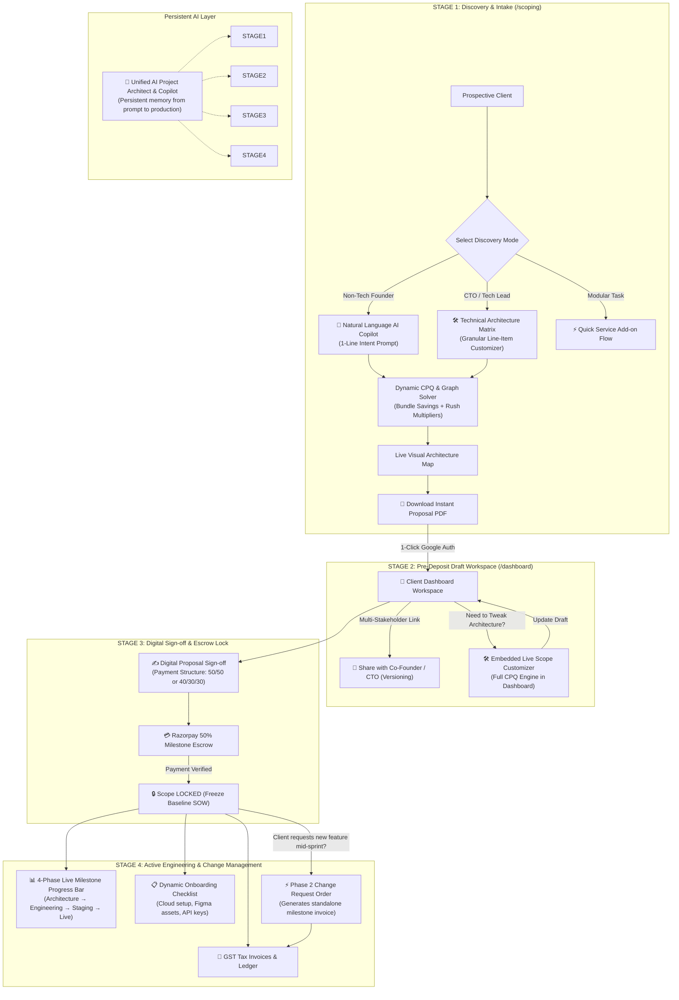
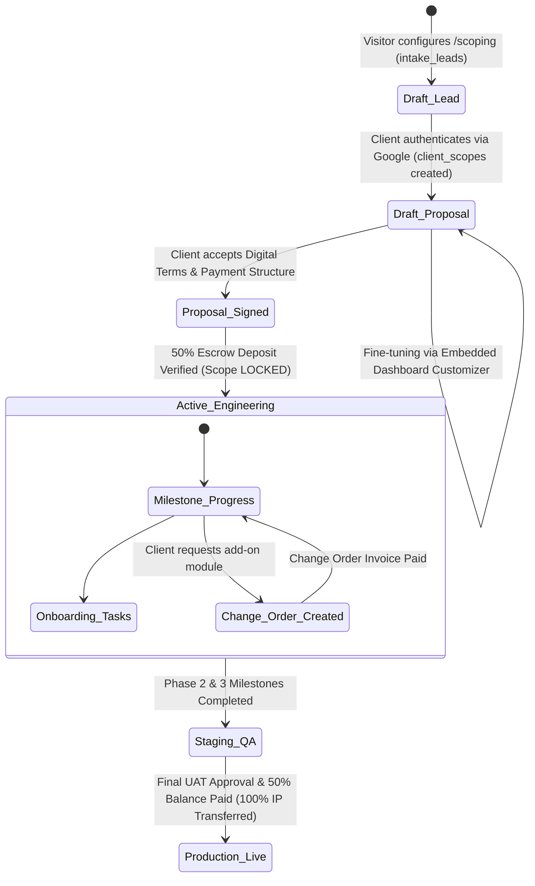

# PRD: Unified SOTA Scoping Engine & Client Workspace Dashboard (v2.0)

> **Document Status:** Working Draft — Unified Architecture Established  
> **Target Release:** Q3 2026  
> **Lead Architect:** Prateek Sharma  
> **Target Audience:** High-ticket B2B Founders, CTOs, Enterprise Product Managers, and Sales Partners  
> **Deal Size Focus:** $3,000 to $35,000+ USD / ₹2,50,000 to ₹30,00,000+ INR  

---

## 1. Executive Summary & Product Vision

The **Unified SOTA Scoping & Client Workspace Engine** merges the public Scoping Lab (`/scoping`) and the authenticated Client Portal (`/dashboard`) into a **single, continuous client lifecycle**.

Instead of treating scoping as a static one-off cost calculator and the dashboard as a disconnected post-sale viewer, v2.0 unifies them into an **agency-grade productized engineering platform**:
1. **At Discovery (`/scoping`)**: Prospective clients articulate their vision via an AI Natural Language Copilot or technical configurator, generating instant line-item CPQ pricing, visual architecture topologies, and Canva-grade proposal PDFs.
2. **At Alignment & Onboarding (`/dashboard`)**: Clients authenticate with 1-click Google Fast-Pass to enter their personal workspace, fine-tune architecture via an embedded customizer, invite co-founders with versioned collaboration links, and review dynamic onboarding requirements.
3. **At Commitment & Execution**: Clients digitally sign terms, execute 50% milestone deposits via Razorpay, lock scope to prevent project creep, and track development live through a 4-phase milestone engine—with post-deposit feature additions automatically managed as structured Phase 2 Change Orders.
4. **Across the Entire Journey**: A **Unified AI Project Copilot** maintains persistent project memory from the client's first prompt on `/scoping` through live sprint delivery on `/dashboard`.

---

## 2. The 4-Stage Continuous Client Lifecycle



---

## 3. Problem Statement & Key Gaps Solved

| Problem in Current System | Root Cause | SOTA Unified Solution (v2.0) |
|:---|:---|:---|
| **High Drop-off on Step 2** | Non-technical buyers face 15+ complex checkboxes (PgVector, Redis, OAuth) and suffer from decision fatigue. | **AI Intent Copilot**: Types 1 line of plain English $\rightarrow$ auto-generates 95% accurate architectural blueprint with 1 click. |
| **Prerequisite Lock Confusion** | Clicking a prerequisite flashes a temporary locked hint with no cascade action. | **Interactive Cascade Dialog**: *"Removing Auth will also remove Role-Based Admin & Stripe Billing. [Remove All 3] or [Keep]"*. |
| **Primitive Dashboard Feature Customizer** | Dashboard currently uses a plain text-box feature list with fuzzy regex string matching for price recalculations. | **Embedded SOTA Configurator**: Opens the full visual CPQ engine and architecture topology map directly inside `/dashboard`. |
| **Scope Creep & Post-Deposit Mutation** | Modifying features on dashboard after deposit directly mutates `client_scopes.features` without a formal invoice. | **Scope Freeze & Change Order Engine**: Locks baseline SOW upon deposit; new features become formal Phase 2 Change Orders with auto-generated invoices. |
| **Disconnected AI Assistants** | `AiScopingPromptBar` on `/scoping` and `ClientProjectCopilot` on `/dashboard` have separated logic and context. | **Unified Project Copilot**: Single persistent assistant tracking client intent, technical stack, timeline, and deliverables across both routes. |
| **Flat Pricing Economics** | No rush delivery multipliers, and large multi-feature scopes lack bundle discount incentives. | **Dynamic CPQ Economics**: 5%–10% Volume Bundle Savings badges + 1.25x Fast-Track Rush Delivery multipliers. |

---

## 4. User Personas & End-to-End Journeys

```text
┌──────────────────────────────────────────────────────────────────────────────────────────────────┐
│                                   END-TO-END USER JOURNEYS                                       │
├──────────────────────────────────────────────────────────────────────────────────────────────────┤
│ 1. ROHAN (Non-Technical Founder):                                                                 │
│    • Enters /scoping → Types: "AI podcast transcription app with Stripe subscriptions"          │
│    • AI Copilot auto-selects SaaS Engine + AI Vision/Audio + Stripe + Admin Center (1 second)    │
│    • Sees Live Topology Map connect nodes → Sees "Growth Bundle Saves $400"                     │
│    • Downloads 1-Page Executive Pitch PDF for his angel investors                                │
│    • 1-Click Google Fast-Pass → Lands in /dashboard with scope preloaded                         │
│    • Signs digital agreement → Pays 50% deposit via Razorpay → Scope freezes                     │
│    • Fills Dynamic Onboarding tasks (Figma link, Supabase invite) → Tracks 4 milestone stages   │
├──────────────────────────────────────────────────────────────────────────────────────────────────┤
│ 2. MIKE (CTO / Technical Buyer):                                                                 │
│    • Enters /scoping via deep link (?engine=saas&goal=ai_rag_app)                                │
│    • Opens Technical Architect Matrix → Overrides foundation tier → Toggles specific SLA care    │
│    • Copies Collaborative Share Link (?share=SCOPE-49102) to get CFO sign-off                   │
│    • Downloads 3-Page Master SOW PDF with explicit boundary exclusions                           │
│    • Authenticates on /dashboard → Selects 40/30/30 milestone structure → Executes wire/card    │
│    • Mid-sprint, requests Voice AI bot → Dashboard creates Phase 2 Change Order invoice          │
└──────────────────────────────────────────────────────────────────────────────────────────────────┘
```

---

## 5. Master Specification Modules (Roadmap Outline)

```text
┌────────────────────────────────────────────────────────────────────────────────────────┐
│               UNIFIED SOTA SCOPING & CLIENT WORKSPACE v2.0 — MODULE MAP                │
├────────────────────────────────────────────────────────────────────────────────────────┤
│  [MODULE 1]  AI Natural Language Scoping Copilot (Prompt Bar, Intent Parser)            │
│  [MODULE 2]  Interactive Prerequisite Solver & Cascade Disconnect UX                   │
│  [MODULE 3]  Dynamic CPQ Commercial Engine (Bundle Discounts, Timeline Rush Surge)     │
│  [MODULE 4]  Live Visual Architecture Topology Map (Interactive Node Graph)            │
│  [MODULE 5]  Dashboard Workspace Bridge & Pre-Deposit Scoping Customizer                │
│  [MODULE 6]  Digital Sign-off, 50% Milestone Escrow & Scope Freeze Protocol            │
│  [MODULE 7]  Post-Deposit Change Order & Phase 2 Milestone Invoicing Engine             │
│  [MODULE 8]  Unified Persistent AI Project Copilot (Scoping ↔ Dashboard Continuity)   │
│  [MODULE 9]  Multi-Format Commercial Proposal Suite 2.0 (1-Page Exec vs 3-Page SOW)    │
└────────────────────────────────────────────────────────────────────────────────────────┘
```

---

## 6. Core Database Schema & State Lifecycle



---

*This unified foundation covers the entire client journey from first discovery prompt to final production handover. We are now ready to expand each module in extreme detail.*
