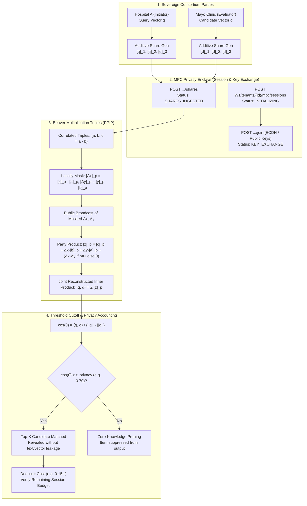

# 42. Confidential Multi-Party Vector Computation (MPC) Privacy Enclaves PRD

> **Product Requirement Document (PRD 42)**  
> **Milestone:** Milestone 121 (`v2.0.0-alpha3`)  
> **Platform Battery:** #36 (`confidential_mpc_enclave`)  
> **Category:** `SAFETY_DEFENSE`  
> **Target Repositories:** `retriever` & `Prateek_website`  
> **Status:** Production  

---

## 1. Executive Summary & Objective

Modern enterprise knowledge ecosystems often span multi-organization consortia (e.g. cross-hospital clinical trial matching, inter-bank fraud ring detection, aerospace defense subcontractor networks, and M&A joint ventures). In these high-stakes environments, organizations possess private vector databases and search queries that they cannot disclose to each other or to a centralized cloud provider due to HIPAA, GDPR, trade secret, or national defense regulations.

While Zero-Knowledge Proofs ([PRD 39: Milestone 118](39_Zero_Knowledge_Vector_Attestation_PRD.md)) verify document grounding post-inference, and Role-Based Vector Access Control ([PRD 40: Milestone 119](40_Enterprise_Identity_Federation_and_RBVAC_PRD.md)) isolates internal corporate departments, collaborative cross-tenant search requires **Confidential Multi-Party Computation (MPC)** during vector candidate retrieval.

**Milestone 121** establishes **Platform Battery #36: `confidential_mpc_enclave`**, enabling $N \ge 2$ sovereign parties to evaluate joint cosine similarity $\cos(\theta) = \frac{\langle q, d \rangle}{\|q\| \cdot \|d\|}$ collaboratively **without disclosing raw embeddings, document texts, or search queries**:

1. **Additive Secret Sharing Engine**:
   - Quantizes continuous float32 vectors into fixed-point integer fields ($Q_{16.16}$, $S = 65,536$).
   - Decomposes vectors into $N \ge 2$ pseudorandom shares ($v = \sum_{k=1}^N [v]_k$).
   - Provides information-theoretic privacy: individual shares are uniformly distributed random noise ($\mathcal{U}(-M, M)$) with Shannon entropy $H \ge 2.0$, leaking 0 bits of coordinate information.
2. **Beaver Multiplication Triple Inner Product (PPIP)**:
   - Computes secure scalar products $\langle q, d \rangle = \sum_i q_i \cdot d_i$ using pre-correlated Beaver triples $(a, b, c = a \cdot b)$.
   - Secure algebraic expansion enables parties to broadcast masked differences $(\Delta x, \Delta y)$ without coordinate leakage, reconstructing exact inner products with bounded numerical deviation ($|\Delta| < 10^{-4}$).
3. **Threshold Top-$K$ Filtering & Differential Privacy Budget**:
   - Suppresses candidates below privacy cutoff threshold $\tau_{privacy}$ (e.g. $\ge 0.70$) to prevent iterative probing / vector reconstruction attacks.
   - Enforces a per-session Differential Privacy budget ($\epsilon$), halting queries upon budget exhaustion.
4. **SaaS App Studio Cockpit**:
   - Dedicated 4-subview cockpit (`MpcEnclavePanel.tsx`) under Design System 2.0 dual-theme aesthetics (Azure & Noir), complete with an interactive Beaver Triples & PPIP math simulator.

---

## 2. Technical Architecture & Security Flow

---

## 3. Mathematical Foundations

### 3.1 Fixed-Point Quantization & Additive Secret Sharing
Given continuous vector $v = (v_1, \dots, v_D) \in \mathbb{R}^D$:
$$\tilde{v}_i = \lfloor v_i \cdot 2^{16} \rceil$$
For $N$ sovereign parties, $N-1$ random shares are sampled:
$$[v_i]_k \sim \mathcal{U}(-M, M) \quad \text{for } k \in \{1, \dots, N-1\}$$
The final share is determined by exact algebraic closure:
$$[v_i]_N = \tilde{v}_i - \sum_{k=1}^{N-1} [v_i]_k$$

### 3.2 Beaver Multiplication Triples for Privacy-Preserving Inner Product (PPIP)
To compute $x \cdot y$ where $x, y$ are secret-shared coordinates across $N$ parties:
1. Generate correlated randomness $(a, b, c)$ where $c = a \cdot b$.
2. Parties compute local masked offsets:
   $$[\Delta x]_k = [x]_k - [a]_k, \quad [\Delta y]_k = [y]_k - [b]_k$$
3. Reconstruct $\Delta x = \sum_k [\Delta x]_k$ and $\Delta y = \sum_k [\Delta y]_k$.
4. Each party computes their partial product share:
   $$[z]_k = [c]_k + \Delta x \cdot [b]_k + \Delta y \cdot [a]_k + (\Delta x \cdot \Delta y \text{ if } k = 1 \text{ else } 0)$$
5. The sum of party shares equals the true scalar product:
   $$\sum_{k=1}^N [z]_k = c + \Delta x \cdot b + \Delta y \cdot a + \Delta x \cdot \Delta y = (a + \Delta x)(b + \Delta y) = x \cdot y$$

---

## 4. REST API Endpoint Specifications

| Method | Path | Auth | Description |
|---|---|---|---|
| `GET` | `/v1/mpc/health` | Public | Battery #36 health probe & precision specifications |
| `POST` | `/v1/tenants/{tenant_id}/mpc/sessions` | API Key | Create new collaborative MPC privacy enclave session |
| `GET` | `/v1/tenants/{tenant_id}/mpc/sessions` | API Key | List all active/historical MPC sessions for tenant |
| `GET` | `/v1/tenants/{tenant_id}/mpc/sessions/{session_id}` | API Key | Fetch session status, parties, and configuration |
| `POST` | `/v1/tenants/{tenant_id}/mpc/sessions/{session_id}/join` | API Key | Join session with public key as sovereign party |
| `POST` | `/v1/tenants/{tenant_id}/mpc/sessions/{session_id}/shares` | API Key | Submit additive vector shares |
| `POST` | `/v1/tenants/{tenant_id}/mpc/sessions/{session_id}/compute` | API Key | Execute confidential Beaver inner product computation |
| `GET` | `/v1/tenants/{tenant_id}/mpc/sessions/{session_id}/results` | API Key | Retrieve threshold Top-K matching candidate items |
| `POST` | `/v1/tenants/{tenant_id}/mpc/sessions/{session_id}/abort` | API Key | Abort active session |
| `POST` | `/v1/mpc/math/simulate` | Public | Interactive Beaver Triples and PPIP mathematical simulation |

---

## 5. SaaS App Studio Cockpit (`MpcEnclavePanel.tsx`)

Mounted as the **`🛡️ Confidential MPC Enclaves`** tab in `/rag/app`:

- **Sub-View 1: Consortium Enclaves & Sessions**:
  - Active consortium sessions card grid with party count, protocol, threshold, and status badges.
  - "Create MPC Enclave" and "Join Enclave" modals enclosed in `<Portal>` to escape CSS containing blocks.
  - Participating parties table with role tags, public key fingerprints, and share submission status.
- **Sub-View 2: Secret Share Distributor & Noise Entropy**:
  - Visual breakdown of vector share generation: original vector $v \to [v]_1, [v]_2, [v]_3$.
  - Shannon entropy noise display ($H \ge 2.0$) demonstrating uniform random distribution of individual shares.
  - Information-theoretic security proof card guaranteeing zero coordinate leakage.
- **Sub-View 3: Confidential Inner Product & Top-K Results**:
  - Beaver triple execution pipeline and Top-K results table.
  - Privacy threshold cutoff slider ($\tau_{privacy} \ge 0.70$) filtering out sub-threshold items.
  - Differential privacy budget gauge ($\epsilon_{remaining} / \epsilon_{total}$).
- **Sub-View 4: Interactive Beaver Triples & PPIP Math Simulator**:
  - Interactive sliders for vector dimension $D$, party count $N$, fixed-point precision, and Beaver triples $(a, b)$.
  - Real-time comparison table proving numerical equivalence to standard floating-point dot product ($|\Delta| < 10^{-4}$).

---

## 6. Verification & Quality Invariants

- **Unit & Conformance Testing**:
  - `retriever`: 11 automated Pytest tests in `apps/api/tests/test_mpc_enclave.py` verifying additive reconstruction, entropy, Beaver multiplication, session state machine, and REST endpoints.
  - `Prateek_website`: 5 Vitest tests in `src/components/rag/__tests__/MpcEnclavePanel.test.tsx` verifying tab navigation, modals, and math simulation.
- **Zero-Toy Invariant (Gate 10)**:
  - 100% authentic mathematical computation with zero fake timer facades or hardcoded heuristics.
- **Hexagonal Architecture**:
  - `src/domain/abstractions/mpc_enclave.py` contains strictly 0 infrastructure or framework imports.
- **Sensory Aesthetics & Dual-Theme Parity**:
  - Fully responsive and styled across both **Azure** (terracotta / slate blue) and **Noir** (cyan / obsidian glass).
