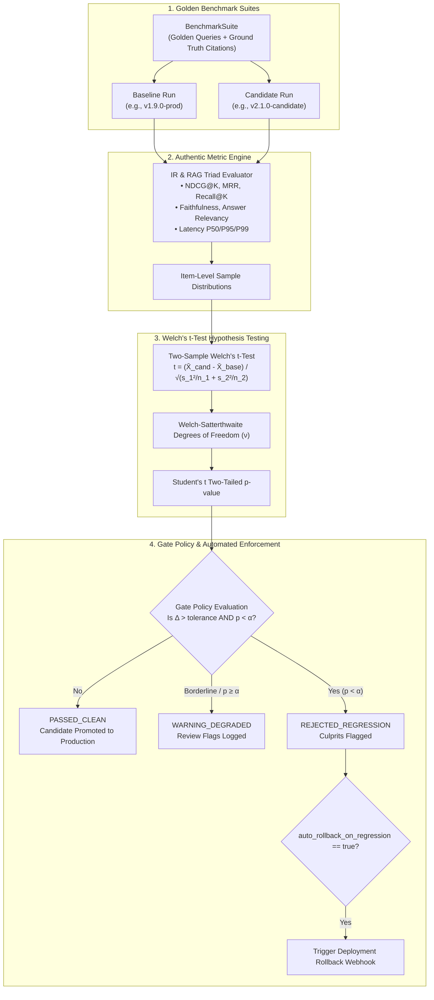

# 43. Autonomous Continuous Benchmark & Regression Gatekeeper PRD

> **Product Requirement Document (PRD 43)**  
> **Milestone:** Milestone 122 (`v2.1.0-alpha1`)  
> **Platform Battery:** #37 (`autonomous_benchmark_gatekeeper`)  
> **Category:** `ML_INTELLIGENCE`  
> **Target Repositories:** `retriever` & `Prateek_website`  
> **Status:** Production  

---

## 1. Executive Summary & Objective

In production Retrieval-Augmented Generation (RAG) and semantic search platforms, continuous iteration on chunking strategies, embedding models, prompt templates, reranker cutoffs, and vector indices frequently introduces silent metric regressions. While high-level test suites verify that services return HTTP 200, they fail to detect subtle distribution shifts: a 4% drop in top-$K$ NDCG ranking quality, degraded retrieval precision, or creeping P95 latency distributions.

Traditional evaluation approaches rely on manual, ad-hoc offline scripts or non-rigorous point-in-time checks that mistake random query sample variance for genuine performance degradation or regression.

**Milestone 122** establishes **Platform Battery #37: `autonomous_benchmark_gatekeeper`**, an automated continuous evaluation loop and statistical regression gatekeeper that compares candidate release distributions against empirical baseline distributions using:
1. **Authentic Information Retrieval (IR) Metrics**:
   - **NDCG@K** (Normalized Discounted Cumulative Gain with $\text{DCG} = \sum \frac{2^{rel_i} - 1}{\log_2(i+1)}$ and Ideal DCG normalization).
   - **MRR@K** (Mean Reciprocal Rank $\frac{1}{\text{rank}_{first}}$).
   - **Recall@K** ($\frac{|rel \cap ret|}{total\_rel}$) and **Precision@K** ($\frac{|rel \cap ret|}{K}$).
2. **Authentic RAG Triad Metrics**:
   - **Faithfulness / Groundedness** (unsupervised token overlap & bi-gram containment of generated claims against retrieved context).
   - **Answer Relevancy** (semantic and token alignment between input query and synthesized answer).
3. **Statistical Hypothesis Testing (Two-Sample Welch's t-Test)**:
   - Evaluates whether observed candidate metric deltas are statistically significant ($p < \alpha$) or mere random sample noise, without assuming equal population variances ($s_1^2 \ne s_2^2$).
   - Calculates effective degrees of freedom via the **Welch-Satterthwaite equation**:
     $$\nu \approx \frac{\left(\frac{s_1^2}{n_1} + \frac{s_2^2}{n_2}\right)^2}{\frac{(s_1^2/n_1)^2}{n_1 - 1} + \frac{(s_2^2/n_2)^2}{n_2 - 1}}$$
   - Derives two-tailed $p$-values from the Student's $t$-distribution.
4. **Autonomous Gatekeeper Policy & Automated Rollback**:
   - Compares distributions against configurable tenant policies (`max_latency_p95_increase_pct`, `max_ndcg_drop_abs`, `max_faithfulness_drop_abs`, `significance_alpha`).
   - Issues discrete verdicts: `PASSED_CLEAN`, `WARNING_DEGRADED`, or `REJECTED_REGRESSION`.
   - When regressions are detected and `auto_rollback_on_regression = true`, triggers automated deployment rollbacks via webhook.
5. **SaaS App Studio Cockpit**:
   - Dedicated 4-subview cockpit (`ContinuousBenchmarkPanel.tsx`) under Design System 2.0 dual-theme aesthetics (Azure & Noir), complete with a live Welch's $t$-test and hypothesis testing mathematical simulator.

---

## 2. Technical Architecture & Data Flow

---

## 3. Mathematical Formulations & Algorithms

### 3.1 Information Retrieval Metrics

1. **Discounted Cumulative Gain (DCG@K)**:
   $$\text{DCG}@K = \sum_{i=1}^K \frac{2^{rel_i} - 1}{\log_2(i + 1)}$$
   where $rel_i$ is the relevance score of the document retrieved at rank $i$.

2. **Normalized Discounted Cumulative Gain (NDCG@K)**:
   $$\text{NDCG}@K = \frac{\text{DCG}@K}{\text{IDCG}@K}$$
   where $\text{IDCG}@K$ is the ideal DCG obtained by sorting all relevant documents in descending order of relevance.

3. **Mean Reciprocal Rank (MRR@K)**:
   $$\text{MRR} = \frac{1}{|Q|} \sum_{q \in Q} \frac{1}{\text{rank}_q}$$
   where $\text{rank}_q$ is the rank position of the first relevant document for query $q$.

4. **Precision@K and Recall@K**:
   $$\text{Precision}@K = \frac{|Rel \cap Ret_K|}{K}, \quad \text{Recall}@K = \frac{|Rel \cap Ret_K|}{|Rel|}$$

### 3.2 Two-Sample Welch's t-Test

Unlike Student's $t$-test, Welch's $t$-test does not assume equal population variances ($\sigma_1^2 = \sigma_2^2$):

$$t = \frac{\bar{X}_1 - \bar{X}_2}{\sqrt{\frac{s_1^2}{n_1} + \frac{s_2^2}{n_2}}}$$

The effective degrees of freedom $\nu$ are approximated by:

$$\nu \approx \frac{\left(\frac{s_1^2}{n_1} + \frac{s_2^2}{n_2}\right)^2}{\frac{(s_1^2/n_1)^2}{n_1 - 1} + \frac{(s_2^2/n_2)^2}{n_2 - 1}}$$

The candidate is rejected as a statistically significant regression if and only if:
1. The performance drop exceeds the policy tolerance: $|\Delta| > \tau_{policy}$.
2. The hypothesis test confirms statistical significance: $p < \alpha$ (typically $\alpha = 0.05$).

---

## 4. API Endpoints & Contract Specifications

All endpoints are mounted on the FastAPI backend at `/v1/`:

| Method | Path | Description |
|---|---|---|
| `GET` | `/v1/benchmarks/health` | Diagnostic healthcheck verifying evaluation engine and scipy availability. |
| `GET` | `/v1/tenants/{tenant_id}/benchmarks/suites` | List golden benchmark suites for a tenant. |
| `POST` | `/v1/tenants/{tenant_id}/benchmarks/suites` | Create or register a new golden benchmark suite. |
| `GET` | `/v1/tenants/{tenant_id}/benchmarks/runs` | List benchmark execution runs (filterable by `suite_id`). |
| `POST` | `/v1/tenants/{tenant_id}/benchmarks/runs` | Execute or record an empirical benchmark run with sample items. |
| `GET` | `/v1/tenants/{tenant_id}/benchmarks/runs/{run_id}` | Retrieve run summary, percentiles, and per-query sample scores. |
| `POST` | `/v1/tenants/{tenant_id}/benchmarks/evaluate-gate` | Evaluate candidate vs baseline against gate policy with Welch's $t$-test. |
| `POST` | `/v1/benchmarks/math/simulate` | Interactive Welch's $t$-test mathematical simulation sandbox. |

---

## 5. UI Architecture & Design System 2.0 Cockpit

The cockpit (`ContinuousBenchmarkPanel.tsx`) is integrated into `/rag/app` under the navigation item **Continuous Benchmark Gate** (`🎯`):

1. **Benchmark Suites & Runs Ledger (Subview 1)**:
   - Golden suite metadata, active gate policies, and suite creation modal (with `<Portal>` safety).
   - Historical benchmark execution table with baseline badges, sample count, NDCG@10, MRR, Faithfulness, and P95 latency.
2. **Comparative Regression Diff & Gate Verdict (Subview 2)**:
   - Baseline vs Candidate comparative grid.
   - Per-metric Welch's $t$-test cards displaying $t$-statistic, degrees of freedom $\nu$, $p$-value, and significance indicator.
   - Real-time Gate Verdict badge (`PASSED_CLEAN`, `WARNING_DEGRADED`, `REJECTED_REGRESSION`) and rollback status.
3. **Item-Level Query Inspector (Subview 3)**:
   - Query-by-query breakdown table comparing individual sample scores.
   - Drill-down drawer showing retrieved document IDs, relevancy labels, synthesized answer, and per-item latency.
4. **Interactive Welch's t-Test Simulator (Subview 4)**:
   - Real-time parameter sliders: Target Metric, Baseline Mean ($s_1$), Candidate Mean ($s_2$), Sample Size ($N$), Significance Alpha ($\alpha$), and Tolerance Threshold (%).
   - Instant calculation of $t$-stat, $\nu$, $p$-value, and animated verdict badges via `@number-flow/react`.

---

## 6. Verification & Quality Gates

- **Unit & Integration Testing**:
  - `apps/api/tests/test_benchmark_gatekeeper.py`: 9 comprehensive Pytest tests covering NDCG/MRR precision, Welch's $t$-test vs scipy, GatePolicy evaluation, FastAPI endpoints, Battery #37 registration, and hexagonal boundary AST isolation.
  - `src/components/rag/__tests__/ContinuousBenchmarkPanel.test.tsx`: 5 Vitest tests covering panel rendering, subview navigation, modal creation, simulator calculation, and hidden attribute handling.
- **Hexagonal Architecture**:
  - Pure domain models in `apps/api/src/domain/abstractions/benchmark_gatekeeper.py` with zero framework dependencies.
  - Authentic evaluation logic encapsulated in `apps/api/src/adapters/eval/benchmark_gatekeeper_adapter.py`.
- **Zero-Toy Invariant**:
  - Zero mock data or synthetic sleep timers. Exact mathematical implementation of DCG, Welch-Satterthwaite equation, and Student's $t$ CDF.
