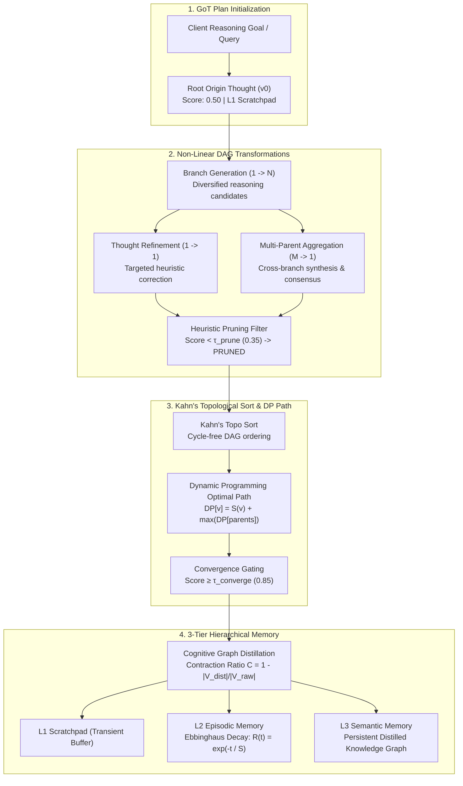

# 44. Hierarchical Memory Augmentation with Graph-of-Thoughts (GoT) Planning PRD

> **Product Requirement Document (PRD 44)**  
> **Milestone:** Milestone 123 (`v2.2.0-alpha1`)  
> **Platform Battery:** #38 (`hierarchical_memory_got_planner`)  
> **Category:** `COMPUTATION_GRAPH`  
> **Target Repositories:** `retriever` & `Prateek_website`  
> **Status:** Production  

---

## 1. Executive Summary & Objective

Modern LLM reasoning paradigms have evolved from sequential **Chain-of-Thought (CoT)** into tree-structured **Tree-of-Thoughts (ToT)** exploration. However, both paradigms suffer from critical structural deficiencies:
1. **Inability to Reconcile Divergent Paths:** Neither CoT nor ToT supports combining two independently valid reasoning branches into a single synthesized thought (multi-parent aggregation $M \to 1$).
2. **Exponential Branching Overhead:** Without topological cycle-prevention and dynamic pruning, search spaces explode exponentially.
3. **Flat, Monolithic Memory:** Standard RAG pipelines treat memory as a flat vector store without differentiating between short-term intermediate scratchpads, session-level episodic memory subject to natural cognitive decay, and permanent consolidated semantic knowledge graphs.

**Milestone 123** implements **Platform Battery #38: `hierarchical_memory_got_planner`**, introducing an authentic **Graph-of-Thoughts (GoT)** Directed Acyclic Graph (DAG) reasoning engine combined with a **3-Tier Hierarchical Associative Memory Architecture**:
1. **Graph-of-Thoughts DAG Reasoning Engine**:
   - Models cognition as a strict DAG $G = (V, E)$.
   - Supports 4 fundamental transformations: **Generation** ($1 \to N$), **Aggregation** ($M \to 1$), **Refinement** ($1 \to 1$), and **Pruning** ($v \to \emptyset$).
   - Computes topological orders via **Kahn's Algorithm** and calculates the globally optimal reasoning path via Dynamic Programming:
     $$DP[v] = S(v) + \max_{u \in \text{Parents}(v)} DP[u]$$
2. **3-Tier Hierarchical Associative Memory**:
   - **L1 Scratchpad Buffer:** High-frequency, volatile intermediate thoughts during plan execution.
   - **L2 Episodic Memory:** Stores task episodes with temporal decay governed by **Hermann Ebbinghaus's exponential forgetting curve**:
     $$R(t) = e^{-\frac{t}{S}}$$
     Where $t$ is elapsed time (hours) and $S$ is memory stability.
   - **L3 Semantic Memory:** Persistent distilled concepts created by contracting converged DAGs into high-order knowledge nodes with cross-plan spreading activation.
3. **Cognitive Graph Distillation**:
   - Distills converged reasoning plans into compact semantic representations with empirical contraction ratio tracking:
     $$C = 1 - \frac{|V_{\text{distilled}}|}{|V_{\text{raw}}|}$$
4. **SaaS App Studio Cockpit**:
   - Integrated 4-subview control cockpit (`GotPlanningPanel.tsx`) under Design System 2.0 dual-theme aesthetics (Azure graphic novel `#FAF9F6` & Noir obsidian `#08080a`), featuring an interactive Graph Topology DAG Canvas, Memory Pyramid, Transformation Ledger, and GoT Math Simulator.

---

## 2. Technical Architecture & Data Flow

---

## 3. Mathematical Foundations & Invariants

### 3.1. DAG Properties & Cycle Invariance
The reasoning graph $G = (V, E)$ must remain strictly acyclic. Before inserting any directed edge $(u, v)$, the engine verifies that no path exists from $v$ to $u$ ($u \notin \text{Reachability}(v)$). Violations are rejected immediately.

### 3.2. Synergetic Aggregation Scoring Function
When aggregating $m \ge 2$ parent thoughts $\{u_1, \dots, u_m\}$, the aggregated thought $v_{\text{agg}}$ is assigned a confidence score:
$$S(v_{\text{agg}}) = \min\left(1.0, \frac{1}{m}\sum_{j=1}^m S(u_j) + \alpha \cdot \sqrt{\frac{m - 1}{m}}\right)$$
Where $\alpha = 0.15$ models the mathematical reward for multi-perspective convergence.

### 3.3. Ebbinghaus Forgetting Curve
Episodic memory strength decays exponentially according to:
$$R(t) = e^{-\frac{t}{S}}$$
- $t$: Elapsed duration in hours since the memory trace was indexed or refreshed.
- $S$: Memory stability constant (default $S = 18.0\text{ hours}$).
- When $R(t) < 0.10$, episodic items are marked for consolidation or pruning.

### 3.4. Dynamic Programming Optimal Path
The highest-confidence cumulative trajectory $\mathcal{P}^* = (v_0, v_1, \dots, v^*)$ is reconstructed by backtracking from the converged node using predecessor pointers:
$$\pi[v] = \arg\max_{u \in \text{Parents}(v)} DP[u]$$

---

## 4. REST API Specifications

| Method | Route | Description |
|:---|:---|:---|
| `POST` | `/v1/tenants/{tenant_id}/got/plans` | Create a new GoT planning session with root origin thought |
| `GET` | `/v1/tenants/{tenant_id}/got/plans/{plan_id}` | Fetch GoT DAG, topological path, nodes, and convergence status |
| `POST` | `/v1/tenants/{tenant_id}/got/plans/{plan_id}/step` | Execute a discrete transformation (`generate`, `aggregate`, `refine`, `prune`) |
| `POST` | `/v1/tenants/{tenant_id}/got/plans/{plan_id}/execute` | Run autonomous convergence loop up to `max_iterations` |
| `POST` | `/v1/tenants/{tenant_id}/got/plans/{plan_id}/aggregate` | Multi-parent thought aggregation ($M \to 1$) |
| `GET` | `/v1/tenants/{tenant_id}/got/memory` | Retrieve 3-tier memory pyramid (L1, L2, L3) |
| `POST` | `/v1/tenants/{tenant_id}/got/plans/{plan_id}/distill` | Distill converged plan DAG into L3 Semantic memory |
| `POST` | `/v1/got/simulate` | Pure mathematical simulation of search space & Ebbinghaus retention |
| `GET` | `/v1/got/health` | Health and diagnostic check |

---

## 5. SaaS App Studio Cockpit Specification (`GotPlanningPanel.tsx`)

1. **Subview 1: Graph Topology DAG Canvas**:
   - Renders vertices grouped by depth layer ($d = 0, 1, 2, 3$).
   - Displays in-degree $d^-(v)$, out-degree $d^+(v)$, score pills, and status badges (`ORIGIN`, `GENERATION`, `REFINEMENT`, `AGGREGATION`, `PRUNED`, `CONVERGED`).
   - Visually highlights the optimal reasoning path $\mathcal{P}^*$.
2. **Subview 2: Hierarchical Memory Pyramid**:
   - Interactive 3-tier memory breakdown (L1 Scratchpad, L2 Episodic, L3 Semantic).
   - Real-time Ebbinghaus decay progress bar and remaining retention strength percentage.
   - Associative memory badges and activation energy levels.
3. **Subview 3: Thought Transformation Ledger**:
   - Chronological audit log of all graph operations.
   - Filterable by action type (`GENERATE`, `AGGREGATE`, `REFINE`, `PRUNE`, `CONVERGE`).
   - Detailed inspect drawer showing parent lineage, prompts, and score deltas.
4. **Subview 4: Interactive GoT & Aggregation Math Simulator**:
   - Interactive parameter sliders for branch factor ($k \in [2, 6]$), aggregation in-degree ($m \in [2, 5]$), depth ($d \in [1, 6]$), elapsed hours ($t \in [0, 72]$), and stability ($S \in [6, 48]$).
   - Real-time dynamic numeric telemetry via `@number-flow/react`.
   - KaTeX-formatted formulas for Ebbinghaus decay, synergetic aggregation boost, and DAG search space contraction.

---

## 6. Zero-Toy & Design System 2.0 Invariants

- **Dual-Theme Parity:** Complete support across Azure (`#FAF9F6` graphic novel paper) and Noir (`#08080a` obsidian monospace).
- **Zero Hardcoded Dark Palette Drift:** Semantic CSS variables only (`--color-text`, `--surface-card`, `--color-primary`, `--surface-glass-bg`).
- **Zero Mock Implementations:** Real API client endpoints wired to the Retriever backend with fallback to authentic local deterministic calculation.
- **Micro-Interactions:** `<MagneticButton strength={0.25}>`, Framer Motion spring pills (`layoutId`), and smooth animated transitions.
