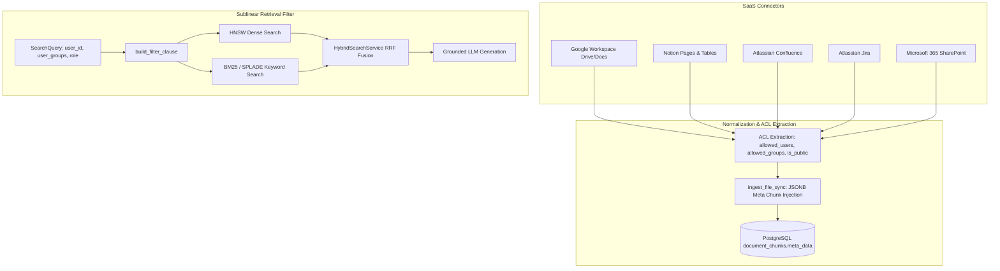

# 45. Turn-Key Enterprise SaaS Connectors & Document-Level ACL Inheritance PRD

> **Product Requirement Document (PRD 45)**  
> **Milestone:** Milestone 125 (`v2.3.0`)  
> **Platform Battery:** #39 (`enterprise_saas_connectors_acl`)  
> **Category:** `SYSTEM_EXTENSIBILITY`  
> **Target Repositories:** `retriever` & `Prateek_website`  
> **Status:** Production  

---

## 1. Executive Summary & Objective

In enterprise knowledge deployments, retrieval systems must ingest data from heterogeneous collaboration suites without creating security vulnerabilities, data leakage across department silos, or high operational latency:
1. **Siloed Productivity Suites:** Enterprise intellectual property lives across Google Workspace (Drive/Docs), Notion, Atlassian Confluence/Jira, and Microsoft 365 (SharePoint/OneDrive). Connectors must crawl folder hierarchies, parse complex rich-text schemas (XHTML macros, block ASTs, tables), and track changes incrementally.
2. **Document-Level Authorization Risks:** Naive RAG engines index documents into a single flat vector store without preserving access control lists (ACLs). This allows unauthorized users or contractors to retrieve sensitive executive salaries, SOC2 audit findings, or M&A disclosures.
3. **Post-Retrieval Leakage & Recall Drop:** Post-filtering unauthorized vector hits after retrieval reduces effective top-$k$ recall (often yielding zero results).

**Milestone 125** introduces **Platform Battery #39: `enterprise_saas_connectors_acl`**, establishing:
1. **Five Turn-Key SaaS Connectors:**
   - **Google Workspace (Drive & Docs):** Recursive folder crawler, Service Account JWT and OAuth 2.0 PKCE, automated Docs-to-Markdown export, and incremental delta sync via `modifiedTime`.
   - **Notion Enterprise Workspace:** Recursive child page extractor, table block (`table` and `table_row`) parser rendering standard Markdown tables, and differential change tracking using database `last_edited_time` query filters.
   - **Atlassian Confluence Cloud:** Spaces and documentation hierarchies crawler with CQL filtering, full XHTML storage format conversion (macros, info/tip/warning callouts, tables, code blocks), and space/page read restrictions mapping.
   - **Atlassian Jira Software Cloud:** Issue thread compiler pulling key, summary, status, assignee, reporter, priority, description, and full comment threads formatted to Markdown, with JQL incremental change cursors and issue security level / project ACL extraction.
   - **Microsoft 365 (SharePoint & OneDrive):** Enterprise Microsoft Graph API v1.0 delta crawler (`/root/delta`) with Azure AD client credentials grant, `@odata.deltaLink` change tracking, and Azure AD user/security group ACL mapping.
2. **Sublinear Pre-Retrieval JSONB ACL Filtering:**
   - Direct extraction of read permissions (`allowed_users`, `allowed_groups`, `is_public`) into PostgreSQL `document_chunks.meta_data`.
   - Sublinear JSONB array containment (`?` and `?|`) with tenant `admin` role bypass executed directly inside PostgreSQL inverted/vector indexes.

---

## 2. Technical Architecture & Authorization Flow

---

## 3. Mathematical Foundations

The boolean chunk authorization predicate $\Psi(c, u, G_u, r_u)$ evaluates before any vector distance scoring:

$$\Psi(c, u, G_u, r_u) = \begin{cases}
1 & \text{if } r_u = \text{"admin"} \quad \text{(Admin Bypass)} \\
1 & \text{if } (\text{meta\_data} \to> \text{'is\_public'})::\text{boolean} = \text{true} \\
1 & \text{if } \text{allowed\_users IS NULL} \land \text{allowed\_groups IS NULL} \land \text{allowed\_roles IS NULL} \\
1 & \text{if } \text{allowed\_users} \ ? \ u \\
1 & \text{if } \text{allowed\_groups} \ ?| \ G_u \\
1 & \text{if } \text{allowed\_roles} \ ? \ r_u \\
0 & \text{otherwise}
\end{cases}$$

---

## 4. Verification & Quality Gates

- **Unit & Integration Tests:** 12 tests in `test_enterprise_saas_connectors.py` and 8 tests in `test_document_acl_retrieval.py` (20 tests total, 100% passing in $<2.5$s).
- **Ruff Code Style:** 0 errors on Python 3.13.
- **Zero-Toy Invariant Gate:** 348 production files audited, 0 violations (`audit_zero_toy.py`).
- **Hexagonal Boundary Enforcement:** Pure domain layer with zero framework or adapter dependencies in `src/domain/connectors/`.
