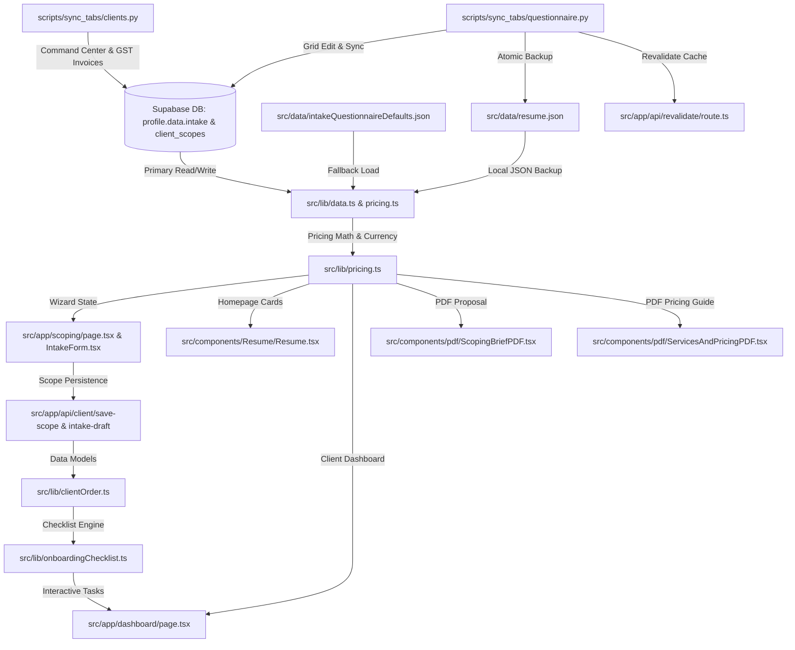
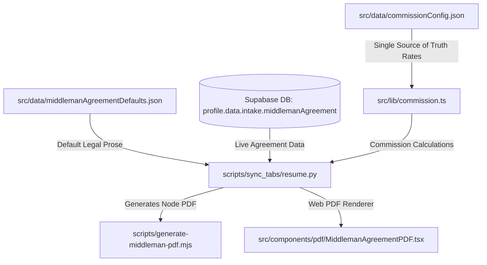
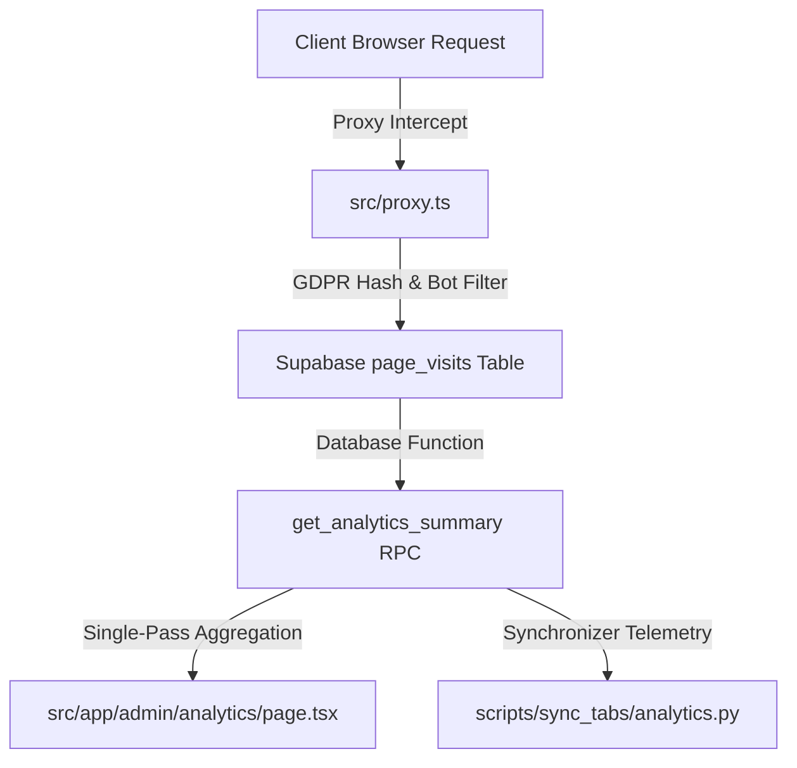
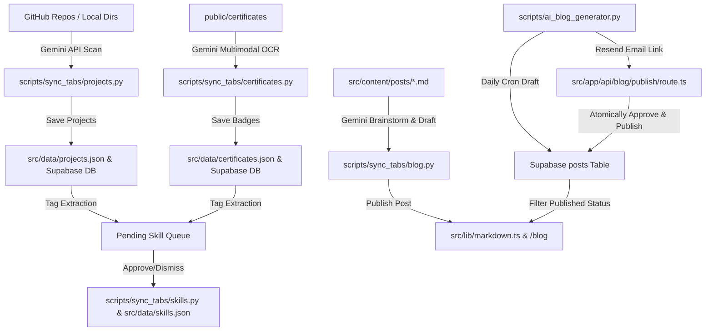
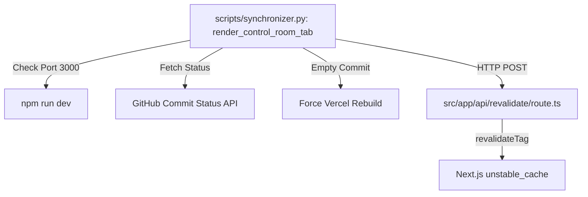

# Portfolio Codebase Architecture & Dependency Map

This living document maps **what connects to what** across all 5 architectural domains of the project: Database/JSON storage, Next.js web application, PDF renderers, local Python Synchronizer, and AI agents.

---

## 1. Commercial Scoping & Pricing Domain

Controls base engines, feature modules, goal archetypes, maintenance plans, brand assets, and instant pricing quotes.

### Component Connection Matrix: Commercial Scoping
| Layer | File / Module | Responsibility |
| :--- | :--- | :--- |
| **Primary Data** | `profile.data.intake` & `client_scopes` (Supabase DB) | Live database record for intake defaults, tiers, & active client scopes. |
| **JSON Fallback** | `src/data/intakeQuestionnaireDefaults.json` | Default base engines, features, goals, care plans. |
| **JSON Backup** | `src/data/resume.json` | Local fallback JSON updated during Synchronizer saves. |
| **Calculation Engine** | `src/lib/pricing.ts` | Dynamic INR/USD price formatting & archetype totals. |
| **Scope Types & Utilities** | `src/lib/clientOrder.ts` | Data schema for `ClientScope`, `dbToClientScope`, and invoice entities. |
| **Checklist Engine** | `src/lib/onboardingChecklist.ts` | Dynamically generates milestone tasks based on payment structure & features. |
| **Interactive UI** | `src/components/Intake/IntakeForm.tsx` | Scoping Lab wizard (`/scoping`). |
| **Homepage UI** | `src/components/Resume/Resume.tsx` | Services & Guarantees 2x2 card grid (`/#resume`). |
| **Client UI** | `src/app/dashboard/page.tsx` | Client Workspace scope view, milestone tracker, & checkout. |
| **Client API Routes** | `src/app/api/client/save-scope/route.ts`, `intake-draft`, `get-scopes`, `auth/callback/route.ts` | Server endpoints for scope persistence, lead drafts, OAuth callback, & Resend email alerts. |
| **Admin Email Alerts** | `src/lib/emailNotification.ts` | Sends instant Resend notifications to Prateek on user signups, intake leads, & scope confirmations. |
| **PDF Renderers** | `src/components/pdf/ScopingBriefPDF.tsx`, `ServicesAndPricingPDF.tsx` | Itemized PDF proposals & pricing guide. |
| **Synchronizer Tabs** | `scripts/sync_tabs/questionnaire.py`, `clients.py` | Streamlit grid editor & Client, Lead, Order, Deliverables Command Center. |

---

## 2. Sales Partner & Middleman Agreement Domain

Controls partner commissions, legal agreement prose, disbursement rules, and PDF contract generation.

### Component Connection Matrix: Sales Partner Domain
| Layer | File / Module | Responsibility |
| :--- | :--- | :--- |
| **Commission Truth** | `src/data/commissionConfig.json` | Single source of truth for Bands A/B/C & recurring rates. |
| **Agreement Defaults** | `src/data/middlemanAgreementDefaults.json` | Default legal prose sections & disbursement rules. |
| **Commission Utility** | `src/lib/commission.ts` | Calculates tier commission payouts. |
| **Synchronizer Tab** | `scripts/sync_tabs/resume.py` (`render_partner_agreement_tab`) | Partner identity & agreement prose editor. |
| **CLI PDF Generator** | `scripts/generate-middleman-pdf.mjs` | Node.js headless React-PDF builder for Synchronizer. |
| **Web PDF Generator** | `src/components/pdf/MiddlemanAgreementPDF.tsx` | Client-side React-PDF builder for portfolio downloads. |

---

## 3. Telemetry & Visitor Analytics Domain

Tracks visitor telemetry, bot filtering, page visits, and analytics RPC aggregations.

### Component Connection Matrix: Telemetry Domain
| Layer | File / Module | Responsibility |
| :--- | :--- | :--- |
| **Middleware Proxy** | `src/proxy.ts` | Intercepts requests, filters crawlers, hashes IP. |
| **Database Storage** | Supabase `page_visits` | Stores GDPR-compliant visitor logs (pruned at 90 days). |
| **Database RPC** | `get_analytics_summary(cutoff_time)` | Fast-path single query aggregation function. |
| **Web Dashboard** | `src/app/admin/analytics/page.tsx` | Live visitor analytics dashboard. |
| **Synchronizer Tab** | `scripts/sync_tabs/analytics.py` | Telemetry & traffic charts inside Streamizer. |

---

## 4. Content & Portfolio Domain (Projects, Skills, Certificates, Blog)

Manages GitHub project showcases, Lucide skills matrix, OCR certificate verification, and AI blog writing.

---

## 5. System Controls & Cache Operations

Controls Vercel deployment status, dev server execution, and Next.js cache revalidation.

---

## 💡 Developer & Agent Maintenance Rules

> [!IMPORTANT]
> **Mandatory Connection Checklist:**
> 1. **Editing Scoping/Pricing:** If you modify `intakeQuestionnaireDefaults.json`, you MUST update `src/data/resume.json` and run `python3 scripts/audit_contracts.py`.
> 2. **Editing Middleman Terms:** If you modify agreement prose in `middlemanAgreementDefaults.json`, verify both `src/components/pdf/MiddlemanAgreementPDF.tsx` and `scripts/generate-middleman-pdf.mjs`.
> 3. **Creating Components/Routes:** Run `python3 scripts/generate_architecture_map.py` to automatically update the import dependency graphs.
