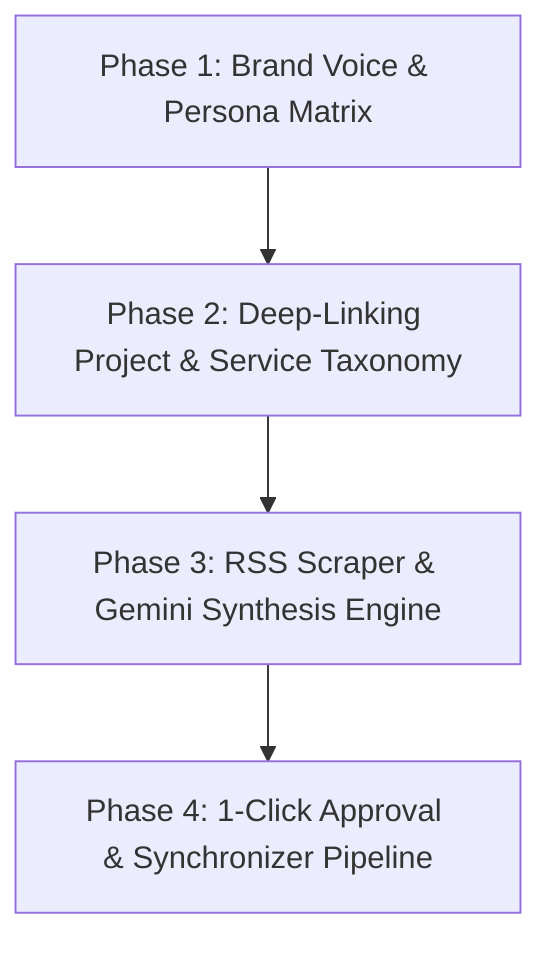

# Automated AI Newsjacking & Content Engine — Technical Specification

> 📌 **Master Roadmap (SSoT):** For active platform milestone sequencing, see [`UNIFIED_MASTER_ROADMAP.md`](UNIFIED_MASTER_ROADMAP.md) (**Milestone 59**).  
> **Status:** Technical Specification Baseline (Completed M59)  

This document outlines the architectural specification for building an automated, AI-driven daily newsjacking blog generator for Prateek Sharma's portfolio website (`prateeq.in`).

---

## Strategic Goals & Moat

1. **Organic SEO & High-Intent Conversion**: Convert trending AI/software news into authoritative, code-first case studies that drive traffic directly to the [AI Strategy & Architecture Audit](architecture_nodes/Route_scoping.md) (₹20,000 / $300) and custom SaaS MVP builds.
2. **Zero-Penalty SEO Safeguard**: Employ a human-in-the-loop 1-click approval workflow (Gmail/Telegram + Supabase Drafts) to prevent Google *Scaled Content Abuse* penalties.
3. **Deep Portfolio Taxonomies**: Automatically cross-reference news topics with Prateek's actual shipped codebases (`retriever`, `PaintMix AI`, `MetaWipe`, `PrateeqSync AI`).

---

## 4-Phase Master Roadmap

### Phase 1: Brand Voice & Writing Style Blueprint
- Define Prateek's tone: Direct, developer-first, concise, code-heavy, slightly humorous.
- Build LLM Banned-Words List (`delve`, `tapestry`, `game-changer`, `rapidly evolving`, `in conclusion`).
- Construct few-shot prompt templates for `gemini-3.6-flash`.

### Phase 2: Deep-Linking Project & Service Taxonomy
- Map tech news domains to portfolio projects:
  - **Vector DB / RAG / Embeddings / Ollama** ➔ [retriever / RAG Lab](architecture_nodes/Route_rag_app.md) + Private AI Knowledge Base Module.
  - **Computer Vision / Color Spaces / Image Processing** ➔ [PaintMix AI](architecture_nodes/Schema_projects.md) + [MetaWipe](architecture_nodes/Schema_projects.md).
  - **Full-Stack / Next.js / Supabase / FastAPI** ➔ Full-Stack SaaS MVP Engine + [AI Strategy Audit](architecture_nodes/Route_scoping.md).
  - **Local Content / Automation / OCR** ➔ [PrateeqSync AI](architecture_nodes/Schema_projects.md).

### Phase 3: Automated Scraper & Synthesis Script (`scripts/ai_blog_generator.py`)
- RSS News Scraper (HackerNews, TechCrunch AI, HuggingFace Papers, Google Dev Blog).
- News relevance evaluator (selects top 1 high-intent news item per day).
- Code benchmark & article synthesis engine in Markdown format.

### Phase 4: 1-Click Approval & Automation Pipeline
- GitHub Actions daily cron job (`.github/workflows/daily_ai_blog.yml`).
- Resend email notification dispatching 1-click `[🚀 Publish to Live]` webhook links (`/api/blog/publish?slug=draft-<slug>&secret=...`).
- Atomic transition in API handler: removes `draft-` from slug, strips `[DRAFT]` from title, updates `status: 'published'`, and revalidates Next.js cache.
- Data layer isolation: `markdown.ts` filters `.or('status.eq.published,status.is.null')` so raw drafts are hidden from live site listing until approved.
- Integration with local Synchronizer (`scripts/sync_tabs/blog.py`) for manual editing, SEO analysis, and deletion.

---

## **Related Architecture & Cross-References**

- [Master Roadmap (Milestone 59)](UNIFIED_MASTER_ROADMAP.md)
- [Brand Voice & Writing Style](07_Content_Strategy.md)
- [Deep-Linking Taxonomy](BLOG_DEEP_LINKING_MAP.md)
- [Zero-Penalty SEO Safeguards](17_SEO_Strategy.md)
- [Blog Section Specification](09_Section_Specifications/11_Blog.md)
- [Architecture Node: Publish API](architecture_nodes/API_blog_publish.md)
- [Architecture Node: Blog Posts Schema](architecture_nodes/Schema_blog_posts.md)