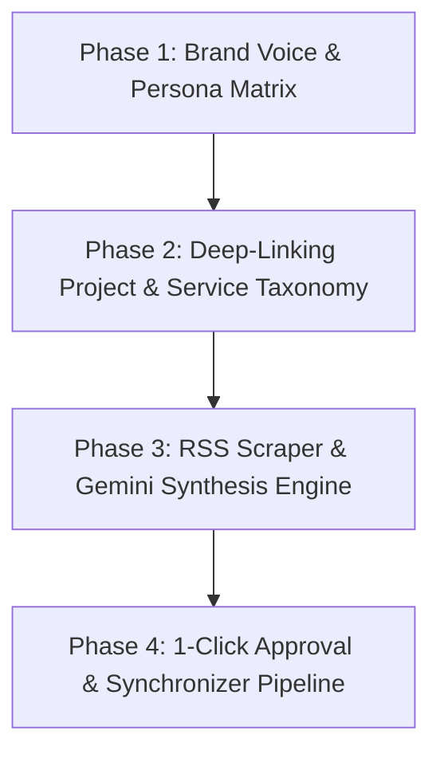

# Automated AI Newsjacking & Content Engine Roadmap

This document outlines the architectural roadmap for building an automated, AI-driven daily newsjacking blog generator for Prateek Sharma's portfolio website (`prateeq.in`).

---

## Strategic Goals & Moat

1. **Organic SEO & High-Intent Conversion**: Convert trending AI/software news into authoritative, code-first case studies that drive traffic directly to the [AI Strategy & Architecture Audit](/scoping?engine=ai_strategy_audit) (₹20,000 / $300) and custom SaaS MVP builds.
2. **Zero-Penalty SEO Safeguard**: Employ a human-in-the-loop 1-click approval workflow (Gmail/Telegram + Supabase Drafts) to prevent Google *Scaled Content Abuse* penalties.
3. **Deep Portfolio Taxonomies**: Automatically cross-reference news topics with Prateek's actual shipped codebases (`retriever`, `PaintMix AI`, `MetaWipe`, `PrateeqSync AI`).

---

## 4-Phase Master Roadmap

### Phase 1: Brand Voice & Writing Style Blueprint
- Define Prateek's tone: Direct, developer-first, concise, code-heavy, slightly humorous.
- Build LLM Banned-Words List (`delve`, `tapestry`, `game-changer`, `rapidly evolving`, `in conclusion`).
- Construct few-shot prompt templates for `gemini-2.5-flash`.

### Phase 2: Deep-Linking Project & Service Taxonomy
- Map tech news domains to portfolio projects:
  - **Vector DB / RAG / Embeddings / Ollama** ➔ [retriever / RAG Lab](/rag) + Private AI Knowledge Base Module.
  - **Computer Vision / Color Spaces / Image Processing** ➔ [PaintMix AI](/src/data/projects.json#L70-L90) + [MetaWipe](/src/data/projects.json#L48-L68).
  - **Full-Stack / Next.js / Supabase / FastAPI** ➔ Full-Stack SaaS MVP Engine + [AI Strategy Audit](/scoping).
  - **Local Content / Automation / OCR** ➔ [PrateeqSync AI](/src/data/projects.json#L92-L112).

### Phase 3: Automated Scraper & Synthesis Script (`scripts/ai_blog_generator.py`)
- RSS News Scraper (HackerNews, TechCrunch AI, HuggingFace Papers, Google Dev Blog).
- News relevance evaluator (selects top 1 high-intent news item per day).
- Code benchmark & article synthesis engine in Markdown format.

### Phase 4: 1-Click Approval & Automation Pipeline
- GitHub Actions daily cron job (`.github/workflows/daily_ai_blog.yml`).
- Telegram/Gmail notification dispatching 1-click `[🚀 Publish to Live]` webhook links.
- Integration with local Synchronizer (`scripts/sync_tabs/blog.py`) for draft management and 1-click deletion.
