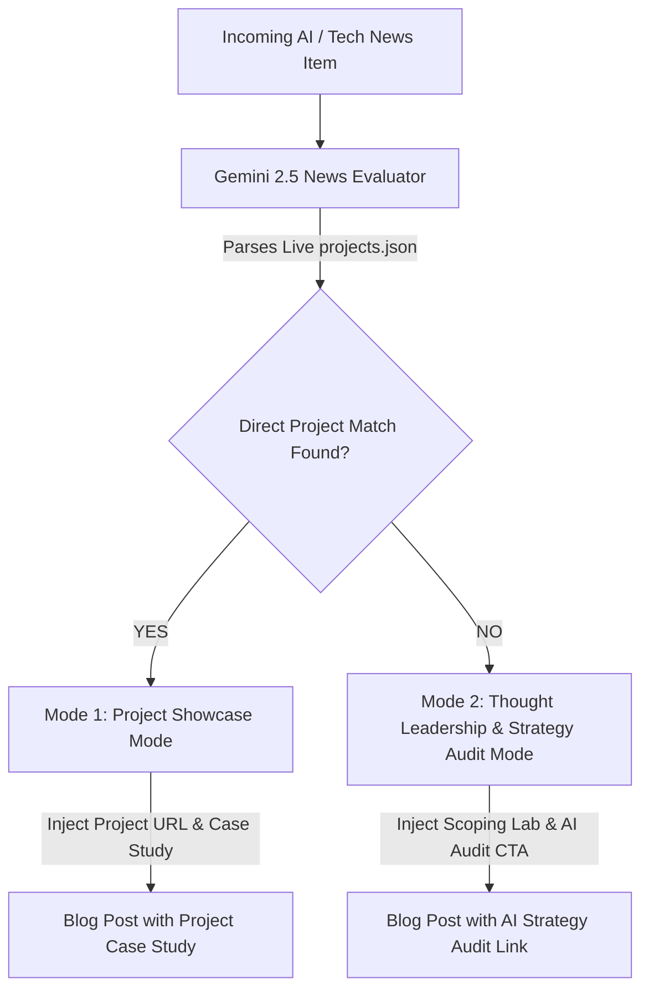

# Dynamic Blog Deep-Linking Taxonomy & Strategy

This document specifies the dual-mode deep-linking rules for the Automated AI Newsjacking Engine.

---

## Dual-Mode Linking Strategy

---

## Mode 1: Project Showcase Mode

Activated when news tags or content intersect with tags/descriptions in `src/data/projects.json`:

| News Domain | Matched Project | Target Link | Primary CTA |
| :--- | :--- | :--- | :--- |
| Vector DB, RAG, Ollama, Embeddings, LLM Q&A | `rag-lab` / Retriever | `/rag` | *"Explore our live [RAG Lab Playground](architecture_nodes/Route_rag_app.md) or add Private Vector Search to your app."* |
| Color Spaces, Computer Vision, Delta E, Mobile Camera | `paintmix-ai` | `projects.json#paintmix-ai` | *"See how we built camera-based CIELAB color matching in [PaintMix AI](architecture_nodes/Route_scoping.md)."* |
| Privacy, Isolates, EXIF Data, Local Security | `metawipe` | `projects.json#metawipe` | *"Learn how offline isolate processing keeps data local in [MetaWipe](architecture_nodes/Route_scoping.md)."* |
| OCR, Certificate Scanning, Gemini Vision, Local CMS | `prateeqsync-ai...` | `projects.json#prateeksync-ai...` | *"Read how we automated content management with Gemini in [PrateeqSync AI](architecture_nodes/Route_scoping.md)."* |

---

## Mode 2: Thought Leadership & Strategy Mode

Activated when news is high-intent general AI/Tech news (e.g. DeepSeek, Claude 3.7, Vercel/Next.js updates) with **no direct project match**:

| News Domain | Commercial Angle | Target Link | Fallback CTA |
| :--- | :--- | :--- | :--- |
| New LLM Model Release / Reasoning Models | Evaluating cost vs latency for business adoption | `/scoping?engine=ai_strategy_audit` | *"Want to evaluate how this new model architecture fits into your tech stack? Book an [AI Strategy & Architecture Audit](architecture_nodes/Route_scoping.md)."* |
| Framework Updates (Next.js, FastAPI, Supabase) | Best practices for modern full-stack web apps | `/scoping?engine=saas` | *"Building a modern SaaS application? Scope your full-stack MVP engine on our [Scoping Lab](architecture_nodes/Route_scoping.md)."* |
| General AI Automation & Business Workflows | Operational bottleneck reduction | `/scoping` | *"Discover how to automate your business operations with custom software at [prateeq.in/scoping](architecture_nodes/Route_scoping.md)."* |

---

## Dynamic Auto-Discovery Rule

The generator script reads `src/data/projects.json` at runtime. Any new project added to `projects.json` in the future automatically expands the **Mode 1** project matching matrix without requiring code changes to the script.

---

## **Related Architecture & Cross-References**

- [Automated AI Content Engine](AUTOMATED_AI_BLOGGING_ROADMAP.md)
- [Content Strategy](07_Content_Strategy.md)
- [SEO Strategy](17_SEO_Strategy.md)
- [Projects Showcase](09_Section_Specifications/04_Projects.md)
- [Architecture Node: Projects Schema](architecture_nodes/Schema_projects.md)