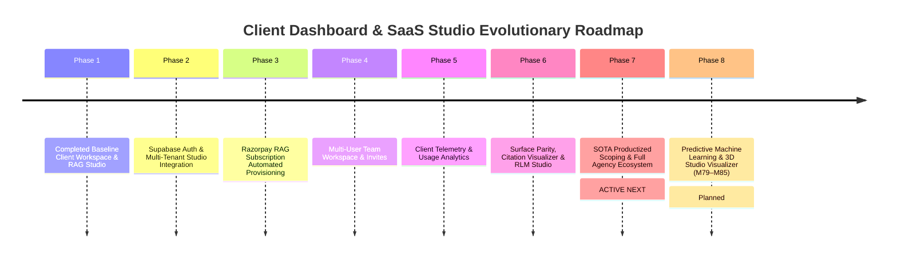

# Client Dashboard & SaaS Studio Ecosystem Specification
**System:** Prateek Website Control Plane (`prateeq.in`)  
**Deployment URL:** `https://prateeq.in/dashboard` & `https://prateeq.in/rag/app`  
**Target Audience:** Commercial Services Clients & RAG SaaS Subscribers  
> 📌 **Master Roadmap (SSoT):** For active platform milestone sequencing (M1 to M78), see [`docs/UNIFIED_MASTER_ROADMAP.md`](UNIFIED_MASTER_ROADMAP.md).  
> 📌 **Scoping PRD:** For the complete SOTA Scoping Engine & Productized E-Commerce specification, see [`docs/25_SOTA_Scoping_Engine_PRD.md`](25_SOTA_Scoping_Engine_PRD.md).  
**Cross-Reference:** Linked directly with the **[Unified Master Product & Architectural Roadmap](UNIFIED_MASTER_ROADMAP.md)** and **[Admin Dashboard Architecture Roadmap](../../retriever/docs/ADMIN_DASHBOARD_ROADMAP.md)** in `retriever`.

---

## 1. Executive Overview & Dual Client Architecture

The **Client Dashboard Ecosystem** on `prateeq.in` serves as the primary commercial portal and self-service SaaS workspace. Unlike the platform-wide **Admin Dashboard** (`admin.rag.prateeq.in`), which is reserved for system administration, the Client Dashboard is designed for end-users and operates under strict multi-tenant authorization boundaries enforced via **Supabase Auth**.

### Dual Client Portals
```
                               CLIENT DASHBOARD ECOSYSTEM
┌────────────────────────────────────────────────────────────────────────────────────────┐
│ CONTROL PLANE: Prateek_website (prateeq.in) on Vercel                                 │
│ ┌──────────────────────────────────────────┐  ┌─────────────────────────────────────┐ │
│ │ 1. Client Workspace Portal               │  │ 2. SaaS RAG Studio Workspace        │ │
│ │    Route: prateeq.in/dashboard           │  │    Route: prateeq.in/rag/app        │ │
│ │    User: Custom Dev Services Client      │  │    User: RAG SaaS Subscriber        │ │
│ │    Purpose: Scopes, Milestones, Invoices │  │    Purpose: Upload Docs, RAG Studio │ │
│ └────────────────────┬─────────────────────┘  └──────────────────┬──────────────────┘ │
└──────────────────────┼───────────────────────────────────────────┼────────────────────┘
                       │                                           │
                       │ 50% Deposit / Milestone Billing           │ API Chat & Document Sync
                       ▼                                           ▼
┌────────────────────────────────────────────┐  ┌──────────────────────────────────────┐
│ Razorpay Payments & Webhooks               │  │ FastAPI Resource Server              │
│ /api/client/create-razorpay-subscription   │  │ rag.prateeq.in                       │
└────────────────────────────────────────────┘  └──────────────────────────────────────┘
```

---

## 2. Cross-Repository Integration Contract

### Identity & Access Flow (Supabase Auth SSoT)
1. **Single Source of Truth:** `prateeq.in` handles all user registration and authentication via Supabase Auth (Google OAuth + PKCE session cookies).
2. **JWT Claims:** The authenticated user's session token contains their Supabase User ID (`sub`) and verified `email`.
3. **Tenant Mapping:** The user's active tenant is resolved from the `rag_tenants` and `rag_tenant_members` tables in Supabase PostgreSQL:
   ```sql
   CREATE TABLE rag_tenant_members (
     id UUID DEFAULT gen_random_uuid() PRIMARY KEY,
     tenant_id UUID NOT NULL,
     user_id UUID REFERENCES auth.users(id) ON DELETE CASCADE,
     email TEXT NOT NULL,
     role TEXT DEFAULT 'member' CHECK (role IN ('owner', 'admin', 'member')),
     created_at TIMESTAMPTZ DEFAULT timezone('utc'::text, now()) NOT NULL
   );
   ```
4. **Resource Calls:** When `/rag/app` makes RAG calls to `rag.prateeq.in`, it includes:
   ```http
   Authorization: Bearer <SUPABASE_AUTH_JWT_OR_TENANT_API_KEY>
   X-User-ID: <SUPABASE_USER_UUID>
   ```

### Subscription Billing Flow (Razorpay)
1. **Plan Selection:** Client selects a plan (Starter, Growth, Enterprise) on `prateeq.in/rag`.
2. **Checkout Trigger:** `prateeq.in` invokes `POST /api/client/create-razorpay-subscription`, returning a Razorpay `subscription_id`.
3. **Webhook Provisioning:** Razorpay sends payment confirmation to `POST /api/webhooks/razorpay`. `prateeq.in` server-side handler:
   - Inserts/updates `rag_subscriptions` and `rag_tenants` in Supabase DB.
   - Invokes `retriever`'s Admin API: `POST https://rag.prateeq.in/v1/admin/tenants` with `X-Admin-Master-Key`.
   - Provisions token quota settings (`M26`).
   - Issues Tenant API Key.
   - Redirects client to `/rag/app` with workspace ready!

---

## 3. Core Feature Directory & Portal Capabilities

### Portal A: Commercial Services Client Workspace (`/dashboard`)
* **Google OAuth Session Gate:** Restricted to authenticated clients via `AuthContext.tsx` and `sessionVerify.ts`.
* **Modular Dashboard Architecture:** High-cohesion subcomponents under `src/components/ClientDashboard/` orchestrating scopes, onboarding, and invoices:
  * **[`ScopeCard.tsx`](../src/components/ClientDashboard/ScopeCard.tsx):** Dynamic status badges, SOW cryptographic baseline hashes, live price calculations (`@number-flow/react`), and Phase 2 change order ledgers.
  * **[`ScopeEditorModal.tsx`](../src/components/ClientDashboard/ScopeEditorModal.tsx):** Interactive CPQ architecture engine customizer with DAG dependency cascades (`DependencyCascadeModal.tsx`) and Phase 2 change order submissions.
  * **[`SowSignoffModal.tsx`](../src/components/ClientDashboard/SowSignoffModal.tsx):** Digital proposal agreement with flexible payment structure selection (50/50 vs 40/30/30) and Razorpay deposit checkout (`checkout.js`).
  * **[`ProposalSuiteModal.tsx`](../src/components/ClientDashboard/ProposalSuiteModal.tsx):** Dual-format commercial PDF exporter (1-Page Executive Pitch Brief vs 3-Page Master SOW Contract).
  * **[`StagingPreviewModal.tsx`](../src/components/ClientDashboard/StagingPreviewModal.tsx):** Desktop and mobile viewport staging sandbox with live URL sharing.
  * **[`InvoiceCreatorModal.tsx`](../src/components/ClientDashboard/InvoiceCreatorModal.tsx) & [`InvoiceLedgerTable.tsx`](../src/components/ClientDashboard/InvoiceLedgerTable.tsx):** GST-compliant tax invoicing, itemized line items, PDF generation, and Razorpay checkout actions.
  * **[`OnboardingChecklistWidget.tsx`](../src/components/ClientDashboard/OnboardingChecklistWidget.tsx):** Categorized technical, financial, and governance prerequisite tracker with real-time readiness scoring.
  * **[`ClientProjectCopilot.tsx`](../src/components/ClientDashboard/ClientProjectCopilot.tsx):** Persistent floating AI copilot querying the client's dedicated Retriever tenant (`RetrieverClient`) with grounded semantic citations and live SLA status.
* **4-Stage Progress Tracker:** Visual milestone progression: `architecture` ➔ `engineering` (unlocked on 50% deposit) ➔ `staging` ➔ `live`.
* **Runtime Schema Safety:** All client API mutations validated at runtime via Zod schemas (`saveScopeSchema`, `copilotQuerySchema`, `intakeDraftSchema`).

### Portal B: RAG SaaS Studio Workspace (`/rag/app`)
* **Overview & Telemetry Tab:**
  * Real-time token consumption, monthly quotas, and semantic cache hit rates (`@number-flow/react`).
  * **Active Engine Batteries & Capabilities Matrix (M86.5):** Live capability cards displaying active retrieval (ColBERT, BM25, HNSW), cognitive (GraphRAG, RLM, Docling), and defense (Token Shield, Sentinel, LlamaGuard 3) engines.
* **Chat Studio Tab:**
  * Real-time SSE token streaming from `rag.prateeq.in`.
  * Response latency indicators and token count breakdown.
  * Clickable presigned citation links to download source PDFs.
  * Thumbs up / down feedback submission.
* **Document Library Tab:**
  * Drag-and-drop file uploader (`.pdf`, `.txt`, `.md`, `.docx`).
  * Ingestion status indicators (`INDEXED`, `PROCESSING`, `FAILED`).
  * Permanent file deletion with cascading vector purges.
* **Search Inspector Tab:**
  * One-shot hybrid search debugger (pgvector HNSW + BM25 keyword + Cohere rerank).
  * Score inspection cards showing rank order and relevance scores.
* **3D Vector Explorer Tab (`VectorVisualizerPanel.tsx`, M82):**
  * Interactive 3D WebGL point cloud rendering document embeddings via PCA/UMAP projections.
* **Semantic Cache Management Tab (`CachePanel.tsx`):**
  * Sub-50ms semantic cache hit-rate telemetry, similarity threshold controls, and vector store purging.
* **Durable Workflows & Background Jobs Tab (`WorkflowsPanel.tsx`, M95):**
  * Step-level memoization, automatic exponential backoff retries, visual step DAG timeline, execution ledger, and checkpoint state inspection via `<Portal>`.
* **RLM Python REPL Studio Tab (`RlmStudioPanel.tsx`):**
  * Sandboxed Python execution environment for recursive multi-turn document vault traversal and structured tabular synthesis.
* **Agent Studio Tab (`AgentStudioPanel.tsx`, M91):**
  * Stateful LangGraph cyclic computation graphs, time-travel thread history, and interactive Human-in-the-Loop (HITL) approval gates.
* **DSPy Prompt Optimization Studio Tab (`PromptOptimizationPanel.tsx`, M92):**
  * Metric-driven automated prompt compilation (`BootstrapFewShot`, `MIPROv2`) and versioned program activation.
* **Smart Router & Gateway Tab (`GatewayPanel.tsx`, M93):**
  * Unified multi-model routing (Gemini, OpenAI, Anthropic, Ollama), dynamic fallback cascades, and virtual tenant budget enforcement.
* **NeMo Guardrails & Safety Tab (`GuardrailsPanel.tsx`, M94):**
  * Colang `.co` conversational dialogue steering, sub-20ms fast-path input jailbreak screening, and factual grounding output rails.
* **Embed Configurator Tab (`ConfigPanel.tsx`):**
  * 1-line script generator and custom interactive widget preview.
* **Team & Compliance Tab (`TeamPanel.tsx`):**
  * Invite team members by email with role assignment (`owner`, `admin`, `member`) and compliance policy management.
* **Plugins & Integrations Tab (`IntegrationsPanel.tsx`, M90):**
  * Slack bot integration, Chrome web capture extension, and 2-way Google Drive document synchronization.

---

## 4. Development Roadmap & Implementation Phases



### Phase 1: Completed Baseline Setup (Current State)
- ✅ Commercial Client Workspace (`/dashboard`) connected to Supabase DB and Razorpay payments.
- ✅ RAG Landing Page (`/rag`) with live demo sandbox and Geo-IP pricing.
- ✅ RAG SaaS Studio (`/rag/app`) UI with Chat, Documents, Search, and Embed tabs using `localStorage` config fallback.

### Phase 2: Supabase Auth & Multi-Tenant Studio Integration (Completed)
- ✅ **Supabase Auth Session Connect:** Connected `/rag/app` (`ConfigPanel.tsx`) directly to Supabase Auth user session tokens and `retriever`'s `/v1/auth/session` endpoint for zero-touch workspace access.
- ✅ **Database Schema & RLS Policy:** `rag_tenants` and `rag_tenant_members` schema policies active in Supabase PostgreSQL.
- ✅ **Session Resolver Route:** Implemented `/v1/auth/session` on `retriever` API to resolve active user workspace and issue session claims.

### Phase 3: Razorpay RAG Subscription Automated Provisioning (Completed)
- ✅ **Subscription Checkout API:** Wired `/api/client/create-razorpay-subscription` for recurring plan creation.
- ✅ **Webhook Receiver:** `/api/webhooks/razorpay` verifies HMAC signatures and processes `subscription.charged` / `payment.captured` events to maintain `rag_subscriptions`.
- ✅ **Quota Allocation:** Initial storage and token limits configured by plan tier.

### Phase 4: Multi-User Team Workspace & Invites (Completed)
- ✅ **Team Management UI:** Built "Team Members" tab (`TeamPanel.tsx`) in `/rag/app`.
- ✅ **Invite Handler API:** Implemented `/api/rag/invite` to dispatch branded invitation emails via Resend API and save entries to `rag_tenant_members`.
- ✅ **Team Members API:** Implemented `/api/rag/members` for listing team members (`GET`) and revoking access (`DELETE`).
- ✅ **User Sync:** Syncs invited user profiles to `retriever`'s `UserDb` via `POST /v1/admin/tenants/{tenantId}/users`.

### Phase 5: Client Telemetry & Usage Analytics (Completed)
- ✅ **Usage Metering UI:** Visual progress bar in `/rag/app` (`TelemetryPanel.tsx`) showing real-time monthly token usage percentage against plan limits.
- ✅ **Resource Limits:** Document count and storage capacity gauges.
- ✅ **Semantic Cache Analytics:** Dashboard card displaying latency reduction (~850ms/hit) and USD cost savings ($4.12 saved).
- ✅ **Feedback Quality Curves:** Visual satisfaction rating ratio (thumbs up vs thumbs down).
- ✅ **Telemetry API:** Session-gated `/api/rag/telemetry` endpoint returning live telemetry metrics.

### Phase 6: Surface Polish, Citation Visualizer & RLM Studio (Completed)
- ✅ **Full SDK Surface Parity (M54):** Update `RetrieverClient` (`src/lib/rag-client.ts`) and Studio UI to support Context Compression toggles, Multi-Agent Consensus badges, Guardrail status alerts, and RLM execution mode.
- ✅ **Citation Span Visualizer (M55):** Highlight exact string-span context matches in Chat Studio messages (`ChatPanel.tsx`), displaying warning tags for ungrounded citations.
- ✅ **Interactive RLM Python REPL Studio (M59):** Dedicated RLM Studio tab (`/rag/app/rlm`) displaying interactive Python code execution streams and recursive document vault traversal visualization.

---

### Phase 7: SOTA Productized Scoping & Full Agency Ecosystem (M63 – M68) — **CURRENT ACTIVE NEXT**

```text
┌────────────────────────────────────────────────────────────────────────────────────────┐
│             PHASE 7: SOTA SCOPING & CLIENT WORKSPACE ECOSYSTEM (M63–M68)               │
├────────────────────────────────────────────────────────────────────────────────────────┤
│  [M63] Multimodal Discovery & Public Dogfooding Tenant (`prateeq_scoping`)             │
│  [M64] Productized Architecture Cart Drawer, GraphRAG Upsells & Promo Engine           │
│  [M65] Live Visual Architecture Topology Map & Dependency Cascade Solver               │
│  [M66] Terminal Scoping CLI (/terminal) & Mobile QR Code Checkout                     │
│  [M67] Dashboard Workspace Bridge, Cryptographic SOW Freeze & Phase 2 Change Orders    │
│  [M68] Unified Persistent Copilot, Git CI/CD Feeds & Post-Launch SLA Monitoring        │
└────────────────────────────────────────────────────────────────────────────────────────┘
```

* **Milestone 63: Multimodal Discovery & Dogfooding Tenant (`prateeq_scoping`)**
  - Public `prateeq_scoping` tenant on Retriever manually onboarded by Prateek (uploading engineering docs, rate cards, and configuring the prompt) just like a standard customer.
  - Scoping connects strictly via API keys generated by Retriever (`RETRIEVER_SCOPING_TENANT_ID`, `RETRIEVER_SCOPING_API_KEY` via env vars, never hardcoded).
  - Scoping chatbox uses the public 1-line embed widget script advertised on `/rag` (`widget.js` / `RetrieverClient`).
  - **Audit-First Rule:** Every Retriever capability (embed widget, document parsing, structured extraction) is audited and verified in `retriever` before frontend integration.
  - 1-line prompt bar + Drag-and-drop RFP/PRD PDF dropzone with Retriever M42 Layout OCR & M22 JSON extraction.
  - Live latency & semantic cache telemetry proof badge (`⚡ Powered by Retriever Engine • Latency: 380ms`).

* **Milestone 64: Productized Architecture Cart Drawer, GraphRAG Upsells & Promo Engine**
  - Slide-over `ArchitectureCartDrawer.tsx` with live line-item itemization, removal, and 5-second `[Undo]` toast.
  - GraphRAG "Frequently Built Together" companion recommendations.
  - Volume bundle discount progress bar (5% on Growth Stacks, 10% on Full Suites).
  - Promo code validation engine (`/api/scoping/validate-promo`, `promo_codes` table, strikethrough pricing).
  - Sandboxed Python REPL CPQ pricing script (`pricing_repl.py`, M47).

* **Milestone 65: Live Visual Architecture Topology Map & Dependency Cascade Solver**
  - Interactive SVG/Canvas node visualizer (`ArchitectureTopologyMap.tsx`) with real-time node highlighting and technical SLA tooltips.
  - GraphRAG DAG dependency solver with active cascade disconnect modal (`DependencyCascadeModal.tsx`).

* **Milestone 66: Terminal Scoping CLI (`/terminal`) & Mobile QR Code Checkout**
  - Hacker/CTO CLI scoping commands in `/terminal`: `scope new`, `scope analyze`, `cart status`, `cart checkout`.
  - Terminal QR code deposit generator (`/api/terminal/qrcode`) for scanning and paying on mobile.

* **Milestone 67: Dashboard Workspace Bridge, 7-Day Trial Provisioning & Phase 2 Change Orders (Completed)**
  - ✅ Supabase Auth PKCE handoff automatically provisions a dedicated client tenant (`tn_client_<uuid>`) on Retriever with a **7-Day Trial** plan and full access to `/rag/app`.
  - ✅ Compiles the confirmed scope/SOW into an immutable, permanent system document (`is_system: true`, `is_deletable: false`) indexed into the client's tenant and displayed in their Document Library.
  - ✅ Embed the full SOTA CPQ customizer and Cart Drawer directly in `/dashboard` (replacing legacy regex text editing).
  - ✅ Digital SOW proposal sign-off modal and Razorpay 50% deposit checkout (`checkout.js`).
  - ✅ Cryptographic SHA-256 SOW freezing (`sow_hash`) upon deposit capture and private workspace collection ingestion (M27).
  - ✅ Phase 2 Change Order engine calculating scope delta in REPL and generating automated milestone invoices.
  - ✅ Local **Streamlit Synchronizer** (`sync_tabs/clients.py`) remains Prateek's single commercial cockpit for tracking scopes, leads, invoices, and linked tenant IDs.

* **Milestone 68: Unified Persistent Copilot, Git CI/CD Feeds & Post-Launch SLA Monitoring (Completed)**
  - ✅ Connect `ClientProjectCopilot.tsx` to private Retriever tenant chat session (grounded in client RFP and sprint milestones).
  - ✅ GitHub private repo auto-scaffolding and live sprint commit feed in `/dashboard`.
  - ✅ Embed Vercel staging preview frames directly inside the milestone progress tab.
  - ✅ Post-launch SLA & production uptime monitoring cockpit (5-minute health pings, Retriever token metering, automated monthly SLA report PDF).
  - ✅ Multi-format commercial proposal suite (1-Page Executive Pitch vs 3-Page Master SOW PDF).

---

### Phase 8: Predictive Machine Learning & 3D Studio Visualizer (M79 – M85) — **PLANNED**

```text
┌────────────────────────────────────────────────────────────────────────────────────────┐
│         PHASE 8: PREDICTIVE ML & 3D SAAS STUDIO VISUALIZER (M79–M85)                   │
├────────────────────────────────────────────────────────────────────────────────────────┤
│  [M82] Interactive 3D WebGL Vector Cloud Visualizer in SaaS Studio (/rag/app)          │
│  [M83] Scikit-Learn Anomaly Sentinel for API Quotas & Suspicious Tenant Traffic         │
│  [M84] ML-Powered SOW Effort & Sprint Delivery Timeline Regression Engine              │
│  [M85] Zero-Cookie Visitor Persona Classifier & Outreach Conversion Propensity Scorer  │
└────────────────────────────────────────────────────────────────────────────────────────┘
```

* **Milestone 82: Interactive 3D WebGL Vector Visualizer in SaaS Studio (`/rag/app`)**
  - Server-side PCA/UMAP projection endpoint in `retriever` reducing 768-dim tenant document vectors to 3D coordinates.
  - Three.js / Canvas interactive point cloud tab in SaaS Studio (`VectorVisualizer.tsx`) rendering document clusters, centroid labels, and glowing real-time search query vector intersections.

* **Milestone 84: ML-Powered SOW Effort & Sprint Delivery Timeline Regression Model**
  - Multi-Output Gradient Boosting Regressor trained on historical CPQ scoping configurations in `src/lib/pricing.ts` and `/api/scoping/estimate-timeline`.
  - Replaces static timeline estimates with dynamic $P_{50} / P_{90}$ sprint confidence intervals displayed inside the Cart Drawer (`/scoping`) and Client Workspace (`/dashboard`).

* **Milestone 85: Zero-Cookie Visitor Persona Classifier & Dynamic CTAs**
  - Unsupervised `KMeans` clustering on GDPR-compliant daily telemetry classifying visitors into Enterprise Clients, SaaS Buyers, Recruiters, and Dev Peers, tailoring dynamic UI CTAs and lead propensity scoring.

---

## 5. Client API & Database Contract Reference Table

| Entity / Endpoint | Type | Primary Purpose |
| :--- | :--- | :--- |
| `clients` | Supabase DB Table | Central client profile (`email`, `company_name`, `country`) |
| `client_scopes` | Supabase DB Table | Commercial project scope records, Order IDs (`ORD-2026-XXXX`), & SOW hashes |
| `scope_change_orders` | Supabase DB Table | Post-deposit scope deltas & Phase 2 add-on milestones (`CO-2026-XXXX-XX`) |
| `promo_codes` | Supabase DB Table | Coupon discount rules & Sales Partner middleman attribution |
| `invoices` | Supabase DB Table | Itemized milestone invoices, GST tax ledger, and Razorpay payment tracking |
| `sprint_capacity` | Supabase DB Table | Quarterly engineering slots & fast-track rush capacity limits |
| `rag_tenants` | Supabase DB Table | RAG tenant registry mapping client to `retriever` `tenant_id` |
| `rag_tenant_members` | Supabase DB Table | Multi-user team memberships (`tenant_id`, `user_id`, `role`) |
| `rag_subscriptions` | Supabase DB Table | Subscription billing tracking (`plan_tier`, `monthly_token_limit`, `razorpay_subscription_id`) |
| `/api/scoping/parse-intent` | Next.js API Route | Natural language intent parser proxying to Retriever `prateeq_scoping` |
| `/api/scoping/parse-rfp` | Next.js API Route | Multimodal RFP/PRD PDF parser proxying to Retriever M42/M22 |
| `/api/scoping/estimate-timeline` | Next.js API Route | ML regression endpoint predicting sprint hours & confidence bounds (M84) |
| `/api/scoping/validate-promo` | Next.js API Route | Promo code validator and Sales Partner attribution resolver |
| `/api/client/save-scope` | Next.js API Route | Save/update scope feature customizations in draft mode |
| `/api/client/create-razorpay-order` | Next.js API Route | Initiate 50% scope deposit Razorpay order |
| `/api/client/create-razorpay-subscription` | Next.js API Route | Initiate RAG SaaS plan subscription |
| `/api/terminal/qrcode` | Next.js API Route | Generate ASCII / PNG QR code for terminal mobile checkout |
| `/api/webhooks/razorpay` | Next.js API Route | Process Razorpay payment & subscription webhooks |
| `/api/rag/workflow-webhook` | Next.js API Route | Process background durable workflow execution status webhooks (M95) |
| `POST /v1/tenants/{id}/workflows/:name/run` | FastAPI Route | Trigger background durable workflow with step memoization (M95) |
| `GET /v1/tenants/{id}/workflows/executions` | FastAPI Route | List durable workflow executions & check DAG step history (M95) |
| `POST /v1/tenants/{id}/embeddings/project` | FastAPI Route | 3D UMAP/PCA dimensionality reduction for Studio visualizer (M82) |

---

## **Related Architecture & Cross-References**

- [Unified Master Roadmap (SSoT)](UNIFIED_MASTER_ROADMAP.md)
- [SOTA Scoping Engine & Commerce PRD](25_SOTA_Scoping_Engine_PRD.md)
- [RAG SaaS Studio PRD](24_RAG_App_Studio_PRD.md)
- [Client Workspace Dashboard Spec](09_Section_Specifications/13_Client_Workspace_Dashboard.md)
- [Payments & Subscriptions](14_Razorpay_Payments_and_Invoicing.md)
- [Supabase Auth PKCE Session Verification](16_Security_and_Privacy.md)
- [Architecture Node: Route /dashboard](architecture_nodes/Route_dashboard.md)
- [Architecture Node: Dashboard UI](architecture_nodes/UI_ClientWorkspaceDashboard.md)
- [Architecture Node: Copilot API](architecture_nodes/API_client_copilot.md)
- [Architecture Node: Client Scopes Schema](architecture_nodes/Schema_client_scopes.md)