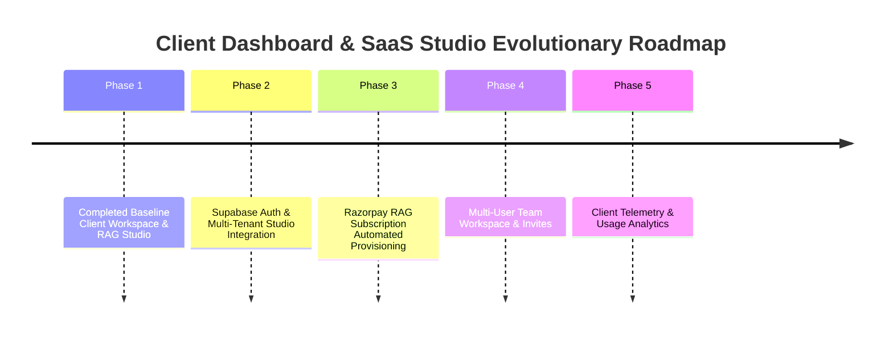

# Client Dashboard & SaaS Studio Ecosystem Roadmap
**System:** Prateek Website Control Plane (`prateeq.in`)  
**Deployment URL:** `https://prateeq.in/dashboard` & `https://prateeq.in/rag/app`  
**Target Audience:** Commercial Services Clients & RAG SaaS Subscribers  
**Cross-Reference:** Linked directly with the **[Admin Dashboard Architecture & Operational Roadmap](file:///Users/prateeksharma/Developer/retriever/docs/ADMIN_DASHBOARD_ROADMAP.md)** in `retriever`.

---

## 1. Executive Overview & Dual Client Architecture

The **Client Dashboard Ecosystem** on `prateeq.in` serves as the primary commercial portal and self-service SaaS workspace. Unlike the platform-wide **Admin Dashboard** (`admin.rag.prateeq.in`), which is reserved for system administration, the Client Dashboard is designed for end-users and operates under strict multi-tenant authorization boundaries enforced via **Supabase Auth**.

### Dual Client Portals
```
                               CLIENT DASHBOARD ECOSYSTEM
┌────────────────────────────────────────────────────────────────────────────────────────┐
│ CONTROL PLANE: Prateek_website (prateeq.in) on Vercel                                 │
│ ┌──────────────────────────────────────────┐  ┌─────────────────────────────────────┐ │
│ │ 1. Client Workspace Portal               │  │ 2. SaaS RAG Studio Workspace        │ │
│ │    Route: prateeq.in/dashboard           │  │    Route: prateeq.in/rag/app        │ │
│ │    User: Custom Dev Services Client      │  │    User: RAG SaaS Subscriber        │ │
│ │    Purpose: Scopes, Milestones, Invoices │  │    Purpose: Upload Docs, RAG Studio │ │
│ └────────────────────┬─────────────────────┘  └──────────────────┬──────────────────┘ │
└──────────────────────┼───────────────────────────────────────────┼────────────────────┘
                       │                                           │
                       │ 50% Deposit / Milestone Billing           │ API Chat & Document Sync
                       ▼                                           ▼
┌────────────────────────────────────────────┐  ┌──────────────────────────────────────┐
│ Razorpay Payments & Webhooks               │  │ FastAPI Resource Server              │
│ /api/client/create-razorpay-subscription   │  │ rag.prateeq.in                       │
└────────────────────────────────────────────┘  └──────────────────────────────────────┘
```

---

## 2. Cross-Repository Integration Contract

### Identity & Access Flow (Supabase Auth SSoT)
1. **Single Source of Truth:** `prateeq.in` handles all user registration and authentication via Supabase Auth (Google OAuth + PKCE session cookies).
2. **JWT Claims:** The authenticated user's session token contains their Supabase User ID (`sub`) and verified `email`.
3. **Tenant Mapping:** The user's active tenant is resolved from the `rag_tenants` and `rag_tenant_members` tables in Supabase PostgreSQL:
   ```sql
   CREATE TABLE rag_tenant_members (
     id UUID DEFAULT gen_random_uuid() PRIMARY KEY,
     tenant_id UUID NOT NULL,
     user_id UUID REFERENCES auth.users(id) ON DELETE CASCADE,
     email TEXT NOT NULL,
     role TEXT DEFAULT 'member' CHECK (role IN ('owner', 'admin', 'member')),
     created_at TIMESTAMPTZ DEFAULT timezone('utc'::text, now()) NOT NULL
   );
   ```
4. **Resource Calls:** When `/rag/app` makes RAG calls to `rag.prateeq.in`, it includes:
   ```http
   Authorization: Bearer <SUPABASE_AUTH_JWT_OR_TENANT_API_KEY>
   X-User-ID: <SUPABASE_USER_UUID>
   ```

### Subscription Billing Flow (Razorpay)
1. **Plan Selection:** Client selects a plan (Starter, Growth, Enterprise) on `prateeq.in/rag`.
2. **Checkout Trigger:** `prateeq.in` invokes `POST /api/client/create-razorpay-subscription`, returning a Razorpay `subscription_id`.
3. **Webhook Provisioning:** Razorpay sends payment confirmation to `POST /api/webhooks/razorpay`. `prateeq.in` server-side handler:
   - Inserts/updates `rag_subscriptions` and `rag_tenants` in Supabase DB.
   - Invokes `retriever`'s Admin API: `POST https://rag.prateeq.in/v1/admin/tenants` with `X-Admin-Master-Key`.
   - Provisions token quota settings (`M26`).
   - Issues Tenant API Key.
   - Redirects client to `/rag/app` with workspace ready!

---

## 3. Core Feature Directory & Portal Capabilities

### Portal A: Commercial Services Client Workspace (`/dashboard`)
* **Google OAuth Session Gate:** Restricted to authenticated clients via `AuthContext.tsx` and `sessionVerify.ts`.
* **Active Scope Management:** Displays client's active project scopes (`client_scopes` table).
* **Interactive Scope Customizer:** Add or remove feature modules dynamically with instant price recalculations (INR/USD).
* **4-Stage Progress Tracker:** Visual milestone progression: `architecture` ➔ `engineering` (unlocked on 50% deposit) ➔ `staging` ➔ `live`.
* **Invoice & Payment Ledger:** Itemized billing ledger from `invoices` table showing payment status (`pending`, `paid`, `cancelled`), due dates, and payment timestamps.
* **Commercial PDF Exporters:** Downloadable high-res PDF proposals rendered client-side ([`ScopingBriefPDF.tsx`](file:///Users/prateeksharma/Developer/Prateek_website/src/components/pdf/ScopingBriefPDF.tsx) and [`ServicesAndPricingPDF.tsx`](file:///Users/prateeksharma/Developer/Prateek_website/src/components/pdf/ServicesAndPricingPDF.tsx)).
* **Razorpay 50% Deposit Trigger:** **"Pay 50% Scope Deposit"** button launching Razorpay checkout modal (`checkout.js`).

### Portal B: RAG SaaS Studio Workspace (`/rag/app`)
* **Chat Studio Tab:**
  * Real-time SSE token streaming from `rag.prateeq.in`.
  * Response latency indicators and token count breakdown.
  * Clickable presigned citation links to download source PDFs.
  * Thumbs up / down feedback submission (`POST /v1/tenants/{tenantId}/chat/sessions/{sessionId}/messages/{messageId}/feedback`).
* **Document Library Tab:**
  * Drag-and-drop file uploader (`.pdf`, `.txt`, `.md`, `.docx`).
  * Ingestion status indicators (`INDEXED`, `PROCESSING`, `FAILED`).
  * Permanent file deletion with cascading vector purges.
* **Search Inspector Tab:**
  * One-shot hybrid search debugger (pgvector HNSW + BM25 keyword + Cohere rerank).
  * Score inspection cards showing rank order and relevance scores.
* **Embed Configurator Tab:**
  * 1-line script generator:
    ```html
    <script
      src="https://rag.prateeq.in/widget.js"
      data-tenant="TENANT_ID"
      data-key="API_KEY">
    </script>
    ```
  * Custom widget preview (theme colors, position, welcome message, bot avatar).
* **Team Members Tab (Upcoming Phase 4):**
  * Invite team members by email.
  * Assign roles (`owner`, `admin`, `member`).
  * Revoke team member access.

---

## 4. Development Roadmap & Implementation Phases



### Phase 1: Completed Baseline Setup (Current State)
- ✅ Commercial Client Workspace (`/dashboard`) connected to Supabase DB and Razorpay payments.
- ✅ RAG Landing Page (`/rag`) with live demo sandbox and Geo-IP pricing.
- ✅ RAG SaaS Studio (`/rag/app`) UI with Chat, Documents, Search, and Embed tabs using `localStorage` config fallback.

### Phase 2: Supabase Auth & Multi-Tenant Studio Integration (Completed)
- ✅ **Supabase Auth Session Connect:** Connected `/rag/app` (`ConfigPanel.tsx`) directly to Supabase Auth user session tokens and `retriever`'s `/v1/auth/session` endpoint for zero-touch workspace access.
- ✅ **Database Schema & RLS Policy:** `rag_tenants` and `rag_tenant_members` schema policies active in Supabase PostgreSQL.
- ✅ **Session Resolver Route:** Implemented `/v1/auth/session` on `retriever` API to resolve active user workspace and issue session claims.

### Phase 3: Razorpay RAG Subscription Automated Provisioning (Completed)
- ✅ **Subscription Checkout API:** Wired `/api/client/create-razorpay-subscription` for recurring plan creation.
- ✅ **Webhook Receiver:** `/api/webhooks/razorpay` verifies HMAC signatures and processes `subscription.charged` / `payment.captured` events to maintain `rag_subscriptions`.
- ✅ **Quota Allocation:** Initial storage and token limits configured by plan tier (Starter: 250K tokens, Growth: 1.5M tokens, Enterprise: Custom).

### Phase 4: Multi-User Team Workspace & Invites (Completed)
- ✅ **Team Management UI:** Built "Team Members" tab (`TeamPanel.tsx`) in `/rag/app`.
- ✅ **Invite Handler API:** Implemented `/api/rag/invite` to dispatch branded invitation emails via Resend API and save entries to `rag_tenant_members`.
- ✅ **Team Members API:** Implemented `/api/rag/members` for listing team members (`GET`) and revoking access (`DELETE`).
- ✅ **User Sync:** Syncs invited user profiles to `retriever`'s `UserDb` via `POST /v1/admin/tenants/{tenantId}/users`.

### Phase 5: Client Telemetry & Usage Analytics (Completed)
- ✅ **Usage Metering UI:** Visual progress bar in `/rag/app` (`TelemetryPanel.tsx`) showing real-time monthly token usage percentage against plan limits.
- ✅ **Resource Limits:** Document count and storage capacity gauges.
- ✅ **Semantic Cache Analytics:** Dashboard card displaying latency reduction (~850ms/hit) and USD cost savings ($4.12 saved).
- ✅ **Feedback Quality Curves:** Visual satisfaction rating ratio (thumbs up vs thumbs down).
- ✅ **Telemetry API:** Session-gated `/api/rag/telemetry` endpoint returning live telemetry metrics.

### Phase 6: 2026 RAG Engine Full Surface Alignment (M54–M60 Alignment)
- **Full SDK Surface Parity (M54):** Update `RetrieverClient` (`src/lib/rag-client.ts`) and Studio UI to support Context Compression toggles, Multi-Agent Consensus badges, Guardrail status alerts, and RLM execution mode.
- **Citation Span Visualizer (M55):** Highlight exact string-span context matches in Chat Studio messages (`ChatPanel.tsx`), displaying warning tags for ungrounded citations.
- **Interactive RLM Python REPL Studio (M59):** Dedicated RLM Studio tab (`/rag/app/rlm`) displaying interactive Python code execution streams and recursive document vault traversal visualization.

---

## 5. Client API & Database Contract Reference Table

| Entity / Endpoint | Type | Purpose |
| :--- | :--- | :--- |
| `clients` | Supabase DB Table | Central client profile (`email`, `company_name`, `country`) |
| `client_scopes` | Supabase DB Table | Commercial project scope records and deposit status |
| `invoices` | Supabase DB Table | Itemized milestone invoices and payment status |
| `rag_tenants` | Supabase DB Table | RAG tenant registry mapping client to `retriever` `tenant_id` |
| `rag_tenant_members` | Supabase DB Table | Multi-user team memberships (`tenant_id`, `user_id`, `role`) |
| `rag_subscriptions` | Supabase DB Table | Subscription billing tracking (`plan_tier`, `monthly_token_limit`, `razorpay_subscription_id`) |
| `/api/client/save-scope` | Next.js API Route | Save/update scope feature customizations |
| `/api/client/create-razorpay-order` | Next.js API Route | Initiate 50% scope deposit Razorpay order |
| `/api/client/create-razorpay-subscription` | Next.js API Route | Initiate RAG SaaS plan subscription |
| `/api/webhooks/razorpay` | Next.js API Route | Process Razorpay payment & subscription webhooks |

---
*Refer to `retriever/docs/ADMIN_DASHBOARD_ROADMAP.md` for the corresponding Admin Dashboard specifications.*
