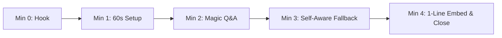

# Retriever AI — High-Converting Client Demo Playbook
**System:** Retriever RAG Engine & SaaS Studio (`prateeq.in/rag` & `prateeq.in/rag/app`)  
**Purpose:** Step-by-Step Field Guide, Pitch Script, and Sample Datasets for Delivering 5-Minute High-Converting Sales Demos to Prospects.

---

## 1. Executive Objective & Demo Strategy

The goal of this demo is to convert prospective buyers (E-commerce merchants, Real Estate developers, Law/CA firms, and SaaS founders) within **5 minutes** by proving 3 non-negotiable value propositions:

1. **Zero Hallucination Guarantee:** The engine never fabricates answers; it strictly grounds responses in verified source documents.
2. **Instant Time-to-Value:** A business can turn a 100-page PDF into an embedded website AI bot in under **60 seconds**.
3. **Downloadable Source Proof:** Every answer provides 1-click presigned PDF citation links so users can inspect original verification documents.

---

## 2. The 3 Plug-and-Play Demo Datasets

Never use raw source code repositories (`.py` / `.ts` files) for customer demos. Use natural language, structured documents with clear headers.

Below are 3 ready-to-use sample dataset templates. You can copy the raw text into a text editor or Word, export as `.pdf` or `.txt`, and upload directly into `/rag/app`.

---

### 🏢 Dataset Bundle A: Real Estate & Property Guide
* **Target Prospect:** Builders, Brokers, Property Management Agencies.
* **Sample File Name:** `Skyline_Towers_Property_Guide.pdf`

```markdown
# Skyline Towers — Luxury Residence Handbook & Pricing Guide

## 1. Property Overview
Skyline Towers is a premier residential complex located in Sector 62, Gurgaon. The development features 2BHK, 3BHK, and 4BHK penthouse apartments with smart home automation and panoramic city views.

## 2. Pricing & Payment Schedules
* 2BHK (1,200 sq.ft.): ₹1.45 Crore ($175,000)
* 3BHK (1,850 sq.ft.): ₹2.15 Crore ($260,000)
* 4BHK Penthouse (3,200 sq.ft.): ₹4.80 Crore ($580,000)

Payment Structure:
- 10% booking deposit upon agreement signing.
- 40% structured across milestone construction stages.
- 50% balance upon final physical handover and possession.

## 3. Amenities & Facilities
- Swimming Pool & Spa: Located on the 5th floor podium level. Operational 6:00 AM – 10:00 PM.
- Clubhouse & Gym: 24/7 access with biometric entry for registered residents.
- Monthly Maintenance Fee: Fixed at ₹4.50 per sq.ft. per month, billed quarterly.

## 4. Cancellation & Refund Terms
Bookings cancelled within 30 days of initial deposit receive a 95% refund (5% administrative deduction). Cancellations after 30 days forfeit the initial booking deposit.
```

#### 🎯 Demo Test Script (Questions to Ask Live):
1. *"What is the price and maintenance fee for a 3BHK unit?"*  
   👉 **Expected Result:** Bot answers ₹2.15 Crore, ₹4.50/sq.ft. maintenance, and provides a downloadable PDF citation button.
2. *"Where is the swimming pool located and what are its hours?"*  
   👉 **Expected Result:** Bot answers 5th floor podium level, 6 AM to 10 PM.

---

### 🛍️ Dataset Bundle B: E-Commerce Store & Return Policy
* **Target Prospect:** Shopify Sellers, D2C Brands, Retail Merchants.
* **Sample File Name:** `AuraTech_Wireless_Headphones_Policy.pdf`

```markdown
# AuraTech Audio — Product Specifications & Customer Policy

## 1. AuraSound Pro Headphones Features
- Active Noise Cancellation (ANC): Hybrid ANC reducing background noise by up to 35dB.
- Battery Life: 40 hours playback with ANC off; 28 hours with ANC enabled.
- Fast Charging: 10 minutes of USB-C charging delivers 4 hours of audio playback.
- Water Resistance: IPX4 splash-proof rating.

## 2. Shipping & Delivery
- Standard Domestic Shipping: 3-5 business days (Free for orders over ₹1,999).
- Express Delivery: 24-48 hours (Flat ₹150 surcharge).

## 3. Return & Refund Policy
Customers may return unopened products within 14 days of delivery for a full refund. 
- Return Condition: Product must be in original box with all accessories and seal intact.
- Damaged / Defective Items: Reported within 48 hours of delivery receive an instant replacement at no shipping cost.
- Return Shipping Fee: Billed to customer (₹100 flat fee) unless the return is due to an AuraTech manufacturing defect.
```

#### 🎯 Demo Test Script (Questions to Ask Live):
1. *"Can I return a headphone if I opened it 10 days ago?"*  
   👉 **Expected Result:** Bot specifies returns are valid within 14 days ONLY if unopened in original box, or reports 48-hour window for damaged goods.
2. *"How long does the battery last with Noise Cancellation turned on?"*  
   👉 **Expected Result:** Bot answers 28 hours with ANC enabled.

---

### 📄 Dataset Bundle C: Commercial Tech Services & SLA
* **Target Prospect:** SaaS Founders, IT Agencies, Corporate Clients.
* **Sample File Name:** `Prateek_Website_Services_Guide.pdf`

```markdown
# Prateek Sharma — Full-Stack Web & AI Engineering Services

## 1. Service Packages & Pricing
- Base Web Engine: Full-Stack Next.js 16 App Router platform with Supabase integration (Turnaround: 2 weeks).
- RAG AI Assistant Module: Custom hybrid search engine integration with pgvector and citation downloads.
- Maintenance & Care Plan: ₹14,999/month ($199/mo) covering 24/7 uptime monitoring, security updates, and database backups.

## 2. Commercial Terms & Payment Milestones
- Payment Structure: 50% deposit upon scope lock; 50% balance upon final staging sign-off.
- Delivery Guarantee: 30-day post-handover warranty for bug fixes and layout calibrations.
```

#### 🎯 Demo Test Script (Questions to Ask Live):
1. *"What is the deposit structure for custom development?"*  
   👉 **Expected Result:** Bot states 50% deposit upon scope lock, 50% upon final sign-off.

---

## 3. The 5-Minute High-Converting Sales Pitch Script

Follow this exact minute-by-minute sequence during a client call or screen-share demo:



### ⏱️ Minute 0–1: The Problem Hook
* **What to Say:**  
  *"Most AI chatbots on the market suffer from two huge problems: they hallucinate fake information, and they take weeks of custom coding to set up. Let me show you how Retriever AI solves both in under 60 seconds."*

### ⏱️ Minute 1–2: The 60-Second Setup
* **What to Do:**  
  1. Open `prateeq.in/rag/app` (SaaS Studio Workspace).
  2. Navigate to the **Document Library** tab.
  3. Drag and drop one of the sample PDFs (e.g., `Skyline_Towers_Property_Guide.pdf`).
  4. Point out the instant ingestion status badge: `INDEXED`.
* **What to Say:**  
  *"I just uploaded our raw PDF property brochure. The engine has automatically parsed, chunked, and stored vector embeddings in pgvector."*

### ⏱️ Minute 2–3: The Magic Q&A & Citation Proof
* **What to Do:**  
  1. Switch to the **Chat Studio** tab.
  2. Type a specific question: *"What is the maintenance fee for a 3BHK unit?"*
  3. Hit Enter. Show real-time SSE token streaming and sub-second response.
  4. Highlight the **`⚡ Cached`** badge and **`📄 Download Source Citation`** button. Click the citation button to show instant PDF access.
* **What to Say:**  
  *"Notice three things: First, it didn't guess — it gave the exact fee from Page 2. Second, notice the sub-50ms speed. Third, the user can click this citation link to download the actual source page as proof."*

### ⏱️ Minute 3–4: Self-Aware Fallback & Search Inspector
* **What to Do:**  
  1. Ask an out-of-bounds question NOT in the PDF: *"Do you offer pet grooming services in the building?"*
  2. Show the Self-Aware CRAG response: *"I cannot find information about pet grooming in the uploaded documents."*
  3. Switch to the **Search Inspector** tab. Type *"maintenance fee"*. Show the hybrid search breakdown (pgvector HNSW score + BM25 keyword score + Cohere rerank score).
* **What to Say:**  
  *"Unlike ChatGPT, our engine is Self-Aware. When it doesn't find facts in your documents, it gracefully admits it rather than inventing fake rules. And in the Search Inspector, you can see the exact mathematical confidence scores."*

### ⏱️ Minute 4–5: The 1-Line Embed Code & Close
* **What to Do:**  
  1. Click the **Embed Configurator** tab.
  2. Show the copyable script tag:
     ```html
     <script src="https://rag.prateeq.in/widget.js" data-tenant="..." data-key="..."></script>
     ```
  3. Show the live widget preview floating in the bottom right corner.
* **What to Say:**  
  *"To put this on your website, your developer literally copies this one line of code. No backend servers, no complex setup. Would you like to set up a 14-day trial for your company today?"*

---

## 4. Common Demo Pitfalls to Avoid

| Pitfall | Why It Harms the Demo | Corrective Action |
| :--- | :--- | :--- |
| ❌ Indexing Raw Codebases | AST variable names don't map to English queries | Always use prose documents/PDFs |
| ❌ Uploading 200MB Scanned Image PDFs | OCR processing takes 60+ seconds on low VPS | Use text-based PDFs (5–15 pages max) |
| ❌ Demoing on Cold Server Starts | First request after idle might take 2-3s | Open `/rag/app` 2 minutes before the call to warm cache |
| ❌ Asking Vague Open Questions | *"Tell me about everything"* returns broad summaries | Ask specific factual questions with numbers/terms |

---
*Playbook created for Prateek Sharma — Prateek Website & Retriever AI Platform.*
