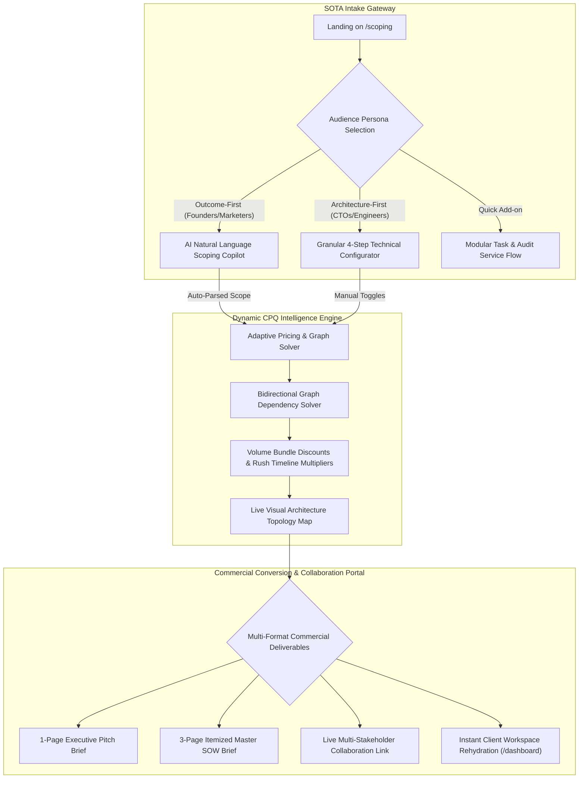

# Scoping Audit & Monolith Decomposition Log (Archived)

> 📌 **Status:** Archived Verification Log (Phases 1–4 Completed).  
> 📌 **Master Roadmap (SSoT):** For active roadmap milestones (Phase G: M63–M68), see [`docs/UNIFIED_MASTER_ROADMAP.md`](UNIFIED_MASTER_ROADMAP.md).  
> 📌 **Master Scoping PRD:** For the complete SOTA Scoping Engine & Productized E-Commerce specification, see [`docs/25_SOTA_Scoping_Engine_PRD.md`](25_SOTA_Scoping_Engine_PRD.md).

---

## Audit Revision Notes

Key corrections from the initial audit:
- **Issue 1.2 (serviceType deep link init) was WRONG** — line 178 already initializes `serviceType` from `initialPreset?.serviceType`. No fix needed.
- **Issue 4.8 (PDF popup blocker) was WRONG** — `pdfGenerator.ts:50` opens the tab synchronously during the click handler, which is the correct pattern. No fix needed.
- **Issue 4.10 (scope code collision) was OVERSTATED** — 5-digit codes (89,991 values) are sufficient for a personal portfolio. Downgraded to low-priority.
- **Issue 2.5 (cookie size) was OVERSTATED** — typical payloads are ~800 bytes, well under the 4KB limit. Removed from active roadmap.
- **Issue 1.1 (dead submitted state) needs nuance** — even if `submitted` is set to `true`, the redirect at lines 798/806 fires immediately, so the success card never renders. Fix must include redirect delay.

## Post-Implementation Audit Notes (2026-08-24)

After completing all 25 issues, a comprehensive post-implementation audit was performed:
- **Email prop type** — Already present in `StepGoalArchetypeProps.formData.contactEmail`. No fix needed.
- **invoiceLayout/itemLine CSS classes** — Do not exist in the codebase. Audit finding was incorrect.
- **Inline styles** — Converted ~50+ inline styles to CSS module classes across all decomposed components.
- **Quick Services & Scoping Audit** — Fixed missing quick service labels (`speed_optimization` label set to `⚡ Core Web Vitals & Speed Optimization`, `accessibility_audit` label set to `♿ WCAG Accessibility Audit & Fixes`), goal archetype label (`landing_page` set to `🚀 High-Converting Landing Page`), and maintenance plan badge (`self` set to `💡 30-Day Warranty Included`) across `intakeQuestionnaireDefaults.json` and `resume.json`. Updated `getQuickServiceIcon` in `QuickServiceFlow.tsx` to handle full JSON quick service IDs alongside short aliases.
- **Final score** — Architecture is solid with proper decomposition into 8 sub-components + custom hook.
- **Architectural Polish (6 Concerns Resolved)**:
  1. **Feature Labels vs IDs**: Migrated `formData.selectedFeatures` from fragile display labels to canonical IDs across `useIntakeFormState.ts`, `IntakeForm.tsx`, and `StepTechnicalScope.tsx`. Converted to labels at render/payload boundaries for seamless backward compatibility.
  2. **Save-Scope Error Feedback**: Replaced silent `console.warn` error swallowing in `handleSubmitOnline` and `handleQuickSubmit` with non-blocking user warning toasts (`toast.warning(...)`).
  3. **`type=care` Service Flow**: Auto-advances deep links with `type=care` straight to Step 4 (Commercials & SLA) with the requested care plan pre-selected.
  4. **Session-Unique Scope Codes**: Added `sessionSeed` to the djb2 hash to prevent collisions between identical configurations across different sessions.
  5. **Quick Service Proposal PDF**: Built `buildQuickServiceData()` and `handleDownloadQuickPDF()` to generate accurate, itemized quick service proposal PDFs.
  6. **`intake-draft` Rate Limiting**: Added IP-based rate limiting (max 5 drafts/IP/hour) backed by `ip_hash` in `intake_leads` table.

---

## Phase 1 — Bug Fixes

**Estimated scope:** 6 issues, ~4 files touched, low regression risk.

- [x] **1.1 Fix dead `submitted` state + redirect timing**
  - **File:** `src/components/Intake/IntakeForm.tsx:193`, lines 798, 806
  - **Problem:** `const [submitted] = useState(false)` has no setter. The success card at line 1226 never renders. Even if a setter were added, the redirect to `/dashboard` at lines 798 and 806 fires immediately, so the success card would never get a chance to display.
  - **Fix:** Replace with `const [submitted, setSubmitted] = useState(false)`. After successful scope save, set `setSubmitted(true)` and delay the redirect by 4-5 seconds (or show a "Continue to Dashboard" button). The success card (lines 1226-1255) with PDF download + WhatsApp CTA becomes the landing state before redirect.
  - **Test impact:** None — no existing tests assert on `submitted` state.
  - **Verification:** Manual — submit a scope, confirm the success card renders with PDF download and WhatsApp button, then auto-redirects after delay.

- [x] **1.2 Add `type=care` to shareable URL generation**
  - **File:** `src/components/Intake/IntakeForm.tsx:237-258`
  - **Problem:** `handleCopyShareableUrl` always sets `params.set('type', 'full')`. The `care` service type (handled by `page.tsx:52-53`) is never generated.
  - **Fix:** Use `serviceType` variable (which is already in scope) instead of hardcoded `'full'`: `params.set('type', serviceType || 'full')`.
  - **Test impact:** None.
  - **Verification:** Select care flow, copy shareable URL, confirm it contains `type=care`.

- [x] **1.3 Fix error handling — show inline errors instead of silent redirect**
  - **File:** `src/components/Intake/IntakeForm.tsx:807-809` and `876-878`
  - **Problem:** The outer `catch` block in both `handleSubmitOnline` and `handleQuickSubmit` redirects to `/dashboard?imported=true` even on failure. User never sees an error. Note: inner try-catches handle most API failures gracefully — this outer catch only fires for unexpected errors (e.g., JSON.stringify failure). Still, redirecting on error is misleading.
  - **Fix:** In the outer catch block, set `setErrorMsg('Something went wrong. Please try again.')` and `setSubmitting(false)` instead of redirecting. Only redirect on success.
  - **Test impact:** None.
  - **Verification:** Simulate a network failure (offline mode), submit the form, confirm error message appears inline.

- [x] **1.4 Fix confetti + toast firing before async work (Full flow only)**
  - **File:** `src/components/Intake/IntakeForm.tsx:711-715`
  - **Problem:** Confetti and "Scope Submitted!" toast fire immediately on submit, before any API call executes. The Quick Service flow (`handleQuickSubmit`) does NOT have this issue — it has no confetti or toast at all.
  - **Fix:** Move the `confetti()` call and `toast.success('Scope Submitted!')` to after the successful completion of the scope save (after line 798 for authenticated users, after line 806 for unauthenticated users). Also add matching confetti + toast to `handleQuickSubmit` for consistency.
  - **Test impact:** None.
  - **Verification:** Submit via both Full and Quick flows, confirm confetti/toast appear after API calls complete, and both flows have consistent feedback.

- [x] **1.5 Fix 7 undefined CSS class references**
  - **File:** `src/components/Intake/IntakeForm.module.css`
  - **Problem:** 7 classes referenced in TSX have no CSS definition (verified via grep — only `.termsCheckboxBox` exists, not `.termsCheckbox`):
    - `stepItemActive` / `stepItemDone` — no visual distinction between current and completed steps
    - `navigationRow` — Quick Service Back/Next buttons have no flex layout
    - `termsCheckbox` — Quick Service terms checkbox has no layout
    - `fieldHint`, `itemPrice`, `checkMark` — missing styling
  - **Fix:** Add the missing class definitions to `IntakeForm.module.css`:
    - `stepItemActive`: mirror `stepBadgeActive` styling for the button container
    - `stepItemDone`: mirror `stepBadgeDone` styling
    - `navigationRow`: `display: flex; justify-content: space-between; align-items: center; gap: 12px;`
    - `termsCheckbox`: `display: flex; align-items: flex-start; gap: 8px; cursor: pointer;`
    - `fieldHint`: `font-size: 13px; opacity: 0.7; margin: 0 0 12px 0;`
    - `itemPrice`: `font-weight: 700; font-size: 12px; color: var(--intake-summary-accent);`
    - `checkMark`: `position: absolute; top: 8px; right: 8px;`
  - **Test impact:** None — CSS-only changes.
  - **Verification:** Visual inspection of Step 0, Quick Service flow, and feature cards.

- [x] **1.6 reCAPTCHA not executed on submit**
  - **File:** `src/components/Intake/IntakeForm.tsx:702`
  - **Problem:** The reCAPTCHA script loads (line 652-700) but `handleSubmitOnline` never calls `window.grecaptcha.execute()` to obtain a token before submitting. The server-side `/api/contact` route handles missing tokens gracefully, so this is a security gap, not a functional bug.
  - **Fix:** Before the `fetch('/api/contact')` call, execute reCAPTCHA to get a token and include it in the payload. If `recaptchaUnavailable` is true, skip gracefully.
  - **Test impact:** None.
  - **Verification:** Submit with reCAPTCHA configured, confirm token is sent.

---

## Phase 2 — Data Collection & Polish

**Estimated scope:** 5 issues, ~4 files touched, medium regression risk.

- [x] **2.1 Add optional email/phone fields to Full flow Step 1**
  - **File:** `src/components/Intake/IntakeForm.tsx:1374-1396` (the `fieldGrid` in Step 1)
  - **Problem:** `formData.contactEmail` and `formData.contactPhone` are never rendered in the Full flow. Unauthenticated users submit with `client@example.com` in the PDF/notification and `lead@unauthenticated.client` in the intake-draft database — two different placeholder emails.
  - **Fix:** Add two optional input fields below the existing `companyName` / `targetAudience` grid:
    - `Contact Email (Optional)` with `inputMode="email"`
    - `Contact Phone (Optional)` with `inputMode="tel"`
  - These fields already exist in the `IntakeFormData` interface (lines 330-331) and are wired to `buildQuestionnaireData()` (lines 610-611) — they just need UI.
  - **Test impact:** `intake-draft.test.ts` — the mock payload in tests may need `contactEmail`/`contactPhone` fields added if the API route validation is tightened.
  - **Verification:** Fill the email field, submit, confirm the PDF and admin notification show the real email.

- [x] **2.2 Add input validation**
  - **File:** `src/components/Intake/IntakeForm.tsx` — `handleSubmitOnline` (line 702) and `handleQuickSubmit` (line 815)
  - **Problem:** No validation on any field. Empty company name, no email, no target audience all pass through.
  - **Fix:** Add lightweight validation in the submit handlers (not per-keystroke):
    - Full flow: require `targetAudience` (at least one character), require `contactEmail` if `user` is null (format check with simple regex)
    - Quick flow: require `companyName` (at least one character)
    - Show validation errors via the existing `errorMsg` state
    - Do NOT block submission for missing `companyName` — it already has a fallback (`'My Custom Project'`)
  - **Test impact:** `intake-draft.test.ts` — if validation is added server-side too.
  - **Verification:** Submit with empty target audience and no email, confirm error appears.

- [x] **2.3 Normalize placeholder emails across all paths**
  - **Files:** `src/components/Intake/IntakeForm.tsx:770` and `src/app/api/client/intake-draft/route.ts:30`
  - **Problem:** Two different placeholder emails for unauthenticated users:
    - Contact API notification: `client@example.com` (line 770)
    - Intake-draft database: `lead@unauthenticated.client` (route.ts line 30)
  - **Fix:** Align to a single placeholder: `lead@unauthenticated.client` everywhere (it's more descriptive). Update line 770 to use the same fallback.
  - **Test impact:** `intake-draft.test.ts` may assert on the placeholder email.
  - **Verification:** Submit unauthenticated, check both the admin notification and database record use the same email.

- [x] **2.4 Add PDF loading state**
  - **File:** `src/components/Intake/IntakeForm.tsx:642-650`
  - **Problem:** `handleDownloadPDF` fires confetti immediately while `@react-pdf/renderer` may take 1-3 seconds.
  - **Fix:** Add a `generatingPdf` state boolean. Set it `true` before calling `generateQuestionnairePDF`, `false` after. Show a loading indicator on the "OPEN PROPOSAL PDF" button (e.g., change text to "GENERATING PDF..." and disable the button). Fire confetti + toast after the PDF blob is created.
  - **Test impact:** None.
  - **Verification:** Click "OPEN PROPOSAL PDF", confirm loading state appears, confirm confetti fires after PDF opens.

- [x] **2.5 Tighten `intake-draft` validation**
  - **File:** `src/app/api/client/intake-draft/route.ts:9`
  - **Problem:** Validation requires only ONE of `baseEngineTitle`, `companyName`, or `contactEmail`. Since `baseEngineTitle` is always set from the engine, this validation never fails — a scope with empty company name and email still passes.
  - **Fix:** Require at least `companyName` OR `contactEmail` (remove `baseEngineTitle` from the OR condition). This ensures the intake lead has identifiable contact information.
  - **Test impact:** `intake-draft.test.ts` — update test expectations for the validation rule.
  - **Verification:** POST to `/api/client/intake-draft` with only `baseEngineTitle` set, confirm 400 response.

---

## Phase 3 — Conversion & Trust

**Estimated scope:** 6 issues, ~4 files touched, low regression risk (mostly UI/copy changes).

- [x] **3.1 Visualize payment milestones**
  - **File:** `src/components/Intake/IntakeForm.tsx:1967-1980` (the terms checkbox area)
  - **Problem:** The 50/50 payment structure is buried inside the checkbox label text.
  - **Fix:** Add a small visual milestone indicator above the terms box:
    ```
    [50% Deposit] ──→ [Development] ──→ [50% Final Delivery]
    ```
    Use simple styled `<div>` elements with the existing chip/card styling.
  - **Test impact:** None.
  - **Verification:** Visual inspection on Step 4.

- [x] **3.2 Add social proof near submit CTA**
  - **File:** `src/components/Intake/IntakeForm.tsx:2099-2111` (the submit button area)
  - **Problem:** No trust signals near the conversion point.
  - **Fix:** Add a small trust block below the submit button (after the existing `ctaSubtext`):
    ```
    "Prateeq delivered our SaaS MVP in 3 weeks. The scoping brief was spot-on." — [Client], [Company]
    ```
    Use the existing `ctaSubtext` styling. Keep it to one line. Make configurable via `resumeData`.
  - **Test impact:** None.
  - **Verification:** Visual inspection.

- [x] **3.3 Highlight recommended archetype**
  - **File:** `src/components/Intake/IntakeForm.tsx:1299+` (archetype card grid)
  - **Problem:** All archetypes are flat with no visual hierarchy.
  - **Fix:** Add a "Most Popular" badge to the `business_multipage` archetype. Use the existing `selectedBadge` or `careCardBadge` styling pattern. Only show on "All" and "Websites & Stores" tabs.
  - **Test impact:** None.
  - **Verification:** Visual inspection.

- [x] **3.4 Fix shareable URL fragile label round-trip**
  - **File:** `src/components/Intake/IntakeForm.tsx:239`
  - **Problem:** `goals.find(g => g.label === formData.projectGoal)` — round-trips through goal label. If labels change, existing URLs break.
  - **Fix:** Store `goalId` alongside `projectGoal` label in `formData`. Add a `projectGoalId` field to `IntakeFormData`, set it in `handleGoalChange`, and use it in `handleCopyShareableUrl` for the `goal` param.
  - **Test impact:** None.
  - **Verification:** Create a shareable URL, change the goal, confirm the URL still uses the correct goal ID.

- [x] **3.5 Add PDF to Quick Service flow**
  - **File:** `src/components/Intake/IntakeForm.tsx:1135-1151` (Quick Service step 2 quote summary)
  - **Problem:** Quick Service flow has no PDF download. Clients get a worse experience.
  - **Fix:** Add an "OPEN PROPOSAL PDF" button to the Quick Service quote summary, reusing `handleDownloadPDF`. Build a simplified `QuestionnaireData` object from `quickFormData` + selected services.
  - **Test impact:** `pdf-smoke.test.ts` — no change needed since the PDF component itself isn't changing.
  - **Verification:** Complete a Quick Service flow, confirm PDF downloads.

- [x] **3.6 Improve ESTIMATE_DISCLAIMER placement**
  - **File:** `src/lib/pricing.ts:12-16` and `src/components/Intake/IntakeForm.tsx:1804-1806`
  - **Problem:** The 2-line legalistic disclaimer appears in the sticky bar area and increases anxiety.
  - **Fix:** Shorten to one line: "Final pricing may vary based on scope complexity. A formal quotation will be issued before development." Move it to a tooltip (via the existing `infoBtn` pattern) instead of inline text.
  - **Test impact:** `pricing.test.ts` — the `ESTIMATE_DISCLAIMER` constant is exported but not asserted on in tests. Safe to change.
  - **Verification:** Visual inspection.

---

## Phase 4 — Architecture & Robustness

**Estimated scope:** 8 issues, ~15+ files touched, highest regression risk. Do after Phases 1-3 are stable.

- [x] **4.1 Decompose IntakeForm monolith**
  - **File:** `src/components/Intake/IntakeForm.tsx` (2,153 lines)
  - **Problem:** Three flows, all state, all handlers, all UI in one file.
  - **Fix:** Extract into sub-components:
    ```
    src/components/Intake/
      IntakeForm.tsx              (~300 lines — state orchestration, step routing)
      ServiceTypeGate.tsx          (~60 lines — Step 0)
      StepGoalArchetype.tsx        (~200 lines — Step 1 UI)
      StepTechnicalScope.tsx       (~300 lines — Step 2 UI, engine selector, feature matrix)
      StepBrandKit.tsx             (~100 lines — Step 3 UI)
      StepCommercials.tsx          (~300 lines — Step 4 UI, care plans, terms)
      QuickServiceFlow.tsx         (~200 lines — Quick Service steps 1-2)
      StickyPriceBar.tsx           (~80 lines — sticky pricing summary)
      useIntakeFormState.ts        (~200 lines — custom hook for all useState/useMemo logic)
    ```
  - Each sub-component receives props from the parent. The custom hook encapsulates all state logic and is independently testable.
  - **Test impact:** Write new unit tests for `useIntakeFormState` hook. Existing API tests unaffected.
  - **Verification:** Full manual regression of all wizard flows. `npm run verify`.

- [x] **4.2 Fix popover drift on mobile scroll**
  - **File:** `src/components/Intake/IntakeForm.tsx` — `togglePopover` function and popover rendering
  - **Problem:** Popovers use `position: fixed` with coordinates from `getBoundingClientRect()`. On mobile scroll, they drift.
  - **Fix:** Add a `useEffect` that listens for `scroll` events on the container and closes the popover when the user scrolls.
  - **Test impact:** None.
  - **Verification:** Open a popover on mobile, scroll, confirm it closes.

- [x] **4.3 Move inline styles to CSS modules**
  - **File:** `src/components/Intake/IntakeForm.tsx` — ~30 inline `style={{ ... }}` blocks
  - **Problem:** Inline styles scattered throughout. Makes responsive overrides harder.
  - **Fix:** Extract each repeated inline style pattern into a CSS class. Priority targets:
    - Step 0 card layout (lines 933-939) → `.step0CardContent`
    - Quick service card internals (lines 1030-1031) → `.quickServiceCardInner`
    - Field grid items (lines 1376-1394) → already have `.fieldGrid` but children use inline styles
  - **Test impact:** None.
  - **Verification:** Visual comparison before/after.

- [x] **4.4 Add `aria-live` on step changes**
  - **File:** `src/components/Intake/IntakeForm.tsx` — step indicator area
  - **Problem:** Screen readers not notified when step changes.
  - **Fix:** Add `aria-live="polite"` to the `mobileStepSubhead` div (line 1220-1223). Add `aria-label` to step buttons (line 1199-1216).
  - **Test impact:** None.
  - **Verification:** Screen reader testing (VoiceOver/NVDA).

- [x] **4.5 Add `role="alert"` to error messages + `aria-pressed` to currency toggle**
  - **Files:** `src/components/Intake/IntakeForm.tsx:1984-1986` and `901-916`
  - **Problem:** Error `<p>` lacks `role="alert"`. Currency buttons function as radio toggle but lack pressed state.
  - **Fix:** Add `role="alert"` and `aria-live="assertive"` to the error message element. Add `aria-pressed={currency === 'INR'}` and `aria-pressed={currency === 'USD'}` to the respective buttons.
  - **Test impact:** None.

- [x] **4.6 Sticky bar containing block concern**
  - **File:** `src/components/Intake/IntakeForm.module.css` — `.stickyBar`
  - **Problem:** `position: sticky` may be trapped by `ScrollSection` containing block (per ADR 05).
  - **Fix:** Verify whether `.stickyBar` is inside a `ScrollSection` ancestor. If so, move the sticky bar outside the ScrollSection wrapping, or use a `Portal` to escape the containing block. If it only needs to stick to the bottom of the form card (not viewport), current behavior may be acceptable — verify with manual testing.
  - **Test impact:** None.
  - **Verification:** Scroll the scoping page, confirm the sticky bar stays visible.

- [x] **4.7 Fix sticky bar mobile viewport consumption**
  - **File:** `src/components/Intake/IntakeForm.module.css` — `.stickyBar` at 640px breakpoint
  - **Problem:** Sticky bar consumes ~48px on mobile, reducing content viewport.
  - **Fix:** At the 640px breakpoint, reduce the sticky bar padding and font size further. Verify the bar doesn't overlap form inputs.
  - **Test impact:** None.
  - **Verification:** Mobile viewport testing.

- [x] **4.8 Audit `backToStep0` form data preservation**
  - **File:** `src/components/Intake/IntakeForm.tsx:1264`
  - **Problem:** The "← Change service type" button resets `serviceType` and `selectedQuickServices` but doesn't clear `formData`. If a user fills Step 1, goes back to Step 0, switches to Quick Service, then back to Full, they'd see their previous Step 1 data. This may be desirable (preserving input) or confusing (stale data from a different flow).
  - **Fix:** Investigate whether preserving form data across flow switches is the intended behavior. If not, clear `formData` fields (except identity fields like `companyName`) when switching flows. If it is intended, add a visual indicator that previous data was preserved.
  - **Test impact:** None.
  - **Verification:** Fill Step 1, go back to Step 0, switch to Quick Service, switch back to Full — verify Step 1 data behavior.

---

## Deferred / Low Priority

These issues were identified but are not worth fixing at current scale:

- **Scope code format improvement** — 5-digit codes (89,991 values) are sufficient for a personal portfolio. Only relevant if the site scales to thousands of scopes.
- **Cookie size risk** — Typical payloads are ~800 bytes, well under the 4KB limit. Only extreme edge cases with 10+ long feature labels would approach the limit.
- **Dual currency display** — Both INR/USD shown simultaneously. This is a design preference, not a bug. Could be improved but not critical.

---

## Phase Completion Log

| Phase | Status | Completed Date | Verified By |
|-------|--------|---------------|-------------|
| Phase 1 | Completed | 2026-08-24 | Antigravity |
| Phase 2 | Completed | 2026-08-24 | Antigravity |
| Phase 3 | Completed | 2026-08-24 | Antigravity |
| Phase 4 | Completed | 2026-08-24 | Antigravity |
| Post-Implementation Polish | Completed | 2026-08-24 | Antigravity |

---

## Post-Implementation Polish (Completed)

- [x] **Convert inline styles to CSS modules** — Extracted ~50+ inline `style={{ }}` blocks across all decomposed components into reusable CSS classes:
  - `.summaryBox`, `.summaryRow`, `.summaryLabel`, `.summaryValue`, `.summaryAccent` — StepCommercials summary
  - `.step0CardContent`, `.step0CardTitle`, `.step0CardDesc` — ServiceTypeGate cards
  - `.cardSelectable`, `.cardHeader`, `.cardTitle`, `.cardPrice`, `.cardDesc` — Selectable cards
  - `.engineCardInner`, `.engineCardHeader`, `.engineCardTitleRow`, `.engineCardDesc` — Engine/Feature cards
  - `.careCardDesc` — Care plan descriptions
  - `.popoverStatic`, `.popoverCloseBtn` — Popover positioning
  - `.submittedCard`, `.submittedIcon`, `.submittedTitle`, `.submittedText`, `.submittedActions` — Success state
  - `.formError` — Error message styling
  - `.fieldMarginSm`, `.fieldMarginMd`, `.fieldMarginTop`, `.inlineIcon` — Layout helpers
  - `.quickSummaryLabel`, `.quickSummaryTotal`, `.quickPdfBtn`, `.quickDisclaimer` — Quick service flow
  - `.submitRow` — Submit button row

- [x] **Audit findings correction** — Verified two incorrect audit findings:
  - `email` prop already exists in `StepGoalArchetypeProps.formData.contactEmail`
  - `invoiceLayout`/`itemLine` CSS classes don't exist in the codebase (hallucinated finding)

---

## Test Impact Summary

| Phase | Existing Tests Affected | New Tests Needed |
|-------|------------------------|------------------|
| Phase 1 | None | None |
| Phase 2 | `intake-draft.test.ts` (validation rule change, placeholder email) | None |
| Phase 3 | `pricing.test.ts` if `ESTIMATE_DISCLAIMER` constant changes | None |
| Phase 4 | None (if decomposition preserves prop interface) | `useIntakeFormState` hook tests |

## Deployment Strategy

- **Phase 1:** Ship immediately. All fixes are backwards-compatible.
- **Phase 2:** Ship within a week. Test PDF generation and intake-draft API after adding email fields.
- **Phase 3:** Ship as a batch. UI/copy changes with no data model impact.
- **Phase 4:** Ship the monolith decomposition as its own PR. Run `npm run verify` before and after. Deploy to a preview branch first if possible.

## Post-Deployment Verification

After each phase:
1. `npm run verify` (types + lint + tests + test build)
2. Manual testing on `/scoping` — all 3 flows (Full, Quick, Care)
3. Deep link testing: `/scoping?type=full&engine=saas`, `/scoping?goal=landing_page`
4. Mobile testing (375px viewport)
5. PDF download testing (both themes)
6. Scope submission + dashboard import end-to-end

---

## Phase 5 — State-of-the-Art (SOTA) Scoping & Quotation Engine

> **Objective:** Elevate the `/scoping` engine from an advanced interactive form into an industry-defining, AI-assisted, productized engineering quotation system (target score: **9.8 / 10**).
> Designed for high-ticket client acquisition ($3,000 to $35,000+ USD contracts / ₹2.5L to ₹30L INR).



---

### Phase 5 Work Packages

#### 5.1 AI Natural Language Scoping Copilot
- [ ] **1-Line Natural Language Scope Parser**
  - **Component:** `src/components/Intake/AiScopingPromptBar.tsx`
  - **Behavior:** Renders an intelligent input bar at the top of Step 1: *"Describe what you want to build in plain English (e.g. 'B2B SaaS with AI document search, Stripe billing, and admin center')."*
  - **API:** Lightweight Edge API route `/api/scoping/parse-intent` (powered by Retriever cognitive core structured inference with deterministic catalog fallback). Returns structured JSON mapping to existing `archetypeId`, `baseEngineId`, and `featureIds` with confidence scores.
  - **UX:** Auto-populates the wizard with an animated highlight ring on auto-selected features and a summary badge: *"AI Blueprint Generated (94% confidence) — Review & Customize below"*.

#### 5.2 Interactive Dependency Cascade UX (Prerequisite Solver)
- [ ] **Smart Dependency Disconnect Dialog**
  - **Component:** `src/components/Intake/DependencyResolutionModal.tsx`
  - **Problem:** Currently, clicking a prerequisite feature flashes a temporary locked hint with no way to cascade-remove dependents.
  - **Fix:** When a user clicks to uncheck a prerequisite module (e.g., `auth`), display an immediate, non-blocking confirmation dialog:
    ```text
    ┌──────────────────────────────────────────────────────────┐
    │  Remove Authentication Module?                           │
    │  This will also remove 2 dependent features:              │
    │  • Role-Based Admin CMS Center                           │
    │  • Stripe Customer Billing Portal                        │
    │                                                          │
    │  [Keep Prerequisite]       [Remove All 3 Modules (-$900)]│
    └──────────────────────────────────────────────────────────┘
    ```
  - **Test Impact:** Unit tests for recursive dependency removal in `pricing.test.ts`.

#### 5.3 CPQ Commercial Economics & Dynamic Bundling
- [ ] **Volume Bundle Discounting & Savings Badge**
  - **Module:** `src/lib/pricing.ts`
  - **Formula:**
    - 4–6 selected add-on modules: `5%` bundle discount on total add-on cost.
    - 7+ selected add-on modules: `10%` bundle discount on total add-on cost.
  - **UI:** Display animated savings chip in `StickyPriceBar.tsx` and `StepCommercials.tsx`:
    `🎁 Bundle Savings Applied: -$350 / -₹28,000`.
- [ ] **Expedited Timeline Rush Multiplier**
  - **Options:**
    - `Standard Delivery (3–4 weeks)`: `1.0x` baseline.
    - `Fast-Track MVP Sprint (2 weeks)`: `1.25x` rush multiplier (+25% dedicated sprint priority).
    - `Flexible Off-Peak (6–8 weeks)`: `0.95x` discount (-5% flexible turnaround).
  - **Storage:** Persisted to `scopePayload.timelineMultiplier` and reflected in itemized SOW.

#### 5.4 Live Visual Architecture Topology Map
- [ ] **Real-Time Interactive Stack Diagram**
  - **Component:** `src/components/Intake/ArchitectureTopologyMap.tsx`
  - **Behavior:** A collapsible visual topology view rendered on Step 2 that updates in real time as modules are checked.
  - **Visual Nodes:**
    `[Client / PWA]` ──→ `[Next.js 16 Edge Proxy]` ──→ `[Supabase PostgreSQL / RLS]` ──→ `[PgVector / RAG Engine]` ──→ `[Resend / Stripe]`
  - **Technology:** Lightweight CSS Grid / SVG connector lines with micro-pulse animations when new nodes are added. Gives non-technical clients immediate visual clarity and reassurance of enterprise-grade architecture.

#### 5.5 Multi-Stakeholder Collaboration & Interactive Proposal Portal
- [ ] **Live Collaborative Scope URL with Versioning**
  - **Route:** `/scoping?share=SCOPE-XXXXX&version=1`
  - **Capability:** Anyone opening a share link sees the exact configuration with a "Fork & Customize" button. Allows technical leads and co-founders to tweak options side-by-side without overriding the original sender's draft.
- [ ] **Dashboard Bidirectional Scope Customizer**
  - **Location:** `src/app/dashboard/components/ScopeDetailModal.tsx`
  - **Capability:** Authenticated clients can reopen their saved scope in an interactive editor on `/dashboard`, modify features, see updated milestone payments, and re-sign the proposal before executing the deposit.

#### 5.6 Multi-Format Commercial Proposal Suite (PDF 2.0)
- [ ] **1-Page Executive Pitch Sheet** (`ExecutiveOnePagerPDF.tsx`)
  - Designed specifically for non-technical investors, CEOs, and board approvals.
  - Focuses on ROI, primary business outcome KPI, delivery timeline, and total investment summary without overwhelming technical module jargon.
- [ ] **3-Page Technical Scope of Work (SOW)** (`ScopingBriefPDF.tsx` enhancement)
  - Enhanced with explicit boundary matrices: *Included in Build* vs *Out of Scope Boundaries*, Cloud Infrastructure SLA, and Milestone Escrow terms.

---

## **Related Architecture & Cross-References**

- [Active SOTA Scoping Engine PRD](25_SOTA_Scoping_Engine_PRD.md)
- [Scoping Lab Section Spec](09_Section_Specifications/12_Scoping_Lab.md)
- [Unified Master Roadmap](UNIFIED_MASTER_ROADMAP.md)