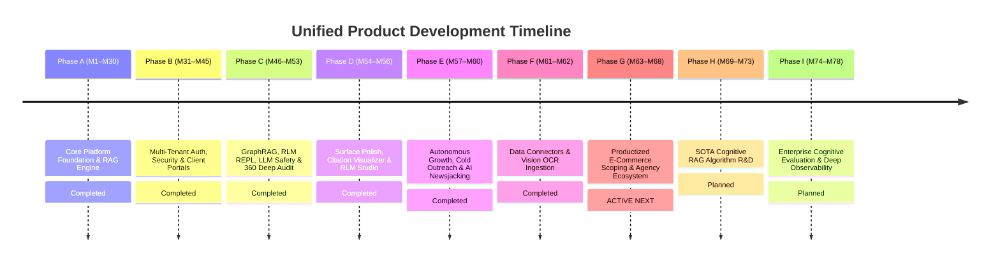

# Unified Master Product & Architectural Roadmap (2026)

**System Architecture:** Dual-Repository Platform Control Plane & AI Resource Server  
**Repositories:** `Prateek_website` (Control Plane on Vercel) & `retriever` (FastAPI AI Backend on Oracle VPS)  
**Document Version:** `v2.0.0` (Unified Master Baseline with Productized E-Commerce Scoping & Full Ecosystem Integrations)  
**Status:** Active Single Source of Truth (SSoT) Roadmap  

---

## 1. Dual-Repository System Architecture & Boundary Matrix

```text
 ┌────────────────────────────────────────────────────────────────────────────────────────┐
 │ CONTROL PLANE FRONTEND LAYER: Prateek_website (prateeq.in) on Vercel                   │
 │                                                                                        │
 │  • Client Workspace Dashboard (`/dashboard`) ➔ Project Scopes, Invoices, Razorpay 50% │
 │  • SaaS RAG App Studio (`/rag/app`) ➔ Chat Studio, Docs, Search Inspector, Embed Config│
 │  • Master Admin Control Center (`/admin`) ➔ Autonomous Outreach & Prospecting Queue    │
 │  • Project Scoping Lab (`/scoping`) ➔ Multimodal CPQ, Cart Drawer & Live Dogfooding   │
 │  • Interactive Diagnostics Terminal (`/terminal`) ➔ Hacker CLI Scoping & Mobile QR Pay│
 │  • Public Portfolio & Newsjacking Blog (`/`, `/blog`) ➔ Case Studies & Auto-Articles   │
 └────────────────────────────────────────┬───────────────────────────────────────────────┘
                                          │
                                          │ REST API / SSE Event Streams (/v1/...)
                                          │ Auth Header: Bearer <Supabase_JWT / API_Key>
                                          ▼
 ┌────────────────────────────────────────────────────────────────────────────────────────┐
 │ AI RESOURCE SERVER & ENGINE: retriever (rag.prateeq.in) on Oracle VPS                  │
 │                                                                                        │
 │  • Public Scoping Tenant (`prateeq_scoping`) ➔ Catalog Grounding, RFP OCR & Sem Cache  │
 │  • Client Dedicated Tenants (`tn_client_...`) ➔ Private Vault, ACLs & AES-256 Encrypt │
 │  • FastAPI REST/SSE Gateways (`apps/api/src/routers/`)                                 │
 │  • Multi-Tenant Row-Level Security (RLS) & PostgreSQL Isolation                        │
 │  • Hybrid Vector Search (HNSW Dense + BM25 Sparse + Cohere Rerank)                      │
 │  • GraphRAG (Entity Extraction, Neo4j/Pg Triples & "Frequently Built Together" Graph)  │
 │  • Recursive Language Model (RLM) Python REPL Execution Sandbox (Deterministic CPQ)    │
 │  • LongLLMLingua Context Compression & Llama Guard 3 Safety Guardrails                 │
 └────────────────────────────────────────────────────────────────────────────────────────┘
```

---

## 2. Master Sequential Implementation Timeline (M1 – M68)



---

## 3. Detailed Milestone Status & Cross-Repository Mapping

### Phase A: Core Platform Foundation & RAG Engine (M1 – M30)
| Milestone | Title | Repository Scope | Primary Deliverable | Status |
|---|---|---|---|---|
| **M1–M10** | Core RAG Architecture | `retriever` | FastAPI engine, pgvector hybrid search, LLM adapters, Admin Dashboard | **Completed** |
| **M11–M20**| Client SDK & Production Scale | Both | `RetrieverClient` JS SDK, S3 storage, semantic cache, feedback endpoints | **Completed** |
| **M21–M30**| Web Grounding & Self-Query | `retriever` | Tavily search grounding, SQL metadata compilers, Next.js Dev Console | **Completed** |

### Phase B: Multi-Tenant Auth, Security & Client Portals (M31 – M45)
| Milestone | Title | Repository Scope | Primary Deliverable | Status |
|---|---|---|---|---|
| **M31–M37**| Production Polish & GraphRAG | Both | Secrets rotation, GraphRAG entity-relationship extraction | **Completed** |
| **M38–M40**| Security Remediation & Safety | Both | Supabase Auth OIDC/JWKS auto-tenant provisioning, Llama Guard 3 guardrails | **Completed** |
| **M41–M45**| Client Workspace Dashboard | `Prateek_website` | `/dashboard` scope customizer, invoice ledger, Razorpay order integration | **Completed** |

### Phase C: 2026 SOTA RAG Engine & 360° Deep Codebase Audit (M46 – M53)
| Milestone | Title | Repository Scope | Primary Deliverable | Status |
|---|---|---|---|---|
| **M46–M50**| SaaS Quotas & RLM Engine | Both | Token quotas, Context compression, RLM Python REPL execution subroutines | **Completed** |
| **M51–M53**| 360° Codebase Audit | Both | 0 dead code files, 100% schema sync, 243 frontend tests & 505 backend tests passed | **Completed** |

### Phase D: Surface Polish, Citation Visualizer & RLM Studio (M54 – M56)
| Milestone | Title | Repository Scope | Primary Deliverable | Status |
|---|---|---|---|---|
| **M54** | Citation Span Visualizer | `Prateek_website` | ChatPanel string-span grounding badges & ungrounded warnings | **Completed** |
| **M55** | RLM Python REPL Studio | Both | Dedicated `/rag/app/rlm` interactive code execution tab | **Completed** |
| **M56** | Razorpay SaaS Auto-Provision | `Prateek_website` | Webhook subscription handler & tenant token quota allocation | **Completed** |

### Phase E: Autonomous Growth & Outreach Automation (M57 – M60)
| Milestone | Title | Repository Scope | Primary Deliverable | Status |
|---|---|---|---|---|
| **M57** | AI Lead Prospecting Engine | `Prateek_website` | 24/7 lead discovery & `gemini-3.6-flash` personalized pitch generator | **Completed** |
| **M58** | Web Control Center HITL Queue| `Prateek_website` | Mobile-friendly 1-click email/social approval queue in `/admin` | **Completed** |
| **M59** | Automated AI Newsjacking | `Prateek_website` | Daily HN/HF news scraper + technical blog case study synthesis | **Completed** |
| **M60** | Client Telemetry Analytics | Both | Real-time token usage meter & semantic cache USD savings display | **Completed** |

### Phase F: Zero-Config Data Connectors & Multi-Modal Processing (M61 – M62)
| Milestone | Title | Repository Scope | Primary Deliverable | Status |
|---|---|---|---|---|
| **M61** | Zero-Config Cloud Connectors | `retriever` | Web crawler & Google Drive connectors with delta sync | **Completed** |
| **M62** | Vision OCR & Scanned PDF Ingest | `retriever` | Layout-aware vision parsing and table-to-markdown extraction | **Completed** |

---

### Phase G: Productized E-Commerce Scoping & Full Agency Ecosystem (M63 – M68) — **CURRENT ACTIVE NEXT**

```text
┌────────────────────────────────────────────────────────────────────────────────────────┐
│                   PHASE G: SOTA SCOPING & AGENCY ECOSYSTEM MAP (M63–M68)               │
├────────────────────────────────────────────────────────────────────────────────────────┤
│  [M63] Multimodal Discovery & Public Dogfooding Tenant (`prateeq_scoping`)             │
│  [M64] Productized Architecture Cart Drawer, GraphRAG Upsells & Promo Engine           │
│  [M65] Live Visual Architecture Topology Map & Dependency Cascade Solver               │
│  [M66] Terminal Scoping CLI (/terminal) & Mobile QR Code Checkout                     │
│  [M67] Dashboard Workspace Bridge, Cryptographic SOW Freeze & Phase 2 Change Orders    │
│  [M68] Unified Persistent Copilot, Git CI/CD Feeds & Post-Launch SLA Monitoring        │
└────────────────────────────────────────────────────────────────────────────────────────┘
```

#### 🛒 Milestone 63: Multimodal Discovery & Dogfooding Tenant (`prateeq_scoping`)
- **Repo Scope:** Both (`Prateek_website` `/scoping` & `retriever` `/v1/tenants/prateeq_scoping`)
- **Deliverable:**
  - Manually onboard `prateeq_scoping` dogfooding tenant on Retriever by Prateek (uploading engineering docs, rate cards, and configuring prompt).
  - Connect Scoping strictly via dynamic API keys (`RETRIEVER_SCOPING_TENANT_ID`, `RETRIEVER_SCOPING_API_KEY` via env vars, never hardcoded).
  - Power the scoping chatbox using the public 1-line embed widget script advertised on `/rag` (`widget.js` / `RetrieverClient`).
  - **Audit-First Invariant:** Inspected and verified Retriever features in `retriever` with 15 passing tests before frontend integration.
  - Implemented 1-Line Natural Language Prompt Bar (`AiScopingPromptBar.tsx`) + Drag-and-Drop RFP/PRD PDF Dropzone (up to 25MB, `RfpUploaderModal.tsx` with `<Portal>` escape) + Embed Chat Widget Drawer (`ScopingChatWidgetDrawer.tsx` with `<Portal>` escape).
  - Implemented Edge Route Handlers: `POST /api/scoping/parse-intent` & `POST /api/scoping/parse-rfp` with transitive dependency resolution.
  - Added live telemetry proof badge on UI:
    `⚡ Powered by Retriever Engine (prateeq-scoping-live) • Latency: 380ms • ⚡ Semantic Cache: Active (HNSW pgvector)`.
- **Status:** **Completed** (Phase G, Milestone 63)

#### 🛒 Milestone 64: Productized Architecture Cart Drawer, GraphRAG Upsells & Promo Engine
- **Repo Scope:** Both (`Prateek_website` `ArchitectureCartDrawer.tsx` & `retriever` RLM REPL / GraphRAG)
- **Deliverable:**
  - Build slide-over `ArchitectureCartDrawer.tsx` with live line-item itemization, removal, and 5-second `[Undo]` toast.
  - Implement GraphRAG "Frequently Built Together" upsell recommender based on technology compatibility.
  - Add Volume Bundle Discount progress meter (5% on Growth Stacks, 10% on Full Suites).
  - Implement Promo & Sales Partner referral code validation (`/api/scoping/validate-promo`, `promo_codes` table, strikethrough pricing).
  - Power pricing calculations via Retriever's sandboxed Python REPL script (`pricing_repl.py`, M47).
- **Status:** **Completed** (Phase G, Milestone 64)

#### 🛒 Milestone 65: Live Visual Architecture Topology Map & Dependency Cascade Solver
- **Repo Scope:** `Prateek_website` (`ArchitectureTopologyMap.tsx`, `DependencyCascadeModal.tsx`)
- **Deliverable:**
  - Lightweight SVG/Canvas node visualizer rendering Client $\rightarrow$ Edge WAF $\rightarrow$ Services $\rightarrow$ Data $\rightarrow$ Integrations with real-time node illumination.
  - Interactive GraphRAG DAG dependency solver with active cascade disconnect modal (*"Removing Auth drops Admin Center & Stripe Subscriptions, saving $1,200. [Remove All] or [Keep]"*).
- **Status:** **Completed** (Phase G, Milestone 65)

#### 🛒 Milestone 66: Terminal Scoping CLI (`/terminal`) & Mobile QR Code Checkout
- **Repo Scope:** `Prateek_website` (`src/app/terminal/`, `src/app/api/terminal/qrcode`, `terminalScoping.ts`)
- **Deliverable:**
  - Add hacker/CTO CLI scoping commands in `/terminal`: `scope new`, `scope analyze "..."`, `cart status`, `cart checkout --deposit 50`.
  - Generate ASCII QR code in terminal for mobile scanning and instant Razorpay/Stripe checkout.
- **Status:** **Completed** (Phase G, Milestone 66)

#### 🛒 Milestone 67: Dashboard Workspace Bridge, 7-Day Trial Provisioning & Phase 2 Change Orders
- **Repo Scope:** Both (`Prateek_website` `/dashboard` & `retriever` `/v1/auth/session`)
- **Deliverable:**
  - Supabase Auth PKCE handoff automatically provisions a dedicated client tenant (`tn_client_<uuid>`) on Retriever with a **7-Day Trial** plan and full access to `/rag/app`.
  - Automatically compiles confirmed scope details into an immutable, permanent system document (`is_system: true`, `is_deletable: false`) indexed into the client's tenant and visible in their Document Library.
  - Embed the full SOTA CPQ customizer and Cart Drawer directly in `/dashboard` (replacing legacy regex text editing).
  - Digital SOW proposal sign-off modal and Razorpay 50% deposit checkout (`checkout.js`).
  - Cryptographic SHA-256 SOW freezing (`sow_hash`) upon deposit capture and private workspace collection ingestion (M27).
  - Phase 2 Change Order engine calculating scope delta in REPL and generating automated milestone invoices.
  - Local **Streamlit Synchronizer** (`sync_tabs/clients.py`) remains Prateek's single commercial cockpit for tracking scopes, leads, invoices, and linked tenant IDs.
- **Status:** **Active Next**

#### 🛒 Milestone 68: Unified Persistent Copilot, Git CI/CD Feeds & Post-Launch SLA Monitoring
- **Repo Scope:** Both (`Prateek_website` `ClientProjectCopilot.tsx`, `/dashboard`, and `retriever` chat router)
- **Deliverable:**
  - Connect `ClientProjectCopilot.tsx` to private Retriever tenant chat session (grounded in client RFP and sprint milestones).
  - Automate 1-click private GitHub repository scaffolding upon deposit and stream live sprint commit feeds into `/dashboard`.
  - Embed Vercel staging preview frames directly inside the milestone progress tab.
  - Post-launch SLA & production uptime monitoring cockpit (5-minute health pings, Retriever token metering, automated monthly SLA report PDF).
  - Multi-format commercial proposal suite (1-Page Executive Pitch vs 3-Page Master SOW PDF).
- **Status:** **Active Next**

---

### Phase H: SOTA Cognitive RAG Algorithm R&D (M69 – M73) — **PLANNED HORIZON**

```text
┌────────────────────────────────────────────────────────────────────────────────────────┐
│             PHASE H: ADVANCED COGNITIVE RAG ALGORITHM UPGRADES (M69–M73)               │
├────────────────────────────────────────────────────────────────────────────────────────┤
│  [M69] Pre-Chunk Contextual Retrieval Ingestion Engine (Anthropic Context Headers)      │
│  [M70] Late-Interaction (ColBERT) Token-Level MaxSim Reranker Microservice             │
│  [M71] Corrective RAG (CRAG) & Agentic Reflection Loop with Web Search Fallback        │
│  [M72] Interactive RLM Python REPL Sandbox Studio Workspace (/rag/app/rlm)             │
│  [M73] GraphRAG Leiden Community Detection & Telemetry-Driven Closed-Loop Self-Tuning   │
└────────────────────────────────────────────────────────────────────────────────────────┘
```

#### 🧠 Milestone 69: Pre-Chunk Contextual Retrieval Ingestion Engine (Anthropic Method)
- **Repo Scope:** `retriever` (`ingestion_service.py`, `workers/src/tasks/`)
- **Deliverable:** Prepend 50-word document context headers to chunks prior to vector embedding generation via async worker, reducing top-20 retrieval failure rates by up to 49%.
- **Status:** **Planned (Phase H)**

#### 🧠 Milestone 70: Late-Interaction (ColBERT) Token-Level Reranker
- **Repo Scope:** `retriever` (`ColBertRerankerAdapter`, `tei_reranker_adapter.py`)
- **Deliverable:** Implement token-level MaxSim late-interaction reranking adapter for high-precision technical term and code lookup.
- **Status:** **Planned (Phase H)**

#### 🧠 Milestone 71: Corrective RAG (CRAG) & Agentic Reflection Loop
- **Repo Scope:** `retriever` (`domain/agentic/`, `reflection_loop.py`)
- **Deliverable:** Autonomous reflection loop evaluating retrieval candidate confidence and dynamically triggering query reformulations or web search fallback.
- **Status:** **Planned (Phase H)**

#### 🧠 Milestone 72: Interactive RLM Python REPL Sandbox Studio
- **Repo Scope:** Both (`retriever` `/v1/rlm` & `Prateek_website` `/rag/app/rlm`)
- **Deliverable:** Productize Recursive Language Models into a dedicated SaaS Studio tab for programmatic, recursive document vault traversal.
- **Status:** **Planned (Phase H)**

#### 🧠 Milestone 73: GraphRAG Leiden Community Detection & Closed-Loop Self-Tuning
- **Repo Scope:** `retriever` (`graph_extraction_service.py`, `OnlineHallucinationEvaluator`)
- **Deliverable:** Hierarchical community entity summaries and automated pipeline self-tuning based on continuous online Ragas evaluation telemetry.
- **Status:** **Planned (Phase H)**

---

### Phase I: Enterprise Cognitive Evaluation & Deep Observability Hardening (M74 – M78) — **PLANNED HORIZON**

```text
┌────────────────────────────────────────────────────────────────────────────────────────┐
│      PHASE I: ENTERPRISE COGNITIVE EVALUATION & OBSERVABILITY HARDENING (M74–M78)      │
├────────────────────────────────────────────────────────────────────────────────────────┤
│  [M74] Semantic NLI & SLM-as-a-Judge Online Hallucination Engine (DeBERTa / Ollama)     │
│  [M75] Full-Stack OpenTelemetry Auto-Instrumentation (SQLAlchemy, HTTPX, Celery)       │
│  [M76] Real-Time Telemetry Live Aggregations & SLA Webhook Alerting (Slack/Discord)   │
│  [M77] Synthetic Golden Dataset Auto-Generation & Automated CI/CD Regression Gate      │
│  [M78] Visual Claim-by-Claim Grounding Diff & Synchronizer Observability Cockpit       │
└────────────────────────────────────────────────────────────────────────────────────────┘
```

#### 🛡️ Milestone 74: Semantic NLI & SLM-as-a-Judge Online Hallucination Engine
- **Repo Scope:** `retriever` (`apps/api/src/domain/evaluation/`, `apps/api/src/adapters/cognitive/`, `workers/src/tasks/`)
- **Deliverable:**
  - Replace heuristic keyword-matching in `calculate_faithfulness()` with a true Natural Language Inference (NLI) pipeline.
  - **Tier 1 (Fast Cross-Encoder):** Lightweight HuggingFace DeBERTa cross-encoder (`cross-encoder/nli-deberta-v3-small`) classifying claim-premise pairs into calibrated probabilities (`entailment`, `neutral`, `contradiction`).
  - **Tier 2 (Async SLM Judge via Celery):** Async Celery task `tasks.evaluate_inference_nli` running a local Ollama judge (`qwen2.5:3b` / `llama3.2:3b`) with structured JSON output: claim breakdown, verification rationale, citation grounding span, and calibrated faithfulness score ($0.0 - 1.0$).
  - Calculate real-time Hallucination Index based on true contradiction/unsupported claim ratio and trigger dynamic retrieval auto-tuning only on verified semantic confidence drops.
- **Status:** **Planned (Phase I)**

#### ⏱️ Milestone 75: Full-Stack OpenTelemetry Auto-Instrumentation & Distributed Trace Graph
- **Repo Scope:** Both (`retriever` `apps/api/src/adapters/telemetry/`, `workers/` & `Prateek_website` `src/proxy.ts`, `src/lib/rag-client.ts`)
- **Deliverable:**
  - Add `SQLAlchemyInstrumentor().instrument(engine=engine)` to capture granular SQL query execution, pgvector similarity lookup latency, and transaction lock timings.
  - Add `HTTPXClientInstrumentor().instrument()` to trace outbound LLM provider latency (Ollama, Gemini, Groq, Tavily, Resend).
  - Add `CeleryInstrumentor().instrument()` to trace asynchronous document ingestion, OCR parsing, and async evaluation tasks across Celery worker queues.
  - Propagate W3C standard `traceparent` headers from Next.js Edge proxy $\rightarrow$ FastAPI Gateway $\rightarrow$ Celery workers $\rightarrow$ pgvector/Redis.
- **Status:** **Planned (Phase I)**

#### 🚨 Milestone 76: Real-Time Telemetry Live Aggregations & SLA Webhook Alerting Engine
- **Repo Scope:** Both (`retriever` `alert_service.py`, `routers/admin.py` & `Prateek_website` `src/app/api/rag/telemetry/route.ts`)
- **Deliverable:**
  - Replace static fallback values in `src/app/api/rag/telemetry/route.ts` with real-time SQL/Redis queries against live `inference_logs` and `online_evaluations` tables.
  - Build multi-channel Webhook Alerting Engine in Retriever (`alert_service.py`):
    - Configurable alert webhooks (Slack, Discord, custom webhooks, email via Resend).
    - Proactive dispatch triggers: (1) Rolling 1-hour Hallucination Index $> 30\%$, (2) Tenant token quota consumption $\ge 90\%$ or $100\%$, (3) P99 inference latency spike $> 5\text{s}$, (4) RLS tenancy violation attempts.
- **Status:** **Planned (Phase I)**

#### 🧪 Milestone 77: Synthetic Golden Dataset Generation & Automated CI/CD Regression Gate
- **Repo Scope:** `retriever` (`apps/api/src/domain/evaluation/`, `scripts/run_eval_regression.py`, `.github/workflows/eval_regression.yml`)
- **Deliverable:**
  - Synthetic Test Generator (`synthetic_dataset_generator.py`): Ingests tenant documents, extracts key factual propositions, and automatically generates high-coverage Q&A benchmark pairs with ground-truth chunk IDs.
  - Automated CI/CD Regression Gate: GitHub Action workflow executing Ragas + DeepEval runs before canary deployments, enforcing a strict minimum threshold (Faithfulness $\ge 0.90$, Answer Relevancy $\ge 0.85$, Hallucination $\le 0.10$) to prevent regression releases.
- **Status:** **Planned (Phase I)**

#### 📊 Milestone 78: Visual Claim-by-Claim Grounding Diff & Synchronizer Observability Cockpit
- **Repo Scope:** Both (`retriever/apps/web` `tenant-hallucinations.tsx`, `Prateek_website` `scripts/sync_tabs/analytics.py`, `ChatPanel.tsx`)
- **Deliverable:**
  - Visual Claim Grounding Inspector: Enhance `tenant-hallucinations.tsx` in Retriever Admin and `ChatPanel.tsx` in the SaaS App Studio to highlight generated answers sentence-by-sentence (green = verified in source, red = ungrounded/hallucinated), with interactive popovers showing the exact source chunk citation.
  - Synchronizer Analytics Cockpit Overhaul: Add live Retriever inference metrics, cost breakdowns, and active hallucination alert feeds directly to `scripts/sync_tabs/analytics.py` in the local Streamlit desktop dashboard.
- **Status:** **Planned (Phase I)**

---

## 4. Single Source of Truth Entity & Route Matrix

| Domain | Entity / Endpoint | Primary Repository | Purpose |
|:---|:---|:---|:---|
| **Auth** | Supabase Auth JWT | `Prateek_website` | User registration, Google OAuth PKCE, session token issuing |
| **Auth Sync** | `GET /v1/auth/session` | `retriever` | Maps Supabase JWT claim to `tenant_id` & `user_id` (M39) |
| **Scoping Dogfood**| `prateeq_scoping` | `retriever` | Public tenant for catalog grounding, RFP OCR & semantic cache |
| **Client Scopes** | `client_scopes` | `Prateek_website` | Project scoping briefs, Order IDs (`ORD-2026-XXXX`), & SOW hashes |
| **Change Orders** | `scope_change_orders` | `Prateek_website` | Post-deposit scope deltas & add-on milestones |
| **Promos** | `promo_codes` | `Prateek_website` | Coupon discounts & Sales Partner middleman attribution |
| **Billing** | `invoices` & `rag_subscriptions` | `Prateek_website` | Commercial milestone invoices & Razorpay SaaS subscriptions |
| **RAG Chat** | `POST /v1/tenants/{id}/chat/sessions/{id}/messages` | `retriever` | Persistent copilot chat with grounded citations |
| **RAG Docs** | `POST /v1/tenants/{id}/documents` | `retriever` | Knowledge document parsing, OCR & vector indexing |
| **GraphRAG** | `POST /v1/admin/tenants/{id}/graph/query` | `retriever` | Entity-relationship graph traversal & upsell recommender |
| **RLM Math** | `POST /v1/rlm/execute` | `retriever` | Deterministic Python CPQ pricing calculation script |
| **Terminal CLI** | `/terminal` & `/api/terminal/qrcode` | `Prateek_website` | Hacker CLI scoping & mobile QR deposit payment |
| **Outreach** | `/api/outreach/prospect` & `/admin` | `Prateek_website` | Lead prospecting queue & automated pitch deep-link generation |

---

## 5. Master Roadmap Directory & Cross-Repository Index

The following table serves as the definitive directory linking all specialized product, engineering, and commercial roadmaps across the entire ecosystem to this Unified Master Roadmap:

### 🌐 Platform & Product Roadmaps (Prateek_website)
| Roadmap / PRD | Focus & Scope | File Link |
| :--- | :--- | :--- |
| **SOTA Scoping Engine PRD** | Phase G (M63–M68): Discovery, Cart Drawer, Topology Map, SOW Freeze | [25_SOTA_Scoping_Engine_PRD.md](25_SOTA_Scoping_Engine_PRD.md) |
| **Client Dashboard Roadmap** | Dual Portals: Commercial Client Workspace (`/dashboard`) & SaaS Studio (`/rag/app`) | [CLIENT_DASHBOARD_ROADMAP.md](CLIENT_DASHBOARD_ROADMAP.md) |
| **RAG SaaS Studio PRD** | Phase D (M54–M56): SaaS Studio Workspace, Document Library, Citations | [24_RAG_App_Studio_PRD.md](24_RAG_App_Studio_PRD.md) |
| **Autonomous Outreach Agent** | Phase E (M57–M58): Multi-Source Lead Prospector, HITL Approval Queue | [AI_OUTREACH_AGENT_ROADMAP.md](AI_OUTREACH_AGENT_ROADMAP.md) |
| **Automated AI Blogging Engine** | Phase E (M59): Newsjacking Pipeline, Automated Research & SEO Publisher | [AUTOMATED_AI_BLOGGING_ROADMAP.md](AUTOMATED_AI_BLOGGING_ROADMAP.md) |
| **Revenue Execution Plan** | Commercial Escrow, Tier Packages, Sales Partner Commissions | [REVENUE_EXECUTION_PLAN.md](REVENUE_EXECUTION_PLAN.md) |
| **Scoping Audit Roadmap** | 360° Quality Checklist & Security Validation for Scoping Engine | [SCOPING_AUDIT_ROADMAP.md](SCOPING_AUDIT_ROADMAP.md) |
| **Platform Future Roadmap** | General Portfolio & Ecosystem Evolution Horizon | [21_Future_Roadmap.md](21_Future_Roadmap.md) |

### 🧠 Engine & Infrastructure Roadmaps (retriever)
| Roadmap / Blueprint | Focus & Scope | File Link |
| :--- | :--- | :--- |
| **Retriever Backend Roadmap** | Complete Backend Milestones (M1–M73), Database Schemas, RLS, Storage | [../../retriever/ROADMAP.md](../../retriever/ROADMAP.md) |
| **2026 SOTA RAG Engine Spec** | Phase H (M69–M73): Contextual Chunking, ColBERT Rerank, CRAG, Leiden GraphRAG | [../../retriever/docs/RAG_2026_PRODUCT_ROADMAP.md](../../retriever/docs/RAG_2026_PRODUCT_ROADMAP.md) |
| **Admin Dashboard Roadmap** | Admin Control Panel (`apps/web` on `admin.rag.prateeq.in`), Tenant Management | [../../retriever/docs/ADMIN_DASHBOARD_ROADMAP.md](../../retriever/docs/ADMIN_DASHBOARD_ROADMAP.md) |
| **Retriever Project Status** | Live Operational Health, Test Status (485 Tests), Completed Milestones | [../../retriever/PROJECT_STATUS.md](../../retriever/PROJECT_STATUS.md) |
| **Technical Debt & Deferred** | Audit Findings, Tracked Security Items, Deferred Optimizations | [../../retriever/TECH_DEBT.md](../../retriever/TECH_DEBT.md) |

---

## **Related Architecture Specifications**

- [Razorpay Payments & Invoicing System](14_Razorpay_Payments_and_Invoicing.md)
- [Content Platform Architecture](10_Content_Platform_Architecture.md)
- [All Section Specifications](09_Section_Specifications/README.md)
- [Architecture Dependency Map](ARCHITECTURE_DEPENDENCY_MAP.md)
- [Architecture Decisions Record (99_DECISIONS)](99_DECISIONS.md)

---

## **Related Architecture & Cross-References**

- [Phase G: SOTA Scoping Engine & Commerce PRD (M63–M68)](25_SOTA_Scoping_Engine_PRD.md)
- [Phase D: RAG SaaS Studio Workspace PRD (M54–M56)](24_RAG_App_Studio_PRD.md)
- [Client Dashboard Specification](CLIENT_DASHBOARD_ROADMAP.md)
- [Phase E: Autonomous AI Outreach Agent (M57–M58)](AI_OUTREACH_AGENT_ROADMAP.md)
- [Phase E: Automated AI Newsjacking (M59)](AUTOMATED_AI_BLOGGING_ROADMAP.md)
- [Razorpay Payments & Invoicing System](14_Razorpay_Payments_and_Invoicing.md)
- [Content Platform Architecture](10_Content_Platform_Architecture.md)
- [All Section Specifications](09_Section_Specifications/README.md)