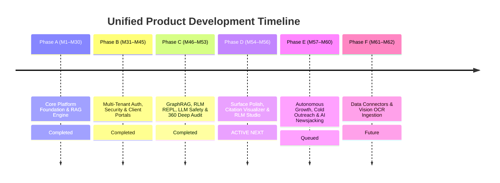

# Unified Master Product & Architectural Roadmap (2026)

**System Architecture:** Dual-Repository Platform Control Plane & AI Resource Server  
**Repositories:** `Prateek_website` (Control Plane on Vercel) & `retriever` (FastAPI AI Backend on Oracle VPS)  
**Document Version:** `v1.0.0` (Unified Master Baseline)  
**Status:** Active Single Source of Truth (SSoT) Roadmap  

---

## 1. Dual-Repository System Architecture & Boundary Matrix

```text
 ┌────────────────────────────────────────────────────────────────────────────────────────┐
 │ CONTROL PLANE FRONTEND LAYER: Prateek_website (prateeq.in) on Vercel                   │
 │                                                                                        │
 │  • Client Workspace Dashboard (`/dashboard`) ➔ Project Scopes, Invoices, Razorpay 50% │
 │  • SaaS RAG App Studio (`/rag/app`) ➔ Chat Studio, Docs, Search Inspector, Embed Config│
 │  • Master Admin Control Center (`/admin`) ➔ Autonomous Outreach & Prospecting Queue    │
 │  • Project Scoping Lab (`/scoping`) ➔ Instant Dual-Currency Quote Wizard & PDF Export  │
 │  • Public Portfolio & Newsjacking Blog (`/`, `/blog`) ➔ Case Studies & Auto-Articles   │
 └────────────────────────────────────────┬───────────────────────────────────────────────┘
                                          │
                                          │ REST API / SSE Event Streams (/v1/...)
                                          │ Auth Header: Bearer <Supabase_JWT / API_Key>
                                          ▼
 ┌────────────────────────────────────────────────────────────────────────────────────────┐
 │ AI RESOURCE SERVER & ENGINE: retriever (rag.prateeq.in) on Oracle VPS                  │
 │                                                                                        │
 │  • FastAPI REST/SSE Gateways (`apps/api/src/routers/`)                                 │
 │  • Multi-Tenant Row-Level Security (RLS) & PostgreSQL Isolation                        │
 │  • Hybrid Vector Search (HNSW Dense + BM25 Sparse + Cohere Rerank)                      │
 │  • GraphRAG (Entity Extraction, Neo4j/Pg Triples & Community Summaries)                │
 │  • Recursive Language Model (RLM) Python REPL Execution Sandbox                        │
 │  • LongLLMLingua Context Compression & Llama Guard 3 Safety Guardrails                 │
 └────────────────────────────────────────────────────────────────────────────────────────┘
```

---

## 2. Master Sequential Implementation Timeline (M1 – M62)



---

## 3. Detailed Milestone Status & Cross-Repository Mapping

### Phase A: Core Platform Foundation & RAG Engine (M1 – M30)
| Milestone | Title | Repository Scope | Primary Deliverable | Status |
|---|---|---|---|---|
| **M1–M10** | Core RAG Architecture | `retriever` | FastAPI engine, pgvector hybrid search, LLM adapters, Admin Dashboard | **Completed** |
| **M11–M20**| Client SDK & Production Scale | Both | `RetrieverClient` JS SDK, S3 storage, semantic cache, feedback endpoints | **Completed** |
| **M21–M30**| Web Grounding & Self-Query | `retriever` | Tavily search grounding, SQL metadata compilers, Next.js Dev Console | **Completed** |

### Phase B: Multi-Tenant Auth, Security & Client Portals (M31 – M45)
| Milestone | Title | Repository Scope | Primary Deliverable | Status |
|---|---|---|---|---|
| **M31–M37**| Production Polish & GraphRAG | Both | Secrets rotation, GraphRAG entity-relationship extraction | **Completed** |
| **M38–M40**| Security Remediation & Safety | Both | Supabase Auth OIDC/JWKS auto-tenant provisioning, Llama Guard 3 guardrails | **Completed** |
| **M41–M45**| Client Workspace Dashboard | `Prateek_website` | `/dashboard` scope customizer, invoice ledger, Razorpay order integration | **Completed** |

### Phase C: 2026 SOTA RAG Engine & 360° Deep Codebase Audit (M46 – M53)
| Milestone | Title | Repository Scope | Primary Deliverable | Status |
|---|---|---|---|---|
| **M46–M50**| SaaS Quotas & RLM Engine | Both | Token quotas, Context compression, RLM Python REPL execution subroutines | **Completed** |
| **M51–M53**| 360° Codebase Audit | Both | 0 dead code files, 100% schema sync, 243 frontend tests & 505 backend tests passed | **Completed** |

---

### Phase D: Surface Polish, Citation Visualizer & RLM Studio (M54 – M56) — **CURRENT ACTIVE NEXT**

#### 🎯 Milestone 54: Citation Span Visualizer & Ungrounded Warnings
- **Repo Scope:** `Prateek_website` (`src/components/rag/ChatPanel.tsx`)
- **Deliverable:**
  - Highlight exact string-span matches in Chat Studio messages.
  - Display green `✓ Grounded (Exact Span)` badges for verified sources and orange warning tags for ungrounded citations.
- **Status:** **Completed**

#### 🎯 Milestone 55: Interactive RLM Python REPL Studio Tab
- **Repo Scope:** Both (`Prateek_website` `/rag/app` & `retriever` `/v1/rlm/execute`)
- **Deliverable:**
  - Add dedicated RLM Studio tab in `/rag/app` displaying real-time Python code execution streams.
  - Visual step-by-step document vault traversal inspector.
- **Status:** **Completed**

#### 🎯 Milestone 56: Live Razorpay SaaS Plan Auto-Provisioning
- **Repo Scope:** `Prateek_website` (`src/app/api/client/create-razorpay-subscription`, `/api/webhooks/razorpay`)
- **Deliverable:**
  - Wire live Razorpay subscription checkout for Starter, Growth, and Enterprise tiers.
  - Auto-provision `rag_subscriptions` and issue tenant API keys upon successful webhook payment.
- **Status:** **Completed**

---

### Phase E: Autonomous Growth & Outreach Automation (M57 – M60) — **CURRENT ACTIVE NEXT**

#### 🚀 Milestone 57: AI Lead Prospecting & Personalized Pitch Generator
- **Repo Scope:** `Prateek_website` (`src/app/api/outreach/prospect`, `src/app/api/outreach/dispatch`)
- **Deliverable:** 24/7 lead discovery engine and `gemini-3.6-flash` personalized pitch generator.
- **Status:** **Completed**

#### 🚀 Milestone 58: Web Control Center 1-Click Approval Queue
- **Repo Scope:** `Prateek_website` (`src/app/admin/page.tsx`)
- **Deliverable:** Mobile-friendly HITL approval queue in `/admin` for 1-click email dispatch and build-in-public social posts (X/LinkedIn).
- **Status:** **Completed**

#### 🚀 Milestone 59: Automated AI Newsjacking & Content Engine
- **Repo Scope:** `Prateek_website` (`scripts/ai_blog_generator.py`, `src/content/posts/`)
- **Deliverable:** Daily HackerNews/HuggingFace news scraper + Gemini technical case-study synthesis engine.
- **Status:** **Completed**

#### 🚀 Milestone 60: Client Telemetry Analytics & Usage Billing
- **Repo Scope:** Both (`src/components/rag/TelemetryPanel.tsx`, `retriever` `/v1/admin/tenants/{id}/telemetry`)
- **Deliverable:** Real-time token usage meter, storage capacity gauges, and semantic cache cost savings display.
- **Status:** **Completed**

---

### Phase F: Zero-Config Data Connectors & Multi-Modal Processing (M61 – M62) — **COMPLETED**

#### 🔮 Milestone 61: Zero-Config Cloud Data Connectors
- **Repo Scope:** `retriever` (`src/adapters/ingestion/`)
- **Deliverable:** Web crawler & Google Drive cloud connectors with automated periodic sync.
- **Status:** **Completed**

#### 🔮 Milestone 62: Multi-Modal Vision & Scanned PDF OCR
- **Repo Scope:** `retriever` (`src/adapters/ingestion/ocr_service.py`)
- **Deliverable:** Vision-model page descriptors and OCR chunking pipeline for scanned PDF diagrams.
- **Status:** **Completed**

---

## 4. Single Source of Truth Entity & Route Matrix

| Domain | Entity / Endpoint | Primary Repository | Purpose |
|:---|:---|:---|:---|
| **Auth** | Supabase Auth JWT | `Prateek_website` | User registration, Google OAuth PKCE, session token issuing |
| **Auth Sync** | `GET /v1/auth/session` | `retriever` | Maps Supabase JWT claim to `tenant_id` & `user_id` |
| **Client** | `client_scopes` | `Prateek_website` | Project scoping briefs & 50% deposit tracking |
| **Billing** | `invoices` & `rag_subscriptions` | `Prateek_website` | Commercial invoice ledger & Razorpay subscriptions |
| **RAG Chat** | `POST /v1/tenants/{id}/chat/sessions/{id}/messages` | `retriever` | SSE token streaming with grounded citations |
| **RAG Docs** | `POST /v1/tenants/{id}/documents` | `retriever` | Knowledge document parsing & vector indexing |
| **GraphRAG** | `POST /v1/admin/tenants/{id}/graph/query` | `retriever` | Entity-relationship graph traversal |
| **RLM** | `POST /v1/rlm/execute` | `retriever` | Recursive language model Python execution |
| **Outreach** | `/api/outreach/prospect` & `/admin` | `Prateek_website` | Lead prospecting queue & 1-click email dispatch |
