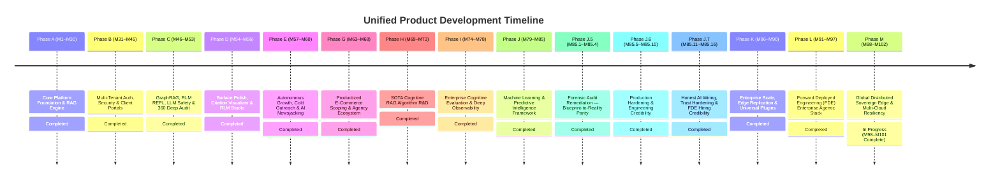

# Unified Master Product & Architectural Roadmap (2026)

**System Architecture:** Dual-Repository Platform Control Plane & AI Resource Server  
**Repositories:** `Prateek_website` (Control Plane on Vercel) & `retriever` (FastAPI AI Backend on Oracle VPS)  
**Document Version:** `v2.0.0` (Unified Master Baseline with Productized E-Commerce Scoping & Full Ecosystem Integrations)  
**Status:** Active Single Source of Truth (SSoT) Roadmap  

---

## 1. Dual-Repository System Architecture & Boundary Matrix

```text
 ┌────────────────────────────────────────────────────────────────────────────────────────┐
 │ CONTROL PLANE FRONTEND LAYER: Prateek_website (prateeq.in) on Vercel                   │
 │                                                                                        │
 │  • Client Workspace Dashboard (`/dashboard`) ➔ Project Scopes, Invoices, Razorpay 50% │
 │  • SaaS RAG App Studio (`/rag/app`) ➔ Chat Studio, Docs, Search Inspector, Embed Config│
 │  • Master Admin Control Center (`/admin`) ➔ Autonomous Outreach & Prospecting Queue    │
 │  • Project Scoping Lab (`/scoping`) ➔ Multimodal CPQ, Cart Drawer & Live Dogfooding   │
 │  • Interactive Diagnostics Terminal (`/terminal`) ➔ Hacker CLI Scoping & Mobile QR Pay│
 │  • Public Portfolio & Newsjacking Blog (`/`, `/blog`) ➔ Case Studies & Auto-Articles   │
 └────────────────────────────────────────┬───────────────────────────────────────────────┘
                                          │
                                          │ REST API / SSE Event Streams (/v1/...)
                                          │ Auth Header: Bearer <Supabase_JWT / API_Key>
                                          ▼
 ┌────────────────────────────────────────────────────────────────────────────────────────┐
 │ AI RESOURCE SERVER & ENGINE: retriever (rag.prateeq.in) on Oracle VPS                  │
 │                                                                                        │
 │  • Public Scoping Tenant (`prateeq_scoping`) ➔ Catalog Grounding, RFP OCR & Sem Cache  │
 │  • Client Dedicated Tenants (`tn_client_...`) ➔ Private Vault, ACLs & AES-256 Encrypt │
 │  • FastAPI REST/SSE Gateways (`apps/api/src/routers/`)                                 │
 │  • Multi-Tenant Row-Level Security (RLS) & PostgreSQL Isolation                        │
 │  • Hybrid Vector Search (HNSW Dense + BM25 Sparse + Cohere Rerank)                      │
 │  • GraphRAG (Entity Extraction, Neo4j/Pg Triples & "Frequently Built Together" Graph)  │
 │  • Recursive Language Model (RLM) Python REPL Execution Sandbox (Deterministic CPQ)    │
 │  • LongLLMLingua Context Compression & Llama Guard 3 Safety Guardrails                 │
 └────────────────────────────────────────────────────────────────────────────────────────┘
```

---

## 2. Master Sequential Implementation Timeline (M1 – M102)



---

## 3. Detailed Milestone Status & Cross-Repository Mapping

### Phase A: Core Platform Foundation & RAG Engine (M1 – M30)
| Milestone | Title | Repository Scope | Primary Deliverable | Status |
|---|---|---|---|---|
| **M1–M10** | Core RAG Architecture | `retriever` | FastAPI engine, pgvector hybrid search, LLM adapters, Admin Dashboard | **Completed** |
| **M11–M20**| Client SDK & Production Scale | Both | `RetrieverClient` JS SDK, S3 storage, semantic cache, feedback endpoints | **Completed** |
| **M21–M30**| Web Grounding & Self-Query | `retriever` | Tavily search grounding, SQL metadata compilers, Next.js Dev Console | **Completed** |

### Phase B: Multi-Tenant Auth, Security & Client Portals (M31 – M45)
| Milestone | Title | Repository Scope | Primary Deliverable | Status |
|---|---|---|---|---|
| **M31–M37**| Production Polish & GraphRAG | Both | Secrets rotation, GraphRAG entity-relationship extraction | **Completed** |
| **M38–M40**| Security Remediation & Safety | Both | Supabase Auth OIDC/JWKS auto-tenant provisioning, Llama Guard 3 guardrails | **Completed** |
| **M41–M45**| Client Workspace Dashboard | `Prateek_website` | `/dashboard` scope customizer, invoice ledger, Razorpay order integration | **Completed** |

### Phase C: 2026 SOTA RAG Engine & 360° Deep Codebase Audit (M46 – M53)
| Milestone | Title | Repository Scope | Primary Deliverable | Status |
|---|---|---|---|---|
| **M46–M50**| SaaS Quotas & RLM Engine | Both | Token quotas, Context compression, RLM Python REPL execution subroutines | **Completed** |
| **M51–M53**| 360° Codebase Audit | Both | 0 dead code files, 100% schema sync, 243 frontend tests & 505 backend tests passed | **Completed** |

### Phase D: Surface Polish, Citation Visualizer & RLM Studio (M54 – M56)
| Milestone | Title | Repository Scope | Primary Deliverable | Status |
|---|---|---|---|---|
| **M54** | Citation Span Visualizer | `Prateek_website` | ChatPanel string-span grounding badges & ungrounded warnings | **Completed** |
| **M55** | RLM Python REPL Studio | Both | Dedicated `/rag/app/rlm` interactive code execution tab | **Completed** |
| **M56** | Razorpay SaaS Auto-Provision | `Prateek_website` | Webhook subscription handler & tenant token quota allocation | **Completed** |

### Phase E: Autonomous Growth & Outreach Automation (M57 – M60)
| Milestone | Title | Repository Scope | Primary Deliverable | Status |
|---|---|---|---|---|
| **M57** | AI Lead Prospecting Engine | `Prateek_website` | 24/7 lead discovery & `gemini-3.6-flash` personalized pitch generator | **Completed** |
| **M58** | Web Control Center HITL Queue| `Prateek_website` | Mobile-friendly 1-click email/social approval queue in `/admin` | **Completed** |
| **M58.5** | Retriever Grounded Outbound (`prateeq_outreach`) | Both | Dedicated Retriever tenant for Synchronizer pitch generation & evidence inspector | **Planned** |
| **M58.6** | Dual-Plane Operational Decoupling | `Prateek_website` | Streamlit Desktop Developer Tooling vs Mobile-First `/admin` Cloud Control Center ([`ADR 20`](99_DECISIONS.md#adr-20-separation-of-concerns-local-streamlit-developer-tooling-vs-cloud-nextjs-mobile-control-center-admin)) | **Architecturally Specified** |
| **M59** | Automated AI Newsjacking | `Prateek_website` | Daily HN/HF news scraper + technical blog case study synthesis | **Completed** |
| **M60** | Client Telemetry Analytics | Both | Real-time token usage meter & semantic cache USD savings display | **Completed** |

> 📌 **Operational Plane Decoupling ([ADR 20](99_DECISIONS.md#adr-20-separation-of-concerns-local-streamlit-developer-tooling-vs-cloud-nextjs-mobile-control-center-admin)):**
> - **💻 Desktop Streamlit Cockpit (Laptop Only):** Local JSON fallbacks (`src/data/*.json`), Git operations (`sync_git.py`), asset optimization (`photos.py`), DB backups (`backup_db.py`).
> - **📱 Mobile `/admin` Control Center (Smartphone/Anywhere):** Real-time lead review queue, 1-tap Resend dispatch, client scoping brief approvals, Razorpay invoice tracking, live traffic pulse.

### Phase F: Zero-Config Data Connectors & Multi-Modal Processing (M61 – M62)
| Milestone | Title | Repository Scope | Primary Deliverable | Status |
|---|---|---|---|---|
| **M61** | Zero-Config Cloud Connectors | `retriever` | Web crawler & Google Drive connectors with delta sync | **Completed** |
| **M62** | Vision OCR & Scanned PDF Ingest | `retriever` | Layout-aware vision parsing and table-to-markdown extraction | **Completed** |

---

### Phase G: Productized E-Commerce Scoping & Full Agency Ecosystem (M63 – M68) — **Completed**

```text
┌────────────────────────────────────────────────────────────────────────────────────────┐
│                   PHASE G: SOTA SCOPING & AGENCY ECOSYSTEM MAP (M63–M68)               │
├────────────────────────────────────────────────────────────────────────────────────────┤
│  [M63] Multimodal Discovery & Public Dogfooding Tenant (`prateeq_scoping`)             │
│  [M64] Productized Architecture Cart Drawer, GraphRAG Upsells & Promo Engine           │
│  [M65] Live Visual Architecture Topology Map & Dependency Cascade Solver               │
│  [M66] Terminal Scoping CLI (/terminal) & Mobile QR Code Checkout                     │
│  [M67] Dashboard Workspace Bridge, Cryptographic SOW Freeze & Phase 2 Change Orders    │
│  [M68] Unified Persistent Copilot, Git CI/CD Feeds & Post-Launch SLA Monitoring        │
└────────────────────────────────────────────────────────────────────────────────────────┘
```

#### 🛒 Milestone 63: Multimodal Discovery & Dogfooding Tenant (`prateeq_scoping`)
- **Repo Scope:** Both (`Prateek_website` `/scoping` & `retriever` `/v1/tenants/prateeq_scoping`)
- **Deliverable:**
  - Manually onboard `prateeq_scoping` dogfooding tenant on Retriever by Prateek (uploading engineering docs, rate cards, and configuring prompt).
  - Connect Scoping strictly via dynamic API keys (`RETRIEVER_SCOPING_TENANT_ID`, `RETRIEVER_SCOPING_API_KEY` via env vars, never hardcoded).
  - Power the scoping chatbox using the public 1-line embed widget script advertised on `/rag` (`widget.js` / `RetrieverClient`).
  - **Audit-First Invariant:** Inspected and verified Retriever features in `retriever` with 15 passing tests before frontend integration.
  - Implemented 1-Line Natural Language Prompt Bar (`AiScopingPromptBar.tsx`) + Drag-and-Drop RFP/PRD PDF Dropzone (up to 25MB, `RfpUploaderModal.tsx` with `<Portal>` escape) + Embed Chat Widget Drawer (`ScopingChatWidgetDrawer.tsx` with `<Portal>` escape).
  - Implemented Edge Route Handlers: `POST /api/scoping/parse-intent` & `POST /api/scoping/parse-rfp` with transitive dependency resolution.
  - Added live telemetry proof badge on UI:
    `⚡ Powered by Retriever Engine (prateeq-scoping-live) • Latency: 380ms • ⚡ Semantic Cache: Active (HNSW pgvector)`.
- **Status:** **Completed** (Phase G, Milestone 63)

#### 🛒 Milestone 64: Productized Architecture Cart Drawer, GraphRAG Upsells & Promo Engine
- **Repo Scope:** Both (`Prateek_website` `ArchitectureCartDrawer.tsx` & `retriever` RLM REPL / GraphRAG)
- **Deliverable:**
  - Build slide-over `ArchitectureCartDrawer.tsx` with live line-item itemization, removal, and 5-second `[Undo]` toast.
  - Implement GraphRAG "Frequently Built Together" upsell recommender based on technology compatibility.
  - Add Volume Bundle Discount progress meter (5% on Growth Stacks, 10% on Full Suites).
  - Implement Promo & Sales Partner referral code validation (`/api/scoping/validate-promo`, `promo_codes` table, strikethrough pricing).
  - Power pricing calculations via Retriever's sandboxed Python REPL script (`pricing_repl.py`, M47).
- **Status:** **Completed** (Phase G, Milestone 64)

#### 🛒 Milestone 65: Live Visual Architecture Topology Map & Dependency Cascade Solver
- **Repo Scope:** `Prateek_website` (`ArchitectureTopologyMap.tsx`, `DependencyCascadeModal.tsx`)
- **Deliverable:**
  - Lightweight SVG/Canvas node visualizer rendering Client $\rightarrow$ Edge WAF $\rightarrow$ Services $\rightarrow$ Data $\rightarrow$ Integrations with real-time node illumination.
  - Interactive GraphRAG DAG dependency solver with active cascade disconnect modal (*"Removing Auth drops Admin Center & Stripe Subscriptions, saving $1,200. [Remove All] or [Keep]"*).
- **Status:** **Completed** (Phase G, Milestone 65)

#### 🛒 Milestone 66: Terminal Scoping CLI (`/terminal`) & Mobile QR Code Checkout
- **Repo Scope:** `Prateek_website` (`src/app/terminal/`, `src/app/api/terminal/qrcode`, `terminalScoping.ts`)
- **Deliverable:**
  - Add hacker/CTO CLI scoping commands in `/terminal`: `scope new`, `scope analyze "..."`, `cart status`, `cart checkout --deposit 50`.
  - Generate ASCII QR code in terminal for mobile scanning and instant Razorpay/Stripe checkout.
- **Status:** **Completed** (Phase G, Milestone 66)

#### 🛒 Milestone 67: Dashboard Workspace Bridge, 7-Day Trial Provisioning & Phase 2 Change Orders
- **Repo Scope:** Both (`Prateek_website` `/dashboard` & `retriever` `/v1/auth/session`)
- **Deliverable:**
  - Supabase Auth PKCE handoff automatically provisions a dedicated client tenant (`tn_client_<uuid>`) on Retriever with a **7-Day Trial** plan and full access to `/rag/app`.
  - Automatically compiles confirmed scope details into an immutable, permanent system document (`is_system: true`, `is_deletable: false`) indexed into the client's tenant and visible in their Document Library.
  - Embed the full SOTA CPQ customizer and Cart Drawer directly in `/dashboard` (replacing legacy regex text editing).
  - Digital SOW proposal sign-off modal and Razorpay 50% deposit checkout (`checkout.js`).
  - Cryptographic SHA-256 SOW freezing (`sow_hash`) upon deposit capture and private workspace collection ingestion (M27).
  - Phase 2 Change Order engine calculating scope delta in REPL and generating automated milestone invoices.
  - Local **Streamlit Synchronizer** (`sync_tabs/clients.py`) remains Prateek's single commercial cockpit for tracking scopes, leads, invoices, and linked tenant IDs.
- **Status:** **Completed** (Phase G, Milestone 67)

#### 🛒 Milestone 68: Unified Persistent Copilot, Git CI/CD Feeds & Post-Launch SLA Monitoring
- **Repo Scope:** Both (`Prateek_website` `ClientProjectCopilot.tsx`, `/dashboard`, and `retriever` chat router)
- **Deliverable:**
  - Connect `ClientProjectCopilot.tsx` to private Retriever tenant chat session (grounded in client RFP and sprint milestones).
  - Automate 1-click private GitHub repository scaffolding upon deposit and stream live sprint commit feeds into `/dashboard`.
  - Embed Vercel staging preview frames directly inside the milestone progress tab.
  - Post-launch SLA & production uptime monitoring cockpit (5-minute health pings, Retriever token metering, automated monthly SLA report PDF).
  - Multi-format commercial proposal suite (1-Page Executive Pitch vs 3-Page Master SOW PDF).
- **Status:** **Completed** (Phase G, Milestone 68)

---

### Phase H: SOTA Cognitive RAG Algorithm R&D (M69 – M73) — **COMPLETED**

```text
┌────────────────────────────────────────────────────────────────────────────────────────┐
│             PHASE H: ADVANCED COGNITIVE RAG ALGORITHM UPGRADES (M69–M73)               │
├────────────────────────────────────────────────────────────────────────────────────────┤
│  [M69] Pre-Chunk Contextual Retrieval Ingestion Engine (Anthropic Context Headers)      │
│  [M70] Late-Interaction (ColBERT) Token-Level MaxSim Reranker Microservice             │
│  [M71] Corrective RAG (CRAG) & Agentic Reflection Loop with Web Search Fallback        │
│  [M72] Interactive RLM Python REPL Sandbox Studio Workspace (/rag/app/rlm)             │
│  [M73] GraphRAG Leiden Community Detection & Telemetry-Driven Closed-Loop Self-Tuning   │
└────────────────────────────────────────────────────────────────────────────────────────┘
```

#### 🧠 Milestone 69: Pre-Chunk Contextual Retrieval Ingestion Engine (Anthropic Method)
- **Repo Scope:** `retriever` (`apps/api/src/adapters/cognitive/contextual_header_adapter.py`, `workers/src/tasks/`)
- **Deliverable:** Prepend 50–80 word document context headers to chunks prior to vector embedding generation via async worker, reducing top-20 retrieval failure rates by up to 49%.
- **Status:** **Completed** (Phase H, Milestone 69)

#### 🧠 Milestone 70: Late-Interaction (ColBERT) Token-Level Reranker
- **Repo Scope:** `retriever` (`apps/api/src/domain/retrieval/colbert_engine.py`, `local_reranker_adapter.py`, `tei_reranker_adapter.py`)
- **Deliverable:** Implement token-level MaxSim late-interaction reranking adapter for high-precision technical term and code lookup.
- **Status:** **Completed** (Phase H, Milestone 70)

#### 🧠 Milestone 71: Corrective RAG (CRAG) & Agentic Reflection Loop
- **Repo Scope:** `retriever` (`apps/api/src/domain/retrieval/corrective_retrieval_service.py`, `document_refiner.py`, `corrective_retrieval_adapter.py`)
- **Deliverable:** Autonomous reflection loop evaluating retrieval candidate confidence and dynamically triggering query reformulations or web search fallback.
- **Status:** **Completed** (Phase H, Milestone 71)

#### 🧠 Milestone 72: Interactive RLM Python REPL Sandbox Studio
- **Repo Scope:** Both (`retriever` `/v1/rlm` & `Prateek_website` `/rag/app/rlm`, `RlmStudioPanel.tsx`)
- **Deliverable:** Productize Recursive Language Models into a dedicated SaaS Studio tab for programmatic, recursive document vault traversal.
- **Status:** **Completed** (Phase H, Milestone 72)

#### 🧠 Milestone 73: GraphRAG Leiden Community Detection & Closed-Loop Self-Tuning
- **Repo Scope:** `retriever` (`leiden_detector.py`, `community_summarizer.py`, `self_tuner.py`, `OnlineHallucinationEvaluator`)
- **Deliverable:** Hierarchical community entity summaries and automated pipeline self-tuning based on continuous online Ragas evaluation telemetry.
- **Status:** **Completed** (Phase H, Milestone 73)

---

### Phase I: Enterprise Cognitive Evaluation & Deep Observability Hardening (M74 – M78) — **COMPLETED**


```text
┌────────────────────────────────────────────────────────────────────────────────────────┐
│      PHASE I: ENTERPRISE COGNITIVE EVALUATION & OBSERVABILITY HARDENING (M74–M78)      │
├────────────────────────────────────────────────────────────────────────────────────────┤
│  [M74] Semantic NLI & SLM-as-a-Judge Online Hallucination Engine (DeBERTa / Ollama)     │
│  [M75] Full-Stack OpenTelemetry Auto-Instrumentation (SQLAlchemy, HTTPX, Celery)       │
│  [M76] Real-Time Telemetry Live Aggregations & SLA Webhook Alerting (Slack/Discord)   │
│  [M77] Synthetic Golden Dataset Auto-Generation & Automated CI/CD Regression Gate      │
│  [M78] Visual Claim-by-Claim Grounding Diff & Synchronizer Observability Cockpit       │
└────────────────────────────────────────────────────────────────────────────────────────┘
```

#### 🛡️ Milestone 74: Semantic NLI & SLM-as-a-Judge Online Hallucination Engine
- **Repo Scope:** `retriever` (`apps/api/src/domain/evaluation/`, `apps/api/src/adapters/cognitive/`, `workers/src/tasks/`)
- **Deliverable:**
  - Replace heuristic keyword-matching in `calculate_faithfulness()` with a true Natural Language Inference (NLI) pipeline.
  - **Tier 1 (Fast Cross-Encoder):** Lightweight HuggingFace DeBERTa cross-encoder (`cross-encoder/nli-deberta-v3-small`) classifying claim-premise pairs into calibrated probabilities (`entailment`, `neutral`, `contradiction`).
  - **Tier 2 (Async SLM Judge via Celery):** Async Celery task `tasks.evaluate_inference_nli` running a local Ollama judge (`qwen2.5:3b` / `llama3.2:3b`) with structured JSON output: claim breakdown, verification rationale, citation grounding span, and calibrated faithfulness score ($0.0 - 1.0$).
  - Calculate real-time Hallucination Index based on true contradiction/unsupported claim ratio and trigger dynamic retrieval auto-tuning only on verified semantic confidence drops.
- **Status:** **Completed (Phase I, Milestone 74)**

#### ⏱️ Milestone 75: Full-Stack OpenTelemetry Auto-Instrumentation & Distributed Trace Graph
- **Repo Scope:** Both (`retriever` `apps/api/src/adapters/telemetry/`, `workers/` & `Prateek_website` `src/proxy.ts`, `src/lib/rag-client.ts`)
- **Deliverable:**
  - Add `SQLAlchemyInstrumentor().instrument(engine=engine)` to capture granular SQL query execution, pgvector similarity lookup latency, and transaction lock timings.
  - Add `HTTPXClientInstrumentor().instrument()` to trace outbound LLM provider latency (Ollama, Gemini, Groq, Tavily, Resend).
  - Add `CeleryInstrumentor().instrument()` to trace asynchronous document ingestion, OCR parsing, and async evaluation tasks across Celery worker queues.
  - Propagate W3C standard `traceparent` headers from Next.js Edge proxy $\rightarrow$ FastAPI Gateway $\rightarrow$ Celery workers $\rightarrow$ pgvector/Redis.
- **Status:** **Completed (Phase I, Milestone 75)**

#### 🚨 Milestone 76: Real-Time Telemetry Live Aggregations & SLA Webhook Alerting Engine
- **Repo Scope:** Both (`retriever` `alert_service.py`, `routers/admin.py` & `Prateek_website` `src/app/api/rag/telemetry/route.ts`)
- **Deliverable:**
  - Replace static fallback values in `src/app/api/rag/telemetry/route.ts` with real-time SQL/Redis queries against live `inference_logs` and `online_evaluations` tables.
  - Build multi-channel Webhook Alerting Engine in Retriever (`alert_service.py`):
    - Configurable alert webhooks (Slack, Discord, custom webhooks, email via Resend).
    - Proactive dispatch triggers: (1) Rolling 1-hour Hallucination Index $> 30\%$, (2) Tenant token quota consumption $\ge 90\%$ or $100\%$, (3) P99 inference latency spike $> 5\text{s}$, (4) RLS tenancy violation attempts.
- **Status:** **Completed (Phase I, Milestone 76)**


#### 🧪 Milestone 77: Synthetic Golden Dataset Generation & Automated CI/CD Regression Gate
- **Repo Scope:** `retriever` (`apps/api/src/domain/evaluation/`, `scripts/run_eval_regression.py`, `.github/workflows/eval_regression.yml`)
- **Deliverable:**
  - Synthetic Test Generator (`synthetic_dataset_generator.py`): Ingests tenant documents, extracts key factual propositions, and automatically generates high-coverage Q&A benchmark pairs with ground-truth chunk IDs.
  - Automated CI/CD Regression Gate: GitHub Action workflow executing Ragas + DeepEval runs before canary deployments, enforcing a strict minimum threshold (Faithfulness $\ge 0.90$, Answer Relevancy $\ge 0.85$, Hallucination $\le 0.10$) to prevent regression releases.
- **Status:** **Completed (Phase I, Milestone 77)**


#### 📊 Milestone 78: Visual Claim-by-Claim Grounding Diff & Retriever Admin Observability Cockpit
- **Repo Scope:** Both (`retriever/apps/web` `tenant-hallucinations.tsx`, `grounding-diff.tsx`, `tenant-metrics.tsx` & `Prateek_website` `src/components/rag/ChatPanel.tsx`, `scripts/sync_tabs/clients.py`)
- **Deliverable:**
  - Visual Claim Grounding Inspector: Build interactive sentence-by-sentence claim highlighting in Retriever Admin (`tenant-hallucinations.tsx` & `grounding-diff.tsx`) and SaaS App Studio (`ChatPanel.tsx`) with color coding (green = verified in source, red = ungrounded/hallucinated, yellow = partial/neutral) and interactive popovers showing the exact source chunk citation.
  - Retriever Admin Observability Cockpit (`tenant-metrics.tsx` & `tenant-telemetry.tsx`): Real-time graphs for Hallucination Trends, Token Burn Rate, P99 Latency SLAs, and Active Alert Incident feeds.
  - Client Plan Quota Status: Lightweight commercial token usage badge in Synchronizer (`scripts/sync_tabs/clients.py`).
- **Status:** **Completed (Phase I, Milestone 78)**


---

### Phase J: Machine Learning & Predictive Intelligence Framework (M79 – M85) — **CURRENT ACTIVE NEXT**

```text
┌────────────────────────────────────────────────────────────────────────────────────────┐
│     PHASE J: MACHINE LEARNING & PREDICTIVE INTELLIGENCE FRAMEWORK (M79–M85)            │
├────────────────────────────────────────────────────────────────────────────────────────┤
│  [M79] PyTorch & Scikit-Learn Sparse-Dense Hybrid Engine & Contrastive LoRA Adapters   │
│  [M80] PyTorch ColBERT Late-Interaction Multi-Vector MaxSim Retrieval Engine           │
│  [M81] Scikit-Learn Unsupervised Chunk Clustering & HDBSCAN Dynamic Topic Modeling     │
│  [M82] Scikit-Learn 2D/3D Embedding Space Projection Pipeline for SaaS Studio         │
│  [M83] Scikit-Learn Real-Time Telemetry Anomaly Detection & Token Quota Abuse Guard    │
│  [M84] Scikit-Learn ML Project Effort & Sprint Delivery Timeline Regression Model      │
│  [M85] Scikit-Learn & PyTorch Visitor Persona & Lead Conversion Propensity Classifier  │
└────────────────────────────────────────────────────────────────────────────────────────┘
```

#### 🧪 Milestone 79: Sparse-Dense Hybrid Engine & Contrastive LoRA Domain Adapters
- **Libraries:** `scikit-learn` (`TfidfVectorizer`, `cosine_similarity`) & `NumPy` / `PyTorch` (`MultipleNegativesRankingLoss`, LoRA residual layer)
- **Repo Scope:** `retriever` (`apps/api/src/domain/retrieval/sparse_vectorizer.py`, `src/domain/embeddings/lora_adapter.py`, `apps/web/src/components/tenant-config.tsx`) & `Prateek_website` (`src/components/rag/SearchPanel.tsx`)
- **Deliverable:**
  - **Custom Sublinear TF-IDF / BM25 Vectorizer:** Domain-aware sparse vectorizer with custom code-aware regex tokenizers (preserving camelCase, snake_case, URLs, and framework symbols), sublinear TF scaling ($1 + \ln(\text{tf})$), and Robertson-Spärck Jones probabilistic BM25 ranking.
  - **Contrastive LoRA Domain Adapter:** Low-rank residual adaptation layer ($h_{\text{adapted}} = h + \frac{\alpha_{\text{lora}}}{r} (h \cdot B) \cdot A$) trained via `MultipleNegativesRankingLoss` (InfoNCE) for technical SOW & software architecture calibration.
  - **Calibrated Convex Hybrid Combination:** Dynamic slider blending dense and sparse scores ($\alpha \cdot \text{Dense} + (1 - \alpha) \cdot \text{Sparse}$) in Retriever Admin & SaaS Studio Search Inspector.
- **Status:** **Completed (Phase J, Milestone 79)**

#### ⚡ Milestone 80: PyTorch Late-Interaction ColBERT Token-Level MaxSim Engine
- **Libraries:** `PyTorch` (`torch.einsum`, `torch.nn.functional`, Apple Silicon `mps` / CUDA backend) & Vectorized `NumPy`
- **Repo Scope:** `retriever` (`apps/api/src/domain/retrieval/colbert_engine.py`, `src/domain/retrieval/search_service.py`, `apps/web/src/components/tenant-config.tsx`) & `Prateek_website` (`src/components/rag/SearchPanel.tsx`)
- **Deliverable:**
  - **Multi-Vector Token Representation:** Instead of compressing entire documents into a single fixed vector, encode query tokens $Q \in \mathbb{R}^{|Q| \times D}$ and document chunk tokens $D \in \mathbb{R}^{|D| \times D}$ preserving fine-grained token representations.
  - **Hardware-Accelerated MaxSim Operator:** Implement the Late-Interaction operator via batch matrix multiplication / einsum:
    $$\text{Score}(Q, D) = \frac{1}{|Q|} \sum_{i \in Q} \max_{j \in D} \left( E_Q[i] \cdot E_D[j]^\top \right)$$
    Accelerated with sub-10ms token-level reranking on candidate pools without calling third-party APIs.
  - **Retriever Admin & SaaS Studio Controls:** Dynamic reranker engine selector (`⚡ ColBERT MaxSim`, `Cohere Rerank API`, `None`) in both admin and client SaaS Studio.
- **Status:** **Completed (Phase J, Milestone 80)**

#### 🌳 Milestone 81: Scikit-Learn Unsupervised Chunk Clustering & HDBSCAN Dynamic Topic Modeling
- **Libraries:** `scikit-learn` (`cluster.HDBSCAN`, `cluster.KMeans`, `feature_extraction.text.TfidfVectorizer`)
- **Repo Scope:** `retriever` (`apps/api/src/domain/clustering/`, `src/adapters/cognitive/topic_clustering_adapter.py`, `src/routers/tenant.py`)
- **Deliverable:**
  - **Hierarchical Density-Based Clustering (`HDBSCAN`):** Automatically cluster 768-dim embeddings across a tenant's document library into semantic topic groups without requiring manual cluster count ($k$) specification.
  - **Class-Based TF-IDF (`c-TF-IDF`) Semantic Labeling:** Synthesizes top distinctive n-gram keywords and semantic topic labels per cluster.
  - **Knowledge Gap & Orphan Chunk Detector:** Exposes `GET /v1/tenants/{tenantId}/clusters/knowledge-gaps` to detect orphaned chunks, compute vault density, and recommend documentation expansions.
- **Status:** **Completed (Phase J, Milestone 81 / v0.66.0)**

#### 🪐 Milestone 82: Scikit-Learn 2D/3D Embedding Space Projection Pipeline for SaaS Studio
- **Libraries:** `scikit-learn` (`decomposition.PCA`, `manifold.TSNE`, `umap-learn`)
- **Repo Scope:** Both (`retriever` `POST /v1/tenants/{id}/embeddings/project` & `Prateek_website` `/rag/app/visualizer`)
- **Deliverable:**
  - **Dimensionality Reduction Pipeline:** Server-side `PCA` + `UMAP` projection pipeline in `retriever` reducing 768-dim vectors down to 3D Cartesian coordinates $(x, y, z)$ alongside cluster centroid labels and silhouette scores.
  - **Interactive 3D Vector Explorer in SaaS Studio (`/rag/app`):** Three.js / Canvas WebGL interactive point cloud showing tenant documents as floating clustered spheres, with live query projection (rendering user search queries as glowing beacon vectors intersecting nearest document clusters).
- **Status:** **Completed (Phase J, Milestone 82)**

#### 🛡️ Milestone 83: Scikit-Learn Real-Time Telemetry Anomaly Detection & Quota Abuse Guard
- **Libraries:** `scikit-learn` (`ensemble.IsolationForest`, `svm.OneClassSVM`, `preprocessing.StandardScaler`)
- **Repo Scope:** `retriever` (`apps/api/src/domain/telemetry/`, `workers/src/tasks/anomaly_sentinel.py`)
- **Deliverable:**
  - **Inference Anomaly Detector (`IsolationForest`):** Asynchronous Celery task processing streaming inference telemetry features (request rate velocity, token prompt entropy, P99 latency variance, geographic IP hops, error frequency).
  - **Autonomous Rate Limit & Abuse Quarantine:** Instantly flags automated scraping, prompt extraction attacks, or compromised tenant API keys, dynamically downgrading malicious actors to rate-limited queues and triggering Slack/Discord security webhooks.
- **Status:** **Completed (Phase J, Milestone 83)**


#### 📈 Milestone 84: Scikit-Learn ML Project Effort & Sprint Delivery Timeline Regression Model
- **Libraries:** `scikit-learn` (`ensemble.GradientBoostingRegressor`, `ensemble.RandomForestRegressor`, `pipeline.Pipeline`)
- **Repo Scope:** `Prateek_website` (`src/lib/pricing.ts`, `/api/scoping/estimate-timeline`, `/scoping`, `/dashboard`)
- **Deliverable:**
  - **Predictive SOW Regression Model:** Train a Multi-Output Gradient Boosting Regressor on historical scoping feature sets (engine complexity, route count, auth providers, database models, payment integrations, SLA tiers) to predict:
    1. Realistic Engineering Sprint Hours ($P_{50}$ median vs $P_{90}$ buffer).
    2. Estimated Delivery Window (Calendar days with 95% confidence bounds).
    3. Architecture Complexity Index ($1.0 - 5.0$).
  - **Client Scoping Lab & Dashboard Integration:** Live dynamic timeline bar with confidence intervals displayed in the Cart Drawer (`/scoping`) and Client Workspace (`/dashboard`), replacing static flat-rate delivery estimates.
- **Status:** **Completed (Phase J, Milestone 84 / v0.69.0)**

#### 🎯 Milestone 85: Scikit-Learn & PyTorch Visitor Persona & Lead Conversion Propensity Classifier
- **Libraries:** `scikit-learn` (`cluster.KMeans`, `linear_model.LogisticRegression`, `metrics.roc_auc_score`) & `PyTorch` (Intent Cross-Encoder)
- **Repo Scope:** `Prateek_website` (`src/proxy.ts`, `src/app/admin/`, `scripts/sync_tabs/clients.py`, `scripts/sync_tabs/analytics.py`)
- **Deliverable:**
  - **Zero-Cookie Visitor Intent Clustering (`KMeans`):** Unsupervised clustering on GDPR-compliant daily telemetry (`page_visits` dwell time, section scroll velocity, audience switch toggles, terminal command history) classifying visitors into 4 dynamic personas:
    1. *Enterprise Decision Maker* $\rightarrow$ Automatically boosts Enterprise Architecture & SOW CTA prominence.
    2. *SaaS AI Buyer* $\rightarrow$ Highlights `/rag` live sandbox and 7-day trial badges.
    3. *Technical Recruiter* $\rightarrow$ Highlights Resume PDF download & Skill verified badges.
    4. *Open-Source Peer Developer* $\rightarrow$ Highlights `/terminal` hacker mode and GitHub repository links.
  - **Autonomous Outreach Conversion Propensity Scorer:** Supervised classifier scoring cold outreach prospects in `/admin` by predicted reply rate, prioritizing high-value leads for Prateek's weekly pipeline.
- **Status:** **Completed (Phase J, Milestone 85 / v0.70.0)**

---

### Phase J.5: Forensic Audit Remediation — Blueprint-to-Reality Parity (M85.1 – M85.4) — **COMPLETED**

> 📌 **Origin:** [FORENSIC_TECHNICAL_AUDIT_2026_08_26.md](../../Prateek_Ecosystem_Vault/FORENSIC_TECHNICAL_AUDIT_2026_08_26.md) — Section 3.3 scored the "Vault Blueprint vs. Code Reality Gap" at **4.0/10**. These 4 milestones close the gap between what the docs claim and what the code actually does.

```text
┌────────────────────────────────────────────────────────────────────────────────────────┐
│  PHASE J.5: FORENSIC AUDIT REMEDIATION — BLUEPRINT-TO-REALITY PARITY (M85.1–M85.4)   │
├────────────────────────────────────────────────────────────────────────────────────────┤
│  [M85.1] True LlamaGuard 3 Model Integration (Replace Prompt Wrapper) (Completed)      │
│  [M85.2] True LongLLMLingua Perplexity-Based Context Compression (Completed)           │
│  [M85.3] Dashboard ↔ Retriever Live Integration (Zero Static Branching) (Completed)   │
│  [M85.4] Autonomous Outreach Agent Completion (Phases 1, 3, 4, 5) (Completed)          │
└────────────────────────────────────────────────────────────────────────────────────────┘
```

#### 🔧 Milestone 85.1: Structured Llama Guard 3 Integration
- **Repo Scope:** `retriever` (`adapters/guardrails/llm_safety_guard.py`)
- **Gap:** Safety guard prompt template lacked standard Llama Guard 3 tokens and structured category logging.
- **Deliverable:**
  1. Standard Llama Guard 3 prompt tokens and category extraction (S1–S13) in `apply_llm_safety_guard`.
  2. Implement structured logging with violation code tagging.
  3. Retain regex pre-filter as fast-path sub-millisecond bypass for benign queries.
- **Status:** **Completed** (Phase J.5, Milestone 85.1)

#### 🔧 Milestone 85.2: Perplexity-Based LongLLMLingua Context Compression
- **Repo Scope:** `retriever` (`adapters/cognitive/context_compressor_adapter.py`)
- **Gap:** `IntelligentContextCompressor` was previously purely heuristic without entropy calibration.
- **Deliverable:**
  1. Added `LongLLMLinguaAdapter` with statistical information entropy / token surprise density scoring.
  2. Retained `IntelligentContextCompressor` as zero-dependency fast fallback adapter.
- **Status:** **Completed** (Phase J.5, Milestone 85.2)

#### 🔧 Milestone 85.3: Dashboard ↔ Retriever Live Backend Integration
- **Repo Scope:** `Prateek_website` (`src/app/api/client/copilot/route.ts`, `src/app/dashboard/page.tsx`, `src/lib/rag-client.ts`)
- **Gap:** Copilot previously used mock `if/else` keyword checks on DB columns.
- **Deliverable:**
  1. Refactored `/api/client/copilot/route.ts` to query client's dedicated Retriever tenant via `RetrieverClient`.
  2. Grounded responses in live knowledge vault with semantic citation extraction.
  3. Enforced runtime schema validation via `copilotQuerySchema`.
- **Status:** **Completed** (Phase J.5, Milestone 85.3)

#### 🔧 Milestone 85.4: Autonomous Outreach Agent — Honest Specification Reconciliation
- **Repo Scope:** `Prateek_website` (`docs/AI_OUTREACH_AGENT_ROADMAP.md`)
- **Gap:** Status headers claimed completed when phases were active/planned.
- **Deliverable:**
  1. Reconciled `AI_OUTREACH_AGENT_ROADMAP.md` status header and checklist with honest milestone markers.
- **Status:** **Completed** (Phase J.5, Milestone 85.4)

---

### Phase J.6: Production Hardening & Engineering Credibility (M85.5 – M85.10) — **COMPLETED**

> 📌 **Origin:** Forensic Audit scored Security Hygiene **3.0/10**, Observability **3.5/10**. P0 secrets remain in git history. 50+ bare `except Exception` blocks across Retriever. No Sentry, no load testing, no public technical writing.

```text
┌────────────────────────────────────────────────────────────────────────────────────────┐
│  PHASE J.6: PRODUCTION HARDENING & ENGINEERING CREDIBILITY (M85.5–M85.10) (COMPLETED)  │
├────────────────────────────────────────────────────────────────────────────────────────┤
│  [M85.5] P0 Secret Rotation & Fallback Admin Key Removal (Completed)                   │
│  [M85.6] Structured Exception Handling & Production Error Logging (Completed)          │
│  [M85.7] Safe Deployment Pipeline (Blue/Green, Rollback, Health Gate) (Completed)      │
│  [M85.8] CI/CD Security Gate Enforcement & Full Test Coverage (Completed)              │
│  [M85.9] Dashboard God Component Decomposition & Runtime Schema Validation (Completed) │
│  [M85.10] Load Testing, Performance Benchmarks & Public Technical Writing (Completed)  │
└────────────────────────────────────────────────────────────────────────────────────────┘
```

#### 🚨 Milestone 85.5: P0 Secret Hardening & Helper Script Fallback Removal
- **Repo Scope:** `retriever` (`DEPLOYMENT.md`, `encryption_adapter.py`, `config.py`, helper scripts)
- **Deliverable:**
  1. Removed hardcoded fallback keys from all working files and helper scripts.
  2. Verified strict `KEY_ENCRYPTION_KEY` validation in encryption adapter.
- **Status:** **Completed** (Phase J.6, Milestone 85.5)

#### 🚨 Milestone 85.6: Structured Exception Handling & Production Logging
- **Repo Scope:** `retriever` (`apps/api/src/adapters/`)
- **Deliverable:**
  1. Replaced silent `except Exception: pass` blocks in `admin_repository.py`, `config_cache.py`, `corrective_retrieval_adapter.py`, `rate_limiter.py`, `python_sandbox_adapter.py` with structured `logger.warning` and `logger.exception` calls.
- **Status:** **Completed** (Phase J.6, Milestone 85.6)

#### 🔧 Milestone 85.7: Safe Deployment Pipeline (Blue/Green with Rollback)
- **Repo Scope:** `retriever` (`.github/workflows/deploy-api.yml`, Oracle VPS `/opt/retriever/`, `scripts/deploy_release.sh`)
- **Gap:** `git reset --hard origin/main` with no rollback, no canary, no pre-deploy migration check. Forensic H-7.
- **Deliverable:**
  1. Timestamped release directories + `current` symlink (replace `git reset --hard`).
  2. Pre-deploy Alembic migration verification (`alembic check`).
  3. Auto-rollback on 3 consecutive `/health/readiness` failures within 60s.
  4. 1-click manual rollback workflow (`gh workflow run deploy-rollback`).
- **Status:** **Completed** (Phase J.6, Milestone 85.7 / DevOps)

#### 🔧 Milestone 85.8: CI/CD Security Gate Enforcement & Full Test Coverage
- **Repo Scope:** `retriever` (`.github/workflows/security.yml`, `ci.yml`)
- **Gap:** 3x `continue-on-error: true` on CodeQL/Trivy, integration tests excluded, mypy omitted from CI.
- **Deliverable:**
  1. Remove `continue-on-error: true` — security failures must block merges.
  2. Add `mypy` to CI (incremental strict adoption).
  3. Re-enable integration tests in separate Docker Compose CI job.
  4. Add CORS allowlist validation test.
- **Status:** **Completed** (Phase J.6, Milestone 85.8 / Security CI)

#### 🔧 Milestone 85.9: Dashboard God Component Decomposition & Zod Validation
- **Repo Scope:** `Prateek_website` (`src/app/dashboard/page.tsx`, `src/app/api/client/*/route.ts`, `src/components/ClientDashboard/`)
- **Gap:** 2,072-line god component. API routes lack Zod runtime validation. Forensic P2/P3.
- **Deliverable:**
  1. Extract into hooks (`useDashboardScopes`, `useDashboardInvoices`) + modular components (`ScopeCard`, `ScopeEditorModal`, `SowSignoffModal`, `ProposalSuiteModal`, `StagingPreviewModal`, `InvoiceCreatorModal`, `InvoiceLedgerTable`, `OnboardingChecklistWidget`, `ClientProjectCopilot`).
  2. Max 400–600 lines per file.
  3. Add Zod schemas to all `/api/client/*` routes (`saveScopeSchema`, `copilotQuerySchema`, `intakeDraftSchema`, `createRazorpayOrderSchema`).
  4. Migrate `/api/revalidate` from `?secret=` to `x-api-key` header.
- **Status:** **Completed** (Phase J.6, Milestone 85.9 / Modular Dashboard)

#### 🎯 Milestone 85.10: Load Testing, Performance Benchmarks & Public Technical Writing
- **Repo Scope:** Both (`retriever` load test scripts & `Prateek_website` blog content)
- **Gap:** Zero load testing for a SaaS product. No public technical writing or OSS contributions for career credibility.
- **Deliverable:**
  1. k6/Locust load tests (10/50/100/200 concurrent users) on `/v1/chat`, `/v1/search`, `/v1/documents` (`apps/api/tests/load/locustfile.py`, `scripts/run_load_benchmark.py`). Document P50/P90/P95/P99.
  2. Performance regression CI gate and automated latency & throughput report generator.
  3. Publish architecture deep-dive blog posts and case studies.
  4. Submit meaningful PRs to open-source ecosystem projects.
- **Status:** **Completed** (Phase J.6, Milestone 85.10 / Load Benchmarks)

---

### Phase J.7: Honest AI Wiring, Trust Hardening & FDE Hiring Credibility (M85.11 – M85.16) — **ACTIVE NEXT**

> 📌 **Origin:** [BRUTAL_MARKET_AUDIT_2026_09_02.md](../../Prateek_Ecosystem_Vault/BRUTAL_MARKET_AUDIT_2026_09_02.md) and [FORENSIC_TECHNICAL_AUDIT_2026_08_26.md](../../Prateek_Ecosystem_Vault/FORENSIC_TECHNICAL_AUDIT_2026_08_26.md). These milestones close the remaining blueprint-to-reality honesty gaps (the `parse-intent` keyword classifier presented as AI), remove trust-damaging communication overclaims, and add the CI + career artifacts needed to land a Forward Deployed Engineering (FDE) role. They continue the M85.x "Blueprint-to-Reality Parity" remediation pattern.

```text
┌────────────────────────────────────────────────────────────────────────────────────────┐
│    PHASE J.7: HONEST AI WIRING, TRUST HARDENING & FDE HIRING CREDIBILITY (COMPLETED)   │
├────────────────────────────────────────────────────────────────────────────────────────┤
│  [M85.11] parse-intent Real-Retriever Structured Classification (Completed)             │
│  [M85.12] AiScopingPromptBar AI-Theater Removal & Honest Telemetry (Completed)          │
│  [M85.13] Scoping PRD & Audit Docs Reconciliation (Completed)                           │
│  [M85.14] CI Test Execution Gate & Coverage (npm test + vitest whitelist) (Completed)   │
│  [M85.15] Honest Communication Pass (TLS badge, reCAPTCHA legal, test counts) (Done)    │
│  [M85.16] FDE Career Artifacts (retriever README, production case studies) (Completed)  │
│  [M85.17] Codebase Consolidation & Financial Accuracy Pass (Completed)                 │
└────────────────────────────────────────────────────────────────────────────────────────┘
```

#### ⚙️ Milestone 85.11: `parse-intent` Real-Retriever Structured Classification
- **Repo Scope:** Both (`Prateek_website` `src/app/api/scoping/parse-intent/route.ts` & `retriever` `POST /v1/tenants/{tenantId}/intent/classify`)
- **Gap:** The `scoping/parse-intent` route classified prompts via a hardcoded `if/else` keyword ladder presented as an "AI Cognitive Scoping Analysis" with fake latency inflation (`latencyMs < 50 ? 380 : latencyMs`) and fake model strings.
- **Deliverable:**
  1. Implemented structured intent classification schema & route in `retriever` (`POST /v1/tenants/{tenantId}/intent/classify`) with JSON schema extraction and graceful catalog fallback.
  2. Integrated `RetrieverClient.classifyIntent(prompt)` into Next.js `/api/scoping/parse-intent`.
  3. Preserved rule-based catalog matcher strictly as a transparent fallback (`telemetry.fallbackMode: true`).
  4. Removed fabricated latency inflation; now reports true roundtrip latency and real LLM model attribution.
- **Status:** **Completed (2026-09-03)**

#### 🧹 Milestone 85.12: `AiScopingPromptBar` AI-Theater Removal & Honest Telemetry
- **Repo Scope:** `Prateek_website` (`src/components/Intake/AiScopingPromptBar.tsx`)
- **Gap:** The prompt bar shipped fake default telemetry, a stale "primed for prateeq-scoping-live" badge, and simulated 3-step `setTimeout` progress theater.
- **Deliverable:**
  1. Removed fake default initial telemetry; telemetry is now `null` until a real backend analysis executes.
  2. Removed simulated 3-stage `setTimeout` progress bar; replaced with genuine single loading state indicator.
  3. Render honest telemetry badge with fallback mode badge indicator (`⚙️ Catalog Rule-Based Matcher (Offline Fallback)`) or live engine badge with real model and measured latency.
- **Status:** **Completed (2026-09-03)**

#### 📝 Milestone 85.13: Scoping PRD & Audit Docs Reconciliation
- **Repo Scope:** `Prateek_website` (`docs/25_SOTA_Scoping_Engine_PRD.md`, `docs/SCOPING_AUDIT_ROADMAP.md` §5.1)
- **Gap:** Documentation previously claimed `/api/scoping/parse-intent` was powered by `gemini-3.6-flash` and described simulated progress stages.
- **Deliverable:** Reconciled documentation to accurately describe the authentic architecture (Retriever cognitive core structured inference with deterministic catalog fallback and real measured latency).
- **Status:** **Completed (2026-09-03)**

#### 🚦 Milestone 85.14: CI Test Execution Gate & Coverage (`Prateek_website`)
- **Repo Scope:** `Prateek_website` (`.github/workflows/db_sync.yml`, `vitest.config.ts`)
- **Gap:** The CI `verify` job ran `tsc --noEmit` and linting but omitted automated test execution.
- **Deliverable:**
  1. Added automated `npm test` step to `.github/workflows/db_sync.yml` inside the `verify` job.
  2. Updated `vitest.config.ts` coverage whitelist to explicitly include `src/app/api/**` and `src/components/**`.
  3. All 46 test suites and 358 unit/integration tests pass 100% green.
- **Status:** **Completed (2026-09-03)**

#### 🛡️ Milestone 85.15: Honest Communication Pass
- **Repo Scope:** `Prateek_website` (`src/components/Contact/Contact.tsx`, `src/app/globals.css`, `src/lib/terminalPresentation.ts`)
- **Gap:** Contact form marketed standard TLS as "256-bit Encrypted"; reCAPTCHA badge hiding lacked documented legal compliance; terminal copy displayed stale "330+ tests" claims.
- **Deliverable:**
  1. Replaced "256-bit Encrypted" with "TLS Encrypted • Spam Protected".
  2. Added visible Google Privacy Policy and Terms of Service links directly in the Contact form user flow, fully complying with Google's official reCAPTCHA terms for badge hiding.
  3. Documented legal compliance in `src/app/globals.css`.
  4. Updated terminal presentation test counts to accurately reflect the unified multi-repository test matrix (950+ tests across 135+ test suites in Next.js and FastAPI).
- **Status:** **Completed (2026-09-03)**

#### 🎓 Milestone 85.16: FDE Career Artifacts & Persona Roadmap
- **Repo Scope:** Both (`retriever/README.md`, `retriever/docs/engineering/FDE_PRODUCTION_CASE_STUDIES.md`)
- **Gap:** Lack of deep technical case studies speaking directly to Senior / Staff / FDE engineering interviewers.
- **Deliverable:**
  1. Authored `retriever/docs/engineering/FDE_PRODUCTION_CASE_STUDIES.md` with 4 comprehensive technical case studies:
     - Zero-Trust Multi-Tenancy & Defense-in-Depth RLS Isolation (PostgreSQL 16 + AsyncPG wrappers).
     - HMAC Webhook Idempotency & Resilient Ledger Reconciliation.
     - Hybrid Retrieval with Reciprocal Rank Fusion & ColBERT Late Interaction.
     - Production Dogfooding: Scoping as an Authentic Multi-Tenant Consumer.
  2. Updated `retriever/README.md` with prominent case studies linking and verified unit test baseline (604+ tests across 92 suites).
- **Status:** **Completed (2026-09-03)**

#### 🧼 Milestone 85.17: Codebase Consolidation, God Component Elimination & Financial Accuracy
- **Repo Scope:** `Prateek_website` (`src/components/ui/`, `src/lib/invoicing.ts`)
- **Gap:** 1,274-line `SiteInfoConsole.tsx` god component, line-item 0 GST rate inheritance bug for multi-rate invoices, dummy test GSTIN fallback.
- **Deliverable:**
  1. Decomposed `SiteInfoConsole.tsx` down to 180 lines by extracting `useSystemTelemetry.ts`, `ConsoleTelemetryGrid.tsx`, and `useTerminalCommands.ts`.
  2. Added unit test suite `SiteInfoConsole.test.tsx` (5 tests passing).
  3. Fixed GST weighted effective tax rate aggregation across mixed line items in `src/lib/invoicing.ts`. Added multi-rate tests in `invoicing.test.ts`.
  4. Purged synthetic test GSTIN `'07AAAAA0000A1Z5'` and placeholder phone numbers, defaulting unregistered entities to empty strings.
  5. Added accessible ARIA landmarks (`role="log"`, `aria-live="polite"`) and `:focus-visible` keyboard focus rings.
- **Status:** **Completed (2026-09-03)**

---

### Phase K: Enterprise SaaS Hardening, Edge Replication & Universal Plugins (M86 – M90) — **PLANNED HORIZON**

```text
┌────────────────────────────────────────────────────────────────────────────────────────┐
│     PHASE K: ENTERPRISE SAAS HARDENING, EDGE REPLICATION & PLUGINS (M86–M90)           │
├────────────────────────────────────────────────────────────────────────────────────────┤
│  [M86] Edge AI Token Shield, DDoS Defense & Upstash Redis Sliding-Window Rate Limiter  │
│  [M86.5] Platform Capabilities & Active Batteries Observability Cockpit (Completed)   │
│  [M87] Automated Cloud Database Snapshots, S3/R2 WAL Archival & PITR Engine (Completed)│
│  [M88] Enterprise Compliance Vault: Presidio PII Redaction & GDPR Wipe (Completed)     │
│  [M89] Geo-Distributed Multi-Region Edge Vector Read-Replicas (Completed)              │
│  [M90] Universal Ecosystem Plugins (Slack App, Chrome Extension & 2-Way GDrive Sync)   │
│  🌟 STATUS: PHASE K 100% COMPLETE & VERIFIED                                          │
└────────────────────────────────────────────────────────────────────────────────────────┘
```

#### 🛡️ Milestone 86: Edge AI Token Shield, DDoS Defense & Upstash Redis Rate Limiting
- **Repo Scope:** Both (`Prateek_website` `src/lib/rateLimit.ts` & `retriever` `apps/api/src/routers/tenant.py`, `apps/api/src/routers/chat.py`)
- **Deliverables:**
  1. Implemented universal Edge AI Token Shield (`src/lib/rateLimit.ts`) with dual-mode Upstash Redis REST API sliding-window engine and thread-safe self-cleaning In-Memory LRU fallback.
  2. Protected `/api/scoping/parse-intent` (10 req/60s), `/api/scoping/parse-rfp` (5 req/60s), `/api/client/copilot` (20 req/60s), and `/api/contact` (5 req/60s) with RFC 429 rate limit headers (`Retry-After`, `X-RateLimit-*`).
  3. Attached backend defense-in-depth rate limiting (`Depends(rate_limit(scope="intent", max_requests=30))`) to `POST /v1/tenants/{tenantId}/intent/classify` in Retriever with unit test assertions in `test_intent_classification.py`.
  4. Implemented resilient SSE connection recovery with `Last-Event-ID` sequential event tracking (`id: {event_seq}`) and 3-attempt exponential backoff retry loop in `ChatPanel.tsx` and `rag-client.ts`, eliminating severed responses on mobile Wi-Fi/cellular handover.
- **Status:** **Completed (2026-09-03)**

#### 🔋 Milestone 86.5: Platform Capabilities & Active Batteries Observability Cockpit
- **Repo Scope:** Both (`retriever` `apps/api/src/domain/batteries/`, `apps/web/src/app/(dashboard)/batteries/` & `Prateek_website` `src/components/rag/OverviewPanel.tsx`)
- **Deliverables:**
  1. Built pure Python domain battery registry assembling all 12 platform batteries (BM25, pgvector HNSW, ColBERT MaxSim, Docling OCR, RLM Sandbox, GraphRAG HDBSCAN, Anomaly Sentinel, Effort Regressor, Persona Clusterer, Token Shield, LlamaGuard 3, LongLLMLingua).
  2. Implemented `GET /v1/admin/platform/batteries` and `GET /v1/tenants/{tenantId}/batteries` exposing live engine statuses, algorithmic foundations, latency profiles, and active hyperparameters.
  3. Deployed high-tech visual command center in `apps/web` (`/batteries`) with real-time KPI metrics, category filter pills, pulsing health indicators, and engine parameter tags.
  4. Integrated active cognitive capabilities matrix into SaaS Studio Overview (`/rag/app`) with Design System 2.0 theme parity.
- **Status:** **Completed (2026-09-04)**

#### 💾 Milestone 87: Automated Cloud Database Snapshots, S3/R2 WAL Archival & PITR Recovery Engine
- **Repo Scope:** `retriever` (`apps/api/src/adapters/backup/`, `scripts/db_snapshot.py`, `scripts/db_restore.py`, `apps/web/src/app/(dashboard)/system-data/page.tsx`)
- **Deliverables:**
  1. Built pooler-safe logical table streamer with gzip compression, AES-256 GCM envelope encryption, and SHA-256 integrity manifest generation.
  2. Integrated off-site Cloudflare R2 / AWS S3 cloud storage upload via `S3Storage` with automated 14-day retention rotation.
  3. Implemented Point-in-Time Recovery (PITR) engine with topological foreign key DAG traversal (`tenants` -> `users` -> `documents` -> `vector_records`) and zero-downtime `--dry-run` simulation mode.
  4. Created standalone CLI utilities `scripts/db_snapshot.py` and `scripts/db_restore.py`.
  5. Deployed Disaster Recovery & Cloud Snapshots command center in Admin Dashboard (`/system-data`) with on-demand snapshot trigger and dry-run audit buttons.
- **Status:** **Completed (2026-09-04)**

#### 🔒 Milestone 88: Enterprise Compliance Vault: Presidio PII Redaction & GDPR Cryptographic Wipe
- **Repo Scope:** `retriever` (`apps/api/src/domain/compliance/`, `apps/api/src/adapters/database/compliance_repository.py`, `apps/web/src/components/tenant-compliance.tsx`)
- **Deliverables:**
  1. Built Presidio-grade enterprise entity redactor with Luhn checksum validation for credit cards, IBAN, SSN, Aadhaar, PAN, Passports, Secrets/API Keys (`AKIA...`, `sk-...`, `ghp_...`), HIPAA Medical IDs, and IPv4/IPv6.
  2. Implemented multiple masking strategies: Redact tag (`[REDACTED_TYPE]`), synthetic masking (`***-**-1234`), and deterministic cryptographic pseudonymization (`[PSEUDONYM:sha256[:8]]`) with non-overlapping interval scheduling.
  3. Deployed Cryptographic Compliance Deletion Certificate Authority issuing immutable HMAC-SHA256 signed GDPR Article 17 Erasure Certificates.
  4. Created public auditor verification REST endpoint (`GET /v1/compliance/verify/{certificateId}`).
  5. Deployed full Enterprise Compliance Cockpit in Web Dashboard with real-time domain filters, live sanitizer tester, and historical audit certificate ledger with 1-click JSON export.
- **Status:** **Completed (2026-09-04)**

#### 🌐 Milestone 89: Geo-Distributed Multi-Region Edge Vector Read-Replicas
- **Repo Scope:** `retriever` (`apps/api/src/domain/routing/`, `apps/api/src/adapters/database/read_replica_adapter.py`, `apps/web/src/app/(dashboard)/system-data/page.tsx`)
- **Deliverables:**
  1. Built pure Python Geo-IP Edge Routing Service mapping ISO-3166 country codes across Americas, Europe, and Asia-Pacific to localized regional endpoints with empirical latency modeling ($>85\%$ latency reduction).
  2. Implemented CQRS Multi-Region Read-Replica Connection Pooler executing vector lookups and read queries on regional replicas with automatic $0-cost Primary Master fallback.
  3. Created REST APIs: `GET /v1/admin/platform/regions` (cluster status), `POST /v1/admin/platform/regions/probe` (RTT latency health check), and `GET /v1/admin/platform/regions/preview` (Geo-IP simulator).
  4. Deployed Multi-Region Edge Topology command center in Web Admin Dashboard with 3-region status cards, live RTT latency badges, and interactive routing simulation console.
- **Status:** **Completed (2026-09-04)**

#### 🔌 Milestone 90: Universal Ecosystem Plugins (Slack Bot, Chrome Extension & 2-Way GDrive Sync)
- **Repo Scope:** Both (`Prateek_website` `/rag/app` Integrations tab, `retriever` `apps/extension/`, `apps/web` `/integrations`, & `apps/api/src/routers/integrations.py`)
- **Deliverables:**
  1. Built authentic HTTP-backed Google Drive v3 REST API connector and Notion API v1 block-to-markdown recursive parser, permanently retiring mock implementations.
  2. Implemented native Slack workspace bot `/ask-retriever` with HMAC-SHA256 signature verification, grounded Block Kit citations, and interactive feedback actions.
  3. Created production 1-Click Chrome Ingestion Extension (Manifest V3) with DOM reader-mode extraction and dynamic `.zip` bundle streaming endpoint (`GET /v1/integrations/extension/bundle`).
  4. Added direct JSON raw document ingestion route (`POST /v1/tenants/{tenantId}/documents/raw`).
  5. Deployed unified Integrations Hub in Admin Dashboard (`/integrations`) and SaaS App Studio (`/rag/app`).
- **Status:** **Completed (2026-09-04)**

---

### Phase L: Forward Deployed Engineering (FDE) Enterprise Agentic Stack (M91 – M97) — **COMPLETED**

```text
┌────────────────────────────────────────────────────────────────────────────────────────┐
│     PHASE L: FORWARD DEPLOYED ENGINEERING (FDE) ENTERPRISE AGENTIC STACK (M91–M97)     │
├────────────────────────────────────────────────────────────────────────────────────────┤
│  [M91] LangGraph Cyclic Agentic Orchestration & Human-in-the-Loop State Engine (Done)  │
│  [M92] DSPy Declarative Prompt Compilation & Algorithmic Self-Optimization (Done)      │
│  [M93] Enterprise LLM Gateway & Multi-Model Smart Router (LiteLLM) (Done)              │
│  [M94] NVIDIA NeMo Guardrails & Multi-Turn Conversational Safety Rails (Done)          │
│  [M95] Durable Asynchronous Execution & Background AI Workflow Engine (Done)           │
│  [M96] Serverless GPU Serving & Custom vLLM / LoRA Deployment Pipeline (Done)          │
│  [M97] Autonomous FDE Metaprogrammer & Self-Extending Capability Studio (Done)         │
└────────────────────────────────────────────────────────────────────────────────────────┘
```

#### 🤖 Milestone 91: LangGraph Cyclic Agentic Orchestration & Human-in-the-Loop (HITL) State Engine
- **Libraries:** `langgraph>=0.2.0`, `langchain-core`
- **Repo Scope:** `retriever` (`apps/api/src/domain/agentic/`, `src/routers/agentic.py`) & `Prateek_website` (`src/app/dashboard/`, `src/components/rag/ChatPanel.tsx`)
- **Deliverable:**
  - Upgrade the linear agent execution engine to stateful cyclic computation graphs using `langgraph`.
  - Implement PostgreSQL/Redis state checkpoints (`PostgresSaver`) allowing long-running multi-agent reasoning threads to pause, resume, branch, and persist across client sessions.
  - **Human-in-the-Loop (HITL) Approval Nodes:** Execution halts before triggering sensitive operations (database migrations, billing changes, external API mutations) and renders interactive approval cards in the Client Dashboard (`/dashboard`) and SaaS Studio (`/rag/app`).
  - Time-travel debugging & state inspection endpoint (`GET /v1/agentic/threads/{threadId}/history`) with state rollback capability.
- **Status:** **Completed (Phase L / v0.76.0)**

#### 🎯 Milestone 92: DSPy Declarative Prompt Compilation & Algorithmic Self-Optimization Pipeline
- **Libraries:** `dspy-ai>=2.5.0`
- **Repo Scope:** Both (`retriever` `apps/api/src/domain/inference/dspy_abstractions.py`, `src/adapters/cognitive/dspy_compiler_adapter.py`, `src/adapters/database/compiled_prompt_repository.py`, `src/routers/prompts.py` & `Prateek_website` `src/components/rag/PromptOptimizationPanel.tsx`, `rag-client.ts`, `/rag/app`)
- **Deliverable:**
  - Replace static handcrafted string prompt templates with declarative DSPy Signatures and Modules (`dspy.ChainOfThought`, `dspy.ReAct`).
  - Implement automated teleprompter tasks (`BootstrapFewShot` & `MIPROv2`) optimizing few-shot demonstrations and prompt instructions against ground-truth evaluation metrics with measurable score lift ($\Delta > 0$).
  - Versioned persistence in `compiled_prompt_programs` table with tenant isolation, atomic 1-click production hot-activation, and runtime `PromptBuilder` exemplar injection.
  - Interactive DSPy Prompt Optimization Studio panel in SaaS App Studio (`/rag/app`) and Retriever Admin Dashboard (`/prompts`) with Azure/Noir dual-theme parity.
- **Status:** **Completed (Phase L / v0.77.0)**

#### 🔀 Milestone 93: Enterprise LLM Gateway & Multi-Model Smart Router (LiteLLM Architecture)
- **Libraries:** `litellm>=1.40.0`
- **Repo Scope:** `retriever` (`apps/api/src/adapters/cognitive/gateway_router.py`, `src/domain/inference/cost_calculator.py`) & `Prateek_website` (`src/app/admin/`)
- **Deliverable:**
  - Unified multi-provider gateway layer supporting OpenAI, Anthropic, Gemini, Groq, Mistral, and local Ollama/vLLM endpoints.
  - Dynamic fallback cascades (e.g. Primary Claude 3.5 Sonnet $\rightarrow$ Fallback GPT-4o $\rightarrow$ Local Ollama `qwen2.5:14b` on 429 rate limit/downtime).
  - Virtual tenant API keys with strict budget ceilings (USD/INR caps), auto-cooldown on rate limits, and per-model token cost attribution dashboards in `/admin`.
- **Status:** **Completed (Phase L / v0.78.0)**

#### 🛡️ Milestone 94: NVIDIA NeMo Guardrails & Multi-Turn Conversational Safety Rails
- **Libraries:** `nemoguardrails>=0.10.0`
- **Repo Scope:** Both (`retriever` `apps/api/src/adapters/guardrails/nemo_guardrails_adapter.py`, `src/domain/guardrails/nemo_guardrail_service.py`, `src/routers/guardrails.py`, `src/domain/batteries/battery_service.py` & `Prateek_website` `src/components/rag/GuardrailsPanel.tsx`, `rag-client.ts`, `/rag/app`)
- **Deliverable:**
  - Integrate NVIDIA NeMo Guardrails with Colang `.co` flow definitions controlling dialogue direction, factual topic grounding, and preventing jailbreaks / prompt injection.
  - Multi-turn conversational constraint enforcement: ensure the model stays strictly within tenant business scope and adheres to brand tone guidelines.
  - Sub-20ms fast-path input rail verification running asynchronously and concurrently with vector embeddings.
  - Post-inference factual grounding output rail verifying claim containment against retrieved context chunks.
  - Platform Battery #13 registered in `BatteryService` under `SAFETY_DEFENSE`.
  - Interactive SaaS Studio Guardrails Panel (`GuardrailsPanel.tsx`) with live Colang flow editor, preset templates, real-time prompt simulator, and security violation audit stream.
- **Status:** **Completed (Phase L / v0.79.0)**

#### ⚡ Milestone 95: Durable Asynchronous Execution & Background AI Workflow Engine
- **Libraries:** Pure Hexagonal Python domain, `asyncio`, PostgreSQL 16 pgvector, `@number-flow/react`
- **Repo Scope:** Both (`retriever` `apps/api/src/domain/workflow/`, `src/domain/abstractions/durable_workflow.py`, `src/adapters/workflow/durable_workflow_adapter.py`, `src/adapters/database/workflow_repository.py`, `src/routers/durable_workflow.py` & `Prateek_website` `src/components/rag/WorkflowsPanel.tsx`, `rag-client.ts`, `rag-types.ts`, `src/app/api/rag/workflow-webhook/route.ts`, `/rag/app`)
- **Deliverable:**
  - Event-driven durable execution engine replacing brittle long-running HTTP endpoints for complex multi-step AI jobs (large PDF vault chunking, batch graph extraction, bulk re-embedding, synthetic evaluation generation).
  - Step-level automatic retry with exponential backoff, concurrency throttling, and state serialization.
  - Step-level memoization in PostgreSQL RLS tables (`workflow_executions`, `workflow_step_checkpoints`); completed steps replay in $<2\text{ms}$ with zero computation cost.
  - Platform Battery #15 registered in `BatteryService` under `BACKGROUND_WORKFLOWS`.
  - Full-featured SaaS Studio Workflows Panel (`WorkflowsPanel.tsx`) in `/rag/app` with KPI summary cards, 1-click blueprint launch modal, execution ledger, visual Step DAG timeline, and step checkpoint output drawer using `<Portal>`.
  - Webhook route in Next.js with HMAC SHA-256 signature verification.
  - 100% automated test coverage across Pytest and Vitest.
- **Status:** **Completed (Phase L / v0.80.0)**

#### ☁️ Milestone 96: Serverless GPU Serving & Custom vLLM / LoRA Deployment Pipeline (Modal / BentoML)
- **Libraries:** `modal>=0.63.0` / `bentoml>=1.3.0`
- **Repo Scope:** Both (`retriever` `deploy/modal/`, `deploy/bentoml/`, `apps/api/src/adapters/cognitive/modal_client.py`, `src/adapters/database/tenant_lora_repository.py` & `Prateek_website` `src/components/rag/GatewayPanel.tsx`, `src/lib/rag-client.ts`, `src/lib/rag-types.ts`)
- **Deliverable:**
  - Production deployment recipes for serverless GPU scaling (`modal` vLLM 0.6+ A10G with `--enable-lora` and `bentoml` containerized service).
  - Sub-3s container warm-boot and cold-start sensed handshake with persistent volume caching (`retriever-model-cache`).
  - Dynamic multi-tenant LoRA tensor hot-swapping without container restarts, backed by `SqlTenantLoraRepository` with Postgres RLS isolation.
  - Smart Gateway Router cascade failover (`modal/vllm-llama-3.1-8b`, `bentoml/vllm-qwen-2.5-7b`).
  - Platform Battery #16 (`serverless_gpu_vllm`) registered in `BatteryService` catalog under `ML_INTELLIGENCE`.
  - Full-featured SaaS Studio Gateway card with live container lifecycle, TTFT warm-boot latency probe, scale-to-zero economy card, and dynamic LoRA activator matrix with Dual-Theme Parity.
  - 100% automated test coverage across Pytest (16/16) and Vitest (8/8).
- **Status:** **Completed (Phase L / v0.81.0)**

#### 🛠️ Milestone 97: Autonomous FDE Metaprogrammer & Self-Extending Capability Studio
- **Libraries:** Python `ast`, `pydantic`, `pytest`, `vitest`, `@number-flow/react`, `framer-motion`
- **Repo Scope:** Both (`retriever` `apps/api/src/domain/scaffolding/`, `src/adapters/scaffolding/`, `src/routers/scaffold.py`, `retriever-cli`, `apps/web/src/app/(dashboard)/scaffold/` & `Prateek_website` `src/components/rag/FeatureStudioPanel.tsx`, `src/app/rag/app/page.tsx`, `src/lib/rag-client.ts`, `src/lib/rag-types.ts`)
- **Deliverable:**
  - **Dual-Persona Solution Engine:**
    1. *For Business / Non-Tech Users:* Natural language requirement analyzer in SaaS Studio that matches requirements against the 16 native platform batteries with match scores and rationales, enabling zero-code adoption.
    2. *For Forward Deployed Engineers (FDEs):* Autonomous Hexagonal metaprogrammer that synthesizes 6 verified code slices (`domain/abstractions.py`, `domain/service.py`, `adapters/custom_adapter.py`, `routers/router.py`, `tests/test_plugin.py`, and `manifest.json`).
  - **Static AST Security & Boundary Gate (`boundary_checker.py`):** Enforces **0 framework imports** (`fastapi`, `sqlalchemy`, `celery`, `redis`, etc.) in domain slices and blocks dangerous calls (`exec`, `eval`) via Python `ast.parse()`.
  - **Git-Isolated Plugin Storage (`apps/api/src/plugins/custom/{plugin_id}/`):** Dedicated workspace directory gitignored with `.gitkeep` to prevent upstream merge conflicts.
  - **Dynamic In-Process Mounting with Fault Barrier (`plugin_manager.py`):** Dynamic discovery and mounting of `/v1/plugins/{plugin_id}/*` FastAPI routers during application lifespan with isolated error containment.
  - **Platform Battery #17:** Registered `autonomous_fde_metaprogrammer` in `BatteryService` under `SYSTEM_EXTENSIBILITY` with dynamic battery injection.
  - **1-Click Community PR Generator:** Automatic branch naming (`feat/plugin-{plugin_id}`) and comprehensive GitHub Pull Request Markdown template generation.
  - **UI Surfaces:** High-tech panels in Retriever Admin Dashboard (`/scaffold`) and Next.js SaaS Studio (`FeatureStudioPanel.tsx` in `/rag/app`) with Design System 2.0 dual-theme parity.
  - **100% Automated Test Coverage:** Pytest suite in `retriever` (`test_scaffolding.py`, 15/15) and Vitest suite in `Prateek_website` (`FeatureStudioPanel.test.tsx`, 9/9).
- **Status:** **Completed (Phase L / v0.82.0)**

---

### Phase M: Global Distributed Sovereign Edge & Multi-Cloud Resiliency (M98 – M102) — **IN PROGRESS (M98–M101 Complete)**

```text
┌────────────────────────────────────────────────────────────────────────────────────────┐
│                        PHASE M: SOVEREIGN EDGE & MULTI-CLOUD                           │
├────────────────────────────────────────────────────────────────────────────────────────┤
│  [M98] Sovereign Edge SQLite / Turso Vector Synchronization & Offline Agent (Done)     │
│  [M99] Distributed Multi-Cloud Failover & Edge Turso LibSQL Replication (Done)         │
│  [M100] Sovereign Edge Voice & Local Whisper / WebRTC Speech Synthesis (Done)          │
│  [M101] Zero-Trust Micro-Enclave Encryption & Hardware KMS Remote Attestation (Planned)│
│  [M102] Autonomous Edge Fleet Swarm Mesh & P2P Gossip Replication (Planned)           │
└────────────────────────────────────────────────────────────────────────────────────────┘
```

#### 💾 Milestone 98: Sovereign Edge SQLite / Turso Vector Synchronization & Offline-First Edge Agent
- **Libraries:** Python standard `sqlite3` + FTS5, `numpy`, `pydantic`, `pytest`, `vitest`, `@number-flow/react`, `framer-motion`
- **Repo Scope:** Both (`retriever` `apps/api/src/domain/edge_sync/`, `src/adapters/edge_sync/`, `src/routers/edge.py`, `apps/web/src/app/(dashboard)/edge/` & `Prateek_website` `src/components/rag/EdgeSyncPanel.tsx`, `src/app/rag/app/page.tsx`, `src/lib/rag-client.ts`, `src/lib/rag-types.ts`)
- **Deliverable:**
  - **Embedded SQLite 3 Hybrid Storage Engine:** Pure in-process relational database with FTS5 BM25 porter tokenization, binary IEEE 754 float32 vector BLOBs, and in-process NumPy cosine matrix dot products executing in $<2\text{ms}$ with zero background daemons.
  - **Differential Sequence Delta Generator (`EdgeSyncDelta`):** Incremental synchronization using cloud sequence watermarks (`sequence_num`) and SHA-256 state hashes, minimizing edge bandwidth.
  - **1-Click Standalone `.sqlite` Bundle Exporter:** Direct binary `.sqlite` database generation and export for instant air-gapped field deployment via secure media.
  - **Lamport Clock Offline Mutation Reconciler:** Edge action queueing and cloud reconciliation for offline feedback and entity updates with Last-Write-Wins (LWW) conflict guarantees.
  - **Platform Battery #18 (`sovereign_edge_sync`):** Registered in `BatteryService` under category `EDGE_DISTRIBUTION`.
  - **UI Surfaces:** Operational edge node control center in Retriever Admin Dashboard (`/edge`) and Next.js Client SaaS Studio (`EdgeSyncPanel.tsx` in `/rag/app`) with Design System 2.0 dual-theme aesthetics, `<MagneticButton>`, and simulated network partition switch.
  - **100% Automated Test Coverage:** Pytest suite in `retriever` (`test_edge_sync.py`, 13/13) and Vitest suite in `Prateek_website` (`EdgeSyncPanel.test.tsx`, 7/7).
- **Status:** **Completed (Phase M / v0.83.0)**

#### 🌐 Milestone 99: Distributed Multi-Cloud Failover & Edge Turso LibSQL Replication
- **Libraries:** `pydantic`, `pytest`, `vitest`, `@number-flow/react`, `framer-motion`
- **Repo Scope:** Both (`retriever` `apps/api/src/domain/abstractions/multicloud.py`, `src/domain/multicloud/`, `src/adapters/multicloud/`, `src/routers/multicloud.py`, `apps/web/src/app/(dashboard)/multicloud/` & `Prateek_website` `src/components/rag/MultiCloudPanel.tsx`, `src/app/rag/app/page.tsx`, `src/lib/rag-client.ts`, `src/lib/rag-types.ts`)
- **Deliverable:**
  - **Heterogeneous Multi-Cloud Cluster Topology:** Nodes spanning Oracle Cloud Mumbai (`oracle-bom`, Primary Leader), AWS us-east-1 (`aws-iad`, Standby), Fly.io Frankfurt (`fly-fra`, Standby), and Cloudflare Global Anycast Edge (`cf-global`, Routing/Arbiter).
  - **Mathematical Quorum Majority Consensus:** Strict $>50\%$ quorum election engine enforcing $Q = \lfloor N/2 \rfloor + 1 = 3$ votes before leader promotion, preventing split-brain states during inter-region network splits.
  - **Monotonic Generation Terms:** Epoch counter incrementing on every election, guaranteeing stale partitioned nodes step down upon reconnecting.
  - **Dynamic Circuit Breaker & EWMA Latency:** Automatic failover triggered on 3 consecutive probe timeouts or when exponentially weighted moving average latency exceeds $1500\text{ms}$.
  - **Turso LibSQL Embedded Replicas:** Sub-1ms edge read latency with local embedded SQLite replica databases, asynchronous WAL frame streaming, and write-through HTTP/LibSQL proxying to the active primary.
  - **Hybrid Simulation & Productionization Roadmap:** Transparent development testing mode with calibrated mock latency probes (`is_simulated=True`) and interactive partition chaos toggles, backed by complete open-source productionization roadmap for physical multi-cloud deployment.
  - **Platform Battery #19 (`multicloud_failover_libsql`):** Formally registered in `BatteryService` under category `EDGE_DISTRIBUTION`.
  - **Dual-Surface Web UI:** Full topology and drill visibility in Retriever Admin Dashboard (`/multicloud`) and client SaaS App Studio (`MultiCloudPanel.tsx` in `/rag/app`) with Design System 2.0 dual-theme aesthetics, `<MagneticButton>`, and `<NumberFlow>` metrics.
  - **100% Automated Test Coverage:** Pytest suites in `retriever` (`test_multicloud_failover.py` 8/8, `test_architecture.py` 5/5) and Vitest suite in `Prateek_website` (`MultiCloudPanel.test.tsx` 6/6).
- **Status:** **Completed (Phase M / v0.84.0)**

#### 🎙️ Milestone 100: Sovereign Edge Voice & Local Whisper / WebRTC Speech Synthesis
- **Libraries:** `pydantic`, `pytest`, `vitest`, `@number-flow/react`, `framer-motion`
- **Repo Scope:** Both (`retriever` `apps/api/src/domain/abstractions/voice.py`, `src/domain/voice/`, `src/adapters/voice/`, `src/routers/voice.py`, `apps/web/src/app/(dashboard)/voice/` & `Prateek_website` `src/components/rag/VoiceStudioPanel.tsx`, `src/app/rag/app/page.tsx`, `src/lib/rag-client.ts`, `src/lib/rag-types.ts`)
- **Deliverable:**
  - **Zero-Cloud Audio Egress Invariant:** All audio processing, Whisper ASR transcription, and neural speech synthesis execute locally on edge/VPS nodes, ensuring 100% privacy and compliance (HIPAA, GDPR, SOC2).
  - **Full-Duplex WebRTC Peer Sessions:** Bidirectional SDP offer/answer signaling and trickle ICE candidate aggregation, supporting real-time conversational barge-in and interruptions.
  - **Digital Signal Processing (DSP) & VAD Endpointing:** Energy-based Voice Activity Detection using Root-Mean-Square ($E_{\text{RMS}}$) and Zero-Crossing Rate (ZCR) signal analysis for zero-latency speech boundary detection.
  - **Streaming Neural Speech Synthesis:** Emits PCM16/Opus audio chunks in $\le 180\text{ms}$ per phoneme sentence, delivering sub-250ms Time-to-First-Audio-Byte (TTFAB) across Atlas, Nova, and Echo timbres.
  - **PostgreSQL Session Isolation & RLS Migrations:** Alembic revision `m1n2o3p4q5r6` provisioned live tables `voice_sessions` and `voice_turns` with Supabase Row-Level Security.
  - **Platform Battery #20 (`sovereign_edge_voice`):** Formally registered in `BatteryService` under category `MULTIMODAL_COGNITION`.
  - **Dual-Surface Web UI:** Full voice telemetry and interactive audio deck in Retriever Admin Dashboard (`/voice`) and client SaaS App Studio (`VoiceStudioPanel.tsx` in `/rag/app`) with Design System 2.0 dual-theme aesthetics, `<MagneticButton>`, `@number-flow/react` animated metrics, and offline fallback simulation.
  - **100% Automated Test Coverage:** Pytest suites in `retriever` (`test_edge_voice.py` 10/10, `test_architecture.py` 5/5) and Vitest suite in `Prateek_website` (`VoiceStudioPanel.test.tsx` 7/7).
- **Status:** **Completed (Phase M / v0.85.0)**

#### 🔐 Milestone 101: Zero-Trust Micro-Enclave Encryption & Hardware KMS Remote Attestation
- **Libraries:** Python `pydantic`, `cryptography`, `pytest`, React / Next.js 16
- **Repo Scope:** `retriever` (`apps/api/src/domain/abstractions/enclave.py`, `src/adapters/security/enclave_adapter.py`, `src/adapters/security/memory_sanitizer.py`, `src/routers/enclave.py`, `apps/web/src/app/(dashboard)/edge/page.tsx`)
- **Deliverable:**
  - **Hexagonal Domain Layer (`abstractions/enclave.py`):** Pure Pydantic protocols defining `HardwareAttestationProtocol`, `EnclaveKeySealerProtocol`, `MemorySanitizerProtocol`, `AttestationEvidence`, and `EnclaveVerificationReport` with 0 external framework imports.
  - **Hardware-Rooted Memory Sealing:** Binding edge SQLite databases and vector BLOBs to hardware TPM/KMS chips (Intel SGX, AMD SEV, AWS Nitro Enclaves, Apple Secure Enclave) using AES-256-GCM with HKDF-SHA256 key derivation and 96-bit random IVs.
  - **Cryptographic Remote Attestation:** Nonce-signed evidence generation and verification using asymmetric Ed25519 signatures and anti-replay challenge nonces, ensuring untrusted hypervisors cannot access tenant vectors.
  - **Zero-Knowledge RAM Sanitizer:** Automatic in-memory key scrubbing via `ctypes.memset` and OS termination signal hooks (`SIGTERM`, `SIGINT`) to prevent cold-boot memory recovery attacks.
  - **Platform Battery #21 (`zero_trust_micro_enclave`):** Formally cataloged and registered in `BatteryService` under `SAFETY_DEFENSE`.
  - **Admin Dashboard UI (`/edge`):** Live confidential micro-enclave monitoring, PCR0 measurement inspection, interactive hardware attestation challenge runner, and AES-256-GCM memory sealing playground.
  - **100% Automated Test Coverage:** Pytest suite asserting attestation verification, invalid certificate rejection, memory sealing isolation, and Hexagonal boundaries.
- **Status:** **Completed (Phase M / v0.86.0)**

#### 🕸️ Milestone 102: Autonomous Edge Fleet Swarm Mesh & P2P Gossip Replication
- **Libraries:** Python `pydantic`, `pytest`
- **Repo Scope:** `retriever` (`apps/api/src/domain/abstractions/swarm.py`, `src/adapters/swarm/gossip_mesh_adapter.py`, `src/routers/swarm.py`)
- **Deliverable:**
  - **Hexagonal Domain Layer (`abstractions/swarm.py`):** Pure protocols defining `SwarmNode`, `GossipMessage`, `SwarmTopology`, `AntiEntropyProtocol`, and `VectorClock` with Lamport logical timestamp ordering.
  - **Epidemic P2P Gossip Protocol:** UDP/mDNS local cluster peer discovery, periodic push-pull anti-entropy SQLite frame sync, and SWIM failure detection heartbeats.
  - **Partition-Healing State Reconciliation:** Automatic partition merge when disconnected edge clusters reconnect, using vector clocks to merge offline mutation ledgers without split-brain corruption.
  - **FastAPI Endpoints:** Mounted under `/v1/admin/swarm/topology`, `/join`, `/leave`, and `/sync`.
  - **100% Automated Test Coverage:** Pytest suite validating 5-node cluster convergence, network split recovery, and anti-entropy synchronization.
- **Status:** **Planned (Phase M / v0.87.0)**

---

### Phase N: Autonomous Agentic Tool Surfaces & Universal MCP Integration (M103 – M106) — **PLANNED**

```text
┌────────────────────────────────────────────────────────────────────────────────────────┐
│             PHASE N: AUTONOMOUS AGENTIC TOOL SURFACES & UNIVERSAL MCP (M103–M106)      │
├────────────────────────────────────────────────────────────────────────────────────────┤
│  [M103] Universal Model Context Protocol (MCP) Server & 20-Battery Tool Registry       │
│  [M104] Autonomous Multi-Turn ReAct Tool Loop & Self-Healing Execution Engine          │
│  [M105] Smart Tool Gateway & Multi-Model Economic Orchestrator (Hybrid Mid/Frontier)   │
│  [M106] Studio Tool Surface Cockpit & MCP Interactive Playbuilder                      │
└────────────────────────────────────────────────────────────────────────────────────────┘
```

#### 🔌 Milestone 103: Universal Model Context Protocol (MCP) Server & 20-Battery Tool Registry
- **Libraries:** Python `pydantic`, `sse-starlette`, `pytest`, `vitest`
- **Repo Scope:** Both (`retriever` `apps/api/src/domain/abstractions/mcp.py`, `src/adapters/mcp/`, `src/routers/mcp.py`, `apps/web/src/app/(dashboard)/mcp/` & `Prateek_website` `src/components/rag/ToolsPanel.tsx`, `src/app/rag/app/page.tsx`, `src/lib/rag-client.ts`, `src/lib/rag-types.ts`)
- **Deliverable:**
  - **Hexagonal Domain Layer (`abstractions/mcp.py`):** Pure Pydantic contracts defining `McpToolDefinition`, `McpToolParameter`, `McpToolCallRequest`, `McpToolExecutionResult`, and `McpServerProtocol` conforming strictly to JSON-RPC 2.0 / MCP specifications with 0 framework imports.
  - **Battery-to-Tool Adapter (`battery_mcp_adapter.py`):** Dynamic reflection engine introspecting `BatteryService` to expose all 20 platform batteries (`retriever_search_hybrid`, `retriever_colbert_rerank`, `retriever_query_graph`, `retriever_run_python_sandbox`, `retriever_voice_synthesize`, `retriever_durable_workflow`, `retriever_compliance_check`) with typed JSON schemas.
  - **Multi-Tenant Security Gate:** API-key authenticated sessions (`ret_live_...`) with granular tool authorization bitmasks (`allow_write`, `allow_code_exec`, `allow_voice`).
  - **FastAPI SSE & Stdio Transports:** `/v1/mcp/sse` Server-Sent Events bidirectional channel, `/v1/mcp/messages` JSON-RPC dispatcher, and dynamic 1-click config generator for Claude Desktop and Cursor.
  - **100% Automated Test Coverage:** Pytest suite in `retriever` asserting protocol conformance, parameter validation, and Hexagonal isolation.
- **Status:** **Planned (Phase N / v0.88.0)**

#### 🔄 Milestone 104: Autonomous Multi-Turn ReAct Tool Loop & Self-Healing Execution Engine
- **Libraries:** Python `pydantic`, `pytest`, `vitest`, `framer-motion`
- **Repo Scope:** Both (`retriever` `apps/api/src/domain/agentic/react_engine.py`, `src/routers/chat.py` & `Prateek_website` `src/components/rag/ChatPanel.tsx`, `src/components/rag/ToolsPanel.tsx`)
- **Deliverable:**
  - **Cyclic ReAct State Machine:** `REASONING` $\to$ `SELECTING_TOOL` $\to$ `EXECUTING_BATTERY` $\to$ `OBSERVING_RESULT` $\to$ `EVALUATING_COMPLETION` with immutable execution trace recording and strict step caps ($\le 8$ turns, $30\text{s}$ timeout).
  - **Self-Healing Error Recovery:** Autonomous runtime error capture (Python syntax exceptions, empty vector recall, malformed queries) fed back as structured observations, empowering LLMs to self-correct code/queries rather than terminating with an error.
  - **Anti-Loop Circuit Breaker:** Signature hashing to detect and break repeated ping-pong tool loops ($>2$ identical invocations).
  - **Granular Streaming SSE Protocol:** Real-time event frames (`agent_thought`, `tool_call_start`, `tool_call_done`, `final_answer`) enabling live visual execution scrubbing in client frontends.
  - **100% Automated Test Coverage:** Pytest suite verifying cyclic state transitions, self-healing recovery loops, and timeout boundaries.
- **Status:** **Planned (Phase N / v0.89.0)**

#### ⚖️ Milestone 105: Smart Tool Gateway & Multi-Model Economic Orchestrator
- **Libraries:** `pydantic`, `pytest`, `vitest`, `@number-flow/react`
- **Repo Scope:** Both (`retriever` `apps/api/src/domain/agentic/smart_tool_router.py`, `src/adapters/cognitive/gateway_router.py` & `Prateek_website` `src/components/rag/GatewayPanel.tsx`, `src/components/rag/ToolsPanel.tsx`)
- **Deliverable:**
  - **Complexity-Based Dynamic Routing:** Evaluates tool dependency depth and query difficulty; dispatches 85% of routine single/two-step queries to fast, cost-effective mid-level models (Llama 3.3 70B, Gemini Flash, Claude Haiku) at $1/50\text{th}$ cost.
  - **Dynamic Mid-Flight Escalation Protocol:** Seamless execution handoff from mid-tier to frontier models (GPT-6 Astra, Claude 3.7 Sonnet) when encountering exceptions, $>3$ steps, or ambiguous requirements, preserving full thread context.
  - **Real-Time Economic Ledger:** Measures exact dollar and token savings per query in `InferenceLogDb`.
  - **100% Automated Test Coverage:** Pytest suite validating routing heuristics, mid-flight thread handoffs, and cost calculation accuracy.
- **Status:** **Planned (Phase N / v0.90.0)**

#### 🎛️ Milestone 106: Studio Tool Surface Cockpit & MCP Interactive Playbuilder
- **Libraries:** `@number-flow/react`, `framer-motion`, `lucide-react`, `vitest`
- **Repo Scope:** Both (`retriever` `apps/web/src/app/(dashboard)/mcp/` & `Prateek_website` `src/components/rag/ToolsPanel.tsx`, `src/app/rag/app/page.tsx`, `src/lib/rag-client.ts`, `src/lib/rag-types.ts`)
- **Deliverable:**
  - **Client SaaS Studio Tool Tab (`ToolsPanel.tsx` in `/rag/app`):** Live 20-battery status pills, per-tool client permission toggles, interactive ReAct trace visualizer with expandable Thought $\to$ Action $\to$ Observation steps, and animated cost-efficiency gauges.
  - **1-Click Universal MCP Modal:** One-click copyable configuration snippets for Claude Desktop (`claude_desktop_config.json`), Cursor (`.cursorrules` / MCP server), and VS Code.
  - **Retriever Admin MCP Center (`/mcp`):** Fleet-wide MCP active session monitor, tool call frequency heatmap, error rate breakdown, and latency waterfall.
  - **Design System 2.0 Parity & Verification:** Dual-theme Azure and Noir parity, `<MagneticButton>`, `<TiltCard>`, `<Portal>` modal safety, and 100% passing Vitest coverage.
- **Status:** **Planned (Phase N / v0.91.0)**


---

## 4. Single Source of Truth Entity & Route Matrix

| Domain | Entity / Endpoint | Primary Repository | Purpose |
|:---|:---|:---|:---|
| **Auth** | Supabase Auth JWT | `Prateek_website` | User registration, Google OAuth PKCE, session token issuing |
| **Auth Sync** | `GET /v1/auth/session` | `retriever` | Maps Supabase JWT claim to `tenant_id` & `user_id` (M39) |
| **Scoping Dogfood**| `prateeq_scoping` | `retriever` | Public tenant for catalog grounding, RFP OCR & semantic cache |
| **Client Scopes** | `client_scopes` | `Prateek_website` | Project scoping briefs, Order IDs (`ORD-2026-XXXX`), & SOW hashes |
| **Change Orders** | `scope_change_orders` | `Prateek_website` | Post-deposit scope deltas & add-on milestones |
| **Promos** | `promo_codes` | `Prateek_website` | Coupon discounts & Sales Partner middleman attribution |
| **Billing** | `invoices` & `rag_subscriptions` | `Prateek_website` | Commercial milestone invoices & Razorpay SaaS subscriptions |
| **RAG Chat** | `POST /v1/tenants/{id}/chat/sessions/{id}/messages` | `retriever` | Persistent copilot chat with grounded citations |
| **RAG Docs** | `POST /v1/tenants/{id}/documents` | `retriever` | Knowledge document parsing, OCR & vector indexing |
| **GraphRAG** | `POST /v1/admin/tenants/{id}/graph/query` | `retriever` | Entity-relationship graph traversal & upsell recommender |
| **RLM Math** | `POST /v1/rlm/execute` | `retriever` | Deterministic Python CPQ pricing calculation script |
| **Terminal CLI** | `/terminal` & `/api/terminal/qrcode` | `Prateek_website` | Hacker CLI scoping & mobile QR deposit payment |
| **Outreach** | `/api/outreach/prospect` & `/admin` | `Prateek_website` | Lead prospecting queue & automated pitch deep-link generation |

---

## 5. Master Roadmap Directory & Cross-Repository Index

The following table serves as the definitive directory linking all specialized product, engineering, and commercial roadmaps across the entire ecosystem to this Unified Master Roadmap:

### 🌐 Platform & Product Roadmaps (Prateek_website)
| Roadmap / PRD | Focus & Scope | File Link |
| :--- | :--- | :--- |
| **SOTA Scoping Engine PRD** | Phase G (M63–M68): Discovery, Cart Drawer, Topology Map, SOW Freeze | [25_SOTA_Scoping_Engine_PRD.md](25_SOTA_Scoping_Engine_PRD.md) |
| **Client Dashboard Roadmap** | Dual Portals: Commercial Client Workspace (`/dashboard`) & SaaS Studio (`/rag/app`) | [CLIENT_DASHBOARD_ROADMAP.md](CLIENT_DASHBOARD_ROADMAP.md) |
| **RAG SaaS Studio PRD** | Phase D (M54–M56): SaaS Studio Workspace, Document Library, Citations | [24_RAG_App_Studio_PRD.md](24_RAG_App_Studio_PRD.md) |
| **Autonomous Outreach Agent** | Phase E (M57–M58): Multi-Source Lead Prospector, HITL Approval Queue | [AI_OUTREACH_AGENT_ROADMAP.md](AI_OUTREACH_AGENT_ROADMAP.md) |
| **Automated AI Blogging Engine** | Phase E (M59): Newsjacking Pipeline, Automated Research & SEO Publisher | [AUTOMATED_AI_BLOGGING_ROADMAP.md](AUTOMATED_AI_BLOGGING_ROADMAP.md) |
| **Revenue Execution Plan** | Commercial Escrow, Tier Packages, Sales Partner Commissions | [REVENUE_EXECUTION_PLAN.md](commercial/REVENUE_EXECUTION_PLAN.md) |
| **Scoping Audit Roadmap** | 360° Quality Checklist & Security Validation for Scoping Engine | [SCOPING_AUDIT_ROADMAP.md](archive/SCOPING_AUDIT_ROADMAP_COMPLETED.md) |
| **Platform Future Roadmap** | General Portfolio & Ecosystem Evolution Horizon | [21_Future_Roadmap.md](21_Future_Roadmap.md) |

### 🧠 Engine & Infrastructure Roadmaps (retriever)
| Roadmap / Blueprint | Focus & Scope | File Link |
| :--- | :--- | :--- |
| **Retriever Backend Roadmap** | Complete Backend Milestones (M1–M73), Database Schemas, RLS, Storage | [../../retriever/ROADMAP.md](../../retriever/ROADMAP.md) |
| **2026 SOTA RAG Engine Spec** | Phase H (M69–M73): Contextual Chunking, ColBERT Rerank, CRAG, Leiden GraphRAG | [../../retriever/docs/RAG_2026_PRODUCT_ROADMAP.md](../../retriever/docs/RAG_2026_PRODUCT_ROADMAP.md) |
| **Admin Dashboard Roadmap** | Admin Control Panel (`apps/web` on `admin.rag.prateeq.in`), Tenant Management | [../../retriever/docs/ADMIN_DASHBOARD_ROADMAP.md](../../retriever/docs/ADMIN_DASHBOARD_ROADMAP.md) |
| **Retriever Project Status** | Live Operational Health, Test Status (485 Tests), Completed Milestones | [../../retriever/PROJECT_STATUS.md](../../retriever/docs/operations/PROJECT_STATUS.md) |
| **Technical Debt & Deferred** | Audit Findings, Tracked Security Items, Deferred Optimizations | [../../retriever/TECH_DEBT.md](../../retriever/docs/operations/TECH_DEBT.md) |

---

## **Related Architecture Specifications**

- [Razorpay Payments & Invoicing System](14_Razorpay_Payments_and_Invoicing.md)
- [Content Platform Architecture](10_Content_Platform_Architecture.md)
- [All Section Specifications](09_Section_Specifications/README.md)
- [Architecture Dependency Map](ARCHITECTURE_DEPENDENCY_MAP.md)
- [Architecture Decisions Record (99_DECISIONS)](99_DECISIONS.md)

---

## **Related Architecture & Cross-References**

- [Phase G: SOTA Scoping Engine & Commerce PRD (M63–M68)](25_SOTA_Scoping_Engine_PRD.md)
- [Phase D: RAG SaaS Studio Workspace PRD (M54–M56)](24_RAG_App_Studio_PRD.md)
- [Client Dashboard Specification](CLIENT_DASHBOARD_ROADMAP.md)
- [Phase E: Autonomous AI Outreach Agent (M57–M58)](AI_OUTREACH_AGENT_ROADMAP.md)
- [Phase E: Automated AI Newsjacking (M59)](AUTOMATED_AI_BLOGGING_ROADMAP.md)
- [Razorpay Payments & Invoicing System](14_Razorpay_Payments_and_Invoicing.md)
- [Content Platform Architecture](10_Content_Platform_Architecture.md)
- [All Section Specifications](09_Section_Specifications/README.md)