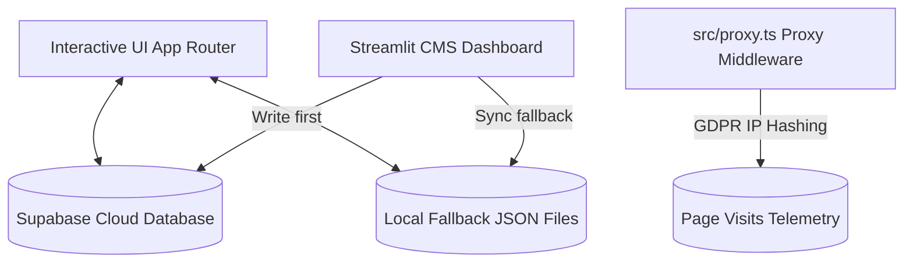

# **Executive Summary**

## **Overview**

Adaptive Portfolio (v2) is a highly customized, adaptive personal portfolio platform designed for Prateek Sharma. Rather than treating all site visitors as a single monolithic block, the platform is designed as an interactive digital product that adapts its communication style and core content according to the specific intentions of its visitors.

The site is built on **Next.js 16 (App Router)**, **React 19**, **TypeScript**, and **TailwindCSS/Vanilla CSS modules**, with dynamic telemetry and content updates backed securely by **Supabase**.

---

## **The Core Problem**

Traditional developer portfolios are structured identically for all audiences. This results in significant friction:
* **Technical Recruiters / Hiring Managers** look for deep engineering rigor, code structure, custom hooks, and architectural decision records.
* **Business Owners / Freelance Clients** look for communication reliability, visual excellence, pricing clarity, and practical business outcomes.

Trying to satisfy both in a single static layout results in either overwhelming a business client with technical jargon or disappointing an engineering manager with overly vague descriptions.

---

## **The Adaptive Solution**

Adaptive Portfolio solves this by defining **composable identity states** across two vectors:

1. **Visual Identity**:
   * **Azure**: A modern, vibrant theme representing creativity, curiosity, and forward-looking exploration.
   * **Noir**: A precise, refined cyber-noir aesthetic representing premium restraint, focus, and craftsmanship.
2. **Communication Identity**:
   * **Hiring a Developer (Developer Mode)**: Focuses on engineering mindsets, technical challenges, custom hook design, and code patterns.
   * **Need a Website (Business Mode)**: Focuses on business problem solving, design-to-delivery workflows, transparent packages, and project outcomes.

By prompting the user on entry ("Who are you here as?"), the site dynamically adapts its language, prioritize navigation, selects project case study narratives, and serves targeted call-to-actions (e.g., Resume download vs. Quotation generation).

---

## **Architectural Pillars**

* **Data Layer Dual Contract**: Live data is stored in Supabase and cached aggressively via Next.js `unstable_cache`. A Streamlit dashboard (`scripts/synchronizer.py`) serves as the Content Management System. It writes updates to Supabase first, and automatically updates local JSON fallback files (`projects.json`, `skills.json`, etc.) as offline fallbacks.
* **Telemetry and Privacy**: Visit metrics are hashed server-side at the proxy middleware layer using GDPR-compliant daily salt, preventing user tracking while logging anonymous analytics.
* **Performance & SEO**: Targeting 100/100 Lighthouse scores, zero layout shifts (CLS), and semantic HTML layout trees for crawlability.

---

## **Primary Success Indicators**

* **Qualitative**: Visitors report that the site feels tailored to their specific needs and demonstrates "product thinking" through its adaptive nature.
* **Quantitative**: High engagement metrics, increased resume and quotation downloads, low bounce rates, and direct contact form submissions sent securely via the Resend API.
